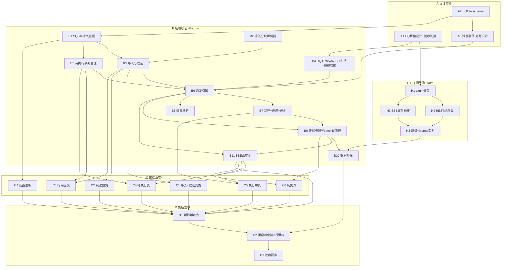
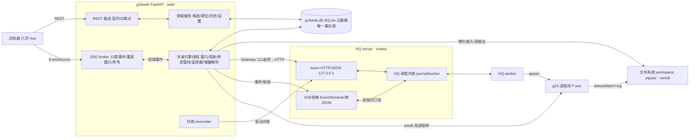
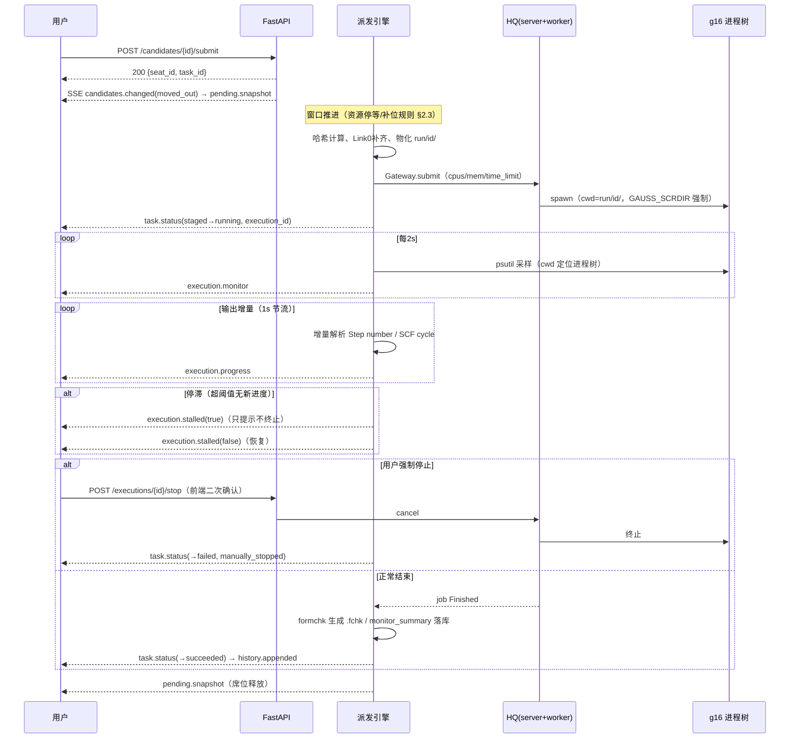

# M1 · 队列与执行 — 详细执行计划

> 状态：执行计划（依据 [roadmap.md](../specs/roadmap.md) §3 M1 制定）。
> 本文是 M1 的任务分解与设计基线：§2 为四项关键设计的**定稿规格**（A 阶段
> 任务的直接输入），§3 为任务流程图，§4 为逐任务执行方案（步骤/技术要求/
> 质量标准/交付物），§5–§9 为测试、提交、验收、决策点与风险方案。
> 本文与 roadmap 冲突时以 roadmap 为准；API/SSE 契约（[openapi.yaml](../api/openapi.yaml)、
> [sse.md](../api/sse.md)）已随 M0 定稿，M1 实施一律不漂移契约，确需变更走
> 文档 diff（roadmap §4）。

## 0. 目标、范围与依据

**目标**（= roadmap §3 M1 定义）：自持队列执行引擎 + 监控 + 候选任务入口，
落成「输入 → 计算」真实闭环——导入、候选列表、只读预览、行内提交、待执行
席位、并行窗口派发、g16 执行、实时监控与进度推送、失败归因、执行历史、
formchk 与清理边界、SQLite 持久化与重启对账；HQ server 侧新增 HTTP/JSON +
SSE 桥接（§8.8 首个改造场景）。

**M1 工作项编号**（引 roadmap §3 M1 段落顺序，WBS 表「对应项」列引用）：

| 编号 | 工作项（roadmap 原文摘要） |
|---|---|
| M1.1 | 批量导入 `.gjf`/`.com`：单文件/多选（自然序：不区分大小写、字母优先 A–Z 先于 0–9）；导入文件夹（默认仅生成候选）；导入即拷贝入库、与源文件彻底独立 |
| M1.2 | 候选任务列表（id/文件名/title 实时解析/来源标记）+ 右侧只读分块预览 + 「-」剔除 |
| M1.3 | 行内提交：确认框含纯文本完整输入（含坐标、限高滚动）；缺 `%NProcShared`/`%Mem` 黄色警告并默认补齐；满员拒绝 |
| M1.4 | 待执行队列页：席位追加/重排/整席移除/席位内成员移除、在途席位上限（默认 3、下限 1、上限 10，越界 422）、容量调小挤出 |
| M1.5 | 派发：执行序列并行窗口、任务结束自动补位保序、资源声明不足停等；资源双账（Link0 补齐 + HQ cpus/mem 请求）；g16 子进程环境自洽构建 + 强制 `GAUSS_SCRDIR`；输入哈希 |
| M1.6 | 执行中页：在跑列表（按执行 id 键控）、CPU/内存监控（psutil 采 g16 进程树）、停滞检测只提示不终止、手动停止二次确认 |
| M1.7 | 失败语义与归因（手动停止/程序报错/外部中断）；failed/skipped 的「重新排队」与「退回候选」 |
| M1.8 | 执行历史：全字段、输入查看、输出纯文本预览与导出、可归档不可删除 |
| M1.9 | SSE 推送运行中进度（自写增量解析：优化步/SCF）；SQLite 持久化；重启后全部恢复并与 HQ 实态对账（hq_job_id 映射识别重跑者） |
| M1.10 | HQ 侧既定改造：server 进程内 HTTP/JSON 层（绑 127.0.0.1）+ SSE 事件桥接（EventStreamer） |
| M1.11 | 执行成功自动 formchk 生成 `.fchk`；文件清理边界（自动清理只作用 .chk/.rwf 与 scratch、保留期、非正常终止保全快照、写半截 .out 永久保留） |

**不做**（非目标，属 M2+）：候选分块编辑（M2）、队列组建与管理 UI（M2）、
cclib 结果解析与可视化（M3）、任务链与断点续跑动作（M4，M1 仅落地保全与
重定向）。M1 无队列创建入口，待执行队列中实际只会出现**单任务席位**；但
引擎、存储、端点按契约实现**队列席位全语义**（席位展开、失败分流、回退），
以单测覆盖——整队端到端验收随 M2 完成（roadmap M1 验收段明示）。

**前置条件**（开工闸门）：

1. M0 收尾（m0-plan 的 D1–D2 阶段）完成：验收走查记录入库、工作区改动按类提交、
   `validate_progress.py` 通过（当前 progress.json 的 in_progress 项）。
2. roadmap §7 开放事项 3 关闭：HQ 桥接的验收判据与双层分工在 M1 动手前
   定稿（本文 §2.1 即定稿载体，A1 落实并回填 roadmap §8.8）。

**依据**：roadmap §2.1（领域模型/状态机/派发原则）、§2.4–§2.7（路径/配置/
字段/输入结构）、§3 M1、§8.4–§8.8（HQ 实地认知）、§5（风险表）；
M0 产出 `docs/api/`（契约四件套）与 `web/`（前后端骨架）；
[m0-plan.md](m0-plan.md) §2.3（端点实施里程碑标注）。

## 1. 任务分解与追踪（WBS）

五阶段：**A** 设计定稿（闸门）、**H** HQ 侧改造（Rust）、**B** 后端核心
（Python）、**C** 前端真实化、**D** 集成验收。任务编号贯穿全文引用。
规模：S ≈ 半天内，M ≈ 1 天，L ≈ 2 天。

| 编号 | 任务 | 产出物 | 验收标准（可验证） | 依赖 | 规模 | 对应项 |
|---|---|---|---|---|---|---|
| A1 | HQ 桥接层设计与验收判据定稿 | §2.1 定稿 + roadmap §8.8 增补（摘要+判据引用） | 职责边界/端点集/事件映射/端口开关/验收判据齐备；实地核查 `server/event/payload.rs` 事件全集；用户评审通过 | M0 收尾 | M | M1.10、roadmap 开放事项 3（§0 前置条件 2） |
| A2 | SQLite 持久化 schema 设计定稿 | §2.2 定稿 + DDL 草案 | 表结构覆盖契约全部 schema 字段；任务形态转换规则对照 §2.1 状态机走查通过 | — | M | M1.9、§2.4/§2.6 |
| A3 | 派发引擎与对账设计定稿 | §2.3/§2.4 定稿 | 执行序列/窗口/双账/事件时序对照 sse.md §3 逐条走查；对账场景矩阵（§2.4 五场景）全覆盖 | A2 | M | M1.5/M1.9、§8.6 |
| H1 | axum 引入与 HTTP server 骨架 | `crates/hyperqueue` server 内嵌 axum listener（`--http-port` 开关，默认关） | `cargo build --release` 通过；不传参数时 HQ 行为零变化；传参后 `GET /info` 返回 200 | A1 | M | §8.8 |
| H2 | HQ REST 端点集 | §2.1 端点表全部实现（提交/详情/批量状态/取消/workers/info） | curl 冒烟逐端点通过；同一 job 经 CLI 与 HTTP 两路查询结果一致 | H1 | L | §8.8 |
| H3 | SSE 事件桥接 | EventStreamer listener → `GET /events` JSON 推流 | 提交→启动→结束全生命周期事件逐条可收；断连重连后恢复推送（薄桥接不重放，§2.1） | H1 | L | §8.6/§8.8 |
| H4 | Rust 侧测试与 journal 行为实测 | crates 测试 + 实测记录 | `cargo test` 全绿；journal 恢复的 job id 延续性、crash_limit 重试可观测性实测结论回填 §2.4（如有出入修正设计） | H2, H3 | M | §8.6/§8.7 |
| B1 | SQLite 持久化层 | `web/src/store/`（DDL/迁移/DAL）+ 设置持久化 | 重启恢复单测（建库→写→重开→读一致）全绿；设置写 SQLite 且生效边界正确 | A2 | L | M1.9、§2.4/§2.5 |
| B2 | 输入分块解析器 | `web/src/parse/`（分块解析/自然序排序） | 金标准样本 + 构造样本单测：节结构与空行规则、多步拒绝、原子统计与 Hill formula、自然序（字母先于数字）全覆盖 | — | L | M1.1/M1.2、§2.7 |
| B3 | 导入与候选管理真实化 | 导入端点（multipart/文件夹）+ 拷贝入库 + 剔除 + title 实时解析 | 重复导入 id 唯一；导入后改/删源文件无影响；坏文件整批 422 且 details 逐文件（§8 决策点 2） | B1, B2 | M | M1.1/M1.2 |
| B4 | HQ Gateway（CLI 先行）+ HQ 进程管理 | `web/src/hq/`（Gateway 接口 + CLI 实现 + 进程管理器） | 对真 `hq` 二进制提交/查询/取消走通；server 显式 journal 路径、worker 托管启动、健康监测与自动重启 | A1 | L | M1.5/M1.10、§8.6 |
| B5 | 待执行队列管理真实化 | 席位增删/重排/容量/挤出/锁定 | 契约 #18–21 语义单测全绿（含队列席位分支，Fake 数据）；挤出只作用于窗口未触及席位；满员 409 | B1 | M | M1.4、§2.1/§2.5 |
| B6 | 派发引擎 | `web/src/engine/`（序列展开/窗口推进/双账/物化/HQ 提交） | FakeGateway 单测：串行/并行/补位保序/资源停等不越位/哈希跳过/Link0 补齐与 GB→MiB 换算；fake g16 集成首通（跑完进历史） | A3, B3, B4, B5 | L | M1.5 |
| B7 | 执行监控 + 停滞检测 + 手动停止 | `engine/monitor`（psutil 采样/停滞状态机/停止） | fake g16 多进程树 CPU 采样差值与 RSS 树汇总正确；停滞置位/解除事件成对；stop→取消→归因 manually_stopped | B6 | M | M1.6、§8.4/§8.7 |
| B8 | 增量解析（优化步/SCF） | `engine/progress`（位点续传/节流） | `~/g16/tests/` 4 份 .out 金标准回归全绿；位点续传（追加不重扫）；1s 合并窗口节流 | B6 | M | M1.9、§8.5 |
| B9 | 终态处理/历史/formchk/清理 | 终态管线 + formchk + 保全快照 + 清理 + requeue/退回候选/归档 | succeeded 自动生成 .fchk；非正常终止 chk/rwf 移入 protected/ 并记 chk_snapshot；清理只作用过期且正常结束的 chk/rwf，永不触碰 .out/.log/输入；#29–32 契约测试全绿 | B6, B7 | L | M1.7/M1.8/M1.11 |
| B10 | 重启对账 | `engine/reconcile` + 启动序列 | §2.4 五场景单测全绿；与真 hq journal 联测（重启 g16web 接管在跑任务、WSL2 重启识别重跑者） | H4, B9 | L | M1.9、§8.6 |
| B11 | SSE broker 真实化 | 事件管道接真实领域事件 + 序号持久化 | 12 类事件按 sse.md §3 时机真实触发（端到端断言）；序号重启延续；重放窗口/快照/溢出断连行为不回归 | B6–B9 | M | M1.9 |
| C1 | 导入交互 + 候选列表真实化 | 多选/文件夹导入、自然序展示、来源标记、剔除 | 批量导入含失败清单提示；列表全字段真实（title/来源标记） | B3 | M | M1.1/M1.2 |
| C2 | 只读预览真实化 | 分块预览（title/Link0/route/电荷·多重度/原子统计） | 预览与后端解析一致；不含坐标大块文本；解析失败节容错展示 | B3 | M | M1.2 |
| C3 | 行内提交流 | 确认框（完整输入限高滚动/黄警/满员提示） | 验收路径第 3–4 步逐项通过（§7.1） | B3, B5 | S | M1.3 |
| C4 | 待执行页真实化 | 席位重排/移除/挤出提示/锁定态 | 全操作走契约端点 #19–21；SSE pending.snapshot 驱动更新 | B5, B11 | M | M1.4 |
| C5 | 执行中页真实化 | 通道卡真实读数/进度/停滞告警/停止二次确认 | monitor/progress 事件驱动读数跳变；停滞徽标翻转；停止走二次确认 | B7, B8, B11 | M | M1.6 |
| C6 | 历史页真实化 | 详情/输入输出查看导出/归档（独立归档页路由）/重新排队/退回候选/清理入口 | 验收路径第 6–7 步通过；输出预览对截断容错；`?download=true` 导出 | B9, B11 | M | M1.7/M1.8 |
| C7 | 设置面板真实化 | 生效语义提示（on_restart 重启提示/席位追溯确认） | 全部设置持久化且生效边界与标注一致；席位上限调小弹挤出确认 | B1 | S | §2.5 |
| D1 | 端到端验收走查（真 g16） | 走查记录 | §7.1 roadmap M1 验收路径逐条留痕 | B*, C* | M | M1 验收段 |
| D2 | 重启/中断/并行演练 | 演练记录 | 重启恢复、外部中断归因、并行数 2 双任务同跑双账核对（§7.1 第 7–8 条） | B10, C5 | M | M1 验收段 |
| D3 | 进度同步与提交整理 | CHANGELOG.jsonl / progress.json | 双闸门（`uv run pytest` + `validate_progress.py`）通过；提交序列符合 §6 | 全部 | S | §5.1 |

依赖关系总览：A1→(H*, B4)；A2→(A3, B1, B5)；A3→B6；B1→B3；B2→B3；
B3/B4/B5→B6→(B7,B8)→B9→B10；B11 依赖 B6–B9；C 按域跟随对应 B 模块；
D 依赖全部。H 与 B 前段（B1–B5）可并行推进。

## 2. 关键设计定稿（A 阶段规格输入）

### 2.1 双层架构与 HQ 桥接（A1 → 关闭 roadmap §7 开放事项 3）

**职责边界**：

| 关注点 | g16web FastAPI 层（`web/`） | HQ server 内 HTTP/SSE 层（`crates/`） |
|---|---|---|
| 面向对象 | 浏览器（M0 契约 33 端点 + 12 类事件，不因 M1 改变） | g16web 后端（**唯一预期消费者**） |
| 语义层级 | 领域语义：候选/队列/席位/历史/归因/停滞 | 执行事实：job 状态/资源分配/worker 存活 |
| 状态与持久化 | SQLite 自持状态（元数据唯一事实来源） | HQ 内部注册表 + journal（g16web 托管时显式传路径，§8.6） |
| 绑定 | `G16WEB_BIND_ADDR`（默认 127.0.0.1）:`listen_port` | 一律 `127.0.0.1`，端口由 g16web 分配传入 |
| 认证 | 无（回环即边界，roadmap §5） | 无（回环即边界；TCP/orion 鉴权通道保持原样不拆） |

**HQ HTTP 端点集**（A1 定稿基线；H2 按此实现，实施中经 context7 核对
axum 当前版本用法）：

| 方法与路径 | 用途 | 对应 CLI 命令（一致性参照） |
|---|---|---|
| GET /info | server 版本/uptime/worker 概览 | `hq info --json` |
| POST /jobs | 提交：program argv、cwd、env、stdout/stderr 路径、resources{cpus, mem_mib, time_limit_s} | `hq submit --json` |
| GET /jobs/{id} | job 详情（状态/错误/资源） | `hq job info --json` |
| GET /jobs?ids=… | 批量状态（对账与轮询用） | `hq job list --json` |
| POST /jobs/{id}/cancel | 取消 | `hq job cancel` |
| GET /workers | worker 列表与资源（窗口记账取 worker 总资源） | `hq worker list --json` |
| GET /events | SSE：EventStreamer 事件 JSON 推流 | （无对应，新能力） |

**事件桥接**：在 server 启动路径注册一个 EventStreamer listener（全类过滤），
axum SSE 端点把 HQ 事件序列化为单行 JSON 帧（`event: <hq 事件类型>`、
`data: {…}`）。**薄桥接**：不缓存、不重放——g16web 断线重连后走 REST 对账
（全量 job 状态对照）补齐缺口，桥接层不承担可靠性（§8.6：可靠性由 g16web
的 SQLite + 对账承担）。事件类型全集在 A1 实地核查
`crates/hyperqueue/src/server/event/payload.rs` 后落表（预期覆盖：
job 提交/启动/结束/失败/取消、worker 注册/失联等），随 §2.1 定稿一并写入
roadmap §8.8。

**SSE 事件名清单**（H3 实现定稿，`event:` 取 HQ 变体 snake_case；`data`
为单行 JSON，统一含 `time` 字段；`Submit.serialized_desc` 为 bincode 字节
不透传）：job/task 域 `submit`、`job_open`、`job_close`、`job_idle`、
`job_completed`、`job_cancel`、`task_started`、`task_finished`、
`task_failed`、`tasks_canceled`、`tasks_aborted`、`task_notify`（message
hex 透传）；worker 域 `worker_connected`、`worker_lost`；server 域
`server_start`、`server_stop`。普通关闭式 job 的生命周期为
`submit → task_started → task_finished → job_completed`（`job_open`/
`job_close` 仅 open job 有）。

**事件转换**（g16web 侧，B4/B11 实现）：HQ job 事件 + 本地映射
（`hq_job_id → execution_id`，B6 派发时落库）→ 领域事件
（`task.status`/`history.appended` 等 12 类之一）→ g16web SSE broker →
浏览器。归因映射按 §8.7：`Canceled`→手动停止；`Failed` 且非超时非失联→
程序报错；worker 失联重排/journal 恢复→外部中断（对账侧判定）。

**过渡策略（CLI JSON 起步，roadmap §2.3 定稿语义）**：`web/src/hq/` 定义
`HQGateway` 接口（submit / cancel / jobs / events），先落 **CliGateway**
（`/target/hq --output-mode json` 子进程调用，事件以周期轮询 `job list`
模拟），打通 B5–B10 全链路；H 阶段完成后切换 **HttpGateway**（REST +
SSE 消费），CLI 实现保留作调试路径。H 阶段受阻时 M1 核心验收不被阻塞
（§9 风险 1）。

**HQ 进程管理**（B4）：g16web 启动时检测（`~/.hq-server` 发现机制）并按需
spawn `hq server --journal <workspace>/hq/server.journal`（journal 必传，
§8.6）与 `hq worker`（默认 `--on-server-lost=Stop`，§8.7）；周期健康监测
（/info 或发现文件），server/worker 意外退出自动重启（journal 恢复语义
交 B10 对账处理）；g16web 自身退出**不杀** HQ 进程（§8.7：g16web 死亡
不影响在跑计算）。

**HQ 桥接验收判据**（A1 产出，H4 逐条验证，D1 复核）：

1. `hq server --http-port <P>` 启动后，curl 完成「提交 job → 查询 → 取消」
   全流程，返回 JSON 与 CLI `--output-mode json` 等价信息；
2. `GET /events` 可接收单个 job 从提交到终态的全部生命周期事件，帧为合法
   SSE（id/event/data 单行 JSON）；
3. g16web 经 HttpGateway 完成「提交 → 事件接收 → 终态落历史」一次完整闭环
   （集成测试）；
4. 不传 `--http-port` 时 HQ 现有行为与测试零变化（开关默认关）；
5. `cargo test` 全绿（新增模块单测 + 受影响模块回归）。

### 2.2 SQLite 持久化 schema（A2）

数据库 `<workspace>/g16web.db`（SQLite 为元数据唯一事实来源，roadmap
§2.4）。建表列集对照契约 schema「一次定死」（§2.6 原则 1），无值字段
NULL/默认；PRAGMA：WAL、`foreign_keys=ON`、`busy_timeout=5000`；
`schema_version` 表 + 顺序迁移（M1 起版本 1）。

| 表 | 关键列（对照契约 schema） | 说明 |
|---|---|---|
| `tasks` | id PK AUTOINCREMENT、filename、origin、failure_note、queue_id FK NULL、position NULL、time_limit_s DEFAULT 0、form、created_at、updated_at | 候选/任务同表同 id（跨形态延续）；`form ∈ {candidate, queue_member, seat_task, finished}` 为形态列（见下转换规则）；候选列表 = `form='candidate'` |
| `queues` | id TEXT PK、name、skip_failed、state、rollback_flag、rollback_count、last_failure JSON、finish_reason、created_at、updated_at | 成员经 `tasks.queue_id+position` 表达，不冗余存列表 |
| `seats` | seat_id PK AUTOINCREMENT、kind、task_id NULL、queue_id NULL、position、locked DEFAULT 0、created_at | 待执行席位有序表 |
| `executions` | id PK AUTOINCREMENT、task_id FK、queue_id NULL、state、submitted_at、started_at NULL、finished_at NULL、input_hash、resources JSON、hq_job_id NULL、filename、cause NULL、monitor_summary NULL、chk_snapshot JSON、archived DEFAULT 0、result_ref NULL | 运行与历史同表：历史 = 终态行（succeeded/failed/skipped）；staged 不建行（由席位表达，契约注记）；终态冻结后仅 archived 可变 |
| `settings` | key PK、value JSON | 运行级设置；启动级不入库（env 只读展示） |
| `sse_seq` | counter | SSE 事件全局序号（持久化，sse.md §5.1） |
| `schema_version` | version | 迁移锚点 |

`form` 形态转换规则（对照 §2.1 状态机，A2 走查锁定）：`candidate`
→（入队）`queue_member` / →（行内提交）`seat_task`；`seat_task` →（执行
结束离席）`finished`；`queue_member` →（队列回退后移除）按结局分流退回
`candidate`（M2 主用，引擎实现同规则）；`finished` →（历史「重新排队」
沿用原 id）`seat_task`。id 生成侧查重天然满足（AUTOINCREMENT 全库永不
复用，m0-plan §2.1 公共约定）。

写并发策略：FastAPI async + 引擎后台线程共用「全局写锁 + 短事务」的
单连接（threading.Lock 串行化写、WAL 允许读并发）；DAL 层
（`web/src/store/`）是唯一 SQL 出口，routers 不写 SQL。M0 mock 状态对象
随各域真实化逐个退役，契约测试 fixture 改为内存 SQLite
（`file:g16web?mode=memory&cache=shared`）+ FakeGateway（§5）。

### 2.3 派发引擎与执行流水线（A3）

引擎为后台线程（阻塞调用与 HQ/g16 交互不占 async loop），核心循环
「事件驱动 + 状态推进」：

**执行序列展开**：seats 按 position 排序 → 每席位展开：`kind=task` →
[该任务]；`kind=queue` → 该队列当前成员序列（按 tasks.position）——
单任务与队列成员平权扁平化（§2.1 派发原则）。窗口**已触及**的席位置
`locked=1`（不可整席重排/移除，错误码 `SEAT_WINDOW_LOCKED`）。

**并行窗口推进**（默认 1=串行，上限 6，运行级设置）：

```text
触发：席位变化 / 任务终态 / 并行数调大 / 启动
循环：自序列头按序取未终态任务，直到窗口满（在跑数 = parallel_window）或序列尽：
  ① 哈希跳过：该任务存在 succeeded 执行记录且当前输入哈希 == 该次 input_hash
     → 沿用既有结果、不建执行记录，序列越过（M1 单测覆盖，M2 端到端）
  ② Link0 解析：取 %NProcShared/%Mem，缺失项按设置默认值补齐 → resources
     （value + defaulted 标记，记入执行记录）
  ③ 声明资源停等：空闲 = worker 总资源（GET /workers 缓存）− 窗口在跑任务
     声明值之和；本任务声明 > 空闲 → 窗口停在该任务等待释放，不越位取其后
     小任务（队头阻塞是显式接受的代价，§2.1）
  ④ 物化 run/<执行id>/：拷贝输入为 input.gjf（哈希对拷贝内容计算，补齐行
     写入实际执行副本）；构建 g16 子进程环境（§2.5 实测：GAUSS_EXEDIR/
     GAUSS_BSDDIR/G16BASIS/GAUSS_ARCHDIR/GAUSS_LEXEDIR 等，g16.profile
     等价）并强制 GAUSS_SCRDIR=run/<执行id>/
  ⑤ 创建执行记录（state=running、submitted_at、input_hash、resources、
     hq_job_id 待回填）→ Gateway.submit（program=g16、cwd=run/<id>/、
     resources：nproc→cpus、mem GB→MiB、time_limit_s≠0 时设 HQ time_limit）
     → 回填 hq_job_id → 发 task.status(staged→running)
```

**任务结束补位**：Gateway 事件（HTTP 模式）或轮询发现终态 → 终态管线
（B9）→ 窗口推进补位（保序）。**失败分流**（引擎实现、单测覆盖、M2 端到端）：
单任务席位终态 → 离席进历史；队列席位按 §2.1——未勾跳过：出错成员记
failed、未启动成员**即时** skipped(predecessor_failed)、在跑成员任其跑完
（回退不提前）、全部结束时队列记失败并自动回退未提交；勾选跳过：继续取
未启动成员；手动停止（在跑成员全部被 stop）：全部 failed(manually_stopped)
+ 未执行 skipped(queue_manually_stopped) + 整队回退。

**监视器（B7）**：psutil 周期采样（2s，M0 决策点 9）——按 cwd=`run/<id>/`
+ 进程启动时间双重校验定位 g16 进程树（防目录复用误采），CPU 取采样差值、
内存树内 RSS 汇总（g16 依次派生 `l*.exe` 段进程）；产出
`execution.monitor` 事件与 monitor_summary 累计峰值。**停滞检测**：状态机
`last_progress_ts`，超阈值（设置项，默认 10 分钟）无新优化步/SCF →
`execution.stalled(stalled=true)`；恢复新进度 → 置 false——**只提示不自动
终止**（红线，roadmap M1），是否终止由用户 stop 决定；**冷启动宽限**：任务
启动/续追后 1×阈值内不置位告警（防正常初始化阶段误报，与 §9 风险 7 一致）。

**增量解析器（B8）**：tail 跟踪 `run/<id>/` 下 g16 输出文件（输出文件名
约定按 g16 手册在 B6 实施时核实锁定，默认预期 input.gjf → 同名 .log），
位点续传（offset 内存保持，重启重扫，进度类可丢）；只识别两类进度行
（优化步 `Step number` / SCF 迭代 cycle），产出 `execution.progress`
（1s 合并窗口推最新）。**红线**：不做领域级解析（正则堆领域解析禁止，
roadmap §4）——进度行识别限定窄域并全部过金标准回归。

**g16 输出捕获**：g16 子进程 stdout/stderr 由 HQ 重定向至 `run/<id>/` 内
文件（提交时指定路径，§8.5：无网络实时流，同机直读文件是最短路径）；
`.out`/`.log` 永久保留（M1.11 清理边界），写半截文件历史页可查
（`errors="replace"`）。

### 2.4 重启对账（A3/B10）

g16web 启动序列：加载 SQLite 全量状态 → 确保 HQ server/worker 存活（B4）
→ Gateway 拉取 HQ job 全量 + worker → 对本地 `state='running'` 的执行记录
按 `hq_job_id` 逐条对照：

| 场景 | 判定 | 处置 |
|---|---|---|
| S1 g16web 重启，HQ 活着、job 在跑 | HQ job Running | 接管：重新定位进程树、解析位点重扫、继续监控（§8.7：g16web 死亡不影响在跑计算） |
| S2 重启期间 job 已终态 | HQ job 终态 | 按终态补齐历史（归因映射 §8.7），monitor_summary 置空 |
| S3 WSL2 整体重启，journal 恢复重跑 | HQ job Running 且本地曾有中断痕迹（H4 实测定稿：journal 恢复后同 id 回退 waiting、worker 重连后从头重跑；见下方实测结论 ②） | **采纳重跑**（§8.6 定稿）：检测 `run/<id>/` 存在 chk——有 → 取消重跑、chk 移入 protected/ 保全、原执行归因外部中断落历史、以新执行目录原样重新提交（**重定向**，防 g16 重写 %CHK 抹掉续跑资产；断点续跑注入属 M4）；无 → 接管跟踪重跑 job，结局即原执行结局 |
| S4 HQ server 丢失/journal 缺失 | 本地 running 无对应 job | 归因外部中断、落历史（chk 若在则保全） |
| S5 worker 失联自动重试（crash_limit≤5） | job 中途失联又 Running | 不中途落历史，仅最终终态入历史（识别重试，roadmap §5） |

场景判定特征（尤其 S3 与 S1 的区分）以 H4 journal 实测结论为准回填修正；
对账完成后发 `system.snapshot(server_restarted=true)` 供前端全量重建。

**H4 journal 实测结论**（2026-09-24，`scripts/probe_hq_journal.sh`，P1–P4
矩阵全部产出结论；记录见提交说明与探针输出）：

1. **flush 周期约束（P1 关键修复）**：`journal_flush_period` 默认 30s；
   RPC 提交/取消路径成功后即调 `flush_journal()`，HTTP 桥原本缺失——
   kill -9 落在 flush 周期内时 Submit 事件不落盘，恢复后 `GET /jobs` 为空、
   任务凭空消失（首跑实测现象）。已给 HTTP 桥补提交/取消后 flush（对齐
   RPC，CLI 等价性），复跑证实恢复正常。**残留窗口**：非提交类事件
   （task started/finished）仍在周期内，kill -9 后已启动任务恢复为
   waiting——这正是 S3 重跑语义的机制来源，B10 按「重跑」处置正确。
2. **S3 特征定稿（P1）**：journal 恢复后 job id 延续、任务回退 waiting、
   worker 重连后**从头重跑**（副作用 start 标记 1→2 次证实，非续跑）；
   重启后新提交 job id 计数延续。
3. **S1 与 S3 区分**：S1（g16web 重启、HQ 存活）job 持续 Running、不回退
   不重跑；S3 恢复后先观测到 waiting 再回 running 且从头执行。g16web
   判据：对账时 HQ job 状态回退 waiting / 任务执行证据（如启动时间、
   输出从头增长）异于本地记录 → S3。
4. **Waiting 任务恰好执行一次（P2）**：journal 恢复后一次性任务只执行
   一次，无重复提交。
5. **crash_limit 重试可观测（P3，S5）**：worker 失联重试全程同 job id，
   事件流特征 = `worker_lost` × N + 重试 `task_started` + 超出
   MaxCrashes(5) 后单个 `task_failed`；每次重试都真执行（start 标记
   6 次 = 6 次失联重试轮）。S5 识别「同 job 多轮 started/aborted」即可，
   不中途落历史。
6. **无 journal（P4，S4 佐证）**：重启后 job 全部丢失、id 计数归零——
   本地 running 无对应 HQ job 即外部中断的归因依据成立。

## 3. 任务流程图

### 3.1 阶段与任务依赖（WBS 全景）



要点：A 阶段是全局闸门；H 与 B 前段（B1–B5）**并行泳道**（CLI Gateway
先行打通 B6–B10，H 完成后 B 切换 HttpGateway）；C 按域纵向切片跟随对应
B 模块，不整段等待。

### 3.2 运行时数据流（双层架构）



### 3.3 单任务执行生命周期（事件时序，对照 sse.md §3）



## 4. 逐任务执行方案

通用技术要求（全部任务适用）：路径 `pathlib.Path`+`/` 拼接；子进程参数
列表形式、禁 `shell=True`；文本读写显式 `encoding="utf-8"`；新依赖经
context7 核对用法后单行 uv/npm 安装（国内镜像源）；每任务完成即同步
CHANGELOG.jsonl unreleased 与 progress.json（AGENTS §九），提交前双闸门。

### 4.1 A 阶段：设计定稿

**A1 HQ 桥接设计**：① 实地核查 `crates/hyperqueue/src/server/event/payload.rs`
事件全集与 `server/event/streamer.rs` 订阅机制，产出「HQ 事件 → 帧格式」
映射表；② 按 §2.1 基线定稿端点集/帧格式/端口开关/验收判据（与本文冲突处
以定稿为准回改本文）；③ roadmap §8.8 增补设计摘要与验收判据引用；④ 交
用户评审。质量标准：六要素齐备、H/B4 可直接照做、无遗留 TBD。交付物：
定稿 §2.1、roadmap §8.8 增补、评审记录（提交说明留痕）。

**A2 SQLite schema**：① 按 §2.2 写 DDL 草案（含索引：seats.position、
executions.task_id/state/archived、tasks.form/queue_id）；② 形态转换规则
对照 §2.1 状态机逐条走查（含退回候选路径、requeue 沿用 id）；③ 契约
schema 字段 ↔ 列映射表核对（无缺列、无私增列——私增即契约变更须走 diff）。
交付物：定稿 §2.2 + DDL 草案（入 B1 提交）。

**A3 派发引擎与对账设计**：① §2.3 窗口推进伪码对照 roadmap §2.1 派发
原则逐句核对（派发时点取信息、补位保序、停等不越位、去重兜底）；② 事件
时序对照 sse.md §3 推送时机表逐行走查；③ §2.4 对账五场景矩阵对照
§8.6/§8.7 核查（标注待 H4 实测确认项）。交付物：定稿 §2.3/§2.4。

### 4.2 H 阶段：HQ 侧改造（crates/）

**H1 axum 骨架**：Cargo.toml（workspace + hyperqueue crate）引入 axum
（版本经 context7 核对）；server 启动路径按 `--http-port` 参数（CLI 参数
解析处透传）条件性 spawn axum listener（127.0.0.1）；`GET /info` 打通。
技术要求：不破坏现有 TCP/TUI 路径；默认不开（零行为变化）；端口冲突时
启动失败并明确报错。质量标准：`cargo build --release` 零警告增量；现有
`cargo test` 不回归。交付物：可启动的 HTTP 骨架。

**H2 REST 端点集**：按 §2.1 端点表逐个实现，复用 server 现有命令处理
逻辑（`client/commands/submit|job|worker` 的内部函数直接调用——CLI 与
HTTP 共用同一实现，一致性由构造保证）；错误结构沿用统一 Error 格式。
质量标准：curl 冒烟脚本（入 `scripts/`）逐端点通过；双路一致性抽查
（同 job CLI/HTTP 查询 diff 为空）。交付物：端点实现 + 冒烟脚本。

**H3 SSE 事件桥接**：EventStreamer 注册全类 listener → axum SSE 端点
（`event: <type>`、`data: 单行 JSON`）；连接断开清理订阅（listener 生命周期
绑定连接）；空闲时 15s 心跳注释帧（防代理断连，不影响解析）。质量标准：
提交一个 sleep job，事件序列「提交→started→finished」逐帧可收；kill
客户端重连后新事件恢复推送。交付物：桥接实现 + 事件类型清单（回填 §2.1）。

**H4 测试与 journal 实测**：① crates 单测（axum 层请求/响应、事件序列化）；
② journal 实测矩阵：带 journal 重启（Waiting/Running job 的 id 是否延续、
是否真的重跑）、crash_limit 重试在事件流中的可观测特征、无 journal 重启——
结论回填 §2.4 场景判定列；③ `cargo test` 全绿。交付物：测试 + 实测记录
（本计划 §2.4 修订）。

### 4.3 B 阶段：后端核心（web/）

**B1 SQLite 持久化层**：① 先写测试（建库/迁移/CRUD/重启一致）；②
`web/src/store/`（db.py 连接与写锁、migrations.py、repositories 按领域
分模块：candidates/queues/seats/executions/settings）；③ `config.py` 接入
设置持久化（启动读 SQLite，无记录回落代码默认值；`listen_port` 保存后
下次重启生效——应用工厂从设置读取）；④ mock 设置存储退役。质量标准：
重启恢复单测全绿；契约测试（settings 相关）不回归。交付物：store 层 +
真实设置。依赖追加：无（sqlite3 标准库）。

**B2 输入分块解析器**：① 先写测试：金标准 `~/g16/tests/` 样本 + 构造
样本（各节齐全/缺节/附加节/多步/CRLF/Variables-Constants 分隔）；② 实现
`parse/blocks.py`：按 §2.7 节结构与空行规则分块（link0/route/title≤5 行/
charge_mult/molecule 统计/additional_sections + terminator_blank 标注）、
Hill formula、parse_errors 逐节容错；③ `parse/naturalsort.py`：文件名 →
[字母|数字] 块序列，字母块 casefold 字典序、数字块数值序、**字母块 <
数字块**（A–Z 先于 0–9），单测锁定（如 `a2 < a10 < b1 < 10x`）。
质量标准：预览响应结构与契约 InputPreview 逐字段一致（复用 M0 契约测试）；
多步输入 `INPUT_MULTISTEP_UNSUPPORTED`。交付物：解析器 + 测试。

**B3 导入与候选**：① `POST /candidates` 真实化：multipart files[] 逐文件
校验（扩展名 .gjf/.com 不区分大小写、解析校验、多步拒绝）→ 全部通过才
拷贝 `inputs/<id>` 并建行（**整批原子**，任一失败 422 + details 逐文件，
§8 决策点 2）；`mode=folder` 由前端传该文件夹内全部受支持文件（后端不做
服务端目录扫描，路径边界 §2.4）；② `DELETE /candidates/{id}`：删
inputs/<id> 与记录（删除任务实体唯一入口）；③ `GET /candidates` title
实时解析注入（B2）；④ 事件 `candidates.changed`。质量标准：重复导入
同一文件 → 两条候选不同 id；导入后删除源文件，预览/提交不受影响；CRLF
导入不转（M2 编辑保存才转 LF，契约语义）。交付物：导入/剔除/列表真实化。

**B4 HQ Gateway + 进程管理**：① `hq/gateway.py` 接口（submit/cancel/
jobs/workers/events 迭代）；② `hq/cli_gateway.py`：`/target/hq
--output-mode json` 子进程封装（参数列表形式），events 以轮询 `job list
--json` 模拟（周期 2s）；③ `hq/process.py`：spawn server（`--journal
<workspace>/hq/server.journal`，切 HTTP 后追加 `--http-port`）与 worker、
健康监测、自动重启、g16web 退出不杀；④ 对真 hq 二进制的集成测试（本地
server+worker 模式，无 pbs/slurm 依赖）。质量标准：集成测试走通提交→
查询→取消；journal 文件落位工作区。交付物：Gateway + 进程管理器。

**B5 待执行队列管理**：席位追加（尾部）/`PUT /pending/order` 全量原子
重排/整席移除（单任务退候选 `candidates.changed(moved_in)`；队列席位
回退 `queue.status(→unsubmitted)`——引擎语义，单测）/席位内成员移除
（未执行者退候选）/容量满员 409 `PENDING_CAPACITY_FULL`/上限调小挤出
（自队尾、只作用窗口外席位、在跑不追溯）/窗口锁定 409 `SEAT_WINDOW_LOCKED`。
质量标准：契约 #18–21 + 错误码语义单测全绿（队列席位分支用构造数据）；
挤出顺序正确（尾部优先）。交付物：pending 域真实化。

**B6 派发引擎**：按 §2.3 实现 `engine/dispatcher.py`（序列展开/窗口推进/
停等/补位）+ `engine/workspace.py`（run/<id>/ 物化、g16 环境构建——env
清单从 §2.5 实测结论等价构造，不 source profile 文件、路径由 `g16_root`
设置派生）+ Link0 补齐与换算（%Mem GB→MiB）。测试先行：FakeGateway
（可编程事件/状态）驱动窗口推进全部路径；随后 fake g16（可控脚本：正常
退出/失败退出/慢输出/派生子进程）经真 CliGateway 跑通「提交→运行→终态→
历史」首条链路。质量标准：§2.3 全部行为单测断言；补位保序（并行 2 下
前 2 结束不越位）；停等（大声明任务阻塞窗口）。交付物：引擎 + fake g16
夹具。

**B7 监控/停滞/停止**：`engine/monitor.py` psutil 采样（§2.3 定位策略）、
`execution.monitor` 事件、峰值累计；停滞状态机（翻转才推）；`POST
/executions/{id}/stop` → Gateway.cancel → HQ Canceled → 归因
manually_stopped（§8.7 映射）。质量标准：fake g16 父子进程树 CPU/RSS
采样正确（与 ps 目测对照）；停滞置位/解除成对且不重复；停止后执行进
历史、席位释放。交付物：monitor + stop 真实化。依赖追加：`psutil`。

**B8 增量解析**：`engine/progress.py`：文件 tail + offset 续传、两类
进度行识别（窄域匹配）、1s 合并窗口、`execution.progress` 事件、解析
失败静默跳过待下周期（sse.md §6）。质量标准：4 份金标准 .out 全量回归
（优化步/SCF 数与人工核对一致）；位点续传（文件增长只读增量）。
交付物：progress 解析器 + 金标准测试。

**B9 终态/历史/formchk/清理**：① 终态管线：HQ 终态事件 → 归因映射 →
executions 冻结（finished_at/cause/monitor_summary；wall_time_s 不设
独立列，由 finished_at−started_at 在历史 API 派生，§2.2）→
`history.appended`；② formchk：succeeded 后以 `g16_root/
formchk` 转 `.fchk` 留在 run/<id>/（chk 路径取 Link0 %Chk，无声明回落
默认名——B6 实施核实），失败记日志不阻断；③ 保全快照：failed/外部中断
时 chk/rwf 改名移入 run/<id>/protected/ + chk_snapshot 落库；④ 清理：
`POST /history/cleanup` 手动触发（自动定时延后启用，§8 决策点 11 关联
风险 12）——仅删「正常结束且超保留期」的 chk/rwf，**永不触碰 .out/.log/
输入**，protected/ 仅用户经文件系统手动清；⑤ #29–32（archive/requeue/
return-candidate/cleanup）真实化：requeue 沿用原任务 id 建席、满员 409；
return-candidate 以 run/<id>/ 实际执行副本新建候选（skipped 回落任务
副本）带来源标记。质量标准：#29–32 契约测试全绿；清理边界单测（构造
过期/未过期/失败/protected 四类文件验证只删该删的）。交付物：终态管线
+ 清理。

**B10 重启对账**：`engine/reconcile.py` 按 §2.4 五场景实现；启动序列挂入
应用工厂（lifespan）；S3 重定向（检测 chk → 取消重跑 → 保全 → 新执行
目录重提交）。质量标准：五场景单测（FakeGateway 编排）；与真 hq journal
联测 S1/S3 各一例；对账完成发 `system.snapshot(server_restarted=true)`。
交付物：reconciler + 启动集成。

**B11 SSE 真实化**：broker 事件源从 mock 剧本切换为领域事件总线（引擎/
路由发事件 → broker 扇出）；序号写 `sse_seq`（每事件落库，短事务）；
重放窗口/溢出断连/心跳行为保持 M0 语义（契约测试不回归）。质量标准：
12 类事件全部由真实动作触发过至少一次（端到端断言清单）；服务重启后
序号延续（重连客户端不触发误判快照，超窗仍走快照）。交付物：真实事件
管道。

### 4.4 C 阶段：前端真实化（web/frontend/）

视觉与交互沿用 [m0-frontend-design.md](m0-frontend-design.md) 定稿基调
与 tokens（不新增视觉决策）；全部数据访问走契约 TS client，禁止手写类型；
mock store 逐页切换为真实 API/SSE 驱动。

- **C1 导入交互 + 候选列表**：导入（file 多选 `accept=.gjf,.com` +
  文件夹选择 `webkitdirectory`）、前端按自然序排列展示（与后端规则一致）、
  失败清单渲染（422 details 逐文件）；候选列表来源标记徽标（失败退回
  附归因注记、与新鲜导入显著区分）。
- **C2 只读预览**：右侧预览接 `GET /candidates/{id}/preview`，分块卡展示
  title/Link0（missing 标注）/route/电荷·多重度/原子数与 formula；解析
  错误节容错条（parse_errors）。
- **C3 行内提交**：确认框 `GET /candidates/{id}/input` 纯文本完整预览
  （限高滚动）；`preview.blocks.link0.missing` 驱动黄色警告（提示将按
  默认值填充）；满员 409 提示。
- **C4 待执行页**：席位行接真实 `GET /pending` + `pending.snapshot` 事件；
  重排（拖拽→`PUT /pending/order`）、整席/成员移除（二次确认）、挤出
  提示、锁定席位（「在途」标记）不可操作态。
- **C5 执行中页**：通道卡接 `execution.monitor`/`progress`/`stalled` 事件
  真实读数（沿用 M0 通道卡与 8s REST 基线轮询兜底）；停滞徽标翻转；
  停止按钮二次确认（danger 色确认框）。
- **C6 历史页**：列表/详情全字段；输入查看、输出预览（限高滚动）与
  `?download=true` 导出；**独立归档页**（独立路由与独立展示页，承载 `archived=true`
  视图，m0-plan 决策点 10）；failed/skipped
  条目「重新排队」「退回候选」动作（满员 409 提示）；清理入口（统计回显）。
- **C7 设置面板**：保存后按 effect 提示（on_restart 提示需重启；席位上限
  调小弹「将自队尾挤出」确认）。

每任务质量标准：`npm run build` + vue-tsc 零错误；对应页手动冒烟通过；
不引入硬编码色值/字号（只引用 tokens）。

### 4.5 D 阶段：集成验收

**D1**：真 g16 环境端到端走查（§7.1 逐条留痕；金丝雀任务：水分子小体系
opt）。**D2**：演练矩阵——g16web 重启接管在跑任务（S1）、WSL2 重启外部
中断归因与 chk 保全重定向（S3）、并行数 2 双任务同跑与双账核对。**D3**：
进度两文件同步、提交整理复核（§6 序列核对）、双闸门。

> **D2 S3 演练替代方案登记（2026-09-25，先行登记后执行，附则「禁止静默
> 偏离」）**：S3 原设计为「WSL2 整体重启」演练，但真·整机重启需人工在
> Windows 侧操作，本次执行期间无人值守，故改用 **SIGKILL 故障注入**替代：
> 以 SIGKILL 同时硬杀 g16web、HQ server 与 g16 子进程树，使数据库/WAL、
> journal 与 checkpoint 均停在半路，达到与断电等价的**进程级现场**；随后
> 重启 g16web（其启动序列自行拉起 server/worker，journal 恢复 → job 回退
> waiting → worker 重连从头重跑），验证 S3 全链路（重跑判定③：server 重
> spawn 时刻晚于本地 started_at；chk 保全入 protected/；原执行归因
> external_interrupt 落历史；新执行目录原样重提交）。**语义等价性论证**：
> S3 判定与处置只依赖「g16web、HQ server、g16 三方非正常死亡 + journal
> 持久化恢复」这一进程级事实，WSL2 整机重启在此基础上仅多出内核与文件
> 系统缓存丢失，二者对本仓库代码路径（对账/归因/保全/重定向）无差异；
> 且 SQLite WAL 与 HQ journal 均为已落盘持久化，「停在下路」的半途状态
> 由 SIGKILL 天然保证。真·整机重启验证留作用户方便时的一次性补验，
> 不阻塞 M1 验收（结果记入本文 §2 验收记录）。

## 5. 测试矩阵（先测试后实现）

原则：每个 B/C 任务动工前先落对应测试文件（红）→ 实现（绿）；测试与被测
模块同名对应（`web/tests/test_<module>.py`）。金标准：`~/g16/tests/` 4 份
真实 .out + fake g16 夹具，**单测不依赖真 g16 环境**。

| 测试文件 | 覆盖任务 | 核心断言（摘要） |
|---|---|---|
| test_parse_blocks.py | B2 | gjf 五段切块（route/Title/charge/spin/body）；Link0 哈希提取；%NProcShared/%Mem 缺失识别；坏文件容错返回 null |
| test_naturalsort.py | B2 | 字母块 casefold 字典序、数字块数值序、字母<数字（A–Z 先于 0–9）、混合序列边界（a2<a10、B=a、x1y2<x1y10） |
| test_store_sqlite.py | B1 | 全表 CRUD；form 形态转换（candidate→queue_member→seat_task→finished）；schema_version 迁移；单连接写锁下并发读写不死锁；WAL 模式生效 |
| test_settings_persist.py | B1 | 运行级参数 SQLite 读写；启动级环境变量覆盖优先；越界值 422 |
| test_candidates_import.py | B3 | 单/批量导入；重复导入同一文件 → 两条候选不同 id 且提示（哈希+内容双校验）；非 .gjf 拒绝；整批原子（任一失败全批 422 + details 逐文件，决策点 2 语义） |
| test_pending_logic.py | B5 | 席位追加/重排/移除/整席清空；容量上限拒绝；队列席位锁定语义（窗口触及→locked） |
| test_dispatch_engine.py | B6 | 哈希跳过；Link0 补齐注入；资源停等不越位（window 满则不派）；并行窗口=2 双任务同时 dispatched；run/<id>/ 物化结构正确；hq_job_id 回填 |
| test_failure_semantics.py | B9 | 前驱失败→后继 skipped；skip_failed 开关两分支；队列回退 unsubmitted；FailureCause 五枚举映射（§8.7 归因表逐条） |
| test_monitor_stall.py | B7 | psutil CPU/MEM 采样注入；停滞判定（阈值内增量解析无进展才告警）；恢复即清告警 |
| test_progress_parse.py | B8 | 金标准 4 份 .out：优化步号/SCF 轮次/完成度提取逐位一致；截断文件容错 |
| test_history_cleanup.py | B9 | 历史分页信封；归档独立存储；清理窗口按 retention_days；四类文件（run 目录/chk/rwf/归档）各自保留与删除边界 |
| test_reconcile.py | B10 | 五场景逐条：S1 接管在跑（hq_job_id 匹配+状态回填）、S2 补齐终态、S3 journal 重跑检测+chk 保全+归因外部中断、S4 server 丢失外部中断、S5 crash_limit 重试识别不误判 |
| test_hq_gateway.py | B4/B6 | CliGateway：JSON 解析、超时、退出码非零；HttpGateway（H 完成后）：提交/查询/停止/事件流四端点薄桥接 |
| test_sse_events.py | B11 | 12 类事件全触发一遍（fake 驱动）；seq 单调递增；Last-Event-ID 重放；心跳间隔生效 |
| test_e2e_fake_g16.py | D 前置 | fake g16 全链路：导入→提交→派发→监控→终态→历史，SSE 事件序符合 sse.md 推送时机表 |
| 契约回归 | 全 B | M0 契约测试改造：fixture 由 mock 换内存 SQLite + FakeGateway，断言不变（契约零漂移证明） |
| crates 侧 | H1–H4 | cargo test：事件查询接口 SQL/状态过滤单测；HTTP 端点 handler 单测；journal 恢复行为保留回归 |

SSE 异步断言约定：统一用轮询等待 helper（deadline 5s），禁止裸 sleep；
事件序断言只允许「同 execution 内有序」，跨 execution 不比较顺序。

## 6. 提交序列与进度同步

28 个提交，顺序即依赖序（AGENTS §5.1：单次提交只做一类变更；
docs → test → feat → 进度同步）。type 前缀按 conventional_commits.md。

| # | 提交（type: 摘要） | 内容 |
|---|---|---|
| 1 | docs(plans): M1 执行计划定稿 | 本文档（含 roadmap §8.8 回填说明） |
| 2 | docs(specs): 关闭开放事项 3 | roadmap §7/§8.8 双层架构定稿引用 |
| 3 | feat(core): SQLite 存储层 | B1 store.py + 迁移 + test_store_sqlite/test_settings_persist |
| 4 | feat(core): gjf 解析与自然序 | B2 parse_blocks.py + naturalsort.py + 两测试文件 |
| 5 | feat(core): HQ Gateway 抽象 + CliGateway | B4 hq_gateway.py（抽象基类+CLI 实现）+ 进程管理器 + test_hq_gateway |
| 6 | feat(core): 候选导入与列表真实化 | B3 candidates.py + inputs/<id> 拷贝 + 剔除 + 实时 title + test_candidates_import |
| 7 | feat(core): 待执行席位逻辑 | B5 pending.py + test_pending_logic |
| 8 | feat(api): 候选/待执行端点真实化 | B3/B5 路由：导入/详情/预览/剔除/提交 + pending/order、seats 移除（容量/挤出/锁定）（依赖 #7 的 B5 领域逻辑） |
| 9 | feat(core): 派发引擎 | B6 dispatcher.py + workspace.py + FakeGateway + fake g16 + test_dispatch_engine |
| 10 | feat(core): 监控采样与停滞检测 | B7 monitor.py + psutil + test_monitor_stall |
| 11 | feat(core): 增量解析 | B8 progress.py + 位点续传 + 金标准回归 + test_progress_parse |
| 12 | feat(core): 失败语义与历史/清理 | B9 failure.py + history.py + cleanup.py + formchk + 保全 + test_failure_semantics/test_history_cleanup |
| 13 | feat(api): 执行/历史/清理端点真实化 | B9 续：stop/requeue/return-candidate/cleanup + history 分页/input/output 路由 |
| 14 | test(contract): 契约回归切换后端 | M0 契约测试 fixture 换 SQLite+FakeGateway（契约零漂移证明） |
| 15 | feat(rust): axum HTTP 骨架 | H1：--http-port 开关 + GET /info（默认关、行为零变化） |
| 16 | feat(rust): REST 端点集 | H2：提交/详情/批量状态/取消/workers/info（复用 CLI 内部命令保证双路一致；按 domain 拆 2–3 个提交） |
| 17 | feat(rust): SSE 事件桥接 | H3：EventStreamer → GET /events 单行 JSON 帧 + 心跳 |
| 18 | feat(rust): journal 恢复加固 | H4 + crates 侧回归测试；结论回填本文 §2.4 场景判定 |
| 19 | feat(core): 重启对账 | B10 reconcile.py + test_reconcile（依赖 H4 实测结论） |
| 20 | feat(core): SSE 事件总线真实化 | B11 broker 对接领域事件源 + 序号持久化（sse_seq）+ test_sse_events（待 B9 事件就绪后接入） |
| 21 | feat(core): HttpGateway 切换 | B4 续：Gateway 工厂按可用性选择 HTTP/CLI + 切换开关 |
| 22 | feat(frontend): 候选页真实化 | C1：多选导入 + 列表真实 + 来源标记；store 换真实源（随本提交） |
| 23 | feat(frontend): 只读预览真实化 | C2：分块预览 + parse_errors 容错 |
| 24 | feat(frontend): 行内提交流真实化 | C3：完整输入限高滚动 + Link0 缺省黄色警告 + 满员提示（黄警随 C3） |
| 25 | feat(frontend): 待执行页真实化 | C4：席位重排/移除/挤出提示/锁定态 + pending.snapshot |
| 26 | feat(frontend): 执行中页真实化 | C5：通道卡真实读数 + 停滞 + 停止二次确认（monitor/progress/stalled） |
| 27 | feat(frontend): 历史页真实化 | C6：详情 + 输入输出导出 + 独立归档页路由 + 重新排队/退回候选/清理入口 |
| 28 | feat(frontend): 设置面板真实化 | C7：生效语义提示（on_restart 重启提示/席位上限调小挤出确认） |
| — | chore(progress): D 阶段收尾 | 进度两文件终态同步（随 D3 走） |

进度同步节点（AGENTS §九）：开发前把当前任务写入 progress.json in_progress；
**每完成一个上表提交**即向 CHANGELOG.jsonl unreleased 行与 progress.json
unreleased 追加摘要，不 deferred 到批次末；提交前跑双闸门
（`uv run pytest` + `uv run python scripts/validate_progress.py`）。
M1EOC（M1 关闭）前 D3 核对本表与实际 git log 一致。

## 7. 验收标准（M1 DoD）

### 7.1 端到端路径（D1 逐条留痕，对照 roadmap M1 验收段）

1. **批量导入**：浏览器选 3 份 .gjf（含 1 份重复）→ 候选列表出现 2 条新
   记录，重复被识别并提示（哈希+内容双校验）；
2. **只读预览**：候选行内预览 → 五段结构高亮渲染、无任何编辑入口；
3. **行内提交（黄警）**：提交缺 %NProcShared/%Mem 的 gjf → 确认框黄色警告
   并填入设置面板缺省值 → 确认后入待执行；
4. **席位流转**：待执行页席位顺序重排 → SSE 推送 seats 变化 → 前端无刷新
   更新；容量 3 满时第 4 席位提交被 409 拒绝；
5. **实时监控**：执行中页通道卡 CPU%/MEM 按采样间隔跳变；优化步/SCF 轮次
   随增量解析推进；数字与 .out 文件实际内容一致；
6. **强制停止**：running 通道卡停止 → 二次确认 → HQ job cancel → 事件流
   推终态 → 历史出现归因 manually_stopped 条目；
7. **失败归因**：fake g16 非零退出 → 历史 failed + program_error；前驱失败
   且 skip_failed=false → 队列回退 unsubmitted；skip_failed=true → 后继
   skipped 继续推进；
8. **并行双账**：parallel_window=2 双任务同跑 → 通道卡 2 张；g16web 声明账
   （Link0 补齐值）与 HQ 请求账（cpus/mem）一致；实耗（psutil）有读数；
9. **重启恢复**：g16web 进程重启 → S1 在跑任务被接管（不重复提交）；
   WSL2 整体重启 → S3 归因 external_interrupt + chk 保全 + 重跑新执行目录
   （journal 重定向生效）；
10. **队列语义佐证**：无 UI 亦有引擎——POST /queues 全生命周期
   （创建 2 任务→提交→派发→失败回退）以 curl + 单测证明引擎/存储/端点
   按契约实现队列席位全语义（端到端验收随 M2）。

### 7.2 系统级判据

- `uv run pytest` 全绿（M0+M1 全量，含契约回归——证明 M0 契约零漂移）；
- `npm run build` + vue-tsc 零错误；
- `cargo test --workspace` 全绿（crates 侧改动无回归）；
- HQ 桥接判据（§2.1 五条）逐条通过；
- 双闸门：`scripts/validate_progress.py` 通过；
- **不偏离核对**：§0 的 M1 工作项编号表（M1.1–M1.11）逐项打勾，roadmap M1 验收段语义
  逐条与 7.1 十条对应留痕。

## 8. 开放决策点（实施中关闭，建议值先行）

| # | 决策点 | 建议值 | 关闭时机 |
|---|---|---|---|
| 1 | HQ 端点最终形态（axum 端点集/路径/字段） | §2.1 表为草案，以 H2 PR 评审定稿 | H2 动工前 A1 复核 |
| 2 | 批量导入部分失败语义 | 整批原子：任一失败全批 422 + details 逐文件（契约无逐文件失败字段） | B5 动工前 |
| 3 | 前端文件夹枚举（是否支持目录递归） | 建议值（已偏离）：后端支持递归（ignore 子目录规则：跳过隐藏目录）；M1 前端仅文件多选，目录上传随 M2。**关闭结论（2026-09-25，审查收尾登记）**：按 §4.4 C1 任务文本落地——前端文件夹选择经 `webkitdirectory` 整目录枚举上传，后端不做服务端目录扫描（路径边界与建议值一致），扩展名/解析校验与整批原子语义不变；偏离仅涉「目录上传提前至 M1」的时点，实现已经 GUI 走查验证（m1-acceptance.md §1.1） | 已关闭（C1） |
| 4 | HQ journal 路径 | `<workspace>/hq/server.journal`（工作区内，随对账可寻） | H4 实测确认 |
| 5 | g16 输出文件名约定（.out 与 .log） | 以 B6 在真环境核实 g16 实际产物名为准，金标准 4 份 .out 已旁证 .out | B6 |
| 6 | GPU 利用率采样 | M1 不做（roadmap 监控项仅 CPU/内存；GPU 属后续可选增强） | 冻结 |
| 7 | cclib 引入时机 | M1 不引入（roadmap 语义属 M3 结果解析；requirements.txt 注释随 B1 提交修正） | 冻结 |
| 8 | fake g16 夹具形态 | 独立 shell/python 脚本：可配置 sleep/退出码/输出模板，环境变量 G16_FAKE 控制 | B8 前 |
| 9 | 停滞判定依据 | 只认增量解析进度（优化步/SCF 无进展），CPU 采样仅展示不参与判定（避免假死误报：g16 长时间单步低 CPU 是正常态） | B9 |
| 10 | parallel_window 调小行为 | 不追溯收敛：在跑任务不杀，新派发按新值停等（与契约 effect=new_submissions 一致） | 冻结 |

## 9. 风险评估与应对预案

| # | 风险 | 等级 | 触发信号 | 预案 |
|---|---|---|---|---|
| 1 | HQ axum 改造复杂度超预期（server 模块侵入面大） | 高 | H1 评审发现事件模型与查询接口适配面 > 预估 | CLI 起步过渡已内置：M1 核心验收不依赖 HTTP 桥接；axum 项降级为 M1.5/M2 前置，CliGateway 长期兜底 |
| 2 | journal 语义与 §8.5 认知不符（重放/重跑边界不明确） | 高 | H4 实测出现非预期重跑或状态错乱 | H4 前置到 H 阶段首位实测；不符则 S3 方案改为「executions 表为准 + journal 只做交叉校验」；job id 延续性以实测回填 §2.4 |
| 3 | psutil 定位 g16 子进程树不准（WSL2 进程命名） | 中 | B9 采样拿到 0% 或系统性偏差 | 双重校验：psutil + /proc/<pid>/stat 直读；仍不准则降级为只显示 Link0 声明值并注明「声明值」 |
| 4 | 增量解析对真实 .out 变体适配不足（不同方法学输出格式差异） | 中 | 金标准 4 份之外的 .out 解析为空 | 窄域解析：只认优化步/SCF/完成度三类锚点行；解析失败静默降级（不告警不阻断），进度字段留空 |
| 5 | 真 g16 环境不可用（许可/安装问题） | 中 | D1 无法启动 | 金丝雀任务前置检测（启动时探测 g16 可执行）；全量 fake g16 兜底，D1 改期不阻塞其余验收 |
| 6 | SQLite 并发写冲突（SSE 写 seq 与业务写交错） | 中 | 偶发 database is locked | 单连接+全局写锁+短事务（§2.2 已定）；WAL；busy_timeout 5s；仍现则写路径全收口到单写线程队列 |
| 7 | 停滞误报（正常长任务被误判） | 中 | 用户报告假任务告警 | 决策点 9：只认增量解析进度；冷启动宽限（启动后 1×阈值内不告警）；告警只提示不停任务 |
| 8 | WSL2 端口占用/防火墙（8300 被占） | 低 | 启动失败 | listen_port 运行级可改；启动失败提示明确错误码与改法 |
| 9 | 大文件夹导入（数百文件）卡 UI | 低 | 导入 >10s 无反馈 | 后端分批落盘+进度打印（AGENTS §七）；前端导入按钮 loading 态；M1 不做流式分页导入 |
| 10 | 前端六页从 mock 切真实源的回归 | 中 | C 阶段页面功能回退 | 逐域切片（每页一提交）；手动冒烟清单每页 3 条核心路径，单测 M2 视需要补（原「M0 mock 事件驱动测试保留为 store 单测」所述对象不存在，2026-09-25 二审修订） |
| 11 | HQ 自动重试干扰归因（crash 后 HQ 重跑，g16web 判为外部中断） | 中 | S5 之外出现重复执行 | 提交时 pin max_reruns=0（§8.6 已知语义）阻断自动重试——若由此 §2.4 S5 的 crash_limit 重试不再发生，S5 退化为防御性/回归测试；若实测确需保留自动重试，则撤销 pin、回归 S5 识别重跑者归因（二选一由 A3/H4 定稿，§2.4 S5 与本文保持同一结论）；对账只认终态不认中间态；重复执行检测兜底（同 task 两个非终态执行→停止派发并告警） |
| 12 | 清理任务误删用户文件 | 高 | 清理后用户数据丢失 | 四类文件白名单严格限定（run/<id>/、匹配命名的 chk/rwf、归档过期条目、归档导出文件）；首版仅手动触发（自动定时随 M2）；test_history_cleanup 边界值全覆盖 |

---

附：本计划与 roadmap 的语义对照在 D1 验收时逐项复核（§7.2 末条）；实施中
发现的偏差一律「先改文档（走 diff）、再改代码」，禁止静默偏离。M1 全部
工作项完成并 DoD 通过后，按 changelog-spec §1.6 走发布流程（预计 minor：
新增功能为主，无 breaking）。
