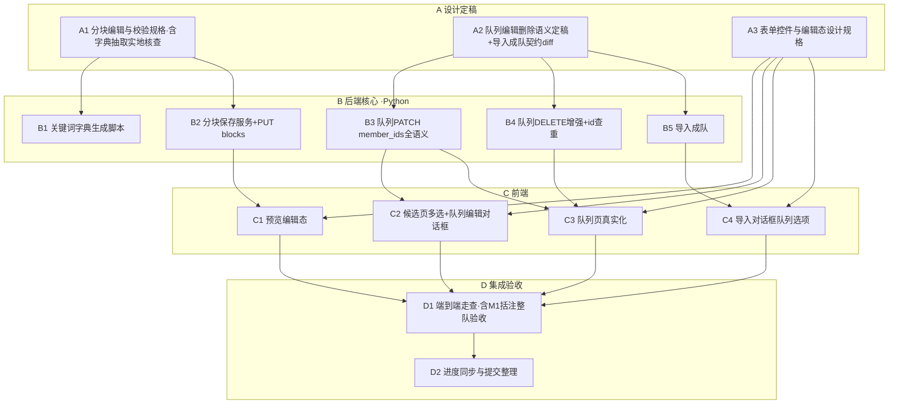
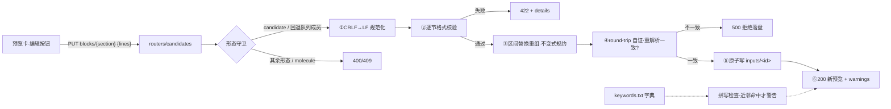
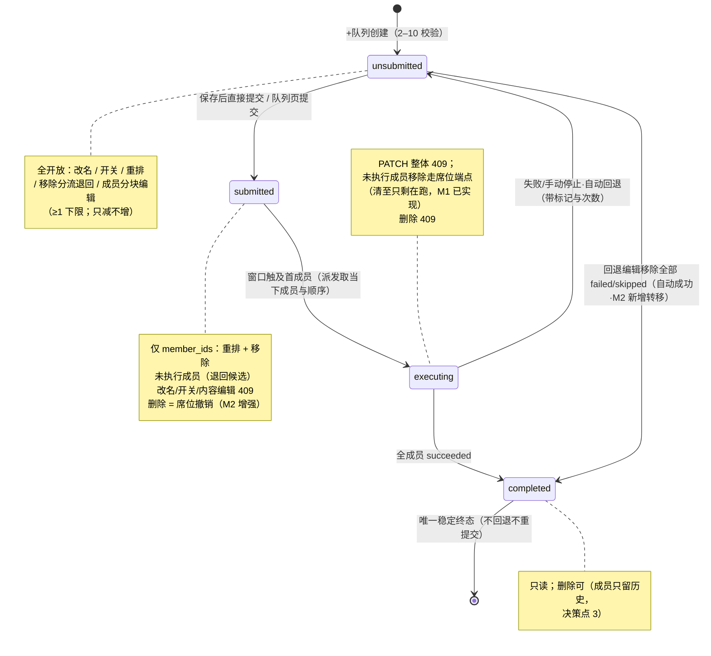

# M2 · 输入工程 — 详细执行计划

> 状态：执行计划（依据 [roadmap.md](../specs/roadmap.md) §3 M2 制定）。
> 本文是 M2 的任务分解与设计基线：§2 为三项关键设计的**定稿规格**（A 阶段
> 任务的直接输入），§3 为任务流程图，§4 为逐任务执行方案（步骤/技术要求/
> 质量标准/交付物），§5–§9 为测试、提交、验收、决策点与风险方案。
> 本文与 roadmap 冲突时以 roadmap 为准；REST/SSE 契约
> （[openapi.yaml](../api/openapi.yaml)、[sse.md](../api/sse.md)）已随 M0
> 定稿，M2 实施一律不漂移契约，确需变更走文档 diff（roadmap §4）——本里程碑
> 预先识别**一处**契约增量（导入成队参数，§2.3），先改文档再动代码。

## 0. 目标、范围与依据

**目标**（= roadmap §3 M2 定义）：在 M1 骨架之上做纯增量，把「编辑输入」做
专业——候选任务分块编辑（校验 + 关键词拼写检查 + CRLF→LF）、队列组建
（「+队列」对话框）、队列管理（独立列表页，唯一删除队列实体入口）与
「导入文件夹」增补队列选项；全部持久化、每次修改原子保存。roadmap M1 验收段
括注的「整队提交与队列失败/skipped 语义的端到端验收」随本里程碑队列组建
后完成（M2.5）。

**M2 工作项编号**（引 roadmap §3 M2 段落顺序，WBS 表「对应项」列引用）：

| 编号 | 工作项（roadmap 原文摘要） |
|---|---|
| M2.1 | 「编辑」：预览区点击「编辑」按钮启用——Link0/title/路由层/电荷·多重度/其他各层独立编辑、原子保存；每框必要格式校验 + 关键词拼写检查（字典从离线知识库程序化抽取生成，路径可配置，纳入版本管理、可重生成）；自动检测 CRLF→LF；**原子坐标不可编辑**（结构编辑交由上游 GaussView） |
| M2.2 | 「+队列」→ 复选框选择任务行 →「确认」→ 队列编辑对话框：顶部队列名（默认时间戳 `yyyymmddhhmmss`，可改）与队列 id，中部成员（任务 id、文件名、title，「-」移除（未执行者退回候选列表）、拖动排序；成员数 2–10 仅创建时校验，创建后只减不增、至少保留 1 个），勾选「自动跳过失败任务」开关，底部「取消」/「保存」/「直接提交」 |
| M2.3 | 队列列表独立页面：已保存队列的管理入口（**唯一删除队列实体的位置**）——双击队列行打开队列编辑框，可改名、拖动重排、移除成员（按结局分流，见 roadmap §2.1）、删除队列（二次确认）；失败队列以回退标记与回退次数显著标识并展示失败成员与各自归因，成员内容可分块修改（哈希自动判定重跑）、可重排、可移除，编辑后重新提交；移除全部 failed/skipped 成员后队列自动标记成功；成功队列为唯一稳定终态，不提供回退重提交 |
| M2.4 | 「导入文件夹」增补队列选项：「以文件夹名为队列名导入并保存为队列」（可选勾选，勾选即按成员数 2–10 校验——受支持文件数越界则拒绝成队、回落为全部生成候选）；导入与剔除的存储规则见 roadmap §2.4 |
| M2.5 | 整队端到端验收（roadmap M1 验收段括注）：整队提交与队列失败/skipped 语义、失败回退编辑重提交的哈希跳过、移除失败成员自动成功，以 GUI 路径完整走通并留痕 |

**不做**（非目标，属 M3+/backlog）：cclib 结果解析与可视化（M3）、任务链与
断点续跑动作（M4）、DSH 工具封装（M5）、页面内 3D 结构预览与可视化 Route
构建器、从零新建输入文件（均属 roadmap §6 backlog）。

**前置条件**（开工闸门）：

1. M1 DoD 已通过（[m1-acceptance.md](m1-acceptance.md) §5 全表）且 M1 发布
   流程（changelog-spec §1.6：冻结、打 tag）完成——当前 progress.json
   in_progress 项即此。
2. M1 交接基线成立：引擎已实现队列席位全语义（序列展开/失败分流/回退/哈希
   跳过，单测覆盖）；queues 路由已真实化（创建含 2–10 校验、GET、PATCH 仅
   name/skip_failed、DELETE 仅 unsubmitted、submit）。M2 后端工作=**补齐
   契约已定义但未实施的语义**（PUT blocks、PATCH member_ids、DELETE 增强、
   导入成队参数），不重做 M1 已验收部分。

**依据**：roadmap §2.1（领域模型/编辑与移除边界/派发原则）、§2.4（文件
治理）、§2.6（字段生命周期三项定稿）、§2.7（输入结构与空行规则）、§3 M2、
§5（风险表）；M0 产出 [m0-plan.md](m0-plan.md) §2.2（输入分块结构与重组
不变式）、§2.3（端点 #9/#13/#15–17 的 M2 实施标注）、§9 决策点 11（校验
分级）；[m0-frontend-design.md](m0-frontend-design.md) §9（select/checkbox/
toggle 规格与编辑态样式移项 M2）；[m1-plan.md](m1-plan.md) §2.2（form 形态
转换）、[m1-acceptance.md](m1-acceptance.md) §1.3（走查遗留项存案）；
契约 [openapi.yaml](../api/openapi.yaml)（PUT blocks warnings 结构、Queue
schema）、[sse.md](../api/sse.md)（§3 推送时机表已覆盖队列编辑场景）。

## 1. 任务分解与追踪（WBS）

四阶段：**A** 设计定稿（闸门）、**B** 后端核心（Python）、**C** 前端真实化、
**D** 集成验收。任务编号贯穿全文引用。规模：S ≈ 半天内，M ≈ 1 天，L ≈ 2 天。

| 编号 | 任务 | 产出物 | 验收标准（可验证） | 依赖 | 规模 | 对应项 |
|---|---|---|---|---|---|---|
| A1 | 分块编辑与校验规格定稿（含字典抽取规则实地核查） | §2.1 定稿（逐节校验规则/重组策略/守卫矩阵/拼写检查策略） | 知识库 HTML 结构抽样核查结论落档；逐节校验规则对照 roadmap §2.7 走查通过；无 TBD 遗留 | — | M | M2.1、§2.7 |
| A2 | 队列编辑/删除语义定稿 + 导入成队契约 diff | §2.2/§2.3 定稿 + openapi.yaml/mapping.md 增补（提交 #2） | PATCH 状态分级矩阵对照 roadmap §2.1「编辑与移除边界」逐条走查；移除分流与自动成功判定有存储规则落位；契约 diff 评审通过 | — | M | M2.2/M2.3/M2.4、§2.1/§2.4 |
| A3 | 表单控件与编辑态设计规格（设计文档增补） | m0-frontend-design.md §4/§9 增补（select/checkbox/toggle/编辑态/拖拽动效/对话框布局） | 规格只引用既有 tokens 不新增色值字号；与 m0-frontend-design §9 移项登记一致 | — | S | M2.1–M2.4 |
| B1 | 关键词字典生成脚本与字典入库 | `scripts/extract_keywords.py` + 字典文件（版本管理） | 对知识库全集运行产出确定集合；两次运行输出逐字节一致（可重生成）；路径参数化（--kb-dir/--out） | A1 | M | M2.1 |
| B2 | 分块保存服务 + PUT blocks 端点 | `services/candidates` 扩展（重组/CRLF/校验/守卫）+ 路由接线 | test_block_save 全绿（§5）；金标准样本 round-trip 一致；写坏文件被 round-trip 自证拦截 | A1 | L | M2.1/M2.3 |
| B3 | 队列 PATCH member_ids 全语义 | queues 路由/服务扩展（重排/移除分流/只减不增/自动成功/状态分级） | test_queue_patch 全绿（§5）；自动成功后 last_failure 清 null 且不可再提交 | A2 | L | M2.2/M2.3 |
| B4 | 队列 DELETE 增强 + id 查重补漏 | submitted 删→席位撤销；completed 删→成员只留历史；_new_queue_id 对照全库查重 | test_queue_delete 全绿；submitted 删除后 pending.snapshot 推送且席位消失 | A2 | M | M2.3、§2.4 |
| B5 | 导入成队（契约 diff 实施） | `services/candidates.import_files` 增 queue_from_folder 分支 + 响应扩字段 | test_import_queue 全绿：2–10 成队、越界回落全部候选、事件序列符合 sse.md §3 | A2 | M | M2.4 |
| C1 | 预览编辑态 | 预览卡「编辑」按钮、分块输入框、错误/警告注记、保存/取消 | 冒烟：改 route 保存后预览与重新 GET 一致；校验 422 与警告 200 均有对应 UI 态 | B2 | M | M2.1 |
| C2 | 候选页多选 + 队列编辑对话框 | 复选框列、+队列工具条、对话框组件（创建/编辑共用） | 冒烟：选 2 任务→改名→拖动排序→保存/直接提交两路径走通；成员 1 个时「-」禁用 | B3 | L | M2.2 |
| C3 | 队列页真实化 | 双击编辑、删除二次确认、回退标识与失败归因、成员分流操作、重新提交 | 冒烟：失败回退队列双击→改成员内容→重提交；全移失败成员→自动成功徽标 | B3, B4 | L | M2.3 |
| C4 | 导入对话框增补队列选项 | 文件夹导入勾选「保存为队列」+ folder_name 上送 | 冒烟：勾选导入 3 文件文件夹→队列出现；11 文件夹→回落全候选并提示 | B5 | S | M2.4 |
| D1 | 端到端验收走查（真 g16 + fake g16 组合） | 走查记录（m2-acceptance.md 或本文档附录） | §7.1 roadmap M2 验收路径逐条留痕（含 M1 括注整队验收） | B*, C* | M | M2.5 |
| D2 | 进度同步与提交整理 | CHANGELOG.jsonl / progress.json 终态 | 双闸门（`uv run pytest` + `validate_progress.py`）通过；提交序列与 §6 核对一致 | 全部 | S | §6 |

依赖关系总览：A1→(B1, B2)；A2→(B3, B4, B5)；A3→C1–C4（设计先行即可开工
前端，但接线依赖对应 B）；B2→C1；B3→(C2, C3)；B4→C3；B5→C4；B*/C*→D1→D2。
A1/A2/A3 可并行；B1 与 B2 可并行（字典就绪前 B2 以空字典跑校验测试，B1 就绪
后补拼写断言）。

## 2. 关键设计定稿（A 阶段规格输入）

### 2.1 分块编辑与校验（A1 → M2.1）

**编辑入口与形态守卫**（对照 roadmap §2.1「编辑与移除边界」：任务内容编辑
只有两个入口——候选列表与回退为未提交的失败队列）。PUT
`/candidates/{id}/blocks/{section}` 按任务形态守卫（id 跨形态延续，端点共用）：

| 任务形态 / 队列状态 | 判定 | 响应 |
|---|---|---|
| `form=candidate` | 放行（候选列表入口） | 200 |
| `form=queue_member` 且所属队列 `unsubmitted`（含失败回退） | 放行（队列编辑框内点击成员进入同一套分块编辑） | 200 |
| `form=queue_member` 且队列 `submitted`/`executing`/`completed` | 拒绝（未执行成员不可编辑内容） | 409 `QUEUE_STATE_CONFLICT` |
| `form=seat_task`（在途） | 拒绝 | 409 `TASK_IN_FLIGHT` |
| `form=finished`（历史态） | 拒绝（历史不可变） | 409 `TASK_FINISHED` |
| `section=molecule` 或未知节名 | 拒绝（原子坐标不可编辑） | 400 `INVALID_REQUEST`（A1 定稿：路径参数级错误） |

**保存流水**（B2 实现，单节原子保存）：

```text
PUT {lines: [...]}
  ① 规范化：逐行剥尾部 \r（CRLF→LF，roadmap M2「自动检测 CRLF→LF」）
  ② 逐节格式校验（阻断级，失败 422 + details）——规则见下表
  ③ 重组：以「原文行区间替换」实现——只替换目标节的行，其余字节原样保留
     （分子节字节级不动，Variables:/Constants: 空行分隔天然保全）；
     目标节末尾按不变式规约「恰好一个空行」（Link0 除外：其后不加空行）
  ④ round-trip 自证：重组全文重新 parse_input，分块结构与②的结果一致，
     不一致即内部错误（500，拒绝落盘——宁可保存失败不可写坏输入）
  ⑤ 原子写 inputs/<id>（临时文件 + os.replace）
  ⑥ 响应 200：新 InputPreview + warnings[]（拼写检查，非阻断）
```

**重组不变式**（m0-plan §2.2 已定稿并写入契约 description，此处为实施基线）：
除 Link 0 外每节末尾恰好一个空行（含文件末节与文件末尾）；Link 0 之后不加
空行；分子节 `Variables:`/`Constants:` 区之间的空行分隔不得丢失或增删（由
「区间替换 + 分子节不动」保证）。

**逐节格式校验规则**（阻断 422；A1 对照 roadmap §2.7 与 G16 手册定稿）：

| 节 | 阻断校验（422） |
|---|---|
| link0 | 每行 `%Key=Value` 形态（大小写不敏感、值非空）；`%NProcShared` 值为正整数；`%Mem` 值为数值（单位 GB/MB/KW/B，缺省按字节——以 A1 手册核查为准） |
| route | 首行以 `#` 开头（大小写不敏感）；行内不得出现空行（route 中断即节终止） |
| title | 至多 5 行；不得含 `@ # ! – _ \` 与控制字符（roadmap §2.7 Title 节要点） |
| charge_mult | 恰好一行、两个 token；电荷为整数（可负）、多重度为正整数 |
| additional-\<n\> | 自由文本（无阻断校验；terminator_blank 标注随保存更新） |
| molecule | 不可编辑（400，见守卫表） |

**关键词拼写检查**（非阻断，200 + warnings[]，结构按契约：`{line, keyword,
kind, suggestion}`）：

- 检查范围：route 节 token（`#` 后按 `/` 与空白切分）。
- **警告条件（A1 定稿建议）**：token 未命中字典**且**与字典某词条编辑距离
  接近（`difflib.get_close_matches(cutoff=0.8)` 命中）→ 报
  `kind="keyword_spell"` + suggestion（首个近邻）。纯新词（无近邻）**不警告**
  ——字典只含 route 关键词（opt/freq/scrf…），方法学与基组（B3LYP、6-31G(d)）
  不在字典内，若「未收录即警告」则每条 route 都告警、检查失效；m0-plan 决策
  点 11 的「知情保存」语义由近邻命中承担（真正的疑似拼错才提示）。
- 大小写不敏感匹配（G16 输入大小写不敏感，roadmap §2.7）。

**字典抽取**（B1）：

- 来源：`/mnt/e/gaussian-knowledge_base/data/raw/keyword/`（实测存在，每
  关键词一页 HTML，文件名即关键词名，如 `admp.html`/`cbs.html`）。
- `scripts/extract_keywords.py`：`--kb-dir`（默认上述路径，可配置）扫描
  `*.html`，抽取关键词全集（文件名 + A1 实地核查后定的页内变体规则，如
  同页列出的等价形式）；`--out` 输出字典文件（默认
  `web/src/parse/keywords.txt`，每行一词、按码点排序——确定性输出保证
  「纳入版本管理、可重生成」且重跑幂等）。
- 字典路径属部署级配置，不列为设置面板项（m0-plan 决策点 11 既定）；后端
  启动加载，缺失时拼写检查降级为「零警告」并在日志登记（不阻断保存）。

### 2.2 队列编辑与删除语义（A2 → M2.2/M2.3）

**PATCH `/queues/{id}` 状态分级矩阵**（对照 roadmap §2.1「编辑与移除边界」；
M1 现实现为整体 409，M2 按矩阵放开）：

| 队列状态 | name | skip_failed | member_ids |
|---|---|---|---|
| `unsubmitted`（含失败回退） | ✓ | ✓ | ✓ 重排 + 移除（按结局分流退回；只减不增；至多移除至剩 1） |
| `submitted`（在待执行、未开跑） | ✗ 409 | ✗ 409（执行语义对已在待执行者不追溯，§2.5 通则类推） | ✓ 重排 + 移除未执行成员（退回候选 `returned_unrun`；正在执行成员不存在于此态；至多移除至剩 1） |
| `executing` | ✗ 409 | ✗ 409 | ✗ 409（未执行成员移除走席位端点 `DELETE /pending/seats/{seat_id}/members/{task_id}`，M1 已实现「清至只剩正在执行的成员」；队列页对执行中队列提供只读视图） |
| `completed`（成功终态） | ✗ 409 | ✗ 409 | ✗ 409（唯一稳定终态，不提供回退重提交） |

**member_ids 校验规则**（unsubmitted/submitted 共通）：

- 全量有序、原子（契约 #15 语义）：请求即新的成员序列。
- 新列表必须是当前列表的**子集**（出现当前成员之外的任务 id → 422
  `QUEUE_MEMBER_ADDED`，创建后只减不增）；重复 id → 422。
- 移除至 0 个成员 → 422 `QUEUE_MEMBER_RANGE`（队列实体不因成员减空而除名，
  至少保留 1 个；删除队列实体走队列列表页 DELETE）。
- 顺序即新 position（重排 = 同集合不同序，全量重写）。

**移除分流**（unsubmitted 回退队列的已执行成员，对照 roadmap §2.1「succeeded
脱离、failed/skipped 退回候选」；存储规则落位）：

| 被移除成员 | 处置 | tasks 行变化 |
|---|---|---|
| 未执行成员（无执行记录） | 退回候选列表（`origin=returned_unrun`，id 延续——移动语义） | `queue_member → candidate` |
| succeeded 成员 | **脱离队列**：历史条目与文件保留、不生成新候选（复用其输入走历史条目「退回候选」） | `queue_member → finished`（归属信息由历史条目承载） |
| failed 成员 | 以 `run/<执行id>/` 实际执行的输入副本**新建候选**（新 id、`origin=returned_failed` 附归因——规则同历史「退回候选」的复制语义） | 原行 `queue_member → finished`；新建 candidate 行 |
| skipped 成员 | 以任务输入副本新建候选（新 id、`origin=returned_unrun`，标注从未执行——skipped 无执行目录回落任务副本） | 同上 |

**自动成功判定**（roadmap §2.1「回退编辑中移除全部 failed/skipped 成员（只剩
succeeded）后自动标记为成功、就此终结」）：

- 触发点：member_ids 更新落库后，对**剩余成员**查最近执行记录终态。
- 判据：剩余成员全部存在 succeeded 执行记录（且无 failed/skipped 未移除）
  → 队列 `state=completed`、`finish_reason=success`、`last_failure=null`
  （契约 Queue schema「队列成功终态时清 null」）。
- 事件：`queue.status(from=unsubmitted, to=completed, finish_reason=success)`
  （sse.md §2 该事件触发条件「队列状态流转（含失败回退、成功终结）」已涵盖，
  无契约变更）。
- 判定后队列进入唯一稳定终态：PATCH/DELETE 内已执行成员无退回需求、submit
  409（前端不渲染编辑与提交入口）。
- 边界：新建（从未提交）队列移除成员不触发判定（成员无执行记录 ≠
  succeeded——判据是「存在 succeeded 记录」而非「无失败记录」）。

**DELETE `/queues/{id}` 增强**（roadmap §2.1「在待执行中的队列删除时其席位
随之撤销；执行中的队列不可删除」+ §2.4 删除队列退回规则）：

| 队列状态 | 处置 |
|---|---|
| `unsubmitted` | 现状保留（M1 已实现）：未执行成员退回候选（`returned_unrun`）→ 删行 → `queues.changed(deleted)` |
| `submitted`（在待执行） | **席位撤销**：从 seats 移除该队列席位 → 未执行成员退回候选 → 删行 → `queues.changed(deleted)` + `pending.snapshot`（席位释放）。窗口已触及=首成员已派发=state 已 executing，故 submitted 态无锁定席位冲突 |
| `executing` | 409 `QUEUE_STATE_CONFLICT`（执行中不可删除） |
| `completed` | 允许删除（决策点 3，建议值）：全成员已执行 → 无退回、成员只留历史（经历史页「重新排队/退回候选」触达，§2.4 通用规则）→ 删行 → `queues.changed(deleted)` |

**队列 id 查重补漏**：契约 Queue.id 描述「生成时对照全库查重」，M1 现实现
`_new_queue_id()` 未查重——B4 补（生成后对照 queues 全表，命中即重试）。

**「+队列」与队列编辑对话框**（创建/编辑共用组件，C2/C3）：

- 顶部：队列名输入（创建时默认 `yyyymmddhhmmss` 时间戳可改）+ 队列 id 只读
  （创建对话框显示「保存后生成」占位——id 由后端随机短 id 生成）。
- 中部：成员列表（任务 id、文件名、title；「-」移除、拖动排序）。创建态
  移除即从待组清单去掉；编辑态移除走 PATCH member_ids（未执行者退回候选，
  已执行者按 §2.2 分流）。移除至剩 1 个时「-」禁用（下限前置提示）。
- 「自动跳过失败任务」开关（创建时勾选、unsubmitted 态可改）。
- 底部「取消」/「保存」/「直接提交」：创建态 = POST /queues（+ POST
  /queues/{id}/submit）；编辑 unsubmitted 态 = PATCH（+ submit）。已提交/
  执行中/成功队列不提供「直接提交」（roadmap：重新提交以队列为单位，仅
  未提交态可提交）。

### 2.3 导入成队的契约 diff（A2 → M2.4，本里程碑唯一契约增量）

roadmap M2「『导入文件夹』增补队列选项」超出 M0 契约 POST /candidates 现有
参数（仅 `files[]` + `mode=files|folder`），按 roadmap §4 走文档 diff（先改
openapi.yaml/mapping.md，评审后实施）：

- 请求（multipart）增补可选字段：
  - `queue_from_folder: boolean`（默认 false；`mode=folder` 时有效，
    `mode=files` 时显式 true → 422）；
  - `folder_name: string`（队列名来源；`queue_from_folder=true` 时必填——
    浏览器 `webkitdirectory` 上传的文件仅携基名，相对路径由前端另送）。
- 语义：勾选且受支持文件数 ∈ [2,10] → 导入后以候选转换（moved_out ×N）+
  创建队列（`name=folder_name`，随机 id，skip_failed=false 默认）；
  数越界（<2 或 >10）→ **拒绝成队、回落为全部生成候选**（roadmap 明示），
  响应明示回落原因供前端提示。
- 响应 `CandidateCreate` 增补可选字段：`queue: {queue_id, name} | null`
  （成队返回，回落 null）+ `queue_fallback_reason: string | null`（回落时
  如「受支持文件 11 个，超出队列成员上限 10」）。
- 事件序列：成队 = `candidates.changed(created)` ×N → `queues.changed
  (created)`（与 sse.md §3「队列保存（创建）」同款，无新事件类型）。
- 前端过滤规则不变（.gjf/.com、跳过隐藏目录，M1 已实现）；过滤后为空仍
  前置拦截不发请求。

### 2.4 表单控件与编辑态规格（A3 → 设计文档增补，非契约变更）

补入 [m0-frontend-design.md](m0-frontend-design.md)（§9 移项落地，走设计
文档 diff，提交 #3）：

- **select**：原生 `appearance:none` 接管，`--bg-inset` 底 + `--border-hair`
  描边 + 焦点双环（输入框同款）；自绘下拉箭头（`--text-faint`）。
- **checkbox**：16×16 方形，描边 `--border-strong`，选中底 `--accent` +
  白勾；禁用 40% 不透明（输入框同则）。
- **toggle**：36×20 轨道（`--bg-inset` + 描边），滑块 16px 圆；选中轨道
  `--accent`；切换 120ms `--ease-std`。
- **编辑态**：校验错误 = 输入框 `--danger` 描边 + 错误注记（中文
  `--text-sm`，对齐现行字号口径）；拼写警告 = 琥珀注记（`--warn`，非阻断、
  可继续保存）；编辑中的分块卡描边转 `--accent`。
- **拖拽排序**：位移动效 120ms、无弹性（m0-frontend-design §9 既定）；与
  待执行页拖拽共用实现（抽取公共 drag-drop 组合式函数，M1 已有可复用交互）。
- **队列编辑对话框**：沿 ConfirmModal 的弹层体系（`--shadow-pop`、标题
  mono 500），宽 560px、限高滚动；布局 = §2.2 末条「顶部名/id、中部成员、
  开关、底部按钮组」。

## 3. 任务流程图

### 3.1 阶段与任务依赖（WBS 全景）



要点：A 三项并行且是全局闸门（A2 含契约 diff，**文档提交先行**）；B1 与 B2
可并行；C 的设计基线（A3）先行、接线随对应 B 就绪。

### 3.2 分块编辑保存数据流



### 3.3 队列状态 × 编辑边界（roadmap §2.1 定稿语义的 M2 实施视图）



## 4. 逐任务执行方案

通用技术要求（全部任务适用，同 m1-plan §4）：路径 `pathlib.Path`+`/` 拼接；
子进程参数列表形式、禁 `shell=True`；文本读写显式 `encoding="utf-8"`；新依赖
经 context7 核对用法后单行 uv/npm 安装（国内镜像源）；每任务完成即同步
CHANGELOG.jsonl unreleased 与 progress.json（AGENTS §九），提交前双闸门。

### 4.1 A 阶段：设计定稿

**A1 分块编辑与校验规格**：① 实地抽样知识库 HTML（≥10 页：单变体/多变体/
复合关键词页），定稿抽取规则（文件名全集 + 页内变体的识别方式）与拼写检查
策略（§2.1 建议：近邻命中才警告）——结论回填本文 §2.1；② 逐节校验规则对照
roadmap §2.7 与 G16 手册（%Mem 单位、title 禁用字符集）逐条走查；③ 守卫
矩阵对照 §2.1「编辑与移除边界」走查（六个入口路径穷举：候选/回退成员/已
提交成员/在途/历史/molecule）。质量标准：无 TBD；B1/B2/C1 可直接照做。
交付物：定稿 §2.1（本文档）。

**A2 队列语义定稿 + 契约 diff**：① §2.2 状态分级矩阵、移除分流存储规则、
自动成功判据对照 roadmap §2.1/§2.4 逐句核对（重点：succeeded 脱离不生成
新候选、failed/skipped 新建候选新 id、至少保留 1、待执行中删除撤席）；②
契约 diff 落盘（openapi.yaml POST /candidates 与 CandidateCreate、mapping.md
导入行），随提交 #2 入库；③ sse.md §3 时机表核对：PATCH 分流
（queues.changed + moved_in）、自动成功（queue.status 成功终结）、submitted
删除（queues.changed + pending.snapshot + moved_in）均确认由既有事件承载、
无新增事件类型。质量标准：与 roadmap 语义零冲突（发现冲突即先改文档再定稿）。
交付物：定稿 §2.2/§2.3 + 契约 diff 提交。

**A3 设计规格增补**：按 §2.4 将 select/checkbox/toggle/编辑态/拖拽动效/
对话框布局规格写入 m0-frontend-design.md（§4 表单控件节扩充 + §9 移项销号）。
质量标准：全部引用既有 tokens、零新增色值字号；check_tokens/check_contrast
两闸门不受影响。交付物：设计文档 diff（提交 #3）。

### 4.2 B 阶段：后端核心（web/）

**B1 关键词字典生成**：① 先写测试（对 fixtures 内 mini 知识库样本断言抽取
结果；两次运行输出一致）；② `scripts/extract_keywords.py`（参数 --kb-dir/
--out，排序输出；AGENTS §八：输出路径参数化）；③ 对真实知识库全集运行，
字典文件 `web/src/parse/keywords.txt` 入版本管理；④ `parse/keywords.py`
加载器（启动读入、缺失降级零警告+日志）。质量标准：脚本可重生成（幂等）；
字典规模与知识库页数一致（登记实际数字）。交付物：脚本 + 字典 + 测试。

**B2 分块保存服务**：① 先写测试（§5 test_block_save：重组不变式 ×5 类
构造样本、CRLF→LF、逐节校验正反例、守卫矩阵六路径、round-trip、金标准
4+ 份 .out 对应输入的编辑回写）；② `services/candidates` 增 `save_block
(task_id, section, lines)`（§2.1 流水 ①–⑥，读-改-写全程持全局写锁短事务）；
③ 重组器落 `parse/blocks.py`（`reassemble(original_text, section, lines)`，
区间替换实现）；④ 路由 `PUT /candidates/{id}/blocks/{section}` 接线（响应
InputPreview + warnings）。质量标准：test_block_save 全绿；构造「重组后无法
解析」的样本被 500 拦截（不落盘）。交付物：保存服务 + 端点 + 测试。

**B3 队列 PATCH 全语义**：① 先写测试（§5 test_queue_patch：矩阵四态 ×
三种字段、分流四类、自动成功含边界、错误码全集）；② queues 路由 PATCH 重构：
按 §2.2 矩阵分级放行；member_ids 校验（子集/去重/≥1）→ 事务内分流（退回/
脱离/新建候选）→ position 全量重写 → 自动成功判定 → 事件发射
（`queues.changed(updated)` + 逐退回成员 `candidates.changed(moved_in)` +
自动成功时 `queue.status`）；③ 待执行页席位内成员展示随 PATCH 结果自然更新
（席位快照由成员变化触发 `pending.snapshot`）。质量标准：test_queue_patch
全绿；与 M1 引擎竞态单测（FakeGateway 窗口推进中并发 PATCH——派发取最新
成员语义不破坏）。交付物：PATCH 全语义 + 测试。

**B4 队列 DELETE 增强**：① 先写测试（§5 test_queue_delete 四态矩阵）；
② `services/pending` 增按队列撤席函数（seats 删行 + snapshot 事件）；
③ DELETE 分级：submitted → 撤席 + 成员退回 + 删行；completed → 删行（成员
只留历史）；executing → 409；unsubmitted 回归不变；④ `_new_queue_id` 对照
全库查重。质量标准：test_queue_delete 全绿；submitted 删除后 GET /pending
席位消失且容量回收。交付物：DELETE 增强 + 测试。

**B5 导入成队**：① 先写测试（§5 test_import_queue）；② `import_files` 增
`queue_from_folder`/`folder_name` 参数分支：越界回落（全部生成候选 + 回落
原因）、成队（导入后转换 + 队列创建 + 事件序列）；③ 契约生成物同步（前端
contract.ts SSOT 再生，流程沿 M1 既有）；④ 前端无需改导入调用（C4 再接）。
质量标准：test_import_queue 全绿；契约回归含新参数不漂移。交付物：导入分支
+ 测试 + 契约同步。

### 4.3 C 阶段：前端（web/frontend/）

视觉与交互沿 m0-frontend-design 定稿基调与 A3 增补规格（不新增视觉决策）；
全部数据访问走契约 TS client，禁止手写类型。

- **C1 预览编辑态**：预览卡头「编辑」按钮（仅候选与回退队列成员上下文渲染）；
  分块卡切换为输入框（textarea mono，Link0/route/title/charge_mult/
  additional 逐块独立「保存」——原子保存语义即契约单节 PUT）；molecule 卡
  持续只读（无编辑按钮）；保存响应即新态（契约 mapping：编辑保存不推事件，
  多标签页不同步为既定语义）；422 错误红描边+注记、warnings 琥珀注记（含
  suggestion 文案「是否意为 xxx？」）；CRLF 检测提示（保存自动转 LF，UI 只
  在检出 CRLF 时注记一句）。
- **C2 候选页多选 + 队列编辑对话框**：列表增复选框列（表头全选/清空、已选
  计数）、「+队列」工具条按钮（已选 ≥2 且 ≤10 可用，越界禁用+提示——创建
  校验前置）；对话框组件（§2.4 规格，创建/编辑共用）：成员行拖动排序
  （复用/抽取待执行页 drag-drop 实现）、「-」移除（剩 1 禁用）、跳过开关
  （toggle）；「保存」= POST /queues、「直接提交」= POST + submit 链式调用
  （失败中断并展示）；成功后关闭并跳转/刷新队列页数据。
- **C3 队列页真实化**：列表行双击打开编辑对话框（按 §2.2 矩阵渲染可用
  操作：unsubmitted 全量、submitted 仅重排+移除未执行成员、executing/
  completed 只读详情）；回退标记与回退次数显著标识（已有「已回退 ×N」基础
  上补失败成员与各自归因列表——last_failure.members 的 task_id/state/cause
  渲染）；失败成员行提供「编辑内容」入口（进入 C1 同一套分块编辑，id 跨
  形态延续）；「重新提交」按钮（unsubmitted 态）；删除按钮（二次确认
  danger 模态，文案区分状态：待执行中的删除需说明席位撤销）；自动成功后
  徽标转 completed/SUCCESS。
- **C4 导入对话框队列选项**：文件夹导入 UI 增「保存为队列」勾选（checkbox）
  + 队列名预填文件夹名（webkitdirectory 顶层目录名，可改）；上送
  queue_from_folder/folder_name；回落响应（queue=null + 原因）以提示条展示。

每任务质量标准：`npm run build` + vue-tsc 零错误；对应页手动冒烟通过；不
引入硬编码色值/字号（check_tokens 闸门）。

### 4.4 D 阶段：集成验收

**D1**：端到端走查（真 g16 + fake g16 组合；§7.1 逐条留痕，走查记录落
`docs/plans/m2-acceptance.md`；GUI 经 Playwright 黑盒驱动，沿 M1 走查方法）。
**D2**：进度两文件同步、提交整理复核（§6 序列核对）、双闸门。

## 5. 测试矩阵（先测试后实现）

原则同 m1-plan §5：每个 B/C 任务动工前先落对应测试文件（红）→ 实现（绿）；
测试与被测模块同名对应。金标准：`~/g16/tests/` 真实样本 + fake g16 夹具。

| 测试文件 | 覆盖任务 | 核心断言（摘要） |
|---|---|---|
| test_extract_keywords.py | B1 | mini 知识库 fixtures 抽取结果确定；两次运行输出逐字节一致（幂等）；--kb-dir/--out 参数生效 |
| test_block_save.py | B2 | 重组不变式（每节末恰一空行/Link0 后无空行/末节文件尾/分子节字节级不动/Variables-Constants 分隔保全）；CRLF→LF；逐节校验阻断正反例（link0 值类型/route 首行 #/title 5 行与禁用字符/charge_mult 两整数）；守卫矩阵六路径（200/400/409 各就位）；round-trip（保存后重解析与保存块一致）；写坏样本被 500 拦截不落盘；拼写 warnings（近邻命中报/纯新词不报/suggestion 非空） |
| test_queue_patch.py | B3 | 状态矩阵（unsubmitted 全量/submitted 仅 member_ids/executing、completed 409）；member_ids 子集校验（新增 422/重复 422/清空 422）；移除分流四类（未执行退回 id 延续/succeeded 脱离无新候选/failed 新候选附归因/skipped 新候选）；自动成功（全移 failed/skipped → completed+success+last_failure null+事件序）；新建队列移除不触发；submitted 移除退回 returned_unrun；与引擎窗口推进并发不破坏（FakeGateway） |
| test_queue_delete.py | B4 | 四态矩阵（unsubmitted 成员退回/submitted 撤席+pending.snapshot+退回/executing 409/completed 成员只留历史）；id 生成查重（构造全库碰撞场景重试） |
| test_import_queue.py | B5 | queue_from_folder 成队（2–10 边界值 2/10 通过）；越界（1/11）回落全部候选 + 原因字段；mode=files + true → 422；事件序列（created ×N → queues.changed(created)）；folder_name 缺失 422 |
| test_e2e_queue_lifecycle.py | D 前置 | fake g16 整队全链路：创建（改名/排序）→直接提交→中段失败→未勾跳过分支（后续 skipped+predecessor_failed、执行序列越过队列补位）→回退（标记/次数/归因落库）→编辑失败成员（blocks 保存）→重提交→哈希跳过（上次成功未变成员无新执行记录）+重跑（已变者新执行）→移除全部 failed/skipped→自动成功；SSE 事件序符合 sse.md §3 |
| 契约回归 | B2/B3/B5 | M0 契约测试更新：PUT blocks 真实化断言、PATCH member_ids、导入新参数——契约零漂移证明（fixture 内存 SQLite + FakeGateway 沿 M1） |

SSE 断言约定沿 m1-plan §5（轮询等待 helper、同 execution 内有序）。本里程碑
无新事件类型，事件断言并入各域测试与 e2e。

## 6. 提交序列与进度同步

15 个提交，顺序即依赖序（AGENTS §5.1：单次提交只做一类变更；
docs → test → feat → 进度同步；每任务测试与实现同提交）。

| # | 提交（type: 摘要） | 内容 |
|---|---|---|
| 1 | docs(plans): M2 执行计划定稿 | 本文档（含 A 阶段规格基线） |
| 2 | docs(api): 导入成队契约增补 | openapi.yaml（POST /candidates 参数 + CandidateCreate 队列字段）+ mapping.md；sse.md 时机表核对说明（无事件变更） |
| 3 | docs(design): 表单控件与编辑态规格增补 | m0-frontend-design.md §4/§9（select/checkbox/toggle/编辑态/拖拽动效/对话框布局，移项销号） |
| 4 | feat(core): 关键词字典生成脚本与字典入库 | B1：scripts/extract_keywords.py + web/src/parse/keywords.txt + 加载器 + test_extract_keywords |
| 5 | feat(core): 分块保存服务与编辑端点 | B2：parse/blocks.py 重组器 + services save_block + PUT blocks 路由 + test_block_save |
| 6 | feat(core): 队列编辑全语义 | B3：PATCH 状态分级 + member_ids 分流 + 自动成功 + test_queue_patch |
| 7 | feat(core): 队列删除增强与 id 查重 | B4：submitted 撤席/completed 可删 + pending 撤席函数 + test_queue_delete |
| 8 | feat(core): 导入成队 | B5：import_files 分支 + 契约生成物同步 + test_import_queue |
| 9 | test(contract): 契约回归更新 | 契约测试覆盖 PUT blocks/PATCH member_ids/导入新参数（零漂移证明） |
| 10 | feat(frontend): 预览编辑态 | C1：编辑按钮/分块输入/错误与警告注记/CRLF 注记 |
| 11 | feat(frontend): 候选页多选与队列编辑对话框 | C2：复选框列/+队列工具条/对话框组件（创建共用） |
| 12 | feat(frontend): 队列页真实化 | C3：双击编辑/状态分级操作/回退与归因展示/重新提交/删除二次确认 |
| 13 | feat(frontend): 导入队列选项 | C4：保存为队列勾选 + 队列名预填 + 回落提示 |
| 14 | — D1 走查 | 走查记录 m2-acceptance.md + 随发现随修的 fix 提交（一缺陷一提交） |
| — | chore(progress): D 阶段收尾 | 进度两文件终态同步（随 D2 走） |

进度同步节点（AGENTS §九）：开发前把当前任务写入 progress.json in_progress；
每完成一个上表提交即向 CHANGELOG.jsonl unreleased 行与 progress.json
unreleased 追加摘要，不 deferred 到批次末；提交前跑双闸门（`uv run pytest` +
`uv run python scripts/validate_progress.py`，前端改动另跑 `npm run build` +
check_tokens/check_contrast）。M2 关闭前 D2 核对本表与实际 git log 一致。

## 7. 验收标准（M2 DoD）

### 7.1 端到端路径（D1 逐条留痕，对照 roadmap M2 验收段）

1. **编辑**：候选列表点击行预览关键信息 → 「编辑」修正一处关键词拼写错误
   （字典报告警告）→ 原子保存 → 文件字节级验证 CRLF 已转 LF（输入副本无
   `\r`）；molecule 无编辑入口；
2. **组建**：「+队列」组建 2 任务队列、改名、拖动排序 → 「保存」后队列列表
   可见、「直接提交」后进入待执行队列并按执行序列执行（默认并行数 1 即
   逐个）；入队者自动移出候选列表（§7.1 第 7 条验收一并留痕）；
3. **失败中止**：中段任务失败（fake g16 非零退出）时整队停止（未勾跳过：
   后续成员 skipped+predecessor_failed）且执行序列越过该队列、顺延待执行
   下一席位任务（队列后置一个单任务席位验证补位）；
4. **跳过跑完**：勾选跳过开关后跑完但仍有失败成员 → 队列记失败并回退可
   编辑（失败位置与原因可见：回退标记/次数/成员归因列表）；
5. **哈希跳过**：回退后修改失败任务再提交 → 上次成功且输入未变的成员跳过
   执行（无新执行记录、状态保持 succeeded）、已变者重跑（新执行记录）；
6. **自动成功**：移除全部失败与 skipped 成员后队列自动标记成功
   （completed/SUCCESS、last_failure 清空、不可再提交）；
7. **队列管理**：队列页双击编辑（改名/重排/移除分流）；删除 submitted 队列
   → 席位撤销、未执行成员退回候选；删除二次确认留痕；
8. **导入成队**：「导入文件夹」勾选保存为队列 → 3 文件文件夹成队（队列名
   =文件夹名）；11 文件文件夹 → 拒绝成队回落全部候选并提示。

### 7.2 系统级判据

- `uv run pytest` 全绿（M0+M1+M2 全量，含契约回归——证明契约 diff 之外零
  漂移、diff 部分按新契约成立）；
- `npm run build` + vue-tsc 零错误；check_tokens/check_contrast 通过；
- 双闸门：`scripts/validate_progress.py` 通过；
- **不偏离核对**：§0 的 M2 工作项编号表（M2.1–M2.5）逐项打勾；roadmap M2
  验收段语义与 §7.1 八条对应留痕；M1 验收段括注（整队端到端）随第 3–6 条
  销号。

## 8. 开放决策点（实施中关闭，建议值先行）

| # | 决策点 | 建议值 | 关闭时机 |
|---|---|---|---|
| 1 | molecule/未知 section 拒绝码 | 400 INVALID_REQUEST（路径参数级错误，区别于形态 409） | A1 |
| 2 | submitted 队列可否改名 | 不可（409 维持契约现语义；roadmap 仅授权 member_ids 的重排/移除，改名未授权——从严） | A2 |
| 3 | completed 队列可否删除 | 可删、成员只留历史（依据 roadmap §2.4 删除队列退回规则的通用语义：已执行成员不退回、经历史触达；成功终态「不提供回退重提交」不涉删除）。若评审从严则改 409 并登记 roadmap 澄清 | A2 |
| 4 | 字典抽取规则（文件名 vs 页内变体） | 文件名全集为基线 + A1 实地核查后定的页内变体规则（如等价形式行） | A1（实地核查） |
| 5 | 拼写警告策略 | 近邻命中才警告（cutoff=0.80 + suggestion）；纯新词不警告（防方法学/基组全量误报致检查失效） | A1 |
| 6 | 导入成队响应形状 | CandidateCreate 增 `queue: {queue_id, name}\|null` + `queue_fallback_reason: string\|null` | A2（随契约 diff 评审） |
| 7 | %Mem 缺省单位与校验粒度 | 按 G16 手册核查后定（值数值 + 可选单位后缀；类型错才 422） | A1 |
| 8 | 队列编辑对话框内已提交队列的操作入口 | submitted 行双击打开对话框、仅渲染重排+移除（其余字段只读+禁用原因提示）；executing/completed 双击展示只读详情（成员状态徽标与归因） | A3（交互规格） |

## 9. 风险评估与应对预案

| # | 风险 | 等级 | 触发信号 | 预案 |
|---|---|---|---|---|
| 1 | 知识库 HTML 结构不稳定（抽取不全/页内变体误抽） | 中 | B1 对真实全集运行产出与页数不符或样本页含意外结构 | A1 抽样核查先行（≥10 页覆盖不同形态）；字典入库 + test_extract_keywords 锁定；拼写检查非阻断（最坏=警告噪声不阻断保存）；D1 走查统计误报并调 cutoff |
| 2 | 重组写坏输入文件（编辑保存破坏 gjf 结构） | 高 | round-trip 自证触发 500、或走查发现保存后预览/提交异常 | 四重防线：区间替换（分子节字节级不动）→ 不变式规约 → round-trip 自证拒绝落盘 → 原子写（临时文件+rename）；test_block_save 对金标准与构造样本全覆盖；最坏恢复路径=重新导入源文件（导入副本语义保证源文件从未被触碰，roadmap §2.4） |
| 3 | PATCH 与引擎派发竞态（编辑时引擎正在取成员派发） | 中 | 并发单测出现双派发或成员状态撕裂 | 全局写锁 + 短事务（M1 既定）；「派发时才取信息」语义（§2.1）天然容忍窗口外编辑；派发中成员已进窗口=席位锁定/状态非未执行，分流规则天然跳过；FakeGateway 并发单测覆盖 |
| 4 | 自动成功误判（成员执行结局判定错） | 中 | 移除失败成员后队列未终结、或误终结 | 判定只读执行记录最近终态（SQLite 事实源）；「存在 succeeded 记录」而非「无失败记录」的从严判据；边界单测（新成员混入不触发/全部成功才触发） |
| 5 | 移除分流的存储一致性（failed 新建候选副本错源） | 中 | 退回候选的输入内容与实际执行副本不符 | 分流规则单测逐类断言文件来源（run/<执行id>/ vs 任务副本）；复用 M1 历史「退回候选」已验收的同源实现，不另写复制逻辑 |
| 6 | 对话框内拖拽排序实现复杂度（前端） | 中 | C2 排序交互不稳或与待执行页行为不一致 | 复用/抽取待执行页已验收的 drag-drop 实现为公共组合式函数；120ms 位移动效（A3 规格）；两端共用一套锁定/边界判定 |
| 7 | 契约 diff 引入前端生成物回归 | 低 | contract.ts 再生后类型检查报错 | SSOT 再生流程沿 M1 既有（临时目录比对）；契约回归测试同步更新（提交 #9） |
| 8 | 多标签页编辑覆盖（同块并发保存后写覆盖） | 低 | 用户双标签页编辑同一候选后丢失一处修改 | 单机单用户低概率；契约既定「保存响应即新态、不推事件」（mapping.md），登记为已知限制不改（避免为边缘场景扩事件契约） |
| 9 | 导入成队边界（空文件夹/混合类型/名称伪造） | 低 | folder_name 空串或与现有队列重名 | 空文件夹前端前置拦截（M1 已实现）；folder_name 空 → 422；队列名无唯一性约束（重名允许，id 唯一即可，roadmap 未要求名唯一） |
| 10 | submitted 队列删除与席位撤销的时序（撤席瞬间引擎取序列） | 中 | 撤席与窗口推进竞争 | 撤席走 pending 服务既有事务路径（与整席移除同源——M1 已实现整席移除回退语义，submitted 删除= 整席移除 + 删队列行的组合，复用而非新写） |

---

附：本计划与 roadmap 的语义对照在 D1 验收时逐项复核（§7.2 末条）；实施中
发现的偏差一律「先改文档（走 diff）、再改代码」，禁止静默偏离。M2 全部
工作项完成并 DoD 通过后，按 changelog-spec §1.6 走发布流程（预计 minor：
新增功能为主，契约 diff 为向后兼容的字段增补、无 breaking）。
