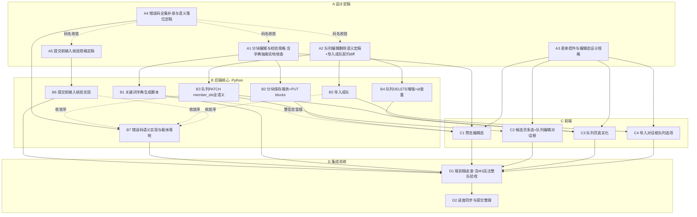
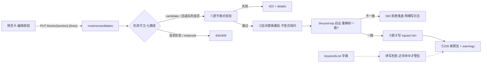
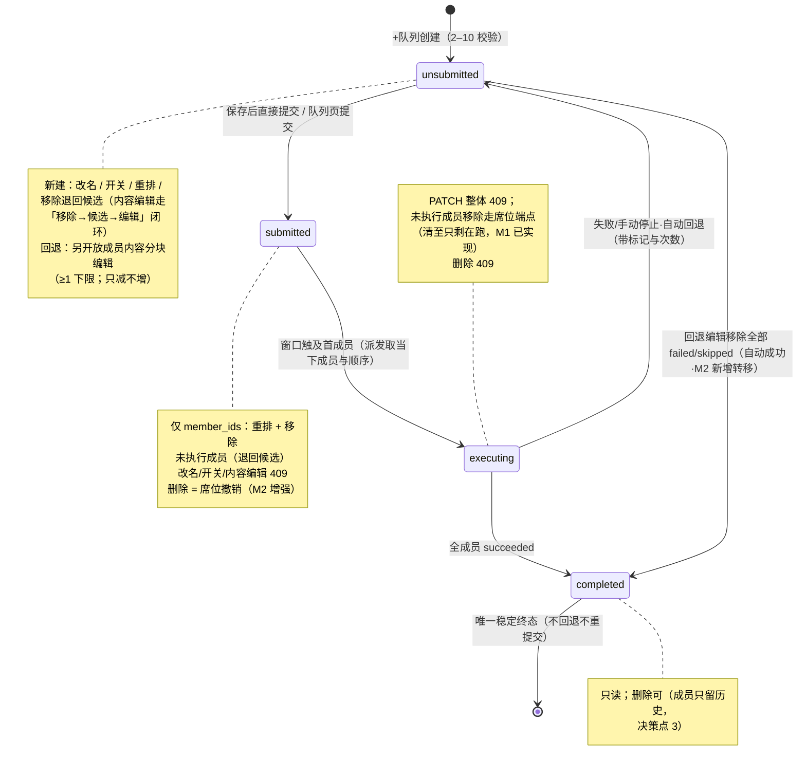
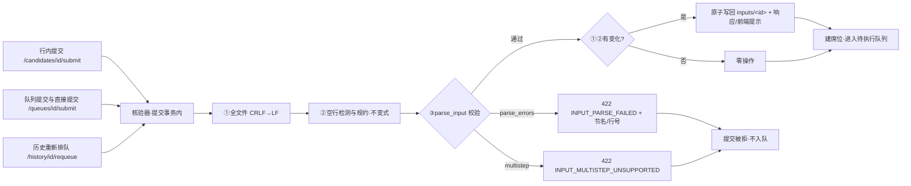

# M2 · 输入工程 — 详细执行计划

> 状态：执行计划（依据 [roadmap.md](../specs/roadmap.md) §3 M2 制定；
> 2026-09-26 按裁决修订并经 roadmap 一致性审查修复——修订要点见 §0
> 「修订说明」与「既有文档口径勘误（覆盖）登记」）。
> 本文是 M2 的任务分解与设计基线：§2 为关键设计的**定稿规格**（A 阶段
> 任务的直接输入），§3 为任务流程图，§4 为逐任务执行方案（步骤/技术要求/
> 质量标准/交付物），§5–§9 为测试、提交、验收、决策点与风险方案。
> 本文与 roadmap 冲突时以 roadmap 为准；REST/SSE 契约
> （[openapi.yaml](../api/openapi.yaml)、[sse.md](../api/sse.md)）已随 M0
> 定稿，M2 实施一律不漂移契约，确需变更走文档 diff（roadmap §4）——本里程碑
> 预先识别**三处**契约增量：导入成队参数（§2.3）、提交响应规范化标记
> `normalized`（§2.5）与错误码全集补录/对齐（§2.6），先改文档再动代码。

## 0. 目标、范围与依据

**目标**（= roadmap §3 M2 定义 + 审查裁决新增项）：在 M1 骨架之上做纯增量，
把「编辑输入」做专业——候选任务分块编辑（校验 + 关键词拼写检查）、队列组建
（「+队列」对话框）、队列管理（独立列表页，唯一删除队列实体入口）与
「导入文件夹」增补队列选项；全部持久化、每次修改自动保存（分块编辑自动保存，
保存为单节原子语义，对齐 roadmap 原文口径）。roadmap M1 验收段
括注的「整队提交与队列失败/skipped 语义的端到端验收」随本里程碑队列组建
后完成（M2.5）。

另有两项经 2026-09-26 审查裁决纳入的**额外任务**：

- **M2.6 提交前输入核验**（原 roadmap「自动检测 CRLF→LF」的实现位置调整，
  2026-09-26 裁决定稿）：
  换行规范化与空行检测/补充**不在编辑保存时执行**，而在**进入待执行队列的
  提交动作**（行内提交 / 队列提交 / 重新排队）时统一核验——编辑不做转换
  （规格见 §2.5）。roadmap M2 编辑条目与验收段已随本裁决同步改述并补录
  （验收段增补队列管理 / 导入成队 / 提交核验路径），随本计划修订一并回填，
  D1 仅做对照核验（见 §7.2）。
- **M2.7 错误码治理**：M0 契约定义但未实施的错误码语义补齐实现；M1 新增
  私有错误码补录/对齐（映射与理由见 §2.6）。

**M2 工作项编号**（引 roadmap §3 M2 段落顺序，WBS 表「对应项」列引用）：

| 编号 | 工作项（roadmap 原文摘要） |
|---|---|
| M2.1 | 「编辑」：预览区点击「编辑」按钮启用——Link0/title/路由层/电荷·多重度/其他各层独立编辑、原子保存；每框必要格式校验 + 关键词拼写检查（字典从离线知识库程序化抽取生成，路径可配置，纳入版本管理、可重生成）；**原子坐标不可编辑**（结构编辑交由上游 GaussView）。注：原文「自动检测 CRLF→LF」经 2026-09-26 裁决调整至提交核验执行（见 M2.6/§2.5） |
| M2.2 | 「+队列」→ 复选框选择任务行 →「确认」→ 队列编辑对话框：顶部队列名（默认时间戳 `yyyymmddhhmmss`，可改）与队列 id，中部成员（任务 id、文件名、title，「-」移除（未执行者退回候选列表）、拖动排序；成员数 2–10 仅创建时校验，创建后只减不增、至少保留 1 个），勾选「自动跳过失败任务」开关，底部「取消」/「保存」/「直接提交」 |
| M2.3 | 队列列表独立页面：已保存队列的管理入口（**唯一删除队列实体的位置**）——双击队列行打开队列编辑框，可改名、拖动重排、移除成员（按结局分流，见 roadmap §2.1）、删除队列（二次确认）；失败队列以回退标记与回退次数显著标识并展示失败成员与各自归因，成员内容可分块修改（哈希自动判定重跑）、可重排、可移除，编辑后重新提交；移除全部 failed/skipped 成员后队列自动标记成功；成功队列为唯一稳定终态，不提供回退重提交 |
| M2.4 | 「导入文件夹」增补队列选项：「以文件夹名为队列名导入并保存为队列」（可选勾选，勾选即按成员数 2–10 校验——受支持文件数越界则拒绝成队、回落为全部生成候选）；导入与剔除的存储规则见 roadmap §2.4 |
| M2.5 | 整队端到端验收（roadmap M1 验收段括注）：整队提交与队列失败/skipped 语义、失败回退编辑重提交的哈希跳过、移除失败成员自动成功，以 GUI 路径完整走通并留痕 |
| M2.6 | **提交前输入核验**（2026-09-26 裁决，roadmap M2 编辑条目已同步回填）：所有进入待执行队列的提交统一核验——全文件 CRLF→LF 转换 + 空行检测与补充（roadmap §2.7 空行规则），解析失败拒绝提交（§2.5）；核验适用于全部提交路径（行内/队列/重新排队），规范化缺漏将致任务启动即失败 |
| M2.7 | **错误码治理**（2026-09-26 裁决纳入，roadmap M2 条目 5 已同步回填）：M0 全集遗漏语义实现（`QUEUE_MEMBER_FLOOR`/`QUEUE_MEMBER_LOCKED`/`TASK_EXECUTED_IMMUTABLE`/`INPUT_PARSE_FAILED`/`SETTING_VALUE_INVALID`/`SETTING_READONLY`）+ M1 私有码与 M2 草案码按原意补录/替换（全集 19 码）+ 契约载体落位（§2.6） |

**不做**（非目标，属 M3+/backlog）：cclib 结果解析与可视化（M3）、任务链与
断点续跑动作（M4）、DSH 工具封装（M5）、页面内 3D 结构预览与可视化 Route
构建器、从零新建输入文件（均属 roadmap §6 backlog）。

**范围边界登记**（M1→M2 托付处置，2026-09-26 裁决「按建议」）：

- **chk/rwf 清理自动定时**（m1-plan §4.3 B9「自动定时延后启用」/§9 风险 12
  「自动定时随 M2」）：**不纳入 M2**，改期登记（落点：roadmap §7 开放事项 5）。
  理由：roadmap M1 条目为「按保留期清理 + 历史页提供清理入口」（手动入口已
  实施闭环，未承诺"定时"）；
  M2 主题为输入工程；自动触发涉「误删用户文件」高等级风险（m1-plan 风险 12），
  需独立安全设计与测试成本，后续按需另立专项或在 M3 前评估。
- **前端页面单测**（m1-plan §9 风险 10「单测 M2 视需要补」）：**决策不引入**
  （M2 C 阶段维持 `npm run build` + vue-tsc + 手动冒烟 + D1 走查）。理由：
  单机单人项目、M1 已建立手动冒烟清单；引入 vitest 属工具链扩张（新依赖），
  成本收益比不足。如需补，另立专项（落点：roadmap §7 开放事项 5）。

**修订说明一**（2026-09-26，按第一轮裁决落实；本文中「裁决 / 审查裁决」
指修订说明一/二各轮的输入）：
① 新增 **M2.6 提交前输入核验**——CRLF→LF 转换与空行检测/补充移至提交时
统一执行（编辑不再转换，防「一提交 g16 即报错」）；② 新增 **M2.7 错误码
治理**——M0 全集遗漏语义实现 + M1 私有码与 M2 草案码按「最接近错误原意」
补录/替换（全集 19 码），载体迁 `openapi.yaml` 文件头；③ 编辑入口维持 roadmap/m0 原标准（候选列表 + 失败
回退队列；新建未提交队列成员不可编辑内容）；④ 导入成队事件序列修正为
`created` ×N → `moved_out` ×N → `queues.changed(created)`；⑤ roadmap M2
编辑条目与验收段随本计划修订一并回填（增补第 7–9 条与 CRLF 口径改述，
不再等待 D1）；
⑥ 其余审查建议逐项落位（队列 id 查重范围、hq 产物闸门、总工量与关键路径、
风险表与决策点补充等）；⑦ 提交核验与 M1 已实现的 Link0 缺省补齐保持时机
分离（**不合并**，分工与理由见 §2.5），候选页黄警文案随之勘误（§4.3）。
工作项编号扩为 M2.1–M2.7；总工量 16.5 → 19.5 人天（核算见 §1）。

**修订说明二**（2026-09-26 一致性审查裁决，同日落实）：
① roadmap M2 编辑条目与验收段已随 CRLF 口径裁决回填（原拟 D1，提前至本
计划修订，见 M2.6/§7.2）；② B7 依赖修正为「晚于 B3/B5 收敛」，依赖图补
B1/B7→D1 与 A1→C1 边；③ 编辑交互口径修正为**分块编辑自动保存 + 「已自动
保存」小字提示**（对齐 roadmap「每次修改自动保存」原语义，替代前稿「显式
保存按钮」；队列编辑对话框仍为显式按钮，见 §2.4/A3/C1）；④ CRLF 检出提示
与「已自动规范化」提示定为中性档信息注记（非琥珀，共用同一样式，规格先行
落盘 m0-frontend-design §4.6/§9，见 §2.4）；⑤ 设计文档 §9 编辑态注记字号
勘误（11px → `--text-sm`）；⑥ 提交 #14 删去已提前完成的黄警文案勘误项；
⑦ D1 走查记录统一落 `docs/plans/m2-acceptance.md`；⑧ C1 依赖补 A1（校验
与警告规格就绪）。

**修订说明三**（2026-09-26 roadmap 一致性审查修复，同日落实）：
① 依赖补强——A4 码名结论先于 A1/A2/A5 引用、B1→C1（警告态冒烟另需字典）、
B7 增列 B6 收敛（依赖图与总览同步）；② 提交序列拆分——新增 1a/1b 承担
roadmap 回填与设计文档先行落盘的提交归属（#1 扩为含 m0-plan 勘误注记）；
③ m0-plan 三处口径勘误登记（见下小节）；④ 设计一致性补强——编辑态
`--accent` 描边须入 §2.1 纪律清单（或改走 `--border-strong`）、队列页
「行展开 × 双击编辑」手势分工、对话框复用 §4.6 弹层基础、D1 增设计一致性
核验（§2.4/A3/D1/§7.2）；⑤ roadmap 回填错误码治理条目与 §7 托付项改期
登记（落点见范围边界登记与 §7.2）；⑥ 措辞修正——`QUEUE_MEMBER_RANGE`
保留场景澄清、m1-plan §4.3 B9 引注、sse.md DELETE 顺序改述（提交 #2）；
⑦ §2.4 提交号勘误（#3 → #4）。

**修订说明四**（2026-09-26 roadmap 一致性复审修复，同日落实）：
① §0 目标段「每次修改原子保存」改述为「每次修改自动保存（单节原子语义）」，
对齐 roadmap M2 原文；② **提交响应规范化标记登记为第三处契约增量**——
`SubmitResponse` 增补 `normalized: boolean`（三条提交端点共用，§2.5），
前端仅据该字段展示「已自动规范化」注记、不在前端重复实现规约检测（防口径
漂移）；③ C 阶段补「已自动规范化」注记承接并全覆盖三条提交路径（C1 行内
提交 / C2 直接提交 / C3 重新提交 / 历史页重新排队随 C1 顺带——提交前核验
对所有提交动作生效，注记消费同步全覆盖，见 §4.3）；④ m0-frontend-design
§2.1 琥珀允许清单增补「拼写警告注记」（先行落盘，消除 §2.1 清单与 §9 移项
的内部矛盾）；⑤ `test_e2e_queue_lifecycle.py` 提交归属落 #12（§5/§6
同步）；⑥ 引用勘误——§9 风险 7「提交 #9」→「#12」、风险 13「roadmap
§7.2」→「roadmap §7 开放事项 2」；⑦ §3.1 要点补 B2–B5 经 C 任务传递至
D1 的说明；⑧ M2.6/M2.7「非 roadmap 原文」标注修正（roadmap 已回填，改注
「已同步回填」）。

**修订说明五**（2026-09-26，B1 开工前按用户指令落实）：
**B1 字典抽取源变更**——不再对 `/mnt/e/gaussian-knowledge_base/data/raw/keyword/`
离线 HTML 自行解析，改用 **gaussian-kb MCP**（官方 HTML 知识库经抽取结构化的
知识库检索服务，本地服务 `http://127.0.0.1:18765/mcp/`，其结构化数据目录
`~/gaussian-kb/data`，页面清单 `page_manifest.json` 与 MCP
`list_gaussian_pages` 同源同数）；`--kb-dir/--out` 参数语义保留
（--kb-dir 指向结构化数据目录）。A1「知识库 HTML 结构实地核查」随之改为
**对 MCP 页面清单甄别**（结论见 §2.1 字典抽取小节，已当场完成），非关键词页
剔除有据。本修订随 B1 开工先行落盘（docs(plans) 提交）。

**既有文档口径勘误（覆盖）登记**（2026-09-26，跨文档一致性；m0-plan 相关
条目以本计划为准，#9/§2.4 示例/§9 决策点 11 已随本批提交打勘误注记）：

① m0-plan §2.3 端点 #9 与 §2.4 PUT blocks 示例的「CRLF→LF 自动转换」——
编辑保存不做换行转换，规范化移至提交核验（§2.5，2026-09-26 裁决）；
② m0-plan §9 决策点 11 的关键词拼写检查策略——收窄为「近邻命中才警告、
纯新词不警告」（§2.1，A1 定稿），非阻断语义不变；
③ m0-plan §2.3 端点 #13/#15–17 的「M2 实施」标注——现状为 M1 已提前实施
基础版（创建含 2–10 校验 / GET / PATCH 仅 name/skip_failed / DELETE 仅
unsubmitted / submit），M2 仅增强（见前置条件 2），不构成冲突，随此登记。

**前置条件**（开工闸门）：

1. M1 DoD 已通过（[m1-acceptance.md](m1-acceptance.md) §5 全表）且 M1 发布
   流程（changelog-spec §1.6：冻结、打 tag）完成——当前 progress.json
   in_progress 项即此。
2. M1 交接基线成立：引擎已实现队列席位全语义（序列展开/失败分流/回退/哈希
   跳过，单测覆盖）；queues 路由已真实化（创建含 2–10 校验、GET、PATCH 仅
   name/skip_failed、DELETE 仅 unsubmitted、submit）。M2 后端工作=**补齐
   契约已定义但未实施的语义**（PUT blocks、PATCH member_ids、DELETE 增强、
   导入成队参数），不重做 M1 已验收部分。基线现状登记（2026-09-26 实测，
   防止把「未实施」误判为「无占位/无既有码」）：
   - `PUT /candidates/{id}/blocks/{section}` 已有**占位实现**（仅回显不落盘、
     无 form 守卫、节名集合含 `additional_sections`）——B2 从占位升级为真实
     实现，节名以契约 `additional-<n>` 为准并消解占位命名；
   - 错误码实际集合 12 个（含 M1 私有码 `INVALID_MEMBERS` /
     `SEAT_MEMBER_EXECUTED` / `SEAT_MEMBER_LAST`）——对齐工作见 M2.7/§2.6；
   - 导入原文落盘不做换行转换（CRLF 保留）；解析层已容错 CRLF
     （`_split_lines` 规范化）——**落盘规范化由 M2.6 提交核验承担**（§2.5）。

**依据**：roadmap §2.1（领域模型/编辑与移除边界/派发原则）、§2.4（文件
治理）、§2.6（字段生命周期三项定稿）、§2.7（输入结构与空行规则）、§3 M2、
§5（风险表）；M0 产出 [m0-plan.md](m0-plan.md) §2.1.1（错误码全集，M2.7
对表基准）、§2.2（输入分块结构与重组不变式）、§2.3（端点 #9/#13/#15–17 的
M2 实施标注）、§2.4（PUT blocks 端点定义）、§9 决策点 11（校验分级）；
[m0-frontend-design.md](m0-frontend-design.md) §2.1（accent 使用纪律清单与
琥珀允许清单——拼写警告注记已登记，见修订说明四）、
§4.6（信息注记三处共用样式，已落盘）、§9（select/checkbox/toggle 规格与
编辑态样式移项 M2、编辑态注记字号勘误、分块编辑自动保存）；
[m1-plan.md](m1-plan.md) §2.2（form 形态转换）、
§2.4/§9 风险 10/12（清理自动定时与前端单测的延后登记，处置见 §0 范围边界）；
契约 [openapi.yaml](../api/openapi.yaml)（PUT blocks warnings 结构、Queue
schema）、[sse.md](../api/sse.md)（§3 推送时机表已覆盖队列编辑场景）。

## 1. 任务分解与追踪（WBS）

四阶段：**A** 设计定稿（闸门）、**B** 后端核心（Python）、**C** 前端真实化、
**D** 集成验收。任务编号贯穿全文引用。规模：S ≈ 半天内，M ≈ 1 天，L ≈ 2 天。

| 编号 | 任务 | 产出物 | 验收标准（可验证） | 依赖 | 规模 | 对应项 |
|---|---|---|---|---|---|---|
| A1 | 分块编辑与校验规格定稿（含字典抽取规则实地核查） | §2.1 定稿（逐节校验规则/重组策略/守卫矩阵/拼写检查策略） | 知识库 HTML 结构抽样核查结论落档；逐节校验规则对照 roadmap §2.7 走查通过；守卫矩阵七路径（候选/回退成员/新建未提交成员/已提交成员/在途/历史/molecule）穷举；无 TBD 遗留 | — | M | M2.1、§2.7 |
| A2 | 队列编辑/删除语义定稿 + 导入成队契约 diff | §2.2/§2.3 定稿 + openapi.yaml/mapping.md 增补（提交 #2；含 §2.5 提交响应 `normalized` 字段落盘，定义以 A5 定稿为准） | PATCH 状态分级矩阵对照 roadmap §2.1「编辑与移除边界」逐条走查；移除分流与自动成功判定有存储规则落位；错误码取值引 §2.6 全集；契约 diff 评审通过 | — | M | M2.2/M2.3/M2.4、§2.1/§2.4 |
| A3 | 表单控件与编辑态设计规格（设计文档增补） | m0-frontend-design.md §2.1/§4/§5/§9 增补（select/checkbox/toggle/编辑态/拖拽动效/对话框布局/编辑自动保存交互/accent 纪律清单/队列页交互分工） | 规格只引用既有 tokens 不新增色值字号；与 m0-frontend-design §9 移项登记一致；编辑态 accent 描边已在 §2.1 纪律清单登记或改走 `--border-strong`（二选一留痕）；队列页「展开 × 双击编辑」手势分工定稿；信息注记中性档与自动保存口径对齐已落盘规格（§2.4） | — | S | M2.1–M2.4 |
| A4 | 错误码全集补录与语义落位定稿 | §2.6 定稿 + openapi.yaml 文件头错误码全集（提交 #3） | M0 全集 16 码逐项落位（实现/替换/登记）；M1 私有码映射结论（替换/补录）落档；与 M1 实施集合实测对表无遗漏 | — | M | M2.7、§2.6 |
| A5 | 提交前输入核验规格定稿 | §2.5 定稿（核验范围/空行规约/失败处理/与哈希跳过交互/提交响应 `normalized` 契约字段） | 空行规约对照 roadmap §2.7 与重组不变式逐条走查；三条提交路径覆盖清单齐全；契约字段定义无 TBD | — | S | M2.6、§2.5 |
| B1 | 关键词字典生成脚本与字典入库 | `scripts/extract_keywords.py` + 字典文件（版本管理） | 对知识库全集运行产出确定集合；两次运行输出逐字节一致（可重生成）；路径参数化（--kb-dir/--out） | A1 | M | M2.1 |
| B2 | 分块保存服务 + PUT blocks 端点 | `services/candidates` 扩展（重组/CRLF/校验/守卫）+ 路由接线 | test_block_save 全绿（§5）；金标准样本 round-trip 一致；写坏文件被 round-trip 自证拦截 | A1 | L | M2.1/M2.3 |
| B3 | 队列 PATCH member_ids 全语义 | queues 路由/服务扩展（重排/移除分流/只减不增/自动成功/状态分级） | test_queue_patch 全绿（§5）；自动成功后 last_failure 清 null 且不可再提交 | A2 | L | M2.2/M2.3 |
| B4 | 队列 DELETE 增强 + id 查重补漏 | submitted 删→席位撤销；completed 删→成员只留历史；_new_queue_id 对照全库查重 | test_queue_delete 全绿；submitted 删除后 pending.snapshot 推送且席位消失 | A2 | M | M2.3、§2.4 |
| B5 | 导入成队（契约 diff 实施） | `services/candidates.import_files` 增 queue_from_folder 分支 + 响应扩字段 | test_import_queue 全绿：2–10 成队、越界回落全部候选、事件序列符合 sse.md §3（`created` ×N → `moved_out` ×N → `queues.changed(created)`） | A2 | M | M2.4 |
| B6 | 提交前输入核验实现 | `services`/`parse` 核验器（CRLF→LF + 空行检测补充 + 解析/多步拒绝）+ 三条提交路径接入 | test_submit_verify 全绿（§5）；行内/队列/重新排队三路径统一；规范化落盘后重解析结构不变 | A5 | M | M2.6、§2.5 |
| B7 | 错误码语义实现与载体落地 | 席位/队列/设置域错误码替换与对齐（§2.6 映射表）+ 受影响测试更新 | test_error_codes 全绿（全集一致性闸门）；替换后无私有码残留；契约载体（openapi.yaml 文件头）与实现零漂移 | A4；B3、B5、B6 之后收敛（替换项涉及其错误码使用，且与 B6 同改 services/candidates） | S | M2.7、§2.6 |
| C1 | 预览编辑态 | 预览卡「编辑」按钮、分块输入框、错误/警告注记、自动保存与「已自动保存」提示 | 冒烟：改 route 自动保存后预览与重新 GET 一致且显「已自动保存」；校验 422 与警告 200 均有对应 UI 态（警告态冒烟另需 B1 字典） | A1, B2（警告态另需 B1） | M | M2.1 |
| C2 | 候选页多选 + 队列编辑对话框 | 复选框列、+队列工具条、对话框组件（创建/编辑共用） | 冒烟：选 2 任务→改名→拖动排序→保存/直接提交两路径走通；成员 1 个时「-」禁用 | B3 | L | M2.2 |
| C3 | 队列页真实化 | 双击编辑、删除二次确认、回退标识与失败归因、成员分流操作、重新提交 | 冒烟：失败回退队列双击→改成员内容→重提交；全移失败成员→自动成功徽标 | B3, B4 | L | M2.3 |
| C4 | 导入对话框增补队列选项 | 文件夹导入勾选「保存为队列」+ folder_name 上送 | 冒烟：勾选导入 3 文件文件夹→队列出现；11 文件夹→回落全候选并提示 | B5 | S | M2.4 |
| D1 | 端到端验收走查（真 g16 + fake g16 组合） | 走查记录（docs/plans/m2-acceptance.md） | §7.1 roadmap M2 验收路径逐条留痕（含 M1 括注整队验收） | B*, C* | M | M2.5 |
| D2 | 进度同步与提交整理 | CHANGELOG.jsonl / progress.json 终态 | 双闸门（`uv run pytest` + `validate_progress.py`）通过；提交序列与 §6 核对一致 | 全部 | S | §6 |

依赖关系总览：A1→(B1, B2)；A2→(B3, B4, B5)；A3→C1–C4（设计先行即可开工
前端，但接线依赖对应 B）；A1→C1（校验分级与警告结构规格就绪）；A4→B7；
A5→B6；B1→C1（警告态冒烟需字典就绪）；B2→C1；B3→(C2, C3)；B4→C3；
B5→C4；B6→D1（核验后的规范化输入纳入 e2e 路径）；B*/C*→D1→D2。
A1–A5 可并行；A5 与其余 A 无交叠；**A4 的码名结论先于 A2 契约 diff 冻结**
（A1/A2/A5 引用的错误码名以 A4 终版为准，见虚线边）；B1 与 B2 可并行
（字典就绪前 B2 以空字典跑校验测试，B1 就绪后补拼写断言）；B6 与 B3–B5
可并行；**B7 需晚于 B3、B5 与 B6 收敛**（替换项涉及其错误码使用，须待
PATCH/导入新码就位，避免中间态码不一致；且与 B6 同改 `services/candidates`）。

**总工量与关键路径**（2026-09-26 按裁决新增任务核算）：总工量 ≈ **19.5 人天**
（A 4.0 + B 8.5 + C 5.5 + D 1.5；含新增 A4/A5/B6/B7 共 3.0 天）；逻辑关键
路径 A2→B3→C2/C3→D1→D2 ≈6.5 天；单人串行执行时总工期即总工量（约 4 周）。
B3/C2/C3 为 L 估算下限（含竞态测试与状态分级渲染），B6 含核验写回与三路径
接入，均建议预留 ~20% 缓冲；估算不含 D1 走查缺陷 fix 的返工。

## 2. 关键设计定稿（A 阶段规格输入）

### 2.1 分块编辑与校验（A1 → M2.1）

**编辑入口与形态守卫**（对照 roadmap §2.1「编辑与移除边界」：任务内容编辑
只有两个入口——候选列表与回退为未提交的失败队列）。PUT
`/candidates/{id}/blocks/{section}` 按任务形态守卫（id 跨形态延续，端点共用）：

| 任务形态 / 队列状态 | 判定 | 响应 |
|---|---|---|
| `form=candidate` | 放行（候选列表入口） | 200 |
| `form=queue_member` 且队列 `unsubmitted` 且 `rollback_flag=true`（失败回退） | 放行（队列编辑框内点击成员进入同一套分块编辑） | 200 |
| `form=queue_member` 且队列 `unsubmitted` 且非回退（新建未提交） | 拒绝（编辑入口仅候选与失败回退队列——2026-09-26 裁决维持 roadmap/m0 原标准；操作引导走「移除→退回候选→编辑→重新入队」闭环） | 409 `QUEUE_MEMBER_LOCKED` |
| `form=queue_member` 且队列 `submitted`/`executing`/`completed` | 拒绝（未执行成员不可编辑内容） | 409 `QUEUE_MEMBER_LOCKED` |
| `form=seat_task`（在途） | 拒绝 | 409 `TASK_IN_FLIGHT`（任务在途，内容锁定） |
| `form=finished`（历史态） | 拒绝（历史不可变） | 409 `TASK_FINISHED`（终态条目不可变） |
| `section=molecule` 或未知节名 | 拒绝（原子坐标不可编辑） | 400 `INVALID_REQUEST`（A1 定稿：路径参数级错误） |

错误码取值一律以 §2.6 全集为准；命名按「**最接近错误原意**」原则
（2026-09-26 裁决）：队列成员内容编辑各拒绝场景统一 `QUEUE_MEMBER_LOCKED`
（原草案 `QUEUE_STATE_CONFLICT` 作废）；在途与终态分别取 `TASK_IN_FLIGHT` /
`TASK_FINISHED`（草案名保留——比泛化的 `TASK_STATE_CONFLICT` 更贴近错误
原意，补录进全集）。

**保存流水**（B2 实现，单节原子保存）：

```text
PUT {lines: [...]}
  ① 逐节格式校验（阻断级，失败 422 + details）——规则见下表
  ② 重组：以「原文行区间替换」实现——只替换目标节的行，其余字节原样保留
     （分子节字节级不动，Variables:/Constants: 空行分隔天然保全）；
     目标节末尾按不变式规约「恰好一个空行」（Link0 除外：其后不加空行）
  ③ round-trip 自证：重组全文重新 parse_input，分块结构与①的结果一致，
     不一致即内部错误（500，拒绝落盘——宁可保存失败不可写坏输入）；
     不一致明细写应用日志（契约 INTERNAL_ERROR message 不泄露内部细节）
  ④ 原子写 inputs/<id>（临时文件 + os.replace）
  ⑤ 响应 200：新 InputPreview + warnings[]（拼写检查，非阻断）
```

**编辑保存不做换行转换**（2026-09-26 裁决）：不在此处执行 CRLF→LF——
换行规范化与空行核验统一在**提交前输入核验**执行（§2.5，全文件范围）。
编辑保存仅对目标节做上表校验与不变式规约；用户提交的 lines 原样参与重组
（含行尾字符），文件的规范形态由提交核验保证。

**重组不变式**（m0-plan §2.2 已定稿并写入契约 description，此处为实施基线）：
除 Link 0 外每节末尾恰好一个空行（含文件末节与文件末尾）；Link 0 之后不加
空行；分子节 `Variables:`/`Constants:` 区之间的空行分隔不得丢失或增删（由
「区间替换 + 分子节不动」保证）。

**逐节格式校验规则**（阻断 422；A1 对照 roadmap §2.7 与 G16 手册定稿）：

| 节 | 阻断校验（422） |
|---|---|
| link0 | 每行 `%Key=Value` 形态（大小写不敏感、值非空）；`%NProcShared` 值为正整数；`%Mem` 值为数值（单位 GB/MB/KW/B，缺省按字节——以 A1 手册核查为准）。**核资源识别集合复用 M1 已实施实现**（`parse/blocks` 的 `%nproc` 前缀超集 + `%CPU=proc-list`），编辑校验不另写一套判定 |
| route | 首行以 `#` 开头（大小写不敏感）；行内不得出现空行（route 中断即节终止） |
| title | 至多 5 行；不得含 `@ # ! – _ \` 与控制字符（roadmap §2.7 Title 节要点） |
| charge_mult | 恰好一行、两个 token；电荷为整数（可负）、多重度为正整数 |
| additional-\<n\> | 自由文本（无阻断校验；terminator_blank 标注随保存更新）。**节名以契约为准**：`additional-<n>`（B2 同步消解 M1 占位实现的 `additional_sections` 命名） |
| molecule | 不可编辑（400，见守卫表） |

**关键词拼写检查**（非阻断，200 + warnings[]，结构按契约：`{line, keyword,
kind, suggestion}`）：

- 检查范围：route 节 token（`#` 后按 `/` 与空白切分）。
- **警告条件（A1 定稿建议）**：token 未命中字典**且**与字典某词条编辑距离
  接近（`difflib.get_close_matches(cutoff=0.8)` 命中）→ 报
  `kind="keyword_spell"` + suggestion（首个近邻）。纯新词（无近邻）**不警告**
  ——字典只含 route 关键词（opt/freq/scrf…），方法学与基组（B3LYP、6-31G(d)）
  不在字典内，若「未收录即警告」则每条 route 都告警、检查失效；m0-plan 决策
  点 11 的「知情保存」语义由近邻命中承担（真正的疑似拼错才提示）。
- 大小写不敏感匹配（G16 输入大小写不敏感，roadmap §2.7）。

**字典抽取**（B1；抽取源与规则已按修订说明五定稿，A1 实地核查结论回填）：

- 来源（修订说明五，2026-09-26）：**gaussian-kb MCP 结构化知识库**——官方
  HTML 知识库经 gaussian-kb 抽取结构化的页面清单（`~/gaussian-kb/data/
  page_manifest.json`，与 MCP `list_gaussian_pages(category=keyword)` 同源）。
  A1 实地核查结论：keyword 分类共 **94 页**，其中 8 页为文章/技术札记/版本
  说明非路由关键词，**剔除**：`afc`/`g09_c01`/`nmrcomp`/`oniom_technote`/
  `qst2`/`thermo`/`vcd`/`vib`（标题逐一核对留档）；`name`(Name=)/
  `frozencore`(Window 族)/`modred`(ModRedundant 语法)/`testmo`(TestMO) 经
  MCP 页面内容核查为真关键词页，保留。真关键词页 **86 页**。
- `scripts/extract_keywords.py`：`--kb-dir`（默认上述结构化数据目录，可配置）
  读页面清单，`--out` 输出字典文件（默认
  `web/src/parse/keywords.txt`）。**词条规则（决策点 4 关闭）**：slug 全集为
  基线 + 标题等价变体——标题按「 and 」/「&」切分且各侧均为无空格单词时
  收两侧（如 `densityfit` 页收 `nodensityfit`、`cc` 页收 `ccd`/`ccsd`、
  `cas` 页收 `casscf`、`temp` 页收 `temperature`），词条小写化、按码点排序、
  去重——确定性输出保证「纳入版本管理、可重生成」且重跑幂等（86 slug +
  11 变体 = 97 词条，随首次运行登记）。
- 拼写警告策略（决策点 5 关闭）：近邻命中才警告（`difflib.get_close_matches`
  cutoff=0.80 + suggestion），纯新词不警告（§2.1 定稿）。
- 字典路径属部署级配置，不列为设置面板项（m0-plan 决策点 11 既定）；后端
  启动加载，缺失时拼写检查降级为「零警告」并在日志登记（不阻断保存）。

### 2.2 队列编辑与删除语义（A2 → M2.2/M2.3）

**PATCH `/queues/{id}` 状态分级矩阵**（对照 roadmap §2.1「编辑与移除边界」；
M1 现实现为整体 409，M2 按矩阵放开）：

| 队列状态 | name | skip_failed | member_ids |
|---|---|---|---|
| `unsubmitted`（含失败回退） | ✓ | ✓ | ✓ 重排 + 移除（按结局分流退回；只减不增；至多移除至剩 1） |
| `submitted`（在待执行、未开跑） | ✗ 409 | ✗ 409（执行语义对已在待执行者不追溯，§2.5 通则类推） | ✓ 重排 + 移除未执行成员（退回候选 `returned_unrun`；正在执行成员不存在于此态；至多移除至剩 1） |
| `executing` | ✗ 409 | ✗ 409 | ✗ 409（未执行成员移除走席位端点 `DELETE /pending/seats/{seat_id}/members/{task_id}`，M1 已实现「清至只剩正在执行的成员」；队列页对执行中队列提供只读视图） |
| `completed`（成功终态） | ✗ 409 | ✗ 409 | ✗ 409（唯一稳定终态，不提供回退重提交） |

表中 `✗ 409` 统一为 `QUEUE_STATE_CONFLICT`（队列属性/成员操作的状态机拒绝，
§2.6 全集）。

**member_ids 校验规则**（unsubmitted/submitted 共通；错误码取值以 §2.6 为准）：

- 全量有序、原子（契约 #15 语义）：请求即新的成员序列。
- 新列表必须是当前列表的**子集**（出现当前成员之外的任务 id → 422
  `VALIDATION_FAILED` + details 指明成员增补，创建后只减不增）；重复 id →
  422 `VALIDATION_FAILED`（details 指明重复）。
- 移除至 0 个成员 → 409 `QUEUE_MEMBER_FLOOR`（M0 全集码，2026-09-26 裁决
  实现其语义；替代原草案拟用的 422 `QUEUE_MEMBER_RANGE`——该码为 M0 全集已
  实施码，保留用于创建期成员数 2–10 校验，§2.6「保持」）——队列实体不因
  成员减空而除名、至少保留 1 个；席位内移除下限同码（B7 将 M1 私有码
  `SEAT_MEMBER_LAST` 替换为 `QUEUE_MEMBER_FLOOR`，见 §2.6）。
- 顺序即新 position（重排 = 同集合不同序，全量重写）。

**移除分流**（unsubmitted 回退队列的已执行成员，对照 roadmap §2.1「succeeded
脱离、failed/skipped 退回候选」；存储规则落位）：

| 被移除成员 | 处置 | tasks 行变化 |
|---|---|---|
| 未执行成员（无执行记录） | 退回候选列表（`origin=returned_unrun`，id 延续——移动语义） | `queue_member → candidate` |
| succeeded 成员 | **脱离队列**：历史条目与文件保留、不生成新候选（复用其输入走历史条目「退回候选」） | `queue_member → finished`（归属信息由历史条目承载） |
| failed 成员 | 以 `run/<执行id>/` 实际执行的输入副本**新建候选**（新 id、`origin=returned_failed` 附归因——规则同历史「退回候选」的复制语义） | 原行 `queue_member → finished`；新建 candidate 行 |
| skipped 成员 | 以任务输入副本新建候选（新 id、`origin=returned_unrun`，标注从未执行——skipped 无执行目录回落任务副本） | 同上 |

**自动成功判定**（roadmap §2.1「回退编辑中移除全部 failed/skipped 成员（只剩
succeeded）后自动标记为成功、就此终结」）：

- 触发点：member_ids 更新落库后，对**剩余成员**查最近执行记录终态。
- 判据：剩余成员全部存在 succeeded 执行记录（且无 failed/skipped 未移除）
  → 队列 `state=completed`、`finish_reason=success`、`last_failure=null`
  （契约 Queue schema「队列成功终态时清 null」）。
- 事件：`queue.status(from=unsubmitted, to=completed, finish_reason=success)`
  （sse.md §2 该事件触发条件「队列状态流转（含失败回退、成功终结）」已涵盖，
  无契约变更）。
- 判定后队列进入唯一稳定终态：PATCH/DELETE 内已执行成员无退回需求、submit
  409（前端不渲染编辑与提交入口）。
- 边界：新建（从未提交）队列移除成员不触发判定（成员无执行记录 ≠
  succeeded——判据是「存在 succeeded 记录」而非「无失败记录」）。

**DELETE `/queues/{id}` 增强**（roadmap §2.1「在待执行中的队列删除时其席位
随之撤销；执行中的队列不可删除」+ §2.4 删除队列退回规则）：

| 队列状态 | 处置 |
|---|---|
| `unsubmitted` | 现状保留（M1 已实现）：未执行成员退回候选（`returned_unrun`）→ 删行 → `queues.changed(deleted)` |
| `submitted`（在待执行） | **席位撤销**：从 seats 移除该队列席位 → 未执行成员退回候选 → 删行 → `queues.changed(deleted)` + `pending.snapshot`（席位释放）。窗口已触及=首成员已派发=state 已 executing，故 submitted 态无锁定席位冲突 |
| `executing` | 409 `QUEUE_STATE_CONFLICT`（执行中不可删除） |
| `completed` | 允许删除（决策点 3，建议值）：全成员已执行 → 无退回、成员只留历史（经历史页「重新排队/退回候选」触达，§2.4 通用规则）→ 删行 → `queues.changed(deleted)` |

**队列 id 查重补漏**：契约 Queue.id 描述「生成时对照全库查重」，roadmap
§2.1/§2.6③ 明文「对照**全库（含历史）**查重、永不复用，防止历史条目归属
歧义」，M1 现实现 `_new_queue_id()` 未查重——B4 补：**对照 queues 全表 +
任务/执行记录中已使用的 `queue_id`（含已删除队列的历史引用）**，命中即重试
（测试构造含历史的碰撞场景，见 §5）。

**「+队列」与队列编辑对话框**（创建/编辑共用组件，C2/C3）：

- 顶部：队列名输入（创建时默认 `yyyymmddhhmmss` 时间戳可改）+ 队列 id 只读
  （创建对话框显示「保存后生成」占位——id 由后端随机短 id 生成）。
- 中部：成员列表（任务 id、文件名、title；「-」移除、拖动排序）。创建态
  移除即从待组清单去掉；编辑态移除走 PATCH member_ids（未执行者退回候选，
  已执行者按 §2.2 分流）。移除至剩 1 个时「-」禁用（下限前置提示）。
  **成员内容编辑入口**：仅失败回退队列（`rollback_flag=true`）的成员行提供
  「编辑内容」，进入 C1 同一套分块编辑；新建未提交队列与已提交/执行中/完成
  队列不提供（守卫拒绝码见 §2.1；新建队列引导走「移除→退回候选→编辑」）。
- 「自动跳过失败任务」开关（创建时勾选、unsubmitted 态可改）。
- 底部「取消」/「保存」/「直接提交」：创建态 = POST /queues（+ POST
  /queues/{id}/submit）；编辑 unsubmitted 态 = PATCH（+ submit）。已提交/
  执行中/成功队列不提供「直接提交」（roadmap：重新提交以队列为单位，仅
  未提交态可提交）。「直接提交」链式调用中 submit 失败（如满员 409）时
  队列保留为已保存（unsubmitted），前端展示失败原因并引导至队列页重试。
- **执行中队列的跨页引导**：队列页对 executing 队列提供只读详情；未执行
  成员移除属待执行页席位端点操作（M1 已实现），队列页给出「前往待执行页
  移除成员」指引（A3 交互规格明确文案）。

### 2.3 导入成队的契约 diff（A2 → M2.4，契约增量之一）

roadmap M2「『导入文件夹』增补队列选项」超出 M0 契约 POST /candidates 现有
参数（仅 `files[]` + `mode=files|folder`），按 roadmap §4 走文档 diff（先改
openapi.yaml/mapping.md，评审后实施）：

- 请求（multipart）增补可选字段：
  - `queue_from_folder: boolean`（默认 false；`mode=folder` 时有效，
    `mode=files` 时显式 true → 422 `VALIDATION_FAILED`）；
  - `folder_name: string`（队列名来源；`queue_from_folder=true` 时必填——
    浏览器 `webkitdirectory` 上传的文件仅携基名，相对路径由前端另送）。
- 语义：勾选且受支持文件数 ∈ [2,10] → 导入后以候选转换（moved_out ×N）+
  创建队列（`name=folder_name`，随机 id，skip_failed=false 默认）；
  数越界（<2 或 >10）→ **拒绝成队、回落为全部生成候选**（roadmap 明示），
  响应明示回落原因供前端提示。
- 响应 `CandidateCreate` **顶层**增补可选字段：`queue: {queue_id, name} | null`
  （成队返回，回落 null）+ `queue_fallback_reason: string | null`（回落时
  如「受支持文件 11 个，超出队列成员上限 10」）。
- 事件序列：成队 = `candidates.changed(created)` ×N（导入落候选）→
  `candidates.changed(moved_out)` ×N（成队转换）→ `queues.changed(created)`
  （与 sse.md §3「队列保存（创建）」同款，无新事件类型）。**不得省略
  `moved_out` ×N**——它为候选列表移除通知，与 M1 创建队列实现一致
  （2026-09-26 裁决修正）。
- 前端过滤规则不变（.gjf/.com、跳过隐藏目录，M1 已实现）；过滤后为空仍
  前置拦截不发请求。

### 2.4 表单控件与编辑态规格（A3 → 设计文档增补，非契约变更）

补入 [m0-frontend-design.md](m0-frontend-design.md)（§9 移项落地，走设计
文档 diff，提交 #4）：

- **select**：原生 `appearance:none` 接管，`--bg-inset` 底 + `--border-hair`
  描边 + 焦点双环（输入框同款）；自绘下拉箭头（`--text-faint`）。
- **checkbox**：16×16 方形，描边 `--border-strong`，选中底 `--accent` +
  白勾；禁用 40% 不透明（输入框同则）。
- **toggle**：36×20 轨道（`--bg-inset` + 描边），滑块 16px 圆；选中轨道
  `--accent`；切换 120ms `--ease-std`。
- **编辑态**：校验错误 = 输入框 `--danger` 描边 + 错误注记（中文
  `--text-sm`，对齐现行字号口径；m0-frontend-design §9 原稿 11px 已随
  2026-09-26 裁决勘误）；拼写警告 = 琥珀注记（`--warn`，非阻断、不阻止
  自动保存）；编辑中的分块卡描边转 `--accent`——**该用法不在 §2.1 accent
  纪律清单内，A3 须显式裁决并同步增补清单**（按交互/焦点态归类；若评审
  认为与 running 通电态易混，改走 `--border-strong`；二选一留痕）。
- **编辑自动保存**（2026-09-26 裁决，对齐 roadmap「每次修改自动保存」原
  语义）：分块修改后自动逐节 PUT（原子保存语义即契约单节 PUT；触发时机由
  A3 定稿，建议失焦/停顿防抖），成功后该分块卡显小字提示「已自动保存」
  （样式见「信息注记」）；保存失败（422）保持编辑态与错误注记、不落盘；
  无显式保存按钮、无整页级暂存/二次确认。队列编辑对话框仍为显式「保存」
  按钮（roadmap 对话框条目既定，不属分块编辑范畴）。
- **信息注记**（中性档，非琥珀，2026-09-26 裁决）：CRLF 检出提示（「提交时
  将自动规范化为 LF」）与提交响应「已自动规范化」提示共用同一样式——整句
  `--text-secondary` 文字注记（m0-frontend-design §7 整句提示文字纪律；
  不用 `--warn` 琥珀——信息性提示非「需要行动」，§2.1 琥珀纪律）；「已自动
  保存」提示同样式。规格已随裁决先行落盘 m0-frontend-design §4.6/§9。
- **拖拽排序**：位移动效 120ms、无弹性（m0-frontend-design §9 既定）；与
  待执行页拖拽共用实现（抽取公共 drag-drop 组合式函数，M1 已有可复用交互）。
- **队列编辑对话框**：复用 §4.6 模态弹层基础（backdrop 纯压暗无模糊、
  `--r-lg`、`z-modal`、焦点圈定、Esc 关闭、`--shadow-pop`、标题 mono 500），
  宽 560px、限高滚动，按钮类别分配（「保存」/「直接提交」谁为 primary——
  §4.2 每视图至多一个）与 560px 的取值形式（规格值或令牌）由 A3 定稿；
  布局 = §2.2 末条「顶部名/id、中部成员、开关、底部按钮组」。
- **队列页交互分工**（A3 定稿）：roadmap 授权的「双击行打开编辑对话框」与
  m0-frontend-design §5 页面 02 既定的「行可展开成员概览」须无手势冲突
  （建议：行首展开箭头控制展开、双击行打开对话框），定稿后写入设计文档。

### 2.5 提交前输入核验（A5 → M2.6，2026-09-26 裁决）

**定位**：所有**进入待执行队列的提交动作**统一执行的输入核验与规范化——
行内提交（`POST /candidates/{id}/submit`）、队列提交与直接提交
（`POST /queues/{id}/submit`）、历史「重新排队」（`POST /history/{id}/requeue`）。
核验在提交事务内完成（先核验落盘、后建席位），失败则整个提交被拒、不入队。
编辑保存不承担换行转换（§2.1），核验是交给 g16 前的最后一道输入把关——
节终止空行缺失/多余、CRLF 等问题若不修，一提交 g16 即报错。

**核验规则**（逐任务成员；队列提交逐成员执行，任一失败整队拒绝并指明成员）：

| # | 动作 | 判定 |
|---|---|---|
| ① | 全文件换行规范化 | `\r\n` → `\n`、孤立 `\r` → `\n`（等价 `parse/blocks._split_lines` 的规范化语义） |
| ② | 空行检测与规约 | 按 roadmap §2.7 与重组不变式：除 Link 0 外每节末尾**恰好一个空行**（含文件末节与文件末尾）；Link 0 之后不加空行；缺则补、多则去；分子节 `Variables:`/`Constants:` 区之间的空行分隔保真（只动节边界行，不动分子节内部） |
| ③ | 解析校验 | `parse_input` 仍有 `parse_errors` → 拒绝提交（422 `INPUT_PARSE_FAILED`，details 带节名与行号） |
| ④ | 多步兜底 | 检出 `--Link1--`（`multistep`）→ 拒绝提交（422 `INPUT_MULTISTEP_UNSUPPORTED`；导入已拒，此为历史遗留兜底） |

**落盘与提示**：核验命中 ①② 且内容有变化时，规范化结果**原子写回
`inputs/<id>`**（副本即规范形态；此后派发、哈希、历史输入查看均以规范文件
为准），提交响应/前端提示明示「输入已自动规范化（换行/空行）」；无变化则
零操作。核验失败不写盘。

**提交响应契约增量（第三处，2026-09-26 复审登记）**：`SubmitResponse`
增补可选字段 `normalized: boolean`（默认 false）——本次提交核验对输入副本
执行了 CRLF→LF 或空行规约变更时置 true。三条提交端点共用该 schema：行内
提交（`POST /candidates/{id}/submit`）、队列提交与直接提交
（`POST /queues/{id}/submit`——逐成员核验，任一成员规范化即置 true）、
历史「重新排队」（`POST /history/{id}/requeue`），随提交 #2 一并走文档
diff。前端**仅据该字段**展示「已自动规范化」注记，不在前端重复实现规约
检测（避免前后端口径漂移）；三路径注记消费落点见 §4.3。

**与哈希跳过的交互（登记）**：规范化改变文件字节 → 输入哈希变化 → 影响
「上次成功且输入未变则跳过」判定：若某成员上次成功执行的副本含 CRLF/空行
不规范，本次提交核验将使其哈希变化 → **该成员重跑一次**（视为输入变更的
从严语义）。接受该行为，不做「规范化等价」的哈希豁免（避免为边缘场景引入
双哈希口径）；A5 定稿时确认并留档。

**与编辑保存的分工**：编辑保存只保证「目标节 + 不变式规约」的局部正确
（§2.1）；提交核验保证「全文件交给 g16 前」的全局正确。两者共用同一套
空行规约实现（`parse/blocks` 能力），不各写一份。

**与 Link0 缺省补齐的分工（2026-09-26 裁决：不合并）**：核验（提交时）与
M1 已实现的「%NProcShared / %Mem 缺省补齐」（派发时）分属两个时机、
两个对象，明确保持分离：

| | 提交前输入核验（本节） | Link0 缺省补齐（M1 已实现） |
|---|---|---|
| 时点 | 提交时（入队前，提交事务内） | 派发时（建执行记录、物化时） |
| 对象 | `inputs/<id>`（用户输入副本） | `run/<执行id>/input.gjf`（执行副本） |
| 内容 | CRLF→LF、空行规约、解析/多步拒绝 | 注入缺省 `%NProcShared`/`%Mem` 行 + `resources{value, defaulted}` |
| 落盘 | 有变化才原子写回 `inputs/<id>` | 物化写执行副本（`inputs/<id>` 不动） |
| 记账 | 无 | HQ 资源请求 + 历史 `resources` 溯源（双账输入） |

不合并理由：① 补齐是「系统为执行添加的声明」，写入用户输入副本会使编辑
预览/回退候选出现非用户输入行；② 补齐取「派发当下」的设置值
（`link0_default_nproc`/`link0_default_mem_gb` 可调、对新派发生效），提前
到提交时等于把设置生效语义绑到提交点；③ `input_hash` 契约语义为「执行前
计算」，且哈希跳过判定（派发循环①）先于补齐（②）——补齐写回 `inputs`
会使哈希随设置变化漂移；④ 两动作无冲突：核验不触碰 Link0 资源语义（缺失
不是 `parse_error`），补齐只做行插入、不依赖空行结构。附带勘误登记：
候选页行内提交确认框黄警文案「提交时将按默认值补齐」与实现时机不符——
改为「**执行时将按默认值补齐**」（登记与落点见 §4.3 C 阶段顺带勘误）。

### 2.6 错误码全集补录与语义落位（A4 → M2.7，2026-09-26 裁决）

**背景**：m0-plan §2.1.1 定义了错误码全集（16 码），M1 实施中部分码语义
缺失、另有私有码未登记；M2 草案又引入 3 个新码。裁决：**M0 全集遗漏语义
补齐实现 + M1 私有码补录/替换 + 命名按「最接近错误原意」取舍**（草案 2 码
按原意采纳补录、1 码因名不达意否决），全集载体落位到契约文件。

**现状对表**（2026-09-26 实测 `web/src/`）：

| M0 全集码 | M1 实施现状 | M2.7 处置 |
|---|---|---|
| `INVALID_REQUEST` / `NOT_FOUND` / `VALIDATION_FAILED` / `INTERNAL_ERROR` / `QUEUE_MEMBER_RANGE` / `QUEUE_STATE_CONFLICT` / `PENDING_CAPACITY_FULL` / `SEAT_WINDOW_LOCKED` / `TASK_STATE_CONFLICT` | 已实施 | 保持 |
| `QUEUE_MEMBER_FLOOR`（409 移除低于下限） | 未实施（席位内以私有码 `SEAT_MEMBER_LAST` 代替） | **实现**：M2 PATCH 移除至 0 使用（§2.2）；B7 将席位内移除替换为该码（私有码退役） |
| `QUEUE_MEMBER_LOCKED`（409 成员内容锁定） | 未实施 | **实现**：PUT blocks 守卫各拒绝场景统一使用（§2.1）；描述扩展为「队列成员内容锁定：未提交非回退 / 已提交 / 执行中 / 已完成队列成员不可编辑内容」 |
| `TASK_EXECUTED_IMMUTABLE`（409 已执行成员不可移除） | 未实施（以私有码 `SEAT_MEMBER_EXECUTED` 代替） | **实现**：席位内已执行成员不可移除；B7 替换私有码（私有码退役） |
| `INPUT_PARSE_FAILED`（422 解析失败） | 语义近似以导入 per-file reason `PARSE_FAILED` 承载 | **实现**：提交核验（§2.5）以顶层码使用；导入侧 reason 值改名对齐为 `INPUT_PARSE_FAILED` |
| `INPUT_MULTISTEP_UNSUPPORTED`（422 多步拒绝） | 已实现（导入 per-file reason 同名） | **登记**：reason 词表登记对齐；提交核验以顶层码兜底（§2.5） |
| `SETTING_VALUE_INVALID`（422 越界） / `SETTING_READONLY`（409 启动级只读） | 未实施（设置域以 `VALIDATION_FAILED` + 逐项 reason 承载） | **实现**：设置域错误码对齐——任一失败项为 readonly（启动级）→ 409 `SETTING_READONLY`；否则 → 422 `SETTING_VALUE_INVALID`（details.errors 保留逐项 reason，词表一并登记） |
| M1 私有码 `INVALID_MEMBERS`（创建队列时成员不存在/非候选） | 已实施，全集无对应语义 | **补录**：登记进全集（保留码名） |
| M2 草案 `TASK_IN_FLIGHT`（409 在途任务内容锁定） | 草案新码（守卫表使用） | **采纳补录**：原名直指拒绝原因（在途），优于泛化的 `TASK_STATE_CONFLICT` |
| M2 草案 `TASK_FINISHED`（409 终态条目不可变） | 草案新码（守卫表使用） | **采纳补录**：覆盖终态全体（含未执行的 skipped），比 `TASK_EXECUTED_IMMUTABLE` 的字面（已执行）更准 |

**全集终版（19 码）**：上表「保持」9 个 + 「实现」6 个（`QUEUE_MEMBER_FLOOR`、
`QUEUE_MEMBER_LOCKED`、`TASK_EXECUTED_IMMUTABLE`、`INPUT_PARSE_FAILED`、
`SETTING_VALUE_INVALID`、`SETTING_READONLY`）+ `INPUT_MULTISTEP_UNSUPPORTED`
+ 补录 3 个（`INVALID_MEMBERS`、`TASK_IN_FLIGHT`、`TASK_FINISHED`）= 19。
`SEAT_MEMBER_EXECUTED`、`SEAT_MEMBER_LAST` 由全集同义码替换（退役、不补录，
避免同场景双码）。

**M2 草案否决码**：`QUEUE_MEMBER_ADDED` —— 该名描述「动作已发生」而非
「拒绝原因」，在 422 响应中易与成功语义混淆；取 `VALIDATION_FAILED` +
details 指明「不允许新增成员」（全集内最接近错误原意的码）。

**载体落位**：错误码全集的事实来源迁移至 **`openapi.yaml` 文件头**（列全集
清单 + 逐项 HTTP 状态与场景；`ErrorBody.code` description 指向该清单），随
提交 #3 落盘；同时登记两张词表——导入 per-file reason（`INVALID_FILENAME` /
`UNSUPPORTED_EXTENSION` / `INVALID_ENCODING` / `INPUT_PARSE_FAILED` /
`INPUT_MULTISTEP_UNSUPPORTED`）与设置域逐项 reason（`unknown_setting` /
`readonly` / `range` / `type`）。m0-plan §2.1.1 保持历史原样（不再作为现行
载体，以 M2 计划与契约文件为准）。

**一致性闸门**：新增 `test_error_codes.py`——静态核对 `web/src/` 全部
`err("...")`/`ApiError("...")` 码 ⊆ 契约载体全集（私有码零残留），使 §7.2
「契约零漂移」可自动验证。

## 3. 任务流程图

### 3.1 阶段与任务依赖（WBS 全景）



要点：A 五项并行且是全局闸门（A2 含契约 diff、A4 含错误码全集载体，
**文档提交先行**；A4 码名结论先于 A1/A2/A5 引用——虚线边）；B1 与 B2 可
并行；B6 与 B3–B5 可并行，B7 需晚于 B3/B5/B6 收敛（虚线边）；C 的设计
基线（A3 与 A1 的校验/警告规格）先行、接线随对应 B 就绪；C1 警告态冒烟
另需 B1 字典就绪（虚线边）。B2–B5 无直连 D1 边：其成果经对应 C 任务传递
（B2→C1、B3→C2/C3、B4→C3、B5→C4）到达 D1，与 WBS 表「B*, C*」依赖口径
一致。

### 3.2 分块编辑保存数据流



### 3.3 队列状态 × 编辑边界（roadmap §2.1 定稿语义的 M2 实施视图）



### 3.4 提交前输入核验数据流（M2.6）



## 4. 逐任务执行方案

通用技术要求（全部任务适用，同 m1-plan §4）：路径 `pathlib.Path`+`/` 拼接；
子进程参数列表形式、禁 `shell=True`；文本读写显式 `encoding="utf-8"`；新依赖
经 context7 核对用法后单行 uv/npm 安装（国内镜像源）；每任务完成即同步
CHANGELOG.jsonl unreleased 与 progress.json（AGENTS §九），提交前双闸门。

### 4.1 A 阶段：设计定稿

**A1 分块编辑与校验规格**：① 实地抽样知识库（原定 HTML 抽样，随修订说明五
改为对 gaussian-kb MCP 页面清单甄别，**已完成**：94 页甄别剔除 8 篇文章页，
词条规则与拼写策略结论已回填 §2.1）；② 逐节校验规则对照
roadmap §2.7 与 G16 手册（%Mem 单位、title 禁用字符集）逐条走查，含多步
任务声明（`--Link1--` 由 M0 决策点 1 拒绝导入，不在编辑范围）与 link0 核
资源识别集合复用 M1 实现的确认；③ 守卫矩阵对照 roadmap §2.1「编辑与移除
边界」走查（**七个入口路径穷举**：候选/回退成员/新建未提交成员/已提交成员/
在途/历史/molecule，其中新建未提交成员按 2026-09-26 裁决拒绝内容编辑）；
④ 编辑期换行处理口径确认（不做转换，统一归提交核验 §2.5）；⑤ 拼写检查
降级路径（字典缺失零警告）确认。质量标准：无 TBD；B1/B2/C1 可直接照做。
交付物：定稿 §2.1（本文档）。

**A2 队列语义定稿 + 契约 diff**：① §2.2 状态分级矩阵、移除分流存储规则、
自动成功判据对照 roadmap §2.1/§2.4 逐句核对（重点：succeeded 脱离不生成
新候选、failed/skipped 新建候选新 id、至少保留 1、待执行中删除撤席）；②
契约 diff 落盘（openapi.yaml POST /candidates 与 CandidateCreate、
SubmitResponse 增补 `normalized` 字段——§2.5 契约增量，定义以 A5 定稿为准、
mapping.md 导入行），随提交 #2 入库；导入成队事件序列统一为 `created` ×N →
`moved_out` ×N → `queues.changed(created)`；③ sse.md §3 时机表核对：PATCH
分流（queues.changed + moved_in）、自动成功（queue.status 成功终结）、
submitted 删除（queues.changed + pending.snapshot + moved_in）均确认由既有
事件承载、无新增事件类型，并逐行核对**事件顺序**与 M1 实施一致（DELETE 现
实施顺序为 moved_in ×N → queues.changed(deleted)，提交 #2 将 sse.md 该行
改述为与实施一致，消除文档与实施双口径）；④ 错误码取值全部引 §2.6 全集（`QUEUE_MEMBER_FLOOR` /
`VALIDATION_FAILED` 等）。质量标准：与 roadmap 语义零冲突（发现冲突即先改
文档再定稿）。交付物：定稿 §2.2/§2.3 + 契约 diff 提交。

**A3 设计规格增补**：按 §2.4 将 select/checkbox/toggle/编辑态/拖拽动效/
对话框布局规格写入 m0-frontend-design.md（§4 表单控件节扩充 + §9 移项销号），
含执行中队列「前往待执行页移除成员」跨页引导文案；并明确编辑交互口径——
**分块编辑自动保存**（roadmap M2 开头「每次修改自动保存」原语义，2026-09-26
裁决）：分块修改后自动逐节 PUT（触发时机在此定稿，建议失焦/停顿防抖），
成功后该分块卡显小字提示「已自动保存」，无显式保存按钮、无整页级暂存/
二次确认；队列编辑对话框仍为显式「保存」按钮（roadmap 对话框条目既定）。
信息注记中性档与「已自动保存」样式已先行落盘设计文档（§2.4），A3 保持
一致即可。另四处随本次修订补强（§2.4）：① 编辑态分块卡 `--accent` 描边须
在 §2.1 accent 纪律清单登记或改走 `--border-strong`（二选一裁决留痕）；
② 队列页「行展开（§5 页表）× 双击编辑」手势分工定稿；③ 对话框复用 §4.6
弹层基础与按钮类别分配；④ 「拼写警告注记」已先行登记进 m0-frontend-design
§2.1 琥珀允许清单（修订说明四，2026-09-26 落盘，消除 §2.1 清单与 §9 移项
的内部矛盾），A3 保持一致即可。质量标准：全部引用既有 tokens、零新增色值字号；
check_tokens/check_contrast 两闸门不受影响。交付物：设计文档 diff（提交 #4）。

**A4 错误码全集补录与语义落位**：① 对照 m0-plan §2.1.1 全集与 `web/src/`
实施集合逐码对表（§2.6 现状表），关闭每码处置（保持/实现/替换/补录）；
② 载体落盘：openapi.yaml 文件头错误码全集清单（19 码 + 两张 reason 词表）
+ `ErrorBody.code` description 指向该清单，随提交 #3 入库；③ 输出 B7 可直接
照做的映射表（替换项：`SEAT_MEMBER_LAST` → `QUEUE_MEMBER_FLOOR`、
`SEAT_MEMBER_EXECUTED` → `TASK_EXECUTED_IMMUTABLE`、导入 reason
`PARSE_FAILED` → `INPUT_PARSE_FAILED`；采纳补录项：`TASK_IN_FLIGHT` /
`TASK_FINISHED`）。质量标准：M1 实施集合 12 码全部有去向、无遗漏；契约
diff 评审通过。交付物：定稿 §2.6 + 契约载体更新。

**A5 提交前输入核验规格**：① 按 §2.5 定稿核验规则（换行规范化/空行规约/
解析与多步拒绝）、三条提交路径覆盖清单、落盘与提示语义、提交响应
`normalized` 契约字段（第三处契约增量，§2.5）；② 空行规约对照
roadmap §2.7 与重组不变式逐条走查（含分子节 Variables:/Constants: 保真、
Link0 无空行、文件末节空行）；③ 与哈希跳过交互（规范化致单次重跑）确认
留档；④ 与编辑保存的分工边界（共用 `parse/blocks` 空行规约实现）确认。
质量标准：无 TBD；B6 可直接照做。交付物：定稿 §2.5（本文档）。

### 4.2 B 阶段：后端核心（web/）

**B1 关键词字典生成**：① 先写测试（对 fixtures 内 mini 结构化清单样本断言
抽取结果；两次运行输出一致）；② `scripts/extract_keywords.py`（参数
--kb-dir/--out，读 gaussian-kb 结构化页面清单（修订说明五），排序输出；
AGENTS §八：输出路径参数化）；③ 对真实知识库全集运行，
字典文件 `web/src/parse/keywords.txt` 入版本管理；④ `parse/keywords.py`
加载器（启动读入、缺失降级零警告+日志）。质量标准：脚本可重生成（幂等）；
字典规模与知识库页数一致（登记实际数字：86 页 → 97 词条）。交付物：脚本 +
字典 + 测试。

**B2 分块保存服务**：① 先写测试（§5 test_block_save：重组不变式 ×5 类
构造样本、逐节校验正反例、守卫矩阵七路径、round-trip、金标准 4+ 份 .out
对应输入的编辑回写）；② `services/candidates` 增 `save_block
(task_id, section, lines)`（§2.1 流水 ①–⑤，读-改-写全程持全局写锁短事务；
**不做换行转换**）；③ 重组器落 `parse/blocks.py`（`reassemble(original_text,
section, lines)`，区间替换实现）；④ 路由 `PUT /candidates/{id}/blocks/{section}`
接线（响应 InputPreview + warnings；消解占位实现的 `additional_sections`
命名，节名以契约 `additional-<n>` 为准）。质量标准：test_block_save 全绿；
构造「重组后无法解析」的样本被 500 拦截（不落盘）。交付物：保存服务 + 端点
+ 测试。

**B3 队列 PATCH 全语义**：① 先写测试（§5 test_queue_patch：矩阵四态 ×
三种字段、分流四类、自动成功含边界、错误码按 §2.6 全集）；② queues 路由
PATCH 重构：按 §2.2 矩阵分级放行；member_ids 校验（子集/去重/≥1）→ 事务内
分流（退回/脱离/新建候选）→ position 全量重写 → 自动成功判定 → 事件发射
（`queues.changed(updated)` + 逐退回成员 `candidates.changed(moved_in)` +
自动成功时 `queue.status`）；③ 待执行页席位内成员展示随 PATCH 结果自然更新
（席位快照由成员变化触发 `pending.snapshot`）。质量标准：test_queue_patch
全绿（含移除至 0 → 409 `QUEUE_MEMBER_FLOOR`、成员增补 → 422
`VALIDATION_FAILED`）；与 M1 引擎竞态单测（FakeGateway 窗口推进中并发
PATCH——派发取最新成员语义不破坏）。交付物：PATCH 全语义 + 测试。

**B4 队列 DELETE 增强**：① 先写测试（§5 test_queue_delete 四态矩阵）；
② `services/pending` 增按队列撤席函数（seats 删行 + snapshot 事件）；
③ DELETE 分级：submitted → 撤席 + 成员退回 + 删行；completed → 删行（成员
只留历史）；executing → 409；unsubmitted 回归不变；④ `_new_queue_id`
对照 **queues 全表 + 任务/执行记录中已使用的 `queue_id`（含已删除队列的
历史引用）** 查重（roadmap §2.1/§2.6③「全库（含历史）」）。质量标准：
test_queue_delete 全绿；submitted 删除后 GET /pending 席位消失且容量回收。
交付物：DELETE 增强 + 测试。

**B5 导入成队**：① 先写测试（§5 test_import_queue）；② `import_files` 增
`queue_from_folder`/`folder_name` 参数分支：越界回落（全部生成候选 + 回落
原因）、成队（导入后转换 + 队列创建 + 事件序列 `created` ×N →
`moved_out` ×N → `queues.changed(created)`）；③ 契约生成物同步（前端
contract.ts SSOT 再生，流程沿 M1 既有）；④ 前端无需改导入调用（C4 再接）。
质量标准：test_import_queue 全绿；契约回归含新参数不漂移。交付物：导入分支
+ 测试 + 契约同步。

**B6 提交前输入核验**：① 先写测试（§5 test_submit_verify：换行规范化 ×
CRLF/孤立 `\r`、空行规约正反例（缺空行/多余空行/Link0 后空行/末节与文件
末尾）、解析失败与多步拒绝、三条提交路径统一、无变化零操作、落盘原子性、
写回后重解析结构不变、金标准输入样本全量通过）；② `parse/blocks.py` 增
`verify_and_normalize(text)`（复用 `_split_lines` 与节边界信息，空行规约
只动节边界行、分子节内部保真）；③ `services` 增提交核验入口，接入三条
路径：行内提交（`submit_candidate`）、队列提交（`submit_queue` 逐成员）、
历史重新排队（`requeue`）——核验在提交事务内先于建席位；④ 提交响应携带
`normalized` 标记（§2.5 契约增量）与前端「已自动规范化」提示（C 阶段消费
落点见 §4.3，三条路径全覆盖；不新增 SSE 事件类型）。质量标准：
test_submit_verify 全绿；构造「缺节终止空行」样本在提交后被修复、可解析
并进入执行（fake g16 冒烟佐证「一提交即报错」问题消除）；核验失败不落盘
（副本字节不变）。交付物：核验器 + 三路径接入 + 测试。

**B7 错误码语义实现与载体落地**：① 先写测试（§5 test_error_codes：实现
码集合 ⊆ 契约载体全集、私有码零残留、替换项断言）；② 按 §2.6 映射执行：
`services/pending` 的 `SEAT_MEMBER_LAST` → `QUEUE_MEMBER_FLOOR`、
`SEAT_MEMBER_EXECUTED` → `TASK_EXECUTED_IMMUTABLE`；`services/candidates`
导入 reason `PARSE_FAILED` → `INPUT_PARSE_FAILED`；设置域对齐（任一失败项
为 readonly → 409 `SETTING_READONLY`；否则 → 422 `SETTING_VALUE_INVALID`，
details 保留逐项 reason）；`routers/queues` 创建校验沿用 `INVALID_MEMBERS`
（补录码，保持现名）；③ 更新受影响测试断言（test_pending_logic 两处、
settings 相关断言）。质量标准：test_error_codes 全绿；检索无退役私有码
残留。交付物：错误码实现与替换 + 测试。

### 4.3 C 阶段：前端（web/frontend/）

视觉与交互沿 m0-frontend-design 定稿基调与 A3 增补规格（不新增视觉决策）；
全部数据访问走契约 TS client，禁止手写类型。

- **C1 预览编辑态**：预览卡头「编辑」按钮（仅候选与失败回退队列成员上下文
  渲染；新建未提交队列成员不渲染）；分块卡切换为输入框（textarea mono），
  分块修改后**自动保存**（Link0/route/title/charge_mult/additional 逐块
  独立 PUT——原子保存语义即契约单节 PUT，触发时机沿 A3 定稿），成功后该
  分块卡显小字「已自动保存」；molecule 卡持续只读（无编辑按钮）；保存响应
  即新态（契约 mapping：编辑保存不推事件，多标签页不同步为既定语义）；
  422 错误红描边+注记（自动保存失败保持编辑态、不落盘）、warnings 琥珀
  注记（含 suggestion 文案「是否意为 xxx？」）；CRLF 检出提示为中性档
  信息注记（§2.4，非琥珀）；**CRLF 提示口径**（2026-09-26 裁决）：编辑
  保存不做转换；检出 CRLF 时 UI 注记「提交时将自动规范化为 LF」一句
  （非阻断，不要求用户处理）；行内提交成功响应 `normalized=true` 时显
  「已自动规范化（换行/空行）」中性信息注记（§2.5 契约增量，
  m0-frontend-design §4.6 同款样式）。
- **C2 候选页多选 + 队列编辑对话框**：列表增复选框列（表头全选/清空、已选
  计数）、「+队列」工具条按钮（已选 ≥2 且 ≤10 可用，越界禁用+提示——创建
  校验前置）；对话框组件（§2.4 规格，创建/编辑共用）：成员行拖动排序
  （复用/抽取待执行页 drag-drop 实现）、「-」移除（剩 1 禁用）、跳过开关
  （toggle）；「保存」= POST /queues、「直接提交」= POST + submit 链式调用
  （失败中断并展示）；提交响应 `normalized=true` 时以中性注记提示
  「已自动规范化（换行/空行）」（§2.5，覆盖对话框内直接提交路径）；成功后
  关闭并跳转/刷新队列页数据。
- **C3 队列页真实化**：列表行双击打开编辑对话框（按 §2.2 矩阵渲染可用
  操作：unsubmitted 新建 = 改名/开关/重排/移除退回；unsubmitted 回退 = 另
  开放成员内容编辑；submitted 仅重排+移除未执行成员；executing/completed
  只读详情）；回退标记与回退次数显著标识（已有「已回退 ×N」基础上补失败
  成员与各自归因列表——last_failure.members 的 task_id/state/cause 渲染）；
  失败成员行提供「编辑内容」入口（进入 C1 同一套分块编辑，id 跨形态延续）；
  「重新提交」按钮（unsubmitted 态；响应 `normalized=true` 时同款
  「已自动规范化」注记，§2.5）；删除按钮（二次确认 danger 模态，文案
  区分状态：待执行中的删除需说明席位撤销）；自动成功后徽标转
  completed/SUCCESS；executing 队列只读视图附「前往待执行页移除成员」引导
  （A3 文案）。
- **C4 导入对话框队列选项**：文件夹导入 UI 增「保存为队列」勾选（checkbox）
  + 队列名预填文件夹名（webkitdirectory 顶层目录名，可改）；上送
  queue_from_folder/folder_name；回落响应（queue=null + 原因）以提示条展示。
- **顺带承接（历史页「重新排队」响应注记，2026-09-26 复审补）**：
  `POST /history/{id}/requeue` 亦属提交前核验路径（§2.5 三路径之一——
  所有提交动作均经 CRLF/空行核验，否则任务启动即失败），其响应
  `normalized=true` 注记沿 C1 同一款中性注记接入 M1 已落地的历史页
  「重新排队」动作（随 C1 同批实现，不新增页面任务）。
- **顺带勘误（2026-09-26 已完成，独立提交）**：候选页行内提交确认框黄警
  文案「提交时将按默认值补齐」与实现时机不符——实际补齐发生在派发（物化）
  时（§2.5 分工表），已改为「**执行时将按默认值补齐**」（`fix(web)` 提交），
  并同步 M0 设计样板 `docs/plans/assets/m0-ui-preview.html`（`docs(design)`
  提交）。

每任务质量标准：`npm run build` + vue-tsc 零错误；对应页手动冒烟通过；不
引入硬编码色值/字号（check_tokens 闸门）。

### 4.4 D 阶段：集成验收

**D1**：端到端走查（真 g16 + fake g16 组合；§7.1 逐条留痕，走查记录落
`docs/plans/m2-acceptance.md`；GUI 经 Playwright 黑盒驱动，沿 M1 走查方法）。
roadmap M2 编辑条目与验收段已随 2026-09-26 CRLF 口径裁决回填（本计划修订
时完成，见 §7.2），D1 对已回填的 roadmap 验收段做**对照核验**，发现残留
偏差仍按「先改文档再改代码」处置。**M2 增量 UI 设计一致性核验**（沿
m0-frontend-design §8 同口径）：编辑态/队列页真实化/对话框/导入勾选与设计
规格并排目检留痕，check_tokens/check_contrast 闸门通过。**hq 产物前置检查**：
涉及派发链路的 e2e 执行前确认 `target/release/hq` 存在（缺失即视为未通过、
不计入通过数——对齐 AGENTS §6.1 第 4 条与 M1 既有实践）。
**D2**：进度两文件同步、提交整理复核（§6 序列核对）、双闸门。

## 5. 测试矩阵（先测试后实现）

原则同 m1-plan §5：每个 B/C 任务动工前先落对应测试文件（红）→ 实现（绿）；
测试与被测模块同名对应。金标准：`~/g16/tests/` 真实样本 + fake g16 夹具。

| 测试文件 | 覆盖任务 | 核心断言（摘要） |
|---|---|---|
| test_extract_keywords.py | B1 | mini 知识库 fixtures 抽取结果确定；两次运行输出逐字节一致（幂等）；--kb-dir/--out 参数生效 |
| test_block_save.py | B2 | 重组不变式（每节末恰一空行/Link0 后无空行/末节文件尾/分子节字节级不动/Variables-Constants 分隔保全）；编辑保存**不转换**行尾（CRLF 原样保留，文档级断言）；逐节校验阻断正反例（link0 值类型与同义识别/route 首行 #/title 5 行与禁用字符/charge_mult 两整数）；守卫矩阵七路径（200/400/409 各就位，含新建未提交成员拒绝 `QUEUE_MEMBER_LOCKED`、在途 `TASK_IN_FLIGHT`、终态 `TASK_FINISHED`）；round-trip（保存后重解析与保存块一致）；写坏样本被 500 拦截不落盘；拼写 warnings（近邻命中报/纯新词不报/suggestion 非空） |
| test_queue_patch.py | B3 | 状态矩阵（unsubmitted 全量/submitted 仅 member_ids/executing、completed 409）；member_ids 子集校验（新增 422 `VALIDATION_FAILED`/重复 422/清空 409 `QUEUE_MEMBER_FLOOR`）；移除分流四类（未执行退回 id 延续/succeeded 脱离无新候选/failed 新候选附归因/skipped 新候选）；自动成功（全移 failed/skipped → completed+success+last_failure null+事件序）；新建队列移除不触发；submitted 移除退回 returned_unrun；与引擎窗口推进并发不破坏（FakeGateway） |
| test_queue_delete.py | B4 | 四态矩阵（unsubmitted 成员退回/submitted 撤席+pending.snapshot+退回/executing 409/completed 成员只留历史）；id 生成查重（构造**含历史引用**的全库碰撞场景重试） |
| test_import_queue.py | B5 | queue_from_folder 成队（2–10 边界值 2/10 通过）；越界（1/11）回落全部候选 + 原因字段；mode=files + true → 422 `VALIDATION_FAILED`；事件序列（`created` ×N → `moved_out` ×N → `queues.changed(created)`）；folder_name 缺失 422 |
| test_submit_verify.py | B6 | 换行规范化（CRLF/孤立 `\r` → LF）；空行规约正反例（缺节末空行补/多余空行去/Link0 后不加/末节与文件末尾/分子节 Variables-Constants 分隔保真）；解析失败 → 422 `INPUT_PARSE_FAILED` 且不落盘；多步 → 422 `INPUT_MULTISTEP_UNSUPPORTED`；三条提交路径（行内/队列/重新排队）统一核验；无变化零操作（副本字节不变）；有变化原子写回且重解析结构不变；提交响应 `normalized` 标记与变更一致（有变化 true、无变化 false，三路径共用）；金标准输入样本全量通过 |
| test_error_codes.py | B7 | 实现错误码集合 ⊆ 契约载体全集（静态扫描 `err("...")`/`ApiError("...")`）；退役私有码零残留（`SEAT_MEMBER_LAST`/`SEAT_MEMBER_EXECUTED` 无出现）；补录码（`INVALID_MEMBERS`/`TASK_IN_FLIGHT`/`TASK_FINISHED`）与全集一致；替换项断言（席位移除下限 409 `QUEUE_MEMBER_FLOOR`、已执行成员不可移除 409 `TASK_EXECUTED_IMMUTABLE`）；设置域 409 `SETTING_READONLY` / 422 `SETTING_VALUE_INVALID` |
| test_e2e_queue_lifecycle.py | D 前置 | fake g16 整队全链路：创建（改名/排序）→直接提交→中段失败→未勾跳过分支（后续 skipped+predecessor_failed、执行序列越过队列补位）→回退（标记/次数/归因落库）→编辑失败成员（blocks 保存）→重提交→哈希跳过（上次成功未变成员无新执行记录）+重跑（已变者新执行）→移除全部 failed/skipped→自动成功；含提交核验后规范化输入的执行；SSE 事件序符合 sse.md §3 |
| 契约回归 | B2/B3/B5/B6/B7 | M0 契约测试更新：PUT blocks 真实化断言、PATCH member_ids、导入新参数、提交响应 `normalized` 字段、提交核验（`INPUT_PARSE_FAILED`）、错误码全集一致性——契约零漂移证明（fixture 内存 SQLite + FakeGateway 沿 M1） |

SSE 断言约定沿 m1-plan §5（轮询等待 helper、同 execution 内有序）。本里程碑
无新事件类型，事件断言并入各域测试与 e2e。

## 6. 提交序列与进度同步

**18 个定稿提交**（1、1a、1b、2–16）+ D1 走查记录（17）+ chore 收尾，顺序即
依赖序（AGENTS §5.1：单次提交只做一类变更；docs → test → feat → 进度同步；
每任务测试与实现同提交）。新增任务（A4/A5/B6/B7）插入对应位置；1a/1b 为本
批修订配套的既有文档提交（roadmap 回填、设计文档先行落盘），随 #1 先行；
D1 缺陷 fix 提交随走查随修（一缺陷一提交，另计）。

| # | 提交（type: 摘要） | 内容 |
|---|---|---|
| 1 | docs(plans): M2 执行计划修订（审查裁决落实） | 本文档（裁决处置/新任务 A4/A5/B6/B7/规格修订 §2.5/§2.6/既有文档勘误登记）+ m0-plan.md 口径勘误注记（#9/§2.4/决策点 11） |
| 1a | docs(specs): roadmap M2 回填与托付项改期登记 | roadmap.md（M2 错误码治理条目 + 验收段补录 + §7 开放事项 5「M1 托付项改期登记」） |
| 1b | docs(design): 信息注记与编辑态口径先行落盘 | m0-frontend-design.md §4.6 信息注记 + §9 勘误/移项登记（裁决先行部分；A3 主体增补仍随提交 #4） |
| 2 | docs(api): 导入成队契约增补 | openapi.yaml（POST /candidates 参数 + CandidateCreate 队列字段 + SubmitResponse 增补 `normalized` 字段）+ mapping.md；sse.md 时机表核对说明（含事件序列修正、DELETE 顺序改述为与实施一致：moved_in ×N → queues.changed(deleted)） |
| 3 | docs(api): 错误码全集补录与对齐 | openapi.yaml 文件头全集清单（19 码 + 两类 reason 词表）+ ErrorBody.code 描述指向；A4 映射表（替换/补录项） |
| 4 | docs(design): 表单控件与编辑态规格增补 | m0-frontend-design.md §4/§9（select/checkbox/toggle/编辑态/拖拽动效/对话框布局 + 跨页引导文案，移项销号） |
| 5 | feat(core): 关键词字典生成脚本与字典入库 | B1：scripts/extract_keywords.py + web/src/parse/keywords.txt + 加载器 + test_extract_keywords |
| 6 | feat(core): 分块保存服务与编辑端点 | B2：parse/blocks.py 重组器 + services save_block + PUT blocks 路由 + test_block_save |
| 7 | feat(core): 提交前输入核验 | B6：`verify_and_normalize` + 三提交路径接入 + test_submit_verify |
| 8 | feat(core): 队列编辑全语义 | B3：PATCH 状态分级 + member_ids 分流 + 自动成功 + test_queue_patch |
| 9 | feat(core): 队列删除增强与 id 查重 | B4：submitted 撤席/completed 可删 + pending 撤席函数 + 全库查重 + test_queue_delete |
| 10 | feat(core): 导入成队 | B5：import_files 分支 + 契约生成物同步 + test_import_queue |
| 11 | feat(core): 错误码语义实现与替换 | B7：席位码替换 + 设置域对齐 + 导入 reason 对齐 + test_error_codes |
| 12 | test(contract): 契约回归更新 | 契约测试覆盖 PUT blocks/PATCH member_ids/导入新参数/提交响应 `normalized`/提交核验/错误码全集（零漂移证明）；test_e2e_queue_lifecycle.py（§5「D 前置」）随本提交落盘 |
| 13 | feat(frontend): 预览编辑态 | C1：编辑按钮/分块输入/错误与警告注记/CRLF 提示（提交时规范化口径） |
| 14 | feat(frontend): 候选页多选与队列编辑对话框 | C2：复选框列/+队列工具条/对话框组件（创建共用） |
| 15 | feat(frontend): 队列页真实化 | C3：双击编辑/状态分级操作/回退与归因展示/重新提交/删除二次确认/跨页引导 |
| 16 | feat(frontend): 导入队列选项 | C4：保存为队列勾选 + 队列名预填 + 回落提示 |
| 17 | — D1 走查 | 走查记录 docs/plans/m2-acceptance.md（roadmap 验收段对照核验——已于计划修订时回填）+ 随发现随修的 fix 提交 |
| — | chore(progress): D 阶段收尾 | 进度两文件终态同步（随 D2 走） |

进度同步节点（AGENTS §九）：开发前把当前任务写入 progress.json in_progress；
每完成一个上表提交即向 CHANGELOG.jsonl unreleased 行与 progress.json
unreleased 追加摘要，不 deferred 到批次末；提交前跑双闸门（`uv run pytest` +
`uv run python scripts/validate_progress.py`，前端改动另跑 `npm run build` +
check_tokens/check_contrast）。M2 关闭前 D2 核对本表与实际 git log 一致。

## 7. 验收标准（M2 DoD）

### 7.1 端到端路径（D1 逐条留痕，对照 roadmap M2 验收段）

1. **编辑**：候选列表点击行预览关键信息 → 「编辑」修正一处关键词拼写错误
   （字典报告警告）→ 分块修改后自动保存（原子保存，显「已自动保存」提示）
   → 保存后副本**行尾未被转换**（编辑不做 CRLF
   处理，以含 CRLF 样本验证）、重组不变式成立；molecule 无编辑入口；新建
   未提交队列成员无编辑入口（守卫 409 `QUEUE_MEMBER_LOCKED`）；
2. **组建**：「+队列」组建 2 任务队列、改名、拖动排序 → 「保存」后队列列表
   可见、「直接提交」后进入待执行队列并按执行序列执行（默认并行数 1 即
   逐个）；入队者自动移出候选列表（D1 走查一并留痕）；
3. **失败中止**：中段任务失败（fake g16 非零退出）时整队停止（未勾跳过：
   后续成员 skipped+predecessor_failed）且执行序列越过该队列、顺延待执行
   下一席位任务（队列后置一个单任务席位验证补位）；
4. **跳过跑完**：勾选跳过开关后跑完但仍有失败成员 → 队列记失败并回退可
   编辑（失败位置与原因可见：回退标记/次数/成员归因列表）；
5. **哈希跳过**：回退后修改失败任务再提交 → 上次成功且输入未变的成员跳过
   执行（无新执行记录、状态保持 succeeded）、已变者重跑（新执行记录）；
6. **自动成功**：移除全部失败与 skipped 成员后队列自动标记成功
   （completed/SUCCESS、last_failure 清空、不可再提交）；
7. **队列管理**：队列页双击编辑（改名/重排/移除分流）；删除 submitted 队列
   → 席位撤销、未执行成员退回候选；删除二次确认留痕；
8. **导入成队**：「导入文件夹」勾选保存为队列 → 3 文件文件夹成队（队列名
   =文件夹名，事件序含 `moved_out` ×N）；11 文件文件夹 → 拒绝成队回落全部
   候选并提示。
9. **提交核验**（M2.6）：构造「CRLF + 缺节终止空行」输入（候选行内提交与
   队列提交各一次）→ 提交成功且副本已被规范化（无 `\r`、各节末尾恰一空行、
   重解析结构不变），提交响应 `normalized=true` 驱动前端「已自动规范化」
   注记（§2.5 契约增量）；构造「结构损坏」
   输入 → 提交被拒（422 `INPUT_PARSE_FAILED`，副本字节未变）；哈希跳过的
   「已变者重跑」样本同时覆盖核验规范化致单次重跑的行为（§2.5）。

### 7.2 系统级判据

- `uv run pytest` 全绿（M0+M1+M2 全量，含契约回归——证明契约 diff 之外零
  漂移、diff 部分按新契约成立）；**涉及派发链路的 e2e 执行前确认
  `target/release/hq` 存在**（缺失即视为未通过、不计入通过数——AGENTS
  §6.1 第 4 条）；
- `npm run build` + vue-tsc 零错误；check_tokens/check_contrast 通过；
- **M2 增量 UI 设计一致性**（D1 留痕）：引用 tokens 无硬编码（check_tokens
  闸门）；编辑态/队列页/对话框/导入勾选与 m0-frontend-design 规格并排目检
  通过（沿 §8 同口径）；
- `test_error_codes.py` 通过（实现错误码 ⊆ 契约载体全集、私有码零残留）；
- 双闸门：`scripts/validate_progress.py` 通过；
- **不偏离核对**：§0 的 M2 工作项编号表（M2.1–M2.7）逐项打勾；roadmap M2
  验收段语义与 §7.1 九条对应留痕；M1 验收段括注（整队端到端）随第 3–6 条
  销号；
- **roadmap 一致性核对**（roadmap 已随 2026-09-26 一致性审查回填：M2 验收段
  补录第 7/8 条、提交核验与错误码治理条目、编辑条目改述为提交核验、§7
  开放事项 5 托付项改期登记——见 §0 M2.6/M2.7，保持单一事实来源）：D1
  对照已回填的 roadmap 验收段逐条核验，发现残留偏差按「先改文档再改代码」
  处置。

## 8. 开放决策点（实施中关闭，建议值先行）

| # | 决策点 | 建议值 | 关闭时机 |
|---|---|---|---|
| 1 | molecule/未知 section 拒绝码 | 400 INVALID_REQUEST（路径参数级错误，区别于形态 409） | A1 |
| 2 | submitted 队列可否改名 | 不可（409 维持契约现语义；roadmap 仅授权 member_ids 的重排/移除，改名未授权——从严） | A2 |
| 3 | completed 队列可否删除 | 可删、成员只留历史（依据 roadmap §2.4 删除队列退回规则的通用语义：已执行成员不退回、经历史触达；成功终态「不提供回退重提交」不涉删除）。若评审从严则改 409 并登记 roadmap 澄清 | A2 |
| 4 | 字典抽取规则（文件名 vs 页内变体） | slug 全集为基线 + 标题等价变体（「X and Y」/「X & Y」双侧单词收两侧）；A1 实地核查（MCP 页面清单甄别）已完成，结论落 §2.1 | **已关闭**（2026-09-26，随修订说明五） |
| 5 | 拼写警告策略 | 近邻命中才警告（cutoff=0.80 + suggestion）；纯新词不警告（防方法学/基组全量误报致检查失效） | **已关闭**（2026-09-26，§2.1 定稿） |
| 6 | 导入成队响应形状 | CandidateCreate 增 `queue: {queue_id, name}\|null` + `queue_fallback_reason: string\|null` | A2（随契约 diff 评审） |
| 7 | %Mem 缺省单位与校验粒度 | 按 G16 手册核查后定（值数值 + 可选单位后缀；类型错才 422） | A1 |
| 8 | 队列编辑对话框内已提交队列的操作入口 | submitted 行双击打开对话框、仅渲染重排+移除（其余字段只读+禁用原因提示）；executing/completed 双击展示只读详情（成员状态徽标与归因） | A3（交互规格） |
| 9 | `skip_failed` 在 submitted 态不可改 | 不可（409；理由=执行语义对已在待执行者不追溯，§2.5 通则类推；roadmap 未明示，A2 走查登记） | A2 |
| 10 | 设置域错误码形态 | 任一失败项为 readonly → 409 `SETTING_READONLY`；否则 422 `SETTING_VALUE_INVALID`（details 保留逐项 reason）；若评审认为逐项失败更适单码 `VALIDATION_FAILED`，则登记该口径并同步 §2.6 | A4 |
| 11 | 提交核验规范化与哈希跳过 | 规范化致文件字节变化即视为输入变更（该成员重跑一次，从严）；不做「规范化等价」哈希豁免（避免边缘场景双哈希口径） | A5 |

## 9. 风险评估与应对预案

| # | 风险 | 等级 | 触发信号 | 预案 |
|---|---|---|---|---|
| 1 | 知识库 HTML 结构不稳定（抽取不全/页内变体误抽） | 中 | B1 对真实全集运行产出与页数不符或样本页含意外结构 | A1 抽样核查先行（≥10 页覆盖不同形态）；字典入库 + test_extract_keywords 锁定；拼写检查非阻断（最坏=警告噪声不阻断保存）；D1 走查统计误报并调 cutoff |
| 2 | 重组写坏输入文件（编辑保存破坏 gjf 结构） | 高 | round-trip 自证触发 500、或走查发现保存后预览/提交异常 | 四重防线：区间替换（分子节字节级不动）→ 不变式规约 → round-trip 自证拒绝落盘 → 原子写（临时文件+rename）；test_block_save 对金标准与构造样本全覆盖；最坏恢复路径=重新导入源文件（导入副本语义保证源文件从未被触碰，roadmap §2.4） |
| 3 | PATCH 与引擎派发竞态（编辑时引擎正在取成员派发） | 中 | 并发单测出现双派发或成员状态撕裂 | 全局写锁 + 短事务（M1 既定）；「派发时才取信息」语义（§2.1）天然容忍窗口外编辑；派发中成员已进窗口=席位锁定/状态非未执行，分流规则天然跳过；FakeGateway 并发单测覆盖 |
| 4 | 自动成功误判（成员执行结局判定错） | 中 | 移除失败成员后队列未终结、或误终结 | 判定只读执行记录最近终态（SQLite 事实源）；「存在 succeeded 记录」而非「无失败记录」的从严判据；边界单测（新成员混入不触发/全部成功才触发） |
| 5 | 移除分流的存储一致性（failed 新建候选副本错源） | 中 | 退回候选的输入内容与实际执行副本不符 | 分流规则单测逐类断言文件来源（run/<执行id>/ vs 任务副本）；复用 M1 历史「退回候选」已验收的同源实现，不另写复制逻辑 |
| 6 | 对话框内拖拽排序实现复杂度（前端） | 中 | C2 排序交互不稳或与待执行页行为不一致 | 复用/抽取待执行页已验收的 drag-drop 实现为公共组合式函数；120ms 位移动效（A3 规格）；两端共用一套锁定/边界判定 |
| 7 | 契约 diff 引入前端生成物回归 | 低 | contract.ts 再生后类型检查报错 | SSOT 再生流程沿 M1 既有（临时目录比对）；契约回归测试同步更新（提交 #12） |
| 8 | 多标签页编辑覆盖（同块并发保存后写覆盖） | 低 | 用户双标签页编辑同一候选后丢失一处修改 | 单机单用户低概率；契约既定「保存响应即新态、不推事件」（mapping.md），登记为已知限制不改（避免为边缘场景扩事件契约） |
| 9 | 导入成队边界（空文件夹/混合类型/名称伪造） | 低 | folder_name 空串或与现有队列重名 | 空文件夹前端前置拦截（M1 已实现）；folder_name 空 → 422；队列名无唯一性约束（重名允许，id 唯一即可，roadmap 未要求名唯一） |
| 10 | submitted 队列删除与席位撤销的时序（撤席瞬间引擎取序列） | 中 | 撤席与窗口推进竞争 | 撤席走 pending 服务既有事务路径（与整席移除同源——M1 已实现整席移除回退语义，submitted 删除= 整席移除 + 删队列行的组合，复用而非新写） |
| 11 | 提交核验误改输入（CRLF/空行规约破坏结构） | 高 | 核验写回后重解析结构变化、或走查发现提交后 g16 解析异常 | 四重防线：规约只动节边界行（分子节内部与 Variables/Constants 分隔保真）→ 核验后重解析自证（结构不变才写回）→ 原子写（临时文件 + rename）→ 失败不落盘；test_submit_verify 对金标准与构造样本全覆盖；最坏恢复路径 = 重新导入源文件（副本语义） |
| 12 | 错误码替换遗漏（旧码残留在实现/测试/前端/文档） | 中 | test_error_codes 或检索发现退役私有码 | 静态闸门 test_error_codes 全量扫描（实现 ⊆ 载体全集）；替换项在 §2.6 映射表逐条列明；前端仅 `PENDING_CAPACITY_FULL` 一处按码分支（实测，不受替换影响） |
| 13 | 金标准输入样本有限（M2 编辑/核验覆盖） | 低 | 仅 4 份 .out 对应输入，覆盖类型单一 | 以构造样本补齐（重组不变式 ×5 类 + 空行/换行正反例）；真实样本跑通即锁定；样本扩充随 roadmap §7 开放事项 2 推进 |

---

附：本计划与 roadmap 的语义对照在 D1 验收时逐项复核（§7.2 末条；roadmap
M2 编辑条目与验收段已随本计划修订回填，D1 做对照核验）；实施中发现的偏差
一律「先改文档（走 diff）、再改代码」，禁止静默偏离。M2 全部工作项（M2.1–M2.7）完成并 DoD 通过后，按 changelog-spec §1.6
走发布流程（预计 minor：新增功能为主；契约 diff 为向后兼容的字段增补与
错误码补录/对齐，无 breaking）。
