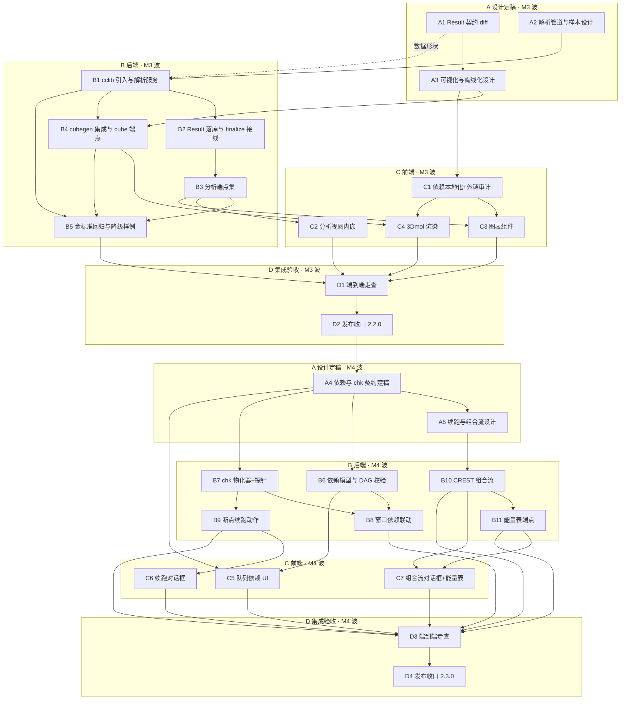
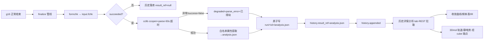
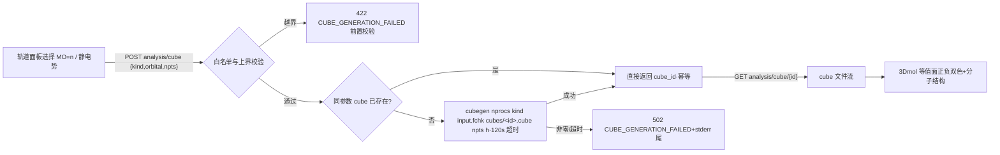
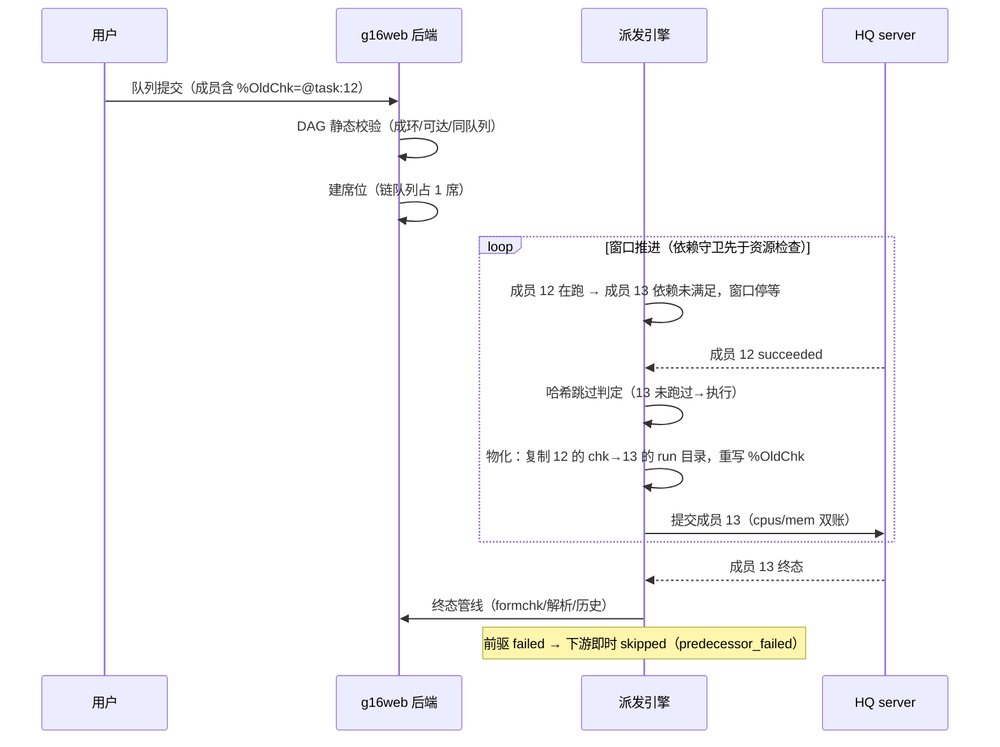
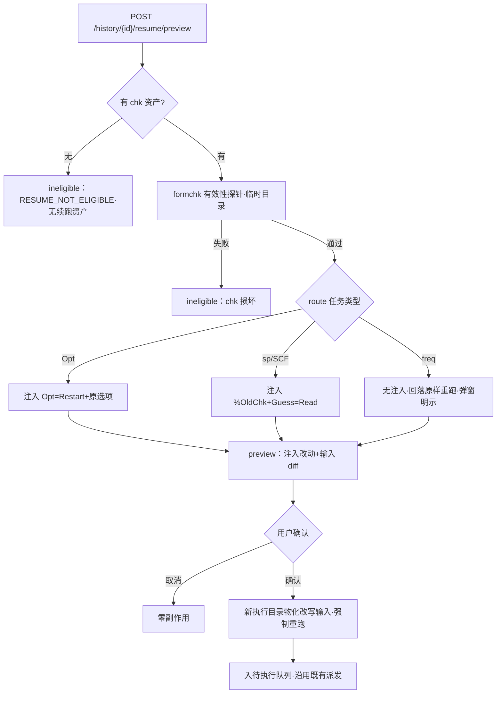
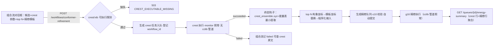

# M3+M4 · 结果分析与工作流 — 联合执行计划

> 状态：执行计划（依据 [roadmap.md](../specs/roadmap.md) §3 M3/M4 制定，2026-09-30）。
> M3 与 M4 联合展开为一份计划，但**两波执行、两次发布**（M3 → 2.2.0 候选、
> M4 → 2.3.0 候选），M3 全部收口后才启动 M4 的 A4 及其后任务。§1 为任务分解
> （WBS），§2 为关键设计定稿（A 阶段规格输入），§3 为任务流程图，§4 为逐任务
> 执行方案（步骤/技术要求/质量标准/交付物），§5–§9 为测试矩阵、提交序列、
> 验收标准（DoD）、开放决策点与风险预案。
> 本文与 roadmap 冲突时以 roadmap 为准；API/SSE 契约
> （[openapi.yaml](../api/openapi.yaml)、[sse.md](../api/sse.md)、
> [mapping.md](../api/mapping.md)）现状为 33 端点 + 15 类事件，M3/M4 的新增
> 一律走契约文档 diff（roadmap §4），不漂移既有语义。
> 用户补充要求（2026-09-30，随计划固化）：**cclib 安装进项目根 `.venv`（uv +
> 国内镜像源），禁止全局安装；3Dmol.js 经 npm 镜像源下载并以本地依赖打包，
> 禁止 CDN/在线引用**——细节见 §2.8，落进 B1/C1 任务与 DoD。

## 0. 目标、范围与依据

### 0.1 目标（= roadmap §3 M3/M4 原文定义）

**M3 · 结果分析**：以执行历史为主入口，分析视图内嵌在历史详情中，仅作简单
预览（不单列页面）；另支持指定工作区内 `.out` 文件只读分析。**仅正常结束**
的执行才进入解析管道。能量收敛曲线、频率表与红外谱图（cclib 数据 + 前端
绘图）、fchk → cubegen → 轨道/静电势可视化。

**M4 · 工作流**：任务链（opt→freq→sp 精修）、接入本机已有的 CREST/xtb
（`~/opt/xtb-6.7.1`、`~/opt/crest-3.0.2`）做构象搜索 → Gaussian 精修的组合
流。队列内任务间依赖与 chk 传递在此定稿（roadmap §7.1 建议方案：`%CHK` 符号
引用 + 提交时 DAG 校验 + 运行时物化路径，`%OldChk` 只读接续）。**自我续跑
同源**：failed/外部中断历史条目的「从断点续跑」动作复用同一物化机制——M1
已保全的 chk 先过 formchk 有效性探针，按任务类型注入 `Opt=Restart`（优化）
或 `%OldChk`+`Guess=Read`（SCF 初猜），弹窗展示注入改动与输入 diff，用户确
认后在新执行目录物化（freq 无中断续跑语义，回落原样重跑）。

### 0.2 工作项编号（引 roadmap 原文段落顺序，WBS 表「对应项」列引用）

| 编号 | 工作项（roadmap 原文摘要） |
|---|---|
| M3.1 | 以执行历史为主入口；分析视图内嵌历史详情，仅简单预览，不单列页面 |
| M3.2 | 仅正常结束（succeeded）的执行进入解析管道；异常结束只可导出原文 |
| M3.3 | 能量收敛曲线、频率表与红外谱图（cclib 数据 + 前端绘图） |
| M3.4 | fchk → cubegen → 轨道/静电势可视化（3Dmol.js） |
| M3.5 | 指定工作区内 `.out` 文件只读分析 |
| M3.6 | Result 字段全集随 M3 契约 diff 一次性扩展（roadmap §2.6 规则 3）；`result_ref`（M0 占位恒 null）起写 |
| M4.1 | 任务链（opt→freq→sp 精修），队列内任务间依赖与 chk 传递定稿（关闭 roadmap §7 开放事项 1） |
| M4.2 | 接入本机 CREST/xtb：构象搜索 → Gaussian 精修组合流 |
| M4.3 | `%CHK` 符号引用 + 提交时 DAG 校验 + 运行时物化路径；`%OldChk` 只读接续；依赖与并行窗口联动（依赖未满足者不得进入窗口） |
| M4.4 | 「从断点续跑」动作（复用同一物化机制；formchk 有效性探针；`Opt=Restart` / `%OldChk`+`Guess=Read` 注入矩阵；弹窗 diff 确认；freq 回落原样重跑） |
| M4.5 | 验收能力：一个按钮完成「构象搜索 + top N 构象精修」提交并汇总能量表；一条带 chk 依赖的任务链跑通 |

### 0.3 不做（非目标）

- 单列分析页面、分析队列页（M3 仅历史详情内嵌预览，roadmap 原文）。
- 通用 crest 日志解析器（仅提取组合流所需的最小数据：构象坐标与能量，见 §2.7）。
- 独立 xtb 单点计算任务类型（xtb 仅作 crest 的引擎；独立 xtb 需求落地时按
  roadmap §2.3 重新评估）。
- 从零新建输入文件的通用编辑器（roadmap §6 backlog；M4 的程序化输入生成
  仅限「模板坐标替换」这一组合流内场景，见 §2.7）。
- 跨队列任务依赖、队列间 chk 引用（roadmap 限定「队列内任务间依赖」）。
- cclib 之外的第二解析引擎；正则堆领域解析（roadmap §4 禁止事项）。

### 0.4 前置条件（开工闸门）

1. M0–M2 与 v2.1.0 已收口（progress.json：`latest_released_version=2.1.0`、
   `unreleased` 为空）；M3 开工前把「M3 结果解析与可视化」登记入
   `in_progress`。
2. `target/release/hq` 在位（M4 触及派发链路，B8/e2e 依赖；缺失会静默跳过
   关键 e2e，违反 §6.1 第 4 条）。M3 的 B 阶段不触及派发，无此硬依赖，但
   D1 走查需真机 g16 跑 freq 任务。
3. 真机资产在位（已实测确认）：`~/g16/g16`、`~/g16/formchk`、
   `~/g16/cubegen`；`~/opt/xtb-6.7.1`、`~/opt/crest-3.0.2`；金标准样本
   `~/g16/tests/` 4 份 `.out`（anisoles0/1、phenoxyls0/1，均含
   `Frequencies --`）+ 14 份 `.fchk`。
4. A1/A4 两份契约 diff 经用户评审通过（文档先行，roadmap §4）。

### 0.5 依据

- roadmap：§2.1（领域模型/派发原则）、§2.4（文件治理与路径边界）、§2.5
  （配置治理）、§2.6（字段生命周期：Result 字段、result_ref）、§2.7（输入
  空行规则）、§3 M3/M4、§4（质量底线：金标准回归）、§5（风险表）、§7.1
  （任务间依赖与 chk 规范建议）、§8.5/§8.6（输出与 journal 约束）。
- M0–M2 产出：`docs/api/` 契约四件套（33 端点、15 类事件、错误码全集载体
  在 openapi.yaml 文件头）；`web/src/`（store/engine/parse/services/routers
  模块已成型）；`web/frontend/`（六页视图 + 组件）。
- M1 遗产（M3/M4 的直接依赖面）：succeeded 后自动 formchk 产出
  `run/<执行id>/input.fchk`（`engine/finalize.py`）；非正常终止 chk/rwf 保全
  至 `run/<执行id>/protected/` 并落库 `chk_snapshot`（`finalize.protect`）；
  历史条目 `result_ref` 字段占位（openapi.yaml `HistoryEntry.result_ref`，
  恒 null 待 M3 激活）。
- Gaussian 16 官方手册（gaussian-kb MCP 权威核查，2026-09-30）：
  - `cubegen`（gaussian.com/cubegen）：语法
    `cubegen nprocs kind fchkfile cubefile npts [format cubefile2]`；
    kind 白名单成员：`MO=n`（含 Homo/Lumo/All/OccA/OccB/Valence/Virtuals）、
    `Density=type`、`Spin=type`、`Alpha/Beta=type`、`Potential=type`（type
    取 Density 关键字选项：SCF/MP2/…，不支持 Current）、`Gradient`、
    `Laplacian` 等；`npts=0` 默认 80³，正值 n³，负值档位（-2/-3/-4 =
    Coarse/Medium/Fine = 3/6/12 点/Bohr）；format `h`（含头，默认）/`n`。
  - `%OldChk=file`（gaussian.com/link0）：指定 chk 的内容在本 job step 开始
    时复制为本 step 的 chk——从先前计算取数据而不破坏其 chk，即只读接续的
    原生机制。
  - `Opt=Restart`（gaussian.com/opt）：从 checkpoint 重启几何优化；整个
    route 只需 Opt 关键字 + 原选项 + Restart，无其他输入。
  - `Guess=Read`（gaussian.com/guess）：从 chk 读初猜（常配
    `Geom=Checkpoint`）；`Guess=(Only,Read)` 可仅做种群分析。
  - `formchk`（gaussian.com/utils）：二进制 chk → ASCII fchk；cclib 不解析
    fchk，二进制 chk 也不能直接作 `%Chk` 复用目标之外的格式（M4 探针与
    物化据此设计，见 §2.5/§2.6）。
- cclib（context7 `/cclib/cclib` 核查，当前文档）：入口
  `cclib.io.ccopen(path).parse()`；M3 所需属性（ccData，单位见属性表）：
  `scfvalues`/`scftargets`（SCF 收敛迹线/判据）、`scfenergies`（各几何步 SCF
  能量，eV）、`optdone`/`optstatus`（优化收敛与否）、`geovalues`/`geotargets`
  （几何收敛）、`atomcoords`/`atomnos`（构型）、`vibfreqs`（1/cm）、`vibirs`
  （km/mol）、`vibsyms`/`vibrmasses`/`vibdisps`（频率表）、`moenergies`（eV）、
  `homos`/`nmo`/`nbasis`/`mosyms`/`aonames`（轨道清单）、`enthalpy`/`entropy`/
  `freeenergy`/`zpve`（热化学，hartree/particle）、`metadata`（含
  `package`/`package_version`/`methods`/`success`）。

### 0.6 实施输入：现状核查结论（2026-09-30 实测）

| 事实 | 对计划的影响 |
|---|---|
| cclib **未安装**（`import cclib` 失败；requirements.txt 注释遗留「M1 追加 cclib」未兑现） | B1 兑现：uv 装入项目 `.venv`（清华镜像），requirements.txt 冻结版本，禁止全局安装 |
| 3Dmol.js **未入** `web/frontend/package.json`（roadmap M0 工作项 7「仅入依赖清单」未兑现） | C1 兑现：npm 镜像源安装并本地打包，禁 CDN；新增外链审计闸门脚本 |
| 前端无图表库；六页视图与组件已成型（HistoryView.vue 为 M3 主入口） | A3 决策图表方案；C2/C3 增量改造历史详情 |
| `HistoryEntry.result_ref` 契约占位恒 null；Task schema 无依赖字段 | M3.6/M4.3 各自契约 diff 一次扩展（roadmap §2.6 规则 3） |
| 金标准：4 份 `.out` 全部含 `Frequencies --`，**缺异常终止/失败样例** | A2 定样本扩充；B5 落构造样例入库 `web/tests/fixtures/` |
| `engine/finalize.py`：succeeded 自动 formchk → `run/<id>/input.fchk`；非正常终止 chk/rwf 保全 `protected/` | M3 cube 数据源现成；M4 续跑探针的对象即保全 chk |
| `~/g16/cubegen`、`~/g16/formchk` 在位；crest/xtb 在 `~/opt/` | B4/B10 直接子进程调用；可执行探测缺失时显式降级（不静默） |
| 契约现状 33 端点 + 15 类事件；错误码全集载体在 openapi.yaml 文件头（`test_error_codes.py` 静态闸门） | 新增错误码随 A1/A4 diff 登记，闸门自动覆盖 |
| openapi `info.version` 运行时从 `APP_VERSION` 动态覆盖（v2.1.0 SSOT 豁免口径） | 契约 diff 不手工追版本号；2.2.0/2.3.0 发布时随 VERSION/tag 自然演进 |

## 1. 任务分解与追踪（WBS）

两波：**M3 波**（A1–A3、B1–B5、C1–C4、D1–D2，目标版本 2.2.0）、**M4 波**
（A4–A5、B6–B11、C5–C7、D3–D4，目标版本 2.3.0）。阶段语义与 m1/m2 计划
一致：**A** 设计定稿（契约 diff，文档先行）→ **B** 后端 → **C** 前端 →
**D** 集成验收与发布。规模：S ≈ 半天内，M ≈ 1 天，L ≈ 2 天。

| 编号 | 任务 | 产出物 | 验收标准（可验证） | 依赖 | 规模 | 对应项 |
|---|---|---|---|---|---|---|
| A1 | Result schema 与分析端点契约 diff 定稿 | openapi.yaml diff（Result 全集 + 6 分析端点 + 新错误码）+ mapping.md 增行 + sse.md「无新增事件」断言 | Result 字段一次定死（§2.1）；端点/错误码逐条列入映射无孤儿；`test_error_codes.py` 适配后通过；用户评审通过 | — | M | M3.1/M3.2/M3.5/M3.6 |
| A2 | 解析管道与样本覆盖设计定稿 | §2.2 定稿（属性白名单映射表、降级链、样本扩充清单） | 白名单逐属性标注单位与缺失语义；降级链覆盖「解析异常/部分属性缺失/success=false」三分支；异常样例构造方案可入库 | — | M | M3.2/M3.3 |
| A3 | 可视化与依赖离线化设计定稿 | §2.4/§2.8 定稿（分析视图信息架构、图表方案选型、3Dmol 交互、cubegen 参数治理、离线化方案） | 视图嵌入历史详情不单列页面；cubegen kind/npts 治理表定稿；离线化含审计闸门方案；图表选型关闭 | A1 | M | M3.1/M3.3/M3.4 |
| B1 | cclib 引入与结果解析服务 | `uv pip install cclib`（项目 `.venv`，清华镜像）+ requirements.txt 冻结 + `web/src/parse/results.py` | 安装命令单行落档且仅进 `.venv`（`uv run python -c "import cclib"` 通过、全局 pip list 无 cclib）；4 份金标准 `.out` 白名单属性提取单测全绿；异常输入降级不抛出 | A2 | L | M3.2/M3.3、用户补充要求① |
| B2 | Result 落库与 finalize 接线 | finalize 管线追加解析步；`result_ref` 写入（analysis.json + history 条目置位） | succeeded 执行完成后 `run/<id>/analysis.json` 存在、`GET /history` 该条 `result_ref` 非 null；解析失败时 result_ref=null 且日志留痕、执行不受影响 | B1 | M | M3.2/M3.6 |
| B3 | 分析端点集 | `routers/history.py` 扩展（概览/收敛/频率/轨道）+ 工作区 `.out` 分析端点 | 契约测试逐端点过；succeeded 才可读（异常条目 409 `ANALYSIS_UNAVAILABLE`）；工作区外路径 400 `WORKSPACE_PATH_OUTSIDE`；不存在的分析块 404 语义明确 | B2 | L | M3.1/M3.5 |
| B4 | cubegen 集成与 cube 端点 | POST/GET cube 两端点 + `services/cube.py`（子进程调用 `~/g16/cubegen`） | kind 白名单外 422；`npts` 越界 422；真机小 fchk 生成 cube 成功（MO 与 Potential 各一）；cubegen 缺失时 503 显式报错（不静默跳过） | A3, B1 | M | M3.4 |
| B5 | 金标准回归与降级样例闸门 | `test_analysis_parse.py`/`test_analysis_api.py`/`test_cube_api.py` + 构造异常样例入库 fixtures | 4 份金标准逐属性断言；截断/失败构造样例走通降级三分支；全量 `uv run pytest` 通过 | B1–B4 | M | §4 质量底线 |
| C1 | 前端依赖本地化 | `web/frontend/package.json` 增 `3dmol`（npm 镜像安装）+ 图表库（若 A3 选型引入）+ `scripts/audit_frontend_offline.sh` | `npm install --registry=https://registry.npmmirror.com` 单行落档；构建产物经审计脚本零外链（http/https 资源引用）；`npm run build` 通过 | A3 | S | M3.4、用户补充要求② |
| C2 | 分析视图（历史详情内嵌） | HistoryView 详情增分析区（tab：概览/能量收敛/频率与 IR/轨道与静电势）+ 工作区 `.out` 打开入口 | 分析区仅出现在历史详情内（无独立路由）；succeeded 条目展示、异常条目仅原文导出入口；`.out` 分析复用同一组件 | A3, B3 | L | M3.1/M3.5 |
| C3 | 图表组件 | 收敛曲线（折线）/频率表（表格）/IR 谱图（棒图）组件 | 金标准数据渲染冒烟；数据为空/缺失块显示占位说明；符合设计令牌与对比度闸门（check_tokens/check_contrast） | C1, B3 | M | M3.3 |
| C4 | 3Dmol 轨道/静电势渲染 | 轨道面板（清单选择 + 等值面渲染 + isoval 档位） | 选 MO=n → POST cube → 渲染等值面（正负相双色）+ 分子结构；静电势映射同链路；cube 失败显式提示 | C1, B4 | M | M3.4 |
| D1 | M3 端到端验收走查（真机） | 走查记录（§7.1 逐条留痕） | roadmap M3 验收路径逐条通过并留痕 | B1–B5, C1–C4 | M | M3 验收 |
| D2 | M3 发布收口（2.2.0） | CHANGELOG.jsonl 冻结 + tag v2.2.0 + progress.json 同步 | §5.2 五步顺序执行；双闸门（pytest + validate_progress）通过 | D1 | S | §5.2 |
| A4 | 任务链依赖与 chk 传递契约定稿（关闭 roadmap §7 开放事项 1） | §2.5 定稿 + 契约 diff（依赖语义、resume 端点、新错误码、mapping 增行） | 符号引用文法与推导规则定稿；DAG 校验规则含成环/可达/跨队列拒绝；与并行窗口、重排、哈希跳过、成员下限的交互逐条写明；用户评审通过 | D2 | L | M4.1/M4.3、roadmap §7.1 |
| A5 | 断点续跑与 CREST 组合流设计定稿 | §2.6/§2.7 定稿（注入矩阵、探针规格、组合流模板、能量表形状、crest 提取边界） | 注入矩阵覆盖 opt/scf/freq 三分支；组合流「一键提交」全链路时序定稿；crest/xtb 定位与配置项定稿；程序化输入生成仅限模板坐标替换 | A4 | L | M4.2/M4.4/M4.5 |
| B6 | 依赖模型与 DAG 校验（后端） | 符号引用解析器 + 提交/编辑时静态校验 + 新错误码落位 | 成环/不可达/跨队列引用/越成员边界引用逐一 422 且错误码正确；`test_error_codes.py` 通过；合法链提交通过 | A4 | M | M4.3 |
| B7 | chk 物化器（含 formchk 探针） | `engine/materialize.py`：派发前物化 %Chk/%OldChk 符号行（复制上游 chk 进本执行目录并重写）+ formchk 探针 | 物化后输入文件内无符号引用残留；上游原件零改动（哈希前后一致）；探针对「正常 chk/损坏 chk/缺 fchk 段」三分支判定正确 | A4 | L | M4.3/M4.4 |
| B8 | 派发窗口依赖联动 | 窗口守卫：依赖未满足成员不取入窗口；依赖失败 → 下游 skipped | FakeGateway 单测：依赖满足前窗口停等不越位（保序语义与资源停等叠加）；上游 failed → 下游 skipped（归因 predecessor_failed）；哈希跳过视为依赖满足且 chk 溯源其最近成功执行 | B6, B7 | M | M4.3 |
| B9 | 「从断点续跑」动作 | POST /history/{id}/resume/preview + POST /history/{id}/resume | 预览返回探针结果 + 注入改动 + 输入 diff；确认后在新执行目录物化并走既有派发；opt 注入 Opt=Restart、单点注入 %OldChk+Guess=Read、freq 回落原样重跑；无保全 chk 或探针失败时 ineligible 且原因明确 | B7 | L | M4.4 |
| B10 | CREST 任务类型与组合流生成 | task_kind 扩展（g16\|crest）+ crest 派发 + ensemble 提取 + top-N 精修队列程序化生成与自动入队 | crest 任务经 HQ 真机跑通（小分子）；ensemble 坐标/能量提取对 crest 3.0.2 输出正确；生成队列成员数=top N、route 来自模板；crest 可执行缺失时提交即拒（显式错误码） | A5 | L | M4.2 |
| B11 | 能量表汇总端点 | GET /queues/{id}/energy-summary | g16 成员能量取自 B1 解析（末次 SCF，附 hartree/eV 双单位）；crest 成员给相对能量；混合队列/部分完成态语义明确 | B10 | M | M4.5 |
| C5 | 队列编辑依赖 UI | 成员行「接续前置 chk」勾选辅助生成符号行 + DAG 错误提示 | 勾选生成的 Link0 行与契约文法一致；DAG 校验错误逐成员内联提示；重排不改 @task:id 引用 | A4, B6 | M | M4.3 |
| C6 | 断点续跑对话框 | 探针结果/注入改动/输入 diff/确认弹窗 | diff 展示与后端 preview 一致；ineligible 展示原因；确认后新执行出现于待执行队列 | B9 | M | M4.4 |
| C7 | 组合流对话框与能量表 | 一键提交对话框（crest 参数/top N/精修模板）+ 队列能量表展示 | 一个按钮完成「构象搜索 + top N 精修」全链路；能量表随成员完成增量刷新 | B10, B11 | M | M4.5 |
| D3 | M4 端到端验收走查（真机） | 走查记录（§7.2 逐条留痕） | roadmap M4 验收路径逐条通过并留痕（含 chk 链、断点续跑） | B6–B11, C5–C7 | M | M4 验收 |
| D4 | M4 发布收口（2.3.0） | CHANGELOG.jsonl 冻结 + tag v2.3.0 + progress.json 同步 | §5.2 五步顺序执行；双闸门通过 | D3 | S | §5.2 |

**依赖关系总览**：M3 波 `A1→(A3, B1 前置评审)`；`A2→B1`；`A1→A3→(B4, C1)`；
`B1→(B2, B4)`；`B2→B3`；`B3→(B5, C2, C3)`；`C1→(C3, C4)`；`B4→C4`；
`B1–B5/C1–C4→D1→D2`。M4 波 `D2→A4→(A5, B6, B7)`；`A4→C5`；`A5→B10`；
`B6→B8`；`B7→(B8, B9)`；`B10→(B11, C7)`；`B11→C7`；`B9→C6`；
`B6–B11/C5–C7→D3→D4`。A1 与 A2 可并行；B1 与 B4 在 A3 定稿后可并行；
C2 与 C3/C4 在 B3/B4 就绪后可并行。M4 波整体不早于 D2 启动（A4 的契约
diff 以 M3 落库后的契约基线为前提，避免两次 diff 叠加冲突）。

## 2. 关键设计定稿（A 阶段规格输入）

> 以下为 A1/A2/A3/A4/A5 的定稿基线。标注「建议」的条目为开放决策点
> （§8）的建议值，评审时定案；未标注者为本计划的直接约束。

### 2.1 Result schema 与契约 diff 范围（A1）

**Result 字段全集**（一次定死，roadmap §2.6 规则 1；`HistoryEntry.result_ref`
由「恒 null 占位」改为「succeeded 且解析成功时 = `analysis.json`（run 目录内
相对引用）」）：

```
Result:
  state: parsed | degraded            # degraded=至少一个请求块解析失败/缺失
  parser: { name: "cclib", version }
  package: { name, version }          # cclib metadata.package / package_version
  method: string | null               # metadata.methods 摘要（如 b3lyp/6-31g(d)）
  summary:
    natom, nmo, nbasis: integer
    scf_energy_eV: number | null      # scfenergies 末值
    scf_energy_hartree: number | null # 供能量表直接使用（eV→hartree 换算单点）
    opt_converged: boolean | null     # optdone；非优化任务 null
    freq_count: integer | null        # vibfreqs 长度；非频率任务 null
    imaginary_freq_count: integer | null
    homos: number[]                   # HOMO 序号（开壳层 α/β 两值）
  blocks:                             # 可用分析块清单（决定端点可见性）
    convergence: boolean              # scfvalues/geotargets 可得
    frequencies: boolean              # vibfreqs 非空
    orbitals: boolean                 # moenergies/homos 非空
    thermochemistry: boolean          # enthalpy/entropy/freeenergy/zpve 可得
  missing: string[]                   # degraded 时的缺失属性清单
  parse_error: string | null          # 解析异常摘要（degraded 主因）
```

**新增端点**（路径前缀 `/api/v1`，A1 评审定稿；全部只读或幂等派生）：

| 方法与路径 | 用途 |
|---|---|
| GET /history/{id}/analysis | Result 概览（即 Result schema 全文，读 analysis.json） |
| GET /history/{id}/analysis/convergence | SCF 迹线（scfvalues/scftargets）+ 几何收敛（geovalues/geotargets）+ 能量序列（scfenergies，hartree/eV 双单位） |
| GET /history/{id}/analysis/frequencies | vibfreqs/vibirs/vibsyms/vibrmasses 表 |
| GET /history/{id}/analysis/orbitals | moenergies/homos/nmo/nbasis/mosyms 清单（不含 mocoeffs——系数不进响应，等值面走 cubegen） |
| POST /history/{id}/analysis/cube | 生成 cube：`{kind, orbital?, npts?}` → `{cube_id}`（kind 白名单见 §2.4；幂等：同参数命中已生成文件直接返回） |
| GET /history/{id}/analysis/cube/{cube_id} | cube 文件流（`chemical/x-cube`；前端 3Dmol 直接 fetch） |
| POST /analysis/workspace-out | 工作区 `.out` 只读分析：`{path}`（工作区内相对路径）→ 与 analysis/convergence/frequencies 同形状的负载（不落库、不写 result_ref） |

**新错误码**（登记 openapi.yaml 文件头全集，`test_error_codes.py` 闸门覆盖）：

| 码 | HTTP | 语义 |
|---|---|---|
| `ANALYSIS_UNAVAILABLE` | 409 | 非 succeeded 条目请求分析，或 analysis.json 缺失且重建失败 |
| `ANALYSIS_PARSE_FAILED` | 422 | 请求的分析块数据不足（如无频率任务请求 frequencies） |
| `WORKSPACE_PATH_OUTSIDE` | 400 | `.out` 分析路径越出工作区（§2.4 边界） |
| `CUBE_GENERATION_FAILED` | 502 | cubegen 非零退出/超时（details 携带 stderr 尾部） |
| `CUBE_EXECUTABLE_MISSING` | 503 | `g16_root/cubegen` 探测失败（显式，不静默） |

**mapping.md**：历史详情分析区四 tab、`.out` 打开入口、轨道面板等界面元素
逐行登记；**sse.md 不变**（M3 全部为拉取型：分析数据随 `history.appended`
后的 REST 拉取，无需新事件——在 A1 评审中显式确认此结论并留痕）。

### 2.2 解析管道与样本覆盖（A2）

- **准入**：仅 `succeeded` 执行进入解析管道（roadmap M3.2）。双保险：执行
  状态机判定（第一道）+ cclib `metadata.success`（第二道，false 即
  degraded）。异常结束执行永不解析，历史详情仅原文查看/导出（M1 已有能力）。
- **时机**：finalize 管线内、formchk 之后追加解析步（同链异步、失败不阻断
  终态落库——沿用 formchk「失败记日志不阻断」先例）。产物
  `run/<执行id>/analysis.json`（Result 全集 + 各块数据），`result_ref` 置位。
  解析超时上限 60s（超时按 degraded 落地，防止大输出阻塞 finalize 链）。
- **属性白名单**（cclib 属性 → analysis.json 数据块，单位随 cclib 属性表）：

| analysis 块 | cclib 属性 | 缺失时语义 |
|---|---|---|
| convergence.scf | scfvalues（迹线）、scftargets（判据） | blocks.convergence=false |
| convergence.geo | geovalues、geotargets、optdone/optstatus | 同上（优化任务才有） |
| convergence.energy | scfenergies（各几何步末次 SCF 能量序列） | 同上 |
| frequencies | vibfreqs、vibirs、vibsyms、vibrmasses | blocks.frequencies=false |
| orbitals | moenergies、homos、nmo、nbasis、mosyms | blocks.orbitals=false（含输出无 MO 表场景，提示建议 Pop=Reg/Full） |
| thermochemistry | enthalpy、entropy、freeenergy、zpve | blocks.thermochemistry=false |
| summary/package/method | natom/nmo/nbasis、metadata.* | 对应字段 null |

- **降级链**（三分支，B5 逐一覆盖）：① cclib 解析抛异常 → `state=degraded`、
  `parse_error` 摘要、已可得块照常保留；② `metadata.success=false` → 同①并
  附注；③ 个别属性缺失 → `missing[]` 登记、对应 block 置 false。三分支均不
  阻断历史落库，`ANALYSIS_UNAVAILABLE` 语义仅在「analysis.json 文件缺失且
  重建失败」时出现（重建 = finalize 急解析失败后的惰性补跑一次，见 §8 决策点 2）。
- **样本覆盖**：金标准回归沿用 m1 模式（`~/g16/tests/` 4 份 `.out` 真机样本，
  逐属性断言）；**异常/降级样例以构造样本入库 `web/tests/fixtures/`**（截断
  freq 输出、`Normal termination` 缺失的 opt 输出、无 MO 表输出——小体量、
  可控、随仓库走，不写用户目录 `~/g16/tests/`）。roadmap §7 待确认事项 2
  的「失败/中断样例」由本项部分关闭（构造样例覆盖解析降级面；真机失败样例
  随 D1 走查强停产出并抽查，不入库大文件）。

### 2.3 分析端点数据形状与边界（A1 评审输入，B3 实施依据）

- convergence 响应含三类序列，前端直接绘图：`scf_trace`（每几何步内 SCF 迭代
  的 ΔE/ΔRMS 等列，cclib scfvalues 逐列展开）、`geo_trace`（geovalues vs
  geotargets）、`energy_series`（scfenergies 逐几何步）。长输出预算：单端点
  响应 ≤ 2MB，超出按步均匀抽稀并附 `downsampled: true`（金标准样本不触发）。
- workspace-out 端点的路径守卫：`(workspace_root / path).resolve()` 后必须是
  `workspace_root.resolve()` 的子孙且后缀 ∈ {.out, .log}；越界/缺失/不可解析
  分别 400/404/422。只读，绝不写工作区外（roadmap §2.4：工作区外一律只读）。
- cube 幂等与留存：产物落 `run/<执行id>/cubes/<cube_id>.cube`
  （cube_id=参数摘要哈希）；同参数重复 POST 直接返回既有 cube_id。cube 为
  派生物、可再生，不参与 chk/rwf 保留期清理，也不进历史条目（留存与执行
  目录同生命周期；§8 决策点 3 复核）。

### 2.4 可视化设计（A3）

- **信息架构**：历史详情（既有详情区）内新增「分析」区，四 tab——概览 /
  能量收敛 / 频率与 IR / 轨道与静电势；不新增路由页面（roadmap M3.1 硬约束）。
  tab 可见性由 `Result.blocks` 驱动（false 的 tab 置灰并注明缺失原因）。
  `.out` 打开入口置于分析区头部（工作区内路径输入 + 只读分析），复用同一
  组图表/表格组件。
- **图表方案（A3 决策，建议值：ECharts 按需引入）**：收敛曲线（折线，双
  判据虚线参考线）、IR 谱图（棒图 + 频率表联动高亮）。按需注册
  LineChart/BarChart/Grid/Tooltip/DataZoom，控制包体；镜像源本地安装、随
  Vite 打包（离线约束同 §2.8）。备选：手写 SVG 组件（零依赖、约 300 行，
  无缩放交互）——评审时定案。
- **3Dmol 渲染**：fetch cube 文件 → 3Dmol 创建 viewer → 加载体积数据渲染
  等值面（正相/负相双色，isoval 档位 ±0.02 默认、±0.05/±0.08 可选）+ cube
  内嵌几何作分子结构；静电势（Potential=SCF）另支持色彩映射模式。轨道清单
  下拉（HOMO/LUMO 预置 + 序号直选，mosyms 附注）。具体 3Dmol API 用法在
  C4 实施时经 context7/官方文档核对，不凭记忆写代码（AGENTS.md §8.3）。
- **cubegen 参数治理**（kind 白名单，白名单外一律 422）：

| 参数 | 允许值 | 默认 |
|---|---|---|
| kind | `MO=<n>`（1≤n≤nmo）、`Potential=SCF`、`Density=SCF`、`Spin=SCF` | —（必填） |
| npts | 40–120 整数 | 80（G16 默认 80³ 档） |
| nprocs | 1–6 | 1（静电势计算并行数） |

  调用：`<g16_root>/cubegen <nprocs> <kind> <fchk> <cube> <npts> h`，子进程
  超时 120s；fchk 取 `run/<id>/input.fchk`（M1 formchk 产物），缺失时
  502（details 注明 formchk 产物缺失）。环境沿用 §2.5 g16 自洽构建口径
  （GAUSS_MEMDEF 缺省不设）。

### 2.5 任务链依赖与 chk 传递（A4 定稿基线，关闭 roadmap §7 开放事项 1）

- **符号引用文法**：Link0 的 `%Chk=` / `%OldChk=` 取值支持 `@task:<id>`
  （id=同队列成员的任务 id）。`@prev` 建议不纳入（提交顺序不构成承诺、
  重排会破坏其语义；如评审坚持保留，则定义为「提交时展开为队首前驱的
  @task:id 糖衣」，重排后不重展开）。
- **依赖推导（单一真相）**：成员的依赖关系**由其 Link0 符号引用自动推导**
  （引用即依赖），不引入独立 depends_on 字段——避免「显式依赖」与「引用
  依赖」两套真相漂移；契约 diff 仅在 Task/输入预览层标注「Link0 含符号引用
  ⇒ 依赖其余成员」的派生语义与校验规则。`%Chk=@task:X`（续用语义）与
  `%OldChk=@task:X`（只读接续）均产生对 X 的依赖边。
- **提交时静态校验（DAG）**：① 引用可达——@task:id 必须是同队列现存成员
  （跨队列、引用已移除成员、自引用一律 422，码 `DEPENDENCY_UNREACHABLE`）；
  ② 依赖图无环（含续用自环），码 `DEPENDENCY_CYCLE`；③ 队列编辑（PATCH）
  同步校验——移除被依赖成员时拒绝（提示先解除下游引用，码沿用
  `DEPENDENCY_UNREACHABLE`，details 注明被谁依赖）；重排不影响 id 引用。
- **运行时物化**：派发某成员前，物化器将其 Link0 符号引用重写为实际路径——
  `%Chk=@task:X`：复制 X 最近一次成功执行的 chk 至本执行目录
  `dep-<taskid>.chk` 并改写 `%Chk=dep-<taskid>.chk`（G16 会重写该文件，复制
  语义保护上游原件——遵循 roadmap §8.6「g16 启动会重写 %CHK」教训）；
  `%OldChk=@task:X`：复制至 `dep-<taskid>.chk`、改写 `%OldChk=`，本任务自身
  `%Chk` 保持默认 `input.chk`。物化完成后输入文件内**零符号残留**；输入哈希
  按物化前的符号形式计算（哈希语义不受物化影响，重跑判定稳定）。
- **chk 溯源**：@task:X 的 chk 来源 = X 最近一次成功（succeeded）执行的
  `run/<eid>/input.chk`（M1 清理边界内的保留期chk）；X 被哈希跳过时溯源至
  其被沿用的那次历史执行。溯源目标缺失（被清理/从未成功）→ 提交时可校验
  元数据警告（chk 快照标记），运行时物化失败 → 该成员 failed，归因沿用
  `program_error`（归因枚举为 M0 定稿不扩），details 注明
  `chk_materialization`（§8 决策点 6）。
- **与并行窗口联动**：依赖未满足（任一前驱未到 succeeded 终态）的成员**不
  取入窗口**——窗口守卫在资源检查之前（roadmap §7.1「依赖未满足者不得进入
  窗口」）；前驱 failed → 下游即时记 skipped（归因 `predecessor_failed`，
  既有语义复用）。窗口停等属显式接受语义，与资源停等叠加时先判依赖。
- **与其他边界交互**：成员数 2–10 仅创建时校验、只减不增、至少保留 1 个
  （§2.1 不变）；待执行席位语义不变（链队列仍占 1 席）；历史「重新排队」
  单任务重跑无依赖语义（其原输入若含符号引用，重跑时按原任务 id 重解析
  依赖——同队列存活才可物化，否则提交拒绝）。
- **契约 diff**：openapi（Queue/Task 描述与校验规则、resume 端点见 §2.6、
  新错误码 `DEPENDENCY_CYCLE`/`DEPENDENCY_UNREACHABLE`/`RESUME_NOT_ELIGIBLE`/
  `CHK_SOURCE_MISSING`/`WORKFLOW_STATE_INVALID`/`CREST_EXECUTABLE_MISSING`、
  能量表端点见 §2.7）+ mapping.md + sse.md 无新增事件说明。M0 契约的
  「多步任务（--Link1--）导入拒绝」语义不变（任务链以队列表达，不引入
  单文件多步）。

### 2.6 「从断点续跑」动作（A5 定稿基线，M4.4）

- **入口**：历史页 failed 条目（归因=程序报错/外部中断，手动停止亦可）
  增「从断点续跑」动作，两段式：`POST /history/{id}/resume/preview`（无副作用）
  → 前端弹窗 → `POST /history/{id}/resume`（创建新执行并入待执行队列，
  沿用既有派发/核验链路）。
- **探针**：优先取 `chk_snapshot.location=protected` 的保全 chk；无保全且
  正常结束过者取 `input.chk`。探针 = 对该 chk 跑 `<g16_root>/formchk`（临
  时目录），formchk 成功且 fchk 可读 ⇒ 有效。探针失败/无 chk ⇒
  `ineligible`（码 `RESUME_NOT_ELIGIBLE`，原因：无续跑资产/chk 损坏）。
- **注入矩阵**（与 roadmap M4.4 逐字对齐）：

| 任务类型（route 判定） | 注入 | 说明 |
|---|---|---|
| 优化（route 含 Opt） | route 改写为 `Opt=Restart` + 原选项 | 整个 route 仅 Opt 关键字与其原选项 + Restart，无其他输入（G16 手册 Opt=Restart 语义） |
| 非优化 SCF（sp 等） | Link0 追加 `%OldChk=<物化 chk>` + route 追加 `Guess=Read` | 只读接续做初猜；本任务 chk 为新 input.chk |
| freq | 无注入 | freq 无中断续跑语义，**回落原样重跑**（弹窗明示） |

- **弹窗与物化**：preview 载荷 = `{eligible, probe:{formchk_ok, reason},
  injections:[{type, link0_lines?, route_lines?}], input_diff}`（diff 为统一
  diff 文本，展示注入改动前后全文）；用户确认后物化器在**新执行目录**
  （新执行 id）落改写后的输入副本并派发——复用 §2.5 物化机制（自我续跑
  同源）；续跑执行不受哈希跳过约束（显式动作即强制重跑，§8 决策点 7）。

### 2.7 CREST/xtb 组合流与能量表（A5 定稿基线，M4.2/M4.5）

- **任务类型**：Task 增 `kind: g16 | crest`（契约 diff，随 A4 一次性扩展）。
  crest 任务：HQ 提交 program=crest 可执行、cwd=`run/<执行id>/`、环境设
  `XTB_PATH` 指向 `~/opt/xtb-6.7.1/bin`；资源声明取组合流参数（核数默认
  `link0_default_nproc`、HQ 请求仅 cpus）；**不进 cclib 管道、无增量进度
  解析**（execution.monitor 照常，execution.progress 不适用——在 sse.md 该
  事件行补注 crest 不适用，非事件结构变更）。
- **组合流（一键提交）**：`POST /workflows/conformer-refinement`，载荷
  `{candidate_id, crest: {nproc, top_n}, template: {route, link0?}}`：
  ① 生成 crest 任务（输入=候选输入副本的分子坐标引导文件，程序化生成，
  模板=本仓库内置 crest 引导模板，非通用编辑器）→ 入待执行队列；
  ② 执行记录登记 `workflow_id`（SQLite 组合流记录：来源候选、crest 执行、
  状态、精修队列 id）；③ crest succeeded 终态钩子提取
  `crest_ensemble.xyz` 与输出中的构象能量表（**最小提取器**：文件级锚点
  解析，锁 crest 3.0.2 实测格式，不做通用 crest 日志解析）；④ 取 top N
  构象坐标，对模板输入做「分子说明节坐标替换」程序化生成 N 个 g16 成员
  输入 → 生成精修队列（成员数 N=top_n，≤10 校验）→ **自动提交**（验收
  「一个按钮」语义；失败回退仍走既有队列回退机制，§8 决策点 5）。
- **定位与配置**：运行级设置新增 `crest_root`（默认 `~/opt/crest-3.0.2`）、
  `xtb_root`（默认 `~/opt/xtb-6.7.1`）（生效边界=new_submissions 通则；
  A4 契约 diff 随 SettingItem 目录登记）。可执行探测失败 → 提交即拒
  （`CREST_EXECUTABLE_MISSING`，显式不静默）。
- **能量表**：`GET /queues/{id}/energy-summary` →
  `{rows: [{task_id, kind, state, method?, energy_hartree?, energy_eV?,
  relative_kJ_mol?, source}]}`——g16 成员取 B1 解析的末次 SCF 能量；
  crest 成员取 ensemble 相对能量；`relative_kJ_mol` 以队列内最低能量为
  零点；部分完成态照常返回已完成行（前端增量刷新）。组合流的能量表 =
  crest 行 + 精修队列行按 workflow_id 聚合。

### 2.8 依赖安装与前端离线化（用户补充要求，2026-09-30 固化）

- **cclib（Python）**：安装进**项目根 `.venv`**（uv 管理），单行命令：
  `uv pip install cclib -i https://pypi.tuna.tsinghua.edu.cn/simple`；版本
  冻结进 `requirements.txt`（注释注明 M3 引入用途）；**禁止全局 pip 安装**
  ——质量标准含「全局环境无 cclib」核查（`uv run` 外的 pip show 无此包）。
- **3Dmol.js（前端）**：`web/frontend/` 内
  `npm install 3dmol --registry=https://registry.npmmirror.com`（或评审确认
  的等价本地化方式），import 本地打包进构建产物；**禁止 CDN/在线引用**。
- **外链审计闸门（新增脚本）**：`scripts/audit_frontend_offline.sh`——对
  `web/frontend/dist/` 构建产物扫描 `https?://` 资源引用（豁免：注释与
  license 文本、SVG namespace 等非资源引用白名单），命中即非零退出；纳入
  C1/C4 与 D1/D3 收口闸门（§6.3）。图表库若引入，同规约束。

## 3. 任务流程图

### 3.1 阶段与任务依赖（WBS 全景）



要点：M3 波内 A1/A2 并行且文档先行（A1 契约 diff 是 B/C 的数据形状基线，
虚线边）；B1 是 B/C 共同前置；D1 前全链闸门（B5）先行。M4 波以 D2 为闸门
整体后置；A4 是 M4 波的契约总闸（B6/B7/C5 的文法与校验规则唯一来源）；
B8/B9 同源于 B7 物化器（「自我续跑同源」的工程投影）；B10→B11→C7 为组合
流纵向链。

### 3.2 M3 结果解析数据流（finalize 管线扩展）



### 3.3 cube 生成与轨道可视化数据流



### 3.4 M4 任务链派发与 chk 物化时序（依赖联动）



### 3.5 断点续跑决策流（M4.4，与 §3.4 同源物化）



### 3.6 CREST 组合流时序（M4.2/M4.5）



## 4. 逐任务执行方案

> 每任务四要素：**步骤**（动手顺序）、**技术要求**（硬约束）、**质量标准**
> （可验证判据）、**交付物**（落库物）。公共纪律不重复写：文档先行、
> 全量 `uv run pytest` + 四校验脚本过闸、hq 产物在位（M4 派发相关）、
> 契约生成物随 diff 再生（gen:types 零 diff）。

### 4.1 A1 · Result 契约 diff

- 步骤：① 依 §2.1 起草 openapi.yaml diff（Result schema、6 端点、5 错误码、
  HistoryEntry.result_ref 描述改写）；② mapping.md 增「05 执行历史」分析区
  行；③ sse.md 补「M3 无新增事件」决策说明；④ gen:types 再生；⑤ 评审。
- 技术要求：字段一次定死不预留「以后再加」（roadmap §2.6 规则 1）；错误码
  登记文件头全集；`openapi-core` 契约测试与 `test_error_codes.py` 适配。
- 质量标准：契约走查——Result 每字段有端点承载、每端点被 mapping 引用；
  评审通过留痕。
- 交付物：契约 diff 提交（docs(api) 单独一类变更）。

### 4.2 A2 · 解析管道与样本设计

- 步骤：① 按 §0.5 cclib 属性表起草白名单映射（单位/缺失语义逐行）；②
  降级链三分支判定顺序定稿；③ 构造异常样例三份起草（内容小、可入库）；
  ④ finalize 接线点与超时参数定稿。
- 技术要求：自写解析仅限 cclib 属性整备与 shape 转换，禁领域正则
  （roadmap §4）；样本不写 `~/g16/tests/`（用户目录只读）。
- 质量标准：4 份金标准在 cclib 当前版本下逐属性试提取通过（写一次性探针
  脚本验证，不入库为测试）。
- 交付物：本节定稿内容回填（如评审有修订）+ fixtures 样例草案。

### 4.3 A3 · 可视化与离线化设计

- 步骤：① 分析视图信息架构定稿（tab 结构、blocks 驱动可见性、`.out` 入口）；
  ② 图表选型评审（建议 ECharts 按需，备选手写 SVG）；③ 3Dmol 交互规格
  （isoval 档位、正负双色、静电势映射）；④ cubegen 治理表（§2.4）定稿；
  ⑤ 离线化方案与外链审计脚本规格定稿。
- 技术要求：不单列页面（roadmap 硬约束）；视觉沿用简约基调与设计令牌。
- 质量标准：决策点 1/3（§8）关闭；审计脚本规格可实施。
- 交付物：本节定稿 + 选型结论回填。

### 4.4 B1 · cclib 引入与解析服务

- 步骤：① `uv pip install cclib -i https://pypi.tuna.tsinghua.edu.cn/simple`
  装入项目 `.venv`；② requirements.txt 冻结；③ `web/src/parse/results.py`：
  `ccopen → parse → 白名单提取 → 契约 JSON`（超时、异常捕获、missing 登记）；
  ④ 金标准单测。
- 技术要求：**仅 `.venv`**（质量标准含全局无包核查）；解析输入只读
  （cclib 不改写原文件）；所有路径 `pathlib`、显式 `encoding="utf-8"`。
- 质量标准：4 份金标准属性提取断言全绿；构造异常输入降级不抛出；cclib
  版本号进入 Result.parser.version（可追溯）。
- 交付物：parse/results.py + 测试 + requirements.txt diff。

### 4.5 B2 · Result 落库与 finalize 接线

- 步骤：① finalize 管线 formchk 步后追加解析步（复用其「失败不阻断」模式
  与超时 60s）；② analysis.json 原子写（临时文件+rename）；③
  executions/history 仓储写 result_ref；④ 单测。
- 技术要求：解析异常仅日志+degraded 落地，不得影响终态落库与 SSE
  `history.appended` 时序；磁盘失败同降级。
- 质量标准：集成测试——fake g16 成功执行后 analysis.json 存在且
  `GET /history` result_ref 非 null；解析失败注入用例 result_ref=null。
- 交付物：finalize 扩展 + 仓储扩展 + 测试。

### 4.6 B3 · 分析端点集

- 步骤：① 概览/收敛/频率/轨道四端点（读 analysis.json 分块响应）；②
  analysis.json 缺失时惰性重建一次（§8 决策点 2 建议值）再判
  `ANALYSIS_UNAVAILABLE`；③ workspace-out 端点（路径守卫 §2.3）；④ 契约
  测试。
- 技术要求：非 succeeded 一律 409；响应预算抽稀逻辑（§2.3）；只读边界
  （resolve 后子孙校验）。
- 质量标准：契约测试逐端点对照 openapi；越界路径用例（`../`、绝对路径、
  符号链接逃逸）全拒。
- 交付物：routers/services 扩展 + 测试。

### 4.7 B4 · cubegen 集成

- 步骤：① `services/cube.py`：探测 `<g16_root>/cubegen`（缺失 503）、参数
  构建、子进程列表调用、120s 超时、stderr 尾部捕获；② cube_id=参数摘要、
  落 `run/<id>/cubes/`、幂等命中；③ POST/GET 两端点；④ 真机集成测试。
- 技术要求：fchk 路径=执行目录内 input.fchk（不读用户源文件）；cube 目录
  不入保留期清理；错误码 CUBE_* 两枚全部用上。
- 质量标准：金标准小 fchk（如 test0009-ref.fchk）MO=1 与 Potential=SCF
  各生成成功；白名单外 kind 422；cubegen 摘除场景（G16WEB 探测注入）503
  显式。
- 交付物：services/cube.py + 端点 + 测试。

### 4.8 B5 · 金标准回归与降级样例闸门

- 步骤：① test_analysis_parse（4 金标准逐属性 + fixtures 异常样例降级三
  分支）；② test_analysis_api（端点/边界/越界）；③ test_cube_api（参数/
  幂等/真机）；④ 全量回归。
- 技术要求：真机依赖（cubegen、金标准）缺失时 skip 必须带显式 reason
  （pytest -rs 可见），不得静默（AGENTS.md §6.1 教训）。
- 质量标准：闸门随 §6.3 常驻；失败样例三分支全覆盖。
- 交付物：三个测试文件 + fixtures 样例。

### 4.9 C1 · 前端依赖本地化

- 步骤：① `npm install 3dmol --registry=https://registry.npmmirror.com`
  （图表库若选型引入同批）；② `scripts/audit_frontend_offline.sh` 落地并
  跑通；③ 构建验证。
- 技术要求：零 CDN；镜像源单行命令落档 development 文档；审计白名单仅
  非资源引用。
- 质量标准：`npm run build` 通过；审计脚本对 dist 零命中；脚本纳入版本
  管理并入 §6.3 闸门清单。
- 交付物：package.json/package-lock.json diff + 审计脚本 + 文档行。

### 4.10 C2 · 分析视图

- 步骤：① HistoryView 详情区增分析区骨架（四 tab + blocks 驱动置灰）；②
  概览 tab（Result 全集摘要）；③ `.out` 打开入口（路径输入 + 校验错误
  内联提示）；④ 异常条目形态（仅原文导出入口 + 不可分析原因）。
- 技术要求：不新增路由；api client 走 gen:types 生成物，禁私相授受。
- 质量标准：succeeded/failed 两形态走查截图留痕；空态/加载/错误三态齐备。
- 交付物：HistoryView 扩展 + 子组件。

### 4.11 C3 · 图表组件

- 步骤：① 收敛曲线（SCF 迹线/几何收敛/能量序列三源，判据参考线）；②
  频率表（表格 + 虚频标红计数）；③ IR 棒图（频率-强度，表格联动高亮）；
  ④ 令牌与对比度校验。
- 技术要求：数据为空显示占位说明；长序列用端点抽稀结果渲染。
- 质量标准：金标准数据渲染冒烟（D1 留痕）；check_tokens/check_contrast
  通过。
- 交付物：图表组件 + 冒烟记录。

### 4.12 C4 · 3Dmol 渲染

- 步骤：① 轨道清单交互（HOMO/LUMO 预置 + 序号直选）；② cube 拉取与等值
  面渲染（正负双色、isoval 档位、静电势色彩映射）；③ 失败态（502/503
  文案区分「生成失败」与「cubegen 不可用」）；④ viewer 生命周期（切换
  执行/轨道时销毁重建，防泄漏）。
- 技术要求：3Dmol API 用法实施时经 context7 核对（AGENTS.md §8.3）。
- 质量标准：金标准 fchk 的 HOMO 渲染截图留痕；连续切换无内存泄漏（手动
  走查）。
- 交付物：轨道面板组件。

### 4.13 D1/D2 · M3 走查与发布

- D1 步骤：按 §7.1 清单逐条真机走查（真 g16 freq 任务 + 金标准样本），
  记录入 `docs/plans/assets/`（截图目录沿用既有惯例）。
- D2 步骤：按 §5.2 五步执行（冻结 2.2.0 → 追加空 unreleased → progress
  同步 → tag v2.2.0 → 提示协作者；**不推送远端**，推送须用户当次授权）。

### 4.14 A4 · 依赖与 chk 契约定稿

- 步骤：① 按 §2.5 起草契约 diff（符号引用文法、派生依赖、DAG 校验、窗口
  联动、错误码、SettingItem 增 crest_root/xtb_root、resume/energy-summary
  端点、Task.kind）；② 与 §2.1/§2.5/§2.7 交互项走查（重排/哈希跳过/
  重新排队/成员下限/清理边界逐条）；③ 评审（此项即 roadmap §7 开放事项 1
  的关闭动作，关闭后回填 roadmap）。
- 质量标准：交互矩阵（依赖 × 重排 × 跳过 × 回退 × 删除）逐格有结论；
  用户评审通过。
- 交付物：契约 diff + roadmap §7.1 状态更新。

### 4.15 A5 · 续跑与组合流设计定稿

- 步骤：① 注入矩阵定稿（§2.6，逐任务类型 diff 形状）；② 组合流时序与
  workflow 记录模型定稿（§2.7）；③ crest 提取器锚点清单（对 3.0.2 实测
  输出核验）；④ 能量表数据形状定稿；⑤ 程序化输入生成的模板与坐标替换
  规则定稿（沿用 §2.7 空行规约——模板重组经既有 verify_and_normalize）。
- 质量标准：crest 真机输出实测锚点核验留痕；评审通过。
- 交付物：本节定稿回填 + crest 样例输出留存 fixtures（小文件）。

### 4.16 B6 · 依赖模型与 DAG 校验

- 步骤：① Link0 符号引用解析器（%Chk/%OldChk 值文法）；② 提交核验链
  （verify_and_normalize 后）追加依赖校验段；③ 队列 PATCH 校验（移除被
  依赖成员拒绝）；④ 错误码落位与契约测试。
- 技术要求：校验在提交事务内、先于席位创建；details 携带环/不可达明细。
- 质量标准：场景矩阵单测（合法链、环、自环、跨队、悬引用、移除被依赖者）
  全绿；`test_error_codes.py` 通过。
- 交付物：校验模块 + 测试。

### 4.17 B7 · chk 物化器与探针

- 步骤：① 物化器（§2.5：复制上游 chk → 重写符号行 → 校验零残留）；②
  溯源（最近成功执行 → 哈希跳过沿用执行）；③ formchk 探针（临时目录、
  复用 finalize 的 formchk 调用模式）；④ 与派发器接线（派发前物化钩子）。
- 技术要求：上游原件哈希前后零改动；物化失败 = failed(program_error,
  details.chk_materialization)；哈希按符号形式预计算。
- 质量标准：FakeGateway 单测（物化后输入内容断言、上游零改动、缺源失败
  分支）；真机小链路（opt→sp）冒烟。
- 交付物：engine/materialize.py + 测试。

### 4.18 B8 · 窗口依赖联动

- 步骤：① 窗口守卫（依赖检查先于资源检查，保序不越位不变）；② skipped
  联动（前驱 failed → 下游即时 skipped）；③ 事件时序对照 sse.md §3
  （task.status 语义复用，无新事件）。
- 技术要求：依赖满足判定含哈希跳过成员（视为已满足）；「依赖未满足停等」
  与「资源不足停等」并存时的优先序与可观测性（执行中页原因标注，C5/C7
  范围外、后端先落）。
- 质量标准：FakeGateway 场景单测（依赖停等不越位、失败联动 skipped、跳过
  溯源物化）全绿；hq 产物在位跑 e2e。
- 交付物：派发器守卫 + 测试。

### 4.19 B9 · 断点续跑动作

- 步骤：① preview 端点（探针+注入矩阵+diff 生成，无副作用）；② confirm
  端点（新执行目录物化、入队、强制重跑豁免哈希跳过）；③ M1 保全 chk
  （protected/）与正常 input.chk 两条取数路径；④ freq 回落分支。
- 技术要求：注入矩阵与 §2.6 逐字一致；resume 不改动原历史条目（新执行
  新 id，历史不可变）；ineligible 三态（无资产/探针失败/类型不明）原因
  明确。
- 质量标准：真机强停 opt → 探针 → Opt=Restart 续跑成功走查（D3 留痕）；
  单测覆盖注入矩阵三分支与 ineligible。
- 交付物：resume 端点对 + 测试。

### 4.20 B10 · CREST 组合流

- 步骤：① Task.kind 扩展与派发适配（crest 程序、cwd、XTB_PATH、资源
  声明）；② workflow 记录表与迁移；③ 组合流端点（提交即建 crest 任务）；
  ④ ensemble 最小提取器（锚点解析 crest_ensemble.xyz + 能量表，crest
  3.0.2 实测核验）；⑤ top-N 程序化输入生成与精修队列自动提交。
- 技术要求：crest 可执行探测缺失提交即拒（503）；程序化生成输入必过
  既有提交核验（空行规约复用，不绕行）；crest 成员不进 cclib 管道。
- 质量标准：真机小分子（如甲醇）crest 任务跑通、top-2 精修队列自动生成
  并执行（D3 留痕）；提取器单测以留存样例喂入。
- 交付物：workflow 模块 + 提取器 + 端点 + 测试。

### 4.21 B11 · 能量表端点

- 步骤：① 汇总查询（队列成员 × kind × 解析结果/ensemble 能量）；②
  relative_kJ_mol 零点计算；③ 部分完成态语义；④ 契约测试。
- 技术要求：单位换算单点（hartree↔eV↔kJ/mol）与 B1 双单位一致；crest 行
  source 标注 ensemble。
- 质量标准：混合队列（crest+g16）汇总单测；缺失成员行为明确。
- 交付物：端点 + 测试。

### 4.22 C5/C6/C7 · M4 前端

- C5（依赖 UI）：成员行「接续前置 chk」勾选 → 生成/移除 `%OldChk=@task:id`
  行；DAG 错误内联提示；重排不改 id 引用。质量：生成行与文法一致单测
  （前端无单测框架，走 D3 手动走查清单）。
- C6（续跑对话框）：preview 载荷渲染（探针结果/注入列表/diff 文本）、
  ineligible 原因展示、确认/取消两态。质量：diff 展示与后端逐字一致
  （D3 走查）。
- C7（组合流对话框+能量表）：参数表单（crest nproc/top N/精修模板路由）、
  提交后 workflow 进度可见（既有 SSE 事件组合驱动）、能量表增量刷新。
  质量：一个按钮全链路 D3 留痕。

### 4.23 D3/D4 · M4 走查与发布

- D3：按 §7.2 清单真机走查（含 chk 链、断点续跑、组合流能量表），截图
  留痕 assets/。
- D4：§5.2 五步执行（2.3.0；不推送远端，授权另请）。

## 5. 测试矩阵（先测试后实现）

| 测试文件（拟） | 覆盖 | 关键用例 | 类型 |
|---|---|---|---|
| test_analysis_parse.py | B1/B2 | 4 金标准逐属性；异常样例降级三分支；超时降级；Result 全集字段 | 单元+回归 |
| test_analysis_api.py | B3 | 四端点契约形状；非 succeeded 409；analysis.json 缺失惰性重建；workspace-out 越界（../、绝对路径、symlink）400/404 | 契约+边界 |
| test_cube_api.py | B4 | kind 白名单 422；npts 越界 422；幂等命中；真机 MO/Potential 生成；cubegen 缺失 503（探测注入） | 契约+集成 |
| test_finalize_result.py | B2 | fake g16 成功→analysis.json+result_ref；解析注入失败→降级不阻断 | 集成 |
| test_dependencies.py | B6 | 合法链/环/自环/跨队/悬引用/PATCH 移除被依赖成员 | 单元+契约 |
| test_materialize.py | B7 | 物化重写内容断言；上游零改动；缺源失败归因；探针三分支 | 单元 |
| test_dispatch_deps.py | B8 | 依赖停等不越位；前驱失败→skipped；哈希跳过溯源物化；依赖+资源双停等叠加 | 单元（FakeGateway） |
| test_resume.py | B9 | 注入矩阵三分支；ineligible 三态；新执行目录物化；历史条目不可变 | 单元+集成 |
| test_workflow_crest.py | B10/B11 | 可执行缺失 503；提取器样例回归；top-N 队列生成与自动提交；能量表混合聚合与换算 | 单元+契约 |
| test_e2e_m3.py | D1 | roadmap M3 验收路径脚本化预演（真机段走查留痕） | e2e |
| test_e2e_m4.py | D3 | chk 链、断点续跑、组合流（真机段走查留痕） | e2e |
| 既有回归 | 全程 | `test_error_codes.py`、`test_openapi_ssot.py`、`gen:types` 零 diff、`test_e2e_fake_g16.py` 不回归 | 闸门 |

说明：真机依赖（cubegen/crest/金标准/真 g16）缺失时 skip 必须显式带
reason（`-rs` 可见）；hq 产物缺失静默跳过的既有教训（§6.1 第 4 条）不得
在新增测试重演——M4 派发类用例开工前先核 `target/release/hq`。

## 6. 提交序列与进度同步

遵守 conventional_commits（单类变更/提交，文档→测试→实现→进度同步）：

1. `docs(plans)`：本计划落库（先行，本次提交）。
2. M3 波：`docs(api)`（A1 diff）→ `test(analysis)`（B1/B5 先行测试骨架随
   批次）→ `feat(web)`（B1→B2→B3→B4 分批）→ `feat(web)`/`feat(frontend)`
   （C1→C2→C3→C4 分批）→ 每批收口双闸门 + 涉前端视觉批次跑
   audit_frontend_offline.sh。
3. `docs(plans)`：D1 走查记录；`chore(release)`：2.2.0 冻结五步
   （CHANGELOG/progress/tag）。
4. M4 波：`docs(api)`（A4/A5 diff）→ `test(deps)` → `feat(web)`（B6→B7→
   B8→B9→B10→B11 分批）→ `feat(frontend)`（C5→C6→C7）→ `docs(plans)`
   （D3 记录）→ `chore(release)`：2.3.0 冻结五步。
5. 每个 A 批次关闭时回填 roadmap（§7 开放事项 1 状态、§8.8 备忘如涉及）。
6. 每次变更同步 CHANGELOG.jsonl unreleased 与 progress.json unreleased
   （§九 约定）；M3 开工时把 in_progress 置为 M3。

**闸门清单**（提交前逐项）：`uv run pytest`（全量）、
`scripts/validate_progress.py`、`scripts/check_tokens.py`、
`scripts/check_contrast.py`、`scripts/gen_changelog_md.py --check`、
`scripts/audit_frontend_offline.sh`（前端批次）、`npm run gen:types` 零
diff（契约批次）、`target/release/hq` 在位（M4 派发批次与 e2e）。

## 7. 验收标准（DoD）

### 7.1 M3 DoD（roadmap 验收逐条展开）

1. 打开一份 freq 输出（真机提交的 succeeded 执行）：能看到 IR 谱图与频率
   表，能量收敛曲线可切换数据源（SCF 迹线/几何收敛/能量序列）。
2. 同一执行详情内选一条轨道（HOMO 或指定 MO）：cubegen 生成 cube 并由
   3Dmol 画出等值面（正负双色）；静电势映射可用。
3. 异常结束的执行：详情仅原文查看/导出入口，无分析区（不进管道，409 语义
   由 UI 置灰体现）。
4. 指定工作区内 `.out` 文件只读分析可用；工作区外路径被拒绝并明示。
5. `result_ref` 在 succeeded 条目非 null、failed/skipped 恒 null（契约
   语义落地）；解析失败条目降级可查（原文不丢）。
6. 金标准回归闸门常驻通过；异常样例降级三分支单测在位。
7. 全量测试与全部闸门脚本通过；cclib 仅在 `.venv`；前端构建产物零外链。
8. 2.2.0 冻结五步完成、tag v2.2.0 本地落位。

### 7.2 M4 DoD

1. 一个按钮完成「构象搜索 + top N 构象精修」：crest 任务执行 → top N
   精修队列自动生成并提交 → 能量表（crest 相对能量 + 精修能量，相对
   kJ/mol）可查、增量刷新。
2. 一条带 chk 依赖的任务链（opt→sp，%OldChk=@task:id）跑通：依赖未满足
   期间窗口停等可见；物化后执行成功；上游 chk 原件零改动。
3. 依赖校验：成环/悬引用/跨队列引用提交被拒且错误码正确；移除被依赖成员
   被拒绝。
4. 断点续跑：真机强停一个 opt → 历史条目「从断点续跑」→ 弹窗展示探针
   结果/注入改动/输入 diff → 确认后新执行以 Opt=Restart 跑通；sp 场景走
   %OldChk+Guess=Read；freq 场景回落原样重跑且弹窗明示；ineligible 场景
   （无保全 chk）原因明确。
5. 派发联动：前驱失败 → 下游 skipped（predecessor_failed）；哈希跳过成员
   的 chk 可被下游溯源物化。
6. crest/xtb 可执行缺失时组合流提交显式 503。
7. 全量测试与全部闸门脚本通过（含 hq 产物在位与 offline 审计）。
8. 2.3.0 冻结五步完成、tag v2.3.0 本地落位；roadmap §7 开放事项 1 关闭
   回填。

## 8. 开放决策点（实施中关闭，建议值先行）

1. **图表方案**（A3 关闭）：建议 ECharts 按需引入（镜像源本地安装）；
   备选手写 SVG（零依赖、约 300 行、无缩放）。
2. **analysis.json 惰性重建**（A1/B3 关闭）：建议 finalize 急解析失败后，
   分析端点首次访问时惰性重建一次（幂等），仍失败方报
   ANALYSIS_UNAVAILABLE。
3. **cube 留存**（A3 关闭）：建议 `run/<id>/cubes/` 不入保留期清理（派生
   物、可再生、体量可控），与执行目录同生命周期。
4. **crest/xtb 配置项形态**（A4 关闭）：建议运行级 `crest_root`/
   `xtb_root` 两键（§2.7），生效边界=new_submissions 通则。
5. **精修队列自动提交**（A5 关闭）：建议自动提交（「一个按钮」验收语义）；
   失败回退走既有队列回退机制，用户可编辑后重提。
6. **物化失败归因**（A4 关闭）：建议归因沿用 `program_error`（M0 归因
   枚举冻结不扩），details 注明 chk_materialization 细节。
7. **resume 与哈希跳过**（A5 关闭）：建议 resume 为显式强制重跑动作，
   豁免哈希跳过判定。
8. **workspace `.out` 分析 UI 入口**（A3 关闭）：建议置于历史详情分析区
   头部；如评审认为入口过深，备选历史页顶部工具位。
9. **@prev 糖衣去留**（A4 关闭）：建议仅支持 @task:<id>；如保留 @prev，
   定义为提交时单向展开、重排不重展开。

## 9. 风险评估与应对预案

| # | 风险 | 影响 | 应对预案 |
|---|---|---|---|
| 1 | cclib 对本机 G16 输出版本/新特性覆盖不全，属性缺失 | 分析块缺失、误 degraded | 白名单+逐块降级（§2.2）本就按「缺失可见」设计；金标准先行探针验证（A2）；缺口向上游提 patch（roadmap §5 既有应对）；`ANALYSIS_PARSE_FAILED` 明示而非静默空页 |
| 2 | cclib 升级引入解析行为漂移 | 回归失败、数据形状变 | requirements.txt 冻结版本；金标准逐属性断言兜底；升级按「引入新依赖」流程走 context7 核对 |
| 3 | 大输出解析耗时阻塞 finalize 链 | 终态落库延迟、SSE 时序受扰 | 60s 超时降级（§2.2）；解析失败不阻断终态（B2 质量标准）；响应端预算抽稀（§2.3） |
| 4 | cubegen 对开壳层/特殊方法 fchk 失败或超时 | 轨道页不可用 | kind 白名单+120s 超时+CUBE_GENERATION_FAILED 携带 stderr 尾部；失败可重试（幂等参数）；原文导出始终可用 |
| 5 | 3Dmol/图表库引入 CDN 引用或体积失控 | 离线环境不可用、加载慢 | 硬约束禁 CDN（§2.8）；audit_frontend_offline.sh 闸门；ECharts 按需注册控制包体（决策点 1） |
| 6 | cclib/3dmol 镜像源不可达 | 依赖安装阻塞 | 镜像参数化（命令行可换源）；安装命令与冻结版本落档，可离线复现（pip download/npm cache 备选） |
| 7 | 上游 chk 被保留期清理后，下游链重跑物化失败 | 链队列重跑中断 | 物化=复制语义（下游自持副本，§2.5）；提交时校验 chk 快照标记并警告；物化失败显式归因（决策点 6），用户可改用「从断点续跑」或先重跑上游 |
| 8 | crest 输出格式随版本变化破坏提取器 | 组合流断链 | 锁定本机 3.0.2 实测锚点（A5 核验留痕）；提取器样例回归；失败时组合流记 failed 且 crest 原文可查，不产生半成品队列 |
| 9 | 依赖模型与重排/哈希跳过/回退/重新排队的交互回归 | 派发语义回归 | 依赖单一真相=符号引用（无第二字段可漂移，§2.5）；场景矩阵单测（§5 test_dispatch_deps）；窗口守卫先于资源检查的优先序固化并留观测 |
| 10 | 组合流自动提交产生用户未预期的队列 | 误提交成本 | 队列自动提交失败仍走既有回退（可编辑重提）；crest 阶段失败不生成精修队列（§3.6）；top N 上限与成员校验兜底（≤10） |
| 11 | M4 触及派发链路引入 M1/M2 回归 | 既有闭环受损 | B8 全部 FakeGateway 单测 + 既有 test_dispatch_engine/test_e2e_* 回归；hq 产物在位硬检查；A4 交互矩阵评审前置 |
| 12 | 金标准与真机版本绑定（换机/升级 g16 后样本失效） | 闸门误报 | 样本引用路径集中配置；缺失时 skip 显式带 reason；异常样例以 fixtures 入库降低对真机目录依赖 |
| 13 | 契约 diff 与 2.2.0/2.3.0 发布交叠（版本号/SSOT） | ssot 闸门误报 | 沿用 v2.1.0 动态覆盖与豁免口径（§0.6）；契约批次跑 openapi ssot 测试；发布五步独立提交 |
