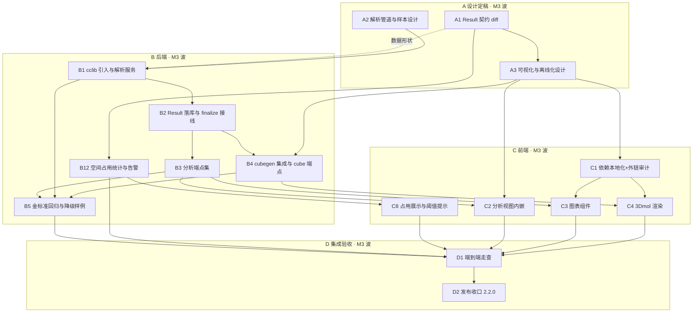
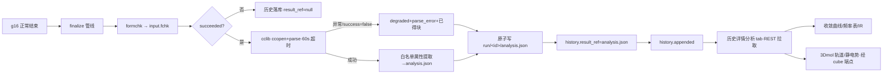
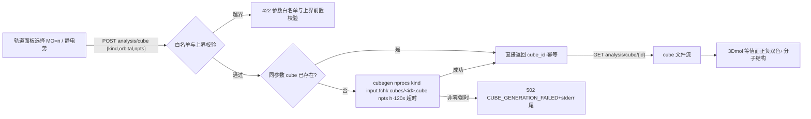

# M3 · 结果分析 — 执行计划

> 状态：执行计划（依据 [roadmap.md](../specs/roadmap.md) §3 M3 制定，
> 2026-09-30 由 M3+M4 联合计划（m3-m4-plan.md，同日经三轮联合审查修订
> 定稿）拆分而来——联合总工量 35 人天过大，按「两波执行、两次发布」的
> 既有结构一分为二，版本目标与波次闸门不变）。§1 为任务分解（WBS），
> §2 为关键设计定稿（A 阶段规格输入），§3 为任务流程图，§4 为逐任务
> 执行方案（步骤/技术要求/质量标准/交付物），§5–§9 为测试矩阵、提交
> 序列、验收标准（DoD）、开放决策点与风险预案。目标版本 2.2.0；M4
> （工作流）另立 [m4-plan.md](m4-plan.md)，以本文 D2 收口为开工闸门。
> 本文与 roadmap 冲突时以 roadmap 为准；API/SSE 契约
> （[openapi.yaml](../api/openapi.yaml)、[sse.md](../api/sse.md)、
> [mapping.md](../api/mapping.md)）现状为 33 路径（40 操作）+ 15 类事件，
> M3 新增一律走契约文档 diff（roadmap §4），不漂移既有语义。
> **沿革注记**：文中「修订说明一/二/三①」式回指 = 原联合计划的三轮
> 审查修订记录（完整文本见 git 历史——本次拆分提交之前的
> docs/plans/m3-m4-plan.md），相关裁决均已内化本文正文。
> 用户补充要求（2026-09-30，随计划固化）：**cclib 安装进项目根 `.venv`
> （uv + 国内镜像源），禁止全局安装；3Dmol.js 经 npm 镜像源下载并以
> 本地依赖打包，禁止 CDN/在线引用**——细节见 §2.5，落进 B1/C1 任务与 DoD。

## 0. 目标、范围与依据

### 0.1 目标（= roadmap §3 M3 原文定义）

**M3 · 结果分析**：以执行历史为主入口，分析视图内嵌在历史详情中，仅作简单
预览（不单列页面）；另支持指定工作区内 `.out`/`.log` 文件只读分析。**仅正常结束**
的执行才进入解析管道。能量收敛曲线、频率表与红外谱图（cclib 数据 + 前端
绘图）、fchk → cubegen → 轨道/静电势可视化。空间占用治理（roadmap M3 段
2026-09-30 回填）：统计各执行与总空间占用，达到总占用阈值仅警告、**不自动
清理**，手动清理沿用 M1 历史页入口（工作项 M3.7，定稿见 §2.6）。

### 0.2 工作项编号（引 roadmap 原文段落顺序，WBS 表「对应项」列引用）

| 编号 | 工作项（roadmap 原文摘要） |
|---|---|
| M3.1 | 以执行历史为主入口；分析视图内嵌历史详情，仅简单预览，不单列页面 |
| M3.2 | 仅正常结束（succeeded）的执行进入解析管道；异常结束只可导出原文 |
| M3.3 | 能量收敛曲线、频率表与红外谱图（cclib 数据 + 前端绘图） |
| M3.4 | fchk → cubegen → 轨道/静电势可视化（3Dmol.js） |
| M3.5 | 指定工作区内 `.out`/`.log` 文件只读分析 |
| M3.6 | Result 字段全集随 M3 契约 diff 一次性扩展（roadmap §2.6 规则 3）；`result_ref`（M0 占位恒 null）起写 |
| M3.7 | 空间占用统计与告警（2026-09-30 随审查裁决回填；替代 M1 托付的自动定时清理——统计各执行与总空间占用、超总占用阈值仅警告**不自动清理**、手动清理沿用 M1 历史页入口） | 已同步回填 roadmap §3 M3 段 |

### 0.3 不做（非目标）

- 单列分析页面、分析队列页（M3 仅历史详情内嵌预览，roadmap 原文）。
- cclib 之外的第二解析引擎；正则堆领域解析（roadmap §4 禁止事项）。
- chk/rwf 自动定时清理（roadmap §7 开放事项 5① 裁决：不引入；替代为 M3.7
  占用统计与阈值告警——仅警告不自动清理，手动清理沿用 M1 历史页入口）。
- 前端页面单测（roadmap §7 开放事项 5② 决策延续：手动冒烟 + D 阶段走查
  清单，不引入 vitest；M4 同此，见 m4-plan.md）。
- 任务链依赖/CREST 组合流/断点续跑（M4 范围，另立
  [m4-plan.md](m4-plan.md)）。

### 0.4 前置条件（开工闸门）

1. M0–M2 与 v2.1.0 已收口（progress.json：`latest_released_version=2.1.0`、
   `unreleased` 仅含 scope=docs 的文档条目、无代码与契约类条目——修订
   说明二校正，原「为空」措辞被本计划自身的落盘提交证伪）；v2.1.0 唯一
   悬留为 Release 附件上传（progress.json next_steps 首条，待 gh CLI
   认证与用户授权），**不阻塞 M3 开工**、随下次授权窗口处置（修订说明
   三⑬）；M3 开工前把
   「M3 结果解析与可视化」登记入 `in_progress`。
2. `target/release/hq` 在位（缺失会静默跳过关键 e2e，违反 AGENTS.md
   §6.1 第 4 条）。M3 不触及派发窗口/资源逻辑（B2 仅于
   `engine/finalize` 终态管线追加解析步，随既有 e2e 回归覆盖），M3 新增
   测试无此硬依赖，但**凡声称「全量 pytest 通过」时 hq 一律须在位**——
   既有 `test_e2e_fake_g16.py` 同受其制约，静默跳过即通过数虚高（修订
   说明三⑰）；D1 走查需真机 g16 跑 freq 任务。
3. 真机资产在位（已实测确认）：`~/g16/g16`、`~/g16/formchk`、
   `~/g16/cubegen`；金标准样本
   `~/g16/tests/` 4 份 `.out`（anisoles0/1、phenoxyls0/1，均含
   `Frequencies --`）+ 14 份 `.fchk`。
4. A1 契约 diff 经用户评审通过（文档先行，roadmap §4）。
5. roadmap §7 开放事项 5 处置已裁决（2026-09-30）：① 自动定时清理不引入、
   替代为 M3.7 占用统计与阈值告警；② 前端页面单测不引入——两项均随联合
   计划修订回填 roadmap（§7 开放事项 5 与 M3 段落）。

### 0.5 依据

- roadmap：§2.4（文件治理与路径边界）、§2.5
  （配置治理）、§2.6（字段生命周期：Result 字段、result_ref）、§3 M3、
  §4（质量底线：金标准回归）、§5（风险表）、§8.5（输出与日志约束）。
- M0–M2 产出：`docs/api/` 契约四件套（33 路径/40 操作、15 类事件、错误码全集载体
  在 openapi.yaml 文件头）；`web/src/`（store/engine/parse/services/routers
  模块已成型）；`web/frontend/`（六页视图 + 组件）。
- M1 遗产（M3 的直接依赖面）：succeeded 后自动 formchk 产出
  `run/<执行id>/input.fchk`（`engine/finalize.py`，M3 cube 的数据源）；
  历史条目 `result_ref` 字段占位（openapi.yaml `HistoryEntry.result_ref`，
  恒 null 待 M3 激活）。
- Gaussian 16 官方手册（gaussian-kb MCP 权威核查，2026-09-30）：
  - `cubegen`（gaussian.com/cubegen）：语法
    `cubegen nprocs kind fchkfile cubefile npts [format cubefile2]`；
    kind 白名单成员：`MO=n`（含 Homo/Lumo/All/OccA/OccB/Valence/Virtuals）、
    `Density=type`、`Spin=type`、`Alpha/Beta=type`、`Potential=type`（type
    取 Density 关键字选项：SCF/MP2/…，不支持 Current）、`Gradient`、
    `Laplacian` 等；`npts=0` 默认 80³，正值 n³，负值档位（-2/-3/-4 =
    Coarse/Medium/Fine = 3/6/12 点/Bohr）；format `h`（含头，默认）/`n`。
  - `formchk`（gaussian.com/utils）：二进制 chk → ASCII fchk（M1 finalize
    已产 fchk，M3 直接消费）。
- cclib（context7 `/cclib/cclib` 核查，当前文档）：入口
  `cclib.io.ccopen(path).parse()`；M3 所需属性（ccData，单位见属性表）：
  `scfvalues`/`scftargets`（SCF 收敛迹线/判据）、`scfenergies`（各几何步 SCF
  能量，eV）、`optdone`/`optstatus`（优化收敛与否）、`geovalues`/`geotargets`
  （几何收敛）、`atomcoords`/`atomnos`（构型）、`vibfreqs`（1/cm）、`vibirs`
  （km/mol）、`vibsyms`/`vibrmasses`/`vibdisps`（频率表）、`moenergies`（eV）、
  `homos`/`nmo`/`nbasis`/`mosyms`/`aonames`（轨道清单）、`enthalpy`/`entropy`/
  `freeenergy`/`zpve`（热化学，hartree/particle）、`metadata`（含
  `package`/`package_version`/`methods`/`success`）。

### 0.6 实施输入：现状核查结论（2026-09-30 实测）

| 事实 | 对计划的影响 |
|---|---|
| cclib **未安装**（`import cclib` 失败；requirements.txt 注释遗留「M1 追加 cclib」未兑现） | B1 兑现：uv 装入项目 `.venv`（清华镜像），requirements.txt 冻结版本，禁止全局安装 |
| 3Dmol.js **未入** `web/frontend/package.json`（roadmap M0 工作项 7「仅入依赖清单」未兑现） | C1 兑现：npm 镜像源安装并本地打包，禁 CDN；新增外链审计闸门脚本 |
| 前端无图表库；六页视图与组件已成型（HistoryView.vue 为 M3 主入口） | A3 决策图表方案；C2/C3 增量改造历史详情 |
| `HistoryEntry.result_ref` 契约占位恒 null | M3.6 契约 diff 一次扩展并起写（roadmap §2.6 规则 3） |
| 金标准：4 份 `.out` 全部含 `Frequencies --`，**缺异常终止/失败样例** | A2 定样本扩充；B5 落构造样例入库 `web/tests/fixtures/` |
| `engine/finalize.py`：succeeded 自动 formchk → `run/<id>/input.fchk` | M3 cube 数据源现成（B4 直接消费） |
| `~/g16/cubegen`、`~/g16/formchk` 在位 | B4 直接子进程调用；可执行探测缺失时显式降级（不静默） |
| 契约现状 33 路径（40 操作）+ 15 类事件；错误码全集载体在 openapi.yaml 文件头（`test_error_codes.py` 静态闸门） | 新增错误码随 A1 diff 登记，闸门自动覆盖 |
| openapi `info.version` 运行时从 `APP_VERSION` 动态覆盖（v2.1.0 SSOT 豁免口径） | 契约 diff 不手工追版本号；2.2.0 发布时随 VERSION/tag 自然演进 |

## 1. 任务分解与追踪（WBS）

单波：**A1–A3、B1–B5、B12、C1–C4、C8、D1–D2，目标版本 2.2.0**。阶段语义
与 m1/m2 计划一致：**A** 设计定稿（契约 diff，文档先行）→ **B** 后端 →
**C** 前端 → **D** 集成验收与发布。规模：S ≈ 半天内，M ≈ 1 天，L ≈ 2 天。
**B12/C8 为补录任务**（修订说明一③，编号沿联合计划、执行属本波）。
M4 波（A4–A5、B6–B11、C5–C7、D3–D4）另立 [m4-plan.md](m4-plan.md)。

| 编号 | 任务 | 产出物 | 验收标准（可验证） | 依赖 | 规模 | 对应项 |
|---|---|---|---|---|---|---|
| A1 | Result schema 与分析端点契约 diff 定稿 | openapi.yaml diff（Result 全集 + 7 分析端点 + 存储统计端点 + 设置项 `disk_usage_warn_gb` + 新错误码）+ mapping.md 增行 + sse.md「无新增事件」断言 | Result 字段一次定死（§2.1）；端点/错误码/设置项逐条列入映射无孤儿；`test_error_codes.py` 适配后通过；用户评审通过 | — | M | M3.1/M3.2/M3.5/M3.6/M3.7 |
| A2 | 解析管道与样本覆盖设计定稿 | §2.2 定稿（属性白名单映射表、降级链、样本扩充清单） | 白名单逐属性标注单位与缺失语义；降级链覆盖「解析异常/部分属性缺失/success=false」三分支；异常样例构造方案可入库 | — | M | M3.2/M3.3 |
| A3 | 可视化与依赖离线化设计定稿 | §2.4/§2.5 定稿（分析视图信息架构、图表方案选型、3Dmol 交互、cubegen 参数治理、离线化方案） | 视图嵌入历史详情不单列页面；cubegen kind/npts 治理表定稿；`.out` 入口形态（含辅助方式）关闭；离线化含审计闸门方案；图表选型关闭 | A1 | M | M3.1/M3.3/M3.4/M3.5 |
| B1 | cclib 引入与结果解析服务 | `uv pip install cclib`（项目 `.venv`，清华镜像）+ requirements.txt 冻结 + `web/src/parse/results.py` | 安装命令单行落档且仅进 `.venv`（`uv run python -c "import cclib"` 通过、全局 pip list 无 cclib）；4 份金标准 `.out` 白名单属性提取单测全绿；异常输入降级不抛出 | A2 | L | M3.2/M3.3、用户补充要求① |
| B2 | Result 落库与 finalize 接线 | finalize 管线追加解析步；`result_ref` 写入（analysis.json + history 条目置位） | succeeded 执行完成后 `run/<id>/analysis.json` 存在、`GET /history` 该条 `result_ref` 非 null；解析失败时 result_ref=null 且日志留痕、执行不受影响 | B1 | M | M3.2/M3.6 |
| B3 | 分析端点集 | `routers/history.py` 扩展（概览/收敛/频率/轨道）+ 工作区 `.out` 分析端点 | 契约测试逐端点过；succeeded 才可读（异常条目 409 `ANALYSIS_UNAVAILABLE`）；工作区外路径 400 `WORKSPACE_PATH_OUTSIDE`；不存在的分析块 404 语义明确 | B2 | L | M3.1/M3.5 |
| B4 | cubegen 集成与 cube 端点 | POST/GET cube 两端点 + `services/cube.py`（子进程调用 `~/g16/cubegen`） | kind 白名单外 422；`npts` 越界 422；真机小 fchk 生成 cube 成功（MO 与 Potential 各一）；cubegen 缺失时 503 显式报错（不静默跳过） | A3, B2 | M | M3.4 |
| B5 | 金标准回归与降级样例闸门 | `test_analysis_parse.py`/`test_analysis_api.py`/`test_cube_api.py` + 构造异常样例入库 fixtures | 4 份金标准逐属性断言；截断/失败构造样例走通降级三分支；全量 `uv run pytest` 通过 | B1–B4 | M | §4 质量底线 |
| B12 | 空间占用统计与告警（M3 波补录） | `services/storage.py` + `GET /storage/usage` 端点 + 运行级设置 `disk_usage_warn_gb` | 各执行占用与总占用统计对照 `du` 一致（可清理量口径与既有清理规则同源）；超总占用阈值 `over=true`、仅警告不自动清理；阈值 0=禁用；手动清理后统计即时反映；entries 截断前 50 条、千级执行目录基准 P95 < 2s | A1（契约 diff 随批）、M1 清理边界 | M | M3.7 |
| C1 | 前端依赖本地化 | `web/frontend/package.json` 增 `3dmol`（npm 镜像安装）+ 图表库（若 A3 选型引入）+ `scripts/audit_frontend_offline.sh` | `npm install --registry=https://registry.npmmirror.com` 单行落档；构建产物经审计脚本零外链（http/https 资源引用，含 3dmol 运行时动态加载路径）；`npm run build` 通过 | A3 | S | M3.4、用户补充要求② |
| C2 | 分析视图（历史详情内嵌） | HistoryView 详情增分析区（tab：概览/能量收敛/频率与 IR/轨道与静电势）+ 工作区 `.out` 打开入口 | 分析区仅出现在历史详情内（无独立路由）；succeeded 条目展示、异常条目仅原文导出入口；`.out` 分析复用同一组件；workspace-out 模式轨道 tab 仅清单、cube 入口置灰注明无 fchk | A3, B3 | L | M3.1/M3.5 |
| C3 | 图表组件 | 收敛曲线（折线）/频率表（表格）/IR 谱图（棒图）组件 | 金标准数据渲染冒烟；数据为空/缺失块显示占位说明；符合设计令牌与对比度闸门（check_tokens/check_contrast） | C1, B3 | M | M3.3 |
| C4 | 3Dmol 轨道/静电势渲染 | 轨道面板（清单选择 + 等值面渲染 + isoval 档位） | 选 MO=n → POST cube → 渲染等值面（正负相双色）+ 分子结构；静电势映射同链路；cube 失败显式提示 | C1, B4 | M | M3.4 |
| C8 | 占用展示与阈值提示（M3 波补录） | 历史页清理区占用面板（总计 + 前 N 大占用明细 + 超阈琥珀警示） | 展示与端点一致；超阈警示显性可辨（琥珀=需要行动）；设置页阈值可配 | B12 | S | M3.7 |
| D1 | M3 端到端验收走查（真机） | 走查记录 `docs/plans/m3-acceptance.md`（§7.2 路径逐条留痕，截图存本地不入库） | roadmap M3 验收段对照核验 + §7.2 走查路径逐条通过 | B1–B5, B12, C1–C4, C8 | M | M3 验收 |
| D2 | M3 发布收口（2.2.0） | CHANGELOG.jsonl 冻结 + tag v2.2.0 + progress.json 同步 | AGENTS.md §5.2 五步顺序执行；双闸门（pytest + validate_progress）通过 | D1 | S | AGENTS.md §5.2 |

**依赖关系总览**：M3 波 `A1→(A3, B1 数据形状边)`；`A2→B1`（B1 硬依赖 A2；
A1 评审为 §0.4 开工闸门，虚线语义=数据形状基线，不另设等待）；`A1→A3→(B4, C1)`；
`B1→B2`；`B2→(B3, B4)`（B4 的 orbital 上界 nmo 取自 B2 的 analysis.json、
对 B1 无直接依赖——修订说明二）；`B3→(B5, C2, C3)`；`C1→(C3, C4)`；`B4→C4`；
`A1→B12`；`B12→C8`；`B1–B5/B12/C1–C4/C8→D1→D2`。A1 与 A2 可并行；
B3 与 B4 在 B2（及 A3）就绪后可并行（修订说明二）；
C2 与 C3/C4 在 B3/B4 就绪后可并行；B12 在 A1 契约 diff 评审后即可开工
（不阻塞解析链）。M4 波另立 m4-plan.md，整体不早于本文 D2 启动（A4 的
契约 diff 以 M3 落库后的契约基线为前提，避免两次 diff 叠加冲突）。

**总工量与关键路径**（2026-09-30 按审查补录，沿 m1/m2 口径；拆分后仅计
本文任务）：总工量 ≈ **17.5 人天**（A1–A3 3 + B1–B5 7 + B12 1 + C1–C4
4.5 + C8 0.5 + D1/D2 1.5）。逻辑关键路径
`A1→B1→B2→B3→C2→D1→D2`（9.5 人天，M3 段实算——修订说明三③）。
单人串行执行时总工期即总工量；B1/B3/C2（L 估算）建议各预留
~20% 缓冲；估算不含 D 阶段走查缺陷 fix 的返工。

## 2. 关键设计定稿（A 阶段规格输入）

> 以下为 A1/A2/A3 的定稿基线。标注「建议」的条目为开放决策点
> （§8）的建议值，评审时定案；未标注者为本计划的直接约束。

### 2.1 Result schema 与契约 diff 范围（A1）

**Result 字段全集**（一次定死，roadmap §2.6 规则 1；`HistoryEntry.result_ref`
口径统一为「succeeded 且 `analysis.json` **落盘成功**（含 degraded 降级
产物）时 = `analysis.json`（执行目录内相对引用，读取方按 `run/<执行id>/`
拼接）；落盘失败/缺失恒 null」——修订说明一⑤，与 §2.2/§4.5/§7.1 逐处
对齐）：

```
Result:
  state: parsed | degraded            # degraded=至少一个请求块解析失败/缺失
  parser: { name: "cclib", version }
  package: { name, version }          # cclib metadata.package / package_version
  method: string | null               # metadata.methods 摘要（如 b3lyp/6-31g(d)）
  summary:
    natom, nmo, nbasis: integer
    scf_energy_eV: number | null      # scfenergies 末值
    scf_energy_hartree: number | null # 供能量表直接使用（eV→hartree 换算单点）
    opt_converged: boolean | null     # optdone；非优化任务 null
    freq_count: integer | null        # vibfreqs 长度；非频率任务 null
    imaginary_freq_count: integer | null
    homos: number[]                   # HOMO 序号（开壳层 α/β 两值）
  blocks:                             # 可用分析块清单（决定端点可见性）
    convergence: boolean              # scfvalues/geotargets 可得
    frequencies: boolean              # vibfreqs 非空
    orbitals: boolean                 # moenergies/homos 非空
    thermochemistry: boolean          # enthalpy/entropy/freeenergy/zpve 可得
  missing: string[]                   # degraded 时的缺失属性清单
  parse_error: string | null          # 解析异常摘要（degraded 主因）
```

**新增端点**（路径前缀 `/api/v1`，A1 评审定稿；全部只读或幂等派生；若
决策点 4 入选 workspace 候选清单端点则另 +1，随 A1 评审一并定——修订
说明三①）：

| 方法与路径 | 用途 |
|---|---|
| GET /history/{id}/analysis | Result 概览（即 Result schema 全文，读 analysis.json） |
| GET /history/{id}/analysis/convergence | SCF 迹线（scfvalues/scftargets）+ 几何收敛（geovalues/geotargets）+ 能量序列（scfenergies，hartree/eV 双单位） |
| GET /history/{id}/analysis/frequencies | vibfreqs/vibirs/vibsyms/vibrmasses 表 |
| GET /history/{id}/analysis/orbitals | moenergies/homos/nmo/nbasis/mosyms 清单（不含 mocoeffs——系数不进响应，等值面走 cubegen） |
| POST /history/{id}/analysis/cube | 生成 cube：`{kind, orbital?, npts?}` → `{cube_id}`（kind 白名单见 §2.4；幂等：同参数命中已生成文件直接返回） |
| GET /history/{id}/analysis/cube/{cube_id} | cube 文件流（`chemical/x-cube`；前端 3Dmol 直接 fetch） |
| POST /analysis/workspace-out | 工作区 `.out` 只读分析：`{path}`（工作区内相对路径）→ 一次性返回「概览 + 收敛 + 频率 + 轨道」四块合一负载（与四个 `GET .../analysis*` 端点的分块结构同形嵌套；不落库、不写 result_ref） |
| GET /storage/usage | 空间占用统计（M3.7）：各执行占用明细（总量 + 可清理量）、总占用、阈值判定与告警标记（只读；定义见 §2.6） |

**新错误码**（登记 openapi.yaml 文件头全集，`test_error_codes.py` 闸门覆盖）：

| 码 | HTTP | 语义 |
|---|---|---|
| `ANALYSIS_UNAVAILABLE` | 409 | 非 succeeded 条目请求分析，或 analysis.json 缺失且重建失败 |
| `ANALYSIS_PARSE_FAILED` | 422 | 请求的分析块数据不足**或解析超时**（如无频率任务请求 frequencies；超时 details 注明，§2.3——修订说明三⑨） |
| `WORKSPACE_PATH_OUTSIDE` | 400 | `.out` 分析路径越出工作区（§2.3 路径守卫） |
| `CUBE_GENERATION_FAILED` | 502 | cubegen 非零退出/超时（details 携带 stderr 尾部） |
| `CUBE_EXECUTABLE_MISSING` | 503 | `g16_root/cubegen` 探测失败（显式，不静默） |

**mapping.md**：历史详情分析区四 tab、归档详情分析区（复用历史详情分析
组件，可见性同 succeeded 条目——修订说明三⑫）、`.out` 打开入口、轨道
面板、历史页
清理区占用面板（M3.7）等界面元素逐行登记；**sse.md 不变**（M3 全部为拉取型：
分析数据与占用统计随 `history.appended` 后的 REST 拉取，无需新事件——在 A1
评审中显式确认此结论并留痕）。

### 2.2 解析管道与样本覆盖（A2）

- **准入**：仅 `succeeded` 执行进入解析管道（roadmap M3.2）。双保险：执行
  状态机判定（第一道）+ cclib `metadata.success`（第二道，false 即
  degraded）。异常结束执行永不解析，历史详情仅原文查看/导出（M1 已有能力）。
- **时机**：finalize 管线内、formchk 之后追加解析步（同链异步、失败不阻断
  终态落库——沿用 formchk「失败记日志不阻断」先例）。产物
  `run/<执行id>/analysis.json`（Result 全集 + 各块数据），`result_ref` 置位
  （**含 degraded**——只要落盘成功即置位；口径统一见 §2.1）。
  解析超时上限 60s（超时按 degraded 落地，防止大输出阻塞 finalize 链）。
- **属性白名单**（cclib 属性 → analysis.json 数据块，单位随 cclib 属性表）：

| analysis 块 | cclib 属性 | 缺失时语义 |
|---|---|---|
| convergence.scf | scfvalues（迹线）、scftargets（判据） | blocks.convergence=false |
| convergence.geo | geovalues、geotargets、optdone/optstatus | 同上（优化任务才有） |
| convergence.energy | scfenergies（各几何步末次 SCF 能量序列） | 同上 |
| frequencies | vibfreqs、vibirs、vibsyms、vibrmasses | blocks.frequencies=false |
| orbitals | moenergies、homos、nmo、nbasis、mosyms | blocks.orbitals=false（含输出无 MO 表场景，提示建议 Pop=Reg/Full） |
| thermochemistry | enthalpy、entropy、freeenergy、zpve | blocks.thermochemistry=false |
| summary/package/method | natom/nmo/nbasis、metadata.* | 对应字段 null |

- **降级链**（三分支，B5 逐一覆盖）：① cclib 解析抛异常 → `state=degraded`、
  `parse_error` 摘要、已可得块照常保留；② `metadata.success=false` → 同①并
  附注；③ 个别属性缺失 → `missing[]` 登记、对应 block 置 false。三分支均不
  阻断历史落库，`ANALYSIS_UNAVAILABLE` 语义仅在「analysis.json 文件缺失且
  重建失败」时出现（重建 = finalize 急解析失败后的惰性补跑一次，见 §8 决策点 2）。
- **样本覆盖**：金标准回归沿用 m1 模式（`~/g16/tests/` 4 份 `.out` 真机样本，
  逐属性断言）；**异常/降级样例以构造样本入库 `web/tests/fixtures/`**（截断
  freq 输出、`Normal termination` 缺失的 opt 输出、无 MO 表输出——小体量、
  可控、随仓库走，不写用户目录 `~/g16/tests/`）。roadmap §7 待确认事项 2
  的「失败/中断样例」由本项部分关闭（构造样例覆盖解析降级面；真机失败样例
  随 D1 走查强停产出并抽查、不入库大文件——动作已编入 §7.2 走查路径第 3
  条；不同方法/任务类型的覆盖缺口在后续里程碑按需补充）。

### 2.3 分析端点数据形状与边界（A1 评审输入，B3 实施依据）

- convergence 响应含三类序列，前端直接绘图：`scf_trace`（每几何步内 SCF 迭代
  的 ΔE/ΔRMS 等列，cclib scfvalues 逐列展开）、`geo_trace`（geovalues vs
  geotargets）、`energy_series`（scfenergies 逐几何步）。长输出预算：单端点
  响应 ≤ 2MB，超出按步均匀抽稀并附 `downsampled: true`（金标准样本不触发）。
- workspace-out 端点的路径守卫：`(workspace_root / path).resolve()` 后必须是
  `workspace_root.resolve()` 的子孙且后缀 ∈ {.out, .log}（`.log` 为 g16
  输出后缀两态的扩展，roadmap M3.5 已同批回填——修订说明二）；
  越界/缺失/不可解析分别 400/404/422；解析超时 60s（沿用 §2.2 finalize
  同款），超时 422 `ANALYSIS_PARSE_FAILED`（details 注明 timeout——修订
  说明三⑨）。只读，绝不写工作区外
  （roadmap §2.4：工作区外一律只读）。
- cube 幂等与留存：产物落 `run/<执行id>/cubes/<cube_id>.cube`
  （cube_id=参数摘要哈希）；同参数重复 POST 直接返回既有 cube_id。cube 为
  派生物、可再生，不参与 chk/rwf 保留期清理，也不进历史条目（留存与执行
  目录同生命周期；§8 决策点 3 复核）。

### 2.4 可视化设计（A3）

- **信息架构**：历史详情（既有详情区）内新增「分析」区，四 tab——概览 /
  能量收敛 / 频率与 IR / 轨道与静电势；不新增路由页面（roadmap M3.1 硬约束）。
  tab 可见性由 `Result.blocks` 驱动（false 的 tab 置灰并注明缺失原因）。
  `.out` 打开入口置于分析区头部（工作区内路径输入 + 只读分析），复用同一
  组图表/表格组件，workspace-out 模式下「轨道与静电势」tab 仅展示轨道能量
  清单、cube/等值面入口置灰并注明「工作区文件无 fchk」（cube 端点以执行
  id 键控——修订说明二）；路径输入的辅助形态（工作区 `.out/.log` 候选列表——
  浏览器不可直接读文件系统，入选需增一个只读候选清单端点）列为决策点 4
  的评审项（**端点有无随 A1 评审定稿**——直接决定 A1 端点清单（8 或 9），
  不能后置；A1 评审未决时默认不纳入、后续如需走独立契约 diff；入口位置
  与交互随 A3——修订说明三①），见 §8。
- **图表方案（A3 决策，建议值：ECharts 按需引入）**：收敛曲线（折线，双
  判据虚线参考线）、IR 谱图（棒图 + 频率表联动高亮）。按需注册
  LineChart/BarChart/Grid/Tooltip/DataZoom，控制包体；镜像源本地安装、随
  Vite 打包（离线约束同 §2.5）。备选：手写 SVG 组件（零依赖、约 300 行，
  无缩放交互）——评审时定案。
- **3Dmol 渲染**：fetch cube 文件 → 3Dmol 创建 viewer → 加载体积数据渲染
  等值面（正相/负相双色，isoval 档位 ±0.02 默认、±0.05/±0.08 可选）+ cube
  内嵌几何作分子结构；静电势（Potential=SCF）另支持色彩映射模式。轨道清单
  下拉（HOMO/LUMO 预置 + 序号直选，mosyms 附注）。具体 3Dmol API 用法在
  C4 实施时经 context7/官方文档核对，不凭记忆写代码（AGENTS.md §8.3）。
  构建产物运行时零外链（含包内 worker/动态加载路径）为 C1 离线审计验收项，
  A3 定稿时核对 3Dmol 包内资源加载方式与纯本地打包的兼容性。
- **cubegen 参数治理**（kind 白名单，白名单外一律 422）：

| 参数 | 允许值 | 默认 |
|---|---|---|
| kind | `MO=<n>`（1≤n≤nmo）、`Potential=SCF`、`Density=SCF`、`Spin=SCF` | —（必填） |
| npts | 40–120 整数 | 80（G16 默认 80³ 档） |
| nprocs | 1–6 | 1（静电势计算并行数） |

  请求体文法（POST /history/{id}/analysis/cube）：`{kind: "MO", orbital: n,
  npts?}`——`kind="MO"` 时 `orbital` 必填且 1≤orbital≤nmo；或
  `{kind: "Potential"|"Density"|"Spin", npts?}`。服务端按此合成 cubegen
  kind 实参（`MO=<orbital>` 与 `<kind>=SCF`）；治理表 kind 列的
  `=<n>`/`=SCF` 后缀为 cubegen 侧实参形态，非请求体字段值。

  调用：`<g16_root>/cubegen <nprocs> <kind> <fchk> <cube> <npts> h`，子进程
  超时 120s；fchk 取 `run/<id>/input.fchk`（M1 formchk 产物），缺失时
  502（details 注明 formchk 产物缺失）。环境沿用 roadmap §2.5 g16 自洽构建口径
  （GAUSS_MEMDEF 缺省不设）。

### 2.5 依赖安装与前端离线化（用户补充要求，2026-09-30 固化）

- **cclib（Python）**：安装进**项目根 `.venv`**（uv 管理），单行命令：
  `uv pip install cclib -i https://pypi.tuna.tsinghua.edu.cn/simple`；版本
  冻结进 `requirements.txt`（注释注明 M3 引入用途）；**禁止全局 pip 安装**
  ——质量标准含「全局环境无 cclib」核查（`uv run` 外的 pip show 无此包）。
- **3Dmol.js（前端）**：`web/frontend/` 内
  `npm install 3dmol --registry=https://registry.npmmirror.com`（或评审确认
  的等价本地化方式），import 本地打包进构建产物；**禁止 CDN/在线引用**。
- **外链审计闸门（新增脚本）**：`scripts/audit_frontend_offline.sh`——对
  `web/frontend/dist/` 构建产物扫描 `https?://` 资源引用（豁免：注释与
  license 文本、SVG namespace 等非资源引用白名单），命中即非零退出；纳入
  C1/C4 与 D1 收口闸门（AGENTS.md §6.3）。图表库若引入，同规约束。

### 2.6 空间占用统计与告警（M3.7 定稿基线，2026-09-30 裁决替代自动定时清理）

- **定位**：roadmap §7 开放事项 5① 裁决（修订说明一③）——自动定时清理
  **不引入**；本项为替代：**只统计与警告，绝不自动清理**；手动清理沿用
  M1 历史页入口（`POST /history/cleanup`，仅删正常结束且超保留期的
  chk/rwf）。纯拉取式、无定时器、无后台任务——不产生「自动动作」面。
- **统计口径**：
  - `total_bytes`：`run/` 下全部执行目录（含输入/输出/scratch/chk/rwf/
    protected/cubes）的总占用。
  - `entries[]`：per-execution 明细 `{execution_id, task_id, filename,
    total_bytes, reclaimable_bytes}`，按 `total_bytes` 降序；`reclaimable_bytes`
    = 按 M1 清理边界**可被手动清理入口移除的量**（口径与清理逻辑同源、
    单一实现——复用清理判定函数，不重复实现；非正常终止的保全快照计 0）。
  - 统计只读（只 stat/遍历，不触碰、不移动任何文件）；清理动作后统计
    即时反映。
- **端点**：`GET /storage/usage` →
  `{total_bytes, threshold_bytes, over, entries[], total_entries, truncated}`
  （阈值判定见下；entries 按总占用降序**默认截断前 50 条**、`truncated`/
  `total_entries` 标注截断与总数——修订说明二定稿，随 A1 契约登记）。
- **阈值与告警**：运行级设置 `disk_usage_warn_gb`（整数 GB；0=禁用告警；
只读告警不涉执行语义、建议即时生效；默认值建议 50，评审定；**随 A1
契约 diff 的 SettingItem 目录登记**）。判定：`threshold_bytes > 0 &&
total_bytes ≥ threshold_bytes ⇒ over=true`。**仅警告不清理**。
- **前端展示（C8）**：历史页清理区常驻占用面板——总占用读数 + 超阈琥珀
  警示条（`--warn`：「总占用已超阈值 N GB — 请手动清理」，属「需要行动的
  警告」琥珀纪律允许面）+ 前 N 大占用明细（可展开）+ 引导既有清理入口；
  刷新时机=历史页加载与 `history.appended` 事件后（拉取式，无新增 SSE
  事件——与 §2.1「M3 无新增事件」断言一致）。

## 3. 任务流程图

### 3.1 阶段与任务依赖（WBS 全景）



要点：A1/A2 并行且文档先行（A1 契约 diff 是 B/C 的数据形状基线，
虚线边）；B1 是 B/C 共同前置；D1 前全链闸门（B5）先行；B12/C8（M3.7 占用
统计，修订说明一③）随 A1 契约后独立开行、与解析链无依赖交错。D2 收口
（tag v2.2.0）即 M4 波（m4-plan.md）的开工闸门。

### 3.2 M3 结果解析数据流（finalize 管线扩展）



### 3.3 cube 生成与轨道可视化数据流



## 4. 逐任务执行方案

> 每任务四要素：**步骤**（动手顺序）、**技术要求**（硬约束）、**质量标准**
> （可验证判据）、**交付物**（落库物）。公共纪律不重复写：文档先行、
> 全量 `uv run pytest` + 四校验脚本过闸、hq 产物在位（凡声称「全量
> pytest 通过」时适用，§0.4 第 2 条）、
> 契约生成物随 diff 再生（gen:types 零 diff）、契约 diff 涉及新存储
> 字段者对应 SQLite 迁移随该批次落库（幂等、版本化，migrations 机制
> ——修订说明三⑥）。

### 4.1 A1 · Result 契约 diff

- 步骤：① 依 §2.1 起草 openapi.yaml diff（Result schema、**8 端点**＝
  7 分析端点 + `GET /storage/usage`（若决策点 4 入选 workspace 候选
  清单端点则 9，随 A1 评审一并定——修订说明三①）、5 错误码、设置项
  `disk_usage_warn_gb` 随 SettingItem 目录登记、HistoryEntry.result_ref
  描述改写——修订说明二与 WBS A1 行对齐）；② mapping.md 增行——
  「05 执行历史」分析区四 tab、归档详情分析区（复用历史详情分析组件，
  可见性同 succeeded 条目——修订说明三⑫）、`.out` 打开入口、轨道面板、
  历史页清理区
  占用面板（M3.7）逐行登记；③ sse.md 补「M3 无新增事件」决策说明；
  ④ gen:types 再生；⑤ 评审。
- 技术要求：字段一次定死不预留「以后再加」（roadmap §2.6 规则 1）；错误码
  登记文件头全集；`openapi-core` 契约测试与 `test_error_codes.py` 适配。
- 质量标准：契约走查——Result 每字段有端点承载、每端点被 mapping 引用；
  评审通过留痕。
- 交付物：契约 diff 提交（docs(api) 单独一类变更）。

### 4.2 A2 · 解析管道与样本设计

- 步骤：① 按 §0.5 cclib 属性表起草白名单映射（单位/缺失语义逐行）；②
  降级链三分支判定顺序定稿；③ 构造异常样例三份起草（内容小、可入库）；
  ④ finalize 接线点与超时参数定稿。
- 技术要求：自写解析仅限 cclib 属性整备与 shape 转换，禁领域正则
  （roadmap §4）；样本不写 `~/g16/tests/`（用户目录只读）。
- 质量标准：4 份金标准在 cclib 当前版本下逐属性试提取通过（写一次性探针
  脚本验证，不入库为测试）。
- 交付物：本节定稿内容回填（如评审有修订）+ fixtures 样例草案。

### 4.3 A3 · 可视化与离线化设计

- 步骤：① 分析视图信息架构定稿（tab 结构、blocks 驱动可见性、`.out` 入口）；
  ② 图表选型评审（建议 ECharts 按需，备选手写 SVG）；③ 3Dmol 交互规格
  （isoval 档位、正负双色、静电势映射）；④ cubegen 治理表（§2.4）定稿；
  ⑤ 离线化方案与外链审计脚本规格定稿。
- 技术要求：不单列页面（roadmap 硬约束）；视觉沿用简约基调与设计令牌。
- 质量标准：决策点 1/3（§8）关闭；审计脚本规格可实施。
- 交付物：本节定稿 + 选型结论回填。

### 4.4 B1 · cclib 引入与解析服务

- 步骤：① `uv pip install cclib -i https://pypi.tuna.tsinghua.edu.cn/simple`
  装入项目 `.venv`；② requirements.txt 冻结；③ `web/src/parse/results.py`：
  `ccopen → parse → 白名单提取 → 契约 JSON`（超时、异常捕获、missing 登记）；
  ④ 金标准单测。
- 技术要求：**仅 `.venv`**（质量标准含全局无包核查）；解析输入只读
  （cclib 不改写原文件）；所有路径 `pathlib`、显式 `encoding="utf-8"`。
- 质量标准：4 份金标准属性提取断言全绿；构造异常输入降级不抛出；cclib
  版本号进入 Result.parser.version（可追溯）。
- 交付物：parse/results.py + 测试 + requirements.txt diff。

### 4.5 B2 · Result 落库与 finalize 接线

- 步骤：① finalize 管线 formchk 步后追加解析步（复用其「失败不阻断」模式
  与超时 60s）；② analysis.json 原子写（临时文件+rename）；③
  executions/history 仓储写 result_ref；④ 单测。
- 技术要求：解析异常仅日志+degraded 落地，不得影响终态落库与 SSE
  `history.appended` 时序；磁盘失败同降级。
- 质量标准：集成测试——fake g16 成功执行后 analysis.json 存在且
  `GET /history` result_ref 非 null（degraded 样本同样非 null，口径见
  §2.1/§2.2）；**analysis.json 落盘失败**注入用例 result_ref=null 且执行
  终态不受影响。
- 交付物：finalize 扩展 + 仓储扩展 + 测试。

### 4.6 B3 · 分析端点集

- 步骤：① 概览/收敛/频率/轨道四端点（读 analysis.json 分块响应）；②
  analysis.json 缺失时惰性重建一次（§8 决策点 2 建议值）再判
  `ANALYSIS_UNAVAILABLE`；③ workspace-out 端点（路径守卫 §2.3）；④ 契约
  测试。
- 技术要求：非 succeeded 一律 409；响应预算抽稀逻辑（§2.3）；只读边界
  （resolve 后子孙校验）。
- 质量标准：契约测试逐端点对照 openapi；越界路径用例（`../`、绝对路径、
  符号链接逃逸）全拒。
- 交付物：routers/services 扩展 + 测试。

### 4.7 B4 · cubegen 集成

- 步骤：① `services/cube.py`：探测 `<g16_root>/cubegen`（缺失 503）、参数
  构建、子进程列表调用、120s 超时、stderr 尾部捕获；② cube_id=参数摘要、
  落 `run/<id>/cubes/`、幂等命中；③ POST/GET 两端点；④ 真机集成测试。
- 技术要求：fchk 路径=执行目录内 input.fchk（不读用户源文件）；cube 目录
  不入保留期清理；错误码 CUBE_* 两枚全部用上。
- 质量标准：金标准小 fchk（如 test0009-ref.fchk）MO=1 与 Potential=SCF
  各生成成功；白名单外 kind 422；cubegen 摘除场景（G16WEB 探测注入）503
  显式。
- 交付物：services/cube.py + 端点 + 测试。

### 4.8 B5 · 金标准回归与降级样例闸门

- 步骤：① test_analysis_parse（4 金标准逐属性 + fixtures 异常样例降级三
  分支）；② test_analysis_api（端点/边界/越界）；③ test_cube_api（参数/
  幂等/真机）；④ 全量回归。
- 技术要求：真机依赖（cubegen、金标准）缺失时 skip 必须带显式 reason
  （pytest -rs 可见），不得静默（AGENTS.md §6.1 教训）。
- 质量标准：闸门随 AGENTS.md §6.3 常驻；失败样例三分支全覆盖。
- 交付物：三个测试文件 + fixtures 样例。

### 4.9 C1 · 前端依赖本地化

- 步骤：① `npm install 3dmol --registry=https://registry.npmmirror.com`
  （图表库若选型引入同批）；② `scripts/audit_frontend_offline.sh` 落地并
  跑通；③ 构建验证。
- 技术要求：零 CDN；镜像源单行命令落档 development 文档；审计白名单仅
  非资源引用。
- 质量标准：`npm run build` 通过；审计脚本对 dist 零命中；脚本纳入版本
  管理并入 AGENTS.md §6.3 闸门清单。
- 交付物：package.json/package-lock.json diff + 审计脚本 + 文档行。

### 4.10 C2 · 分析视图

- 步骤：① HistoryView 详情区增分析区骨架（四 tab + blocks 驱动置灰）；②
  概览 tab（Result 全集摘要）；③ `.out` 打开入口（路径输入 + 校验错误
  内联提示）；④ 异常条目形态（分析区置灰 + 不可分析原因注记——409 语义
  的 UI 承载，与 §7.1-3 对齐）；⑤ 归档条目（`/archive` 路由）与历史条目
  共用分析区与原文查看（归档仅移出历史列表，文件不删——可见性口径随
  A1 登记）。
- 技术要求：不新增路由；api client 走 gen:types 生成物，禁私相授受。
- 质量标准：succeeded/failed/归档三形态走查截图留痕；空态/加载/错误
  三态齐备。
- 交付物：HistoryView 扩展 + 子组件。

### 4.11 C3 · 图表组件

- 步骤：① 收敛曲线（SCF 迹线/几何收敛/能量序列三源，判据参考线）；②
  频率表（表格 + 虚频标红计数）；③ IR 棒图（频率-强度，表格联动高亮）；
  ④ 令牌与对比度校验。
- 技术要求：数据为空显示占位说明；长序列用端点抽稀结果渲染。
- 质量标准：金标准数据渲染冒烟（D1 留痕）；check_tokens/check_contrast
  通过。
- 交付物：图表组件 + 冒烟记录。

### 4.12 C4 · 3Dmol 渲染

- 步骤：① 轨道清单交互（HOMO/LUMO 预置 + 序号直选）；② cube 拉取与等值
  面渲染（正负双色、isoval 档位、静电势色彩映射）；③ 失败态（502/503
  文案区分「生成失败」与「cubegen 不可用」）；④ viewer 生命周期（切换
  执行/轨道时销毁重建，防泄漏）。
- 技术要求：3Dmol API 用法实施时经 context7 核对（AGENTS.md §8.3）。
- 质量标准：金标准 fchk 的 HOMO 渲染截图留痕；连续切换无内存泄漏（手动
  走查）。
- 交付物：轨道面板组件。

### 4.13 B12 · 空间占用统计与告警（M3 波补录，修订说明一③）

- 步骤：① `services/storage.py`：`run/` 遍历统计（总占用 + per-execution
  明细；可清理量复用清理判定函数——口径同源单实现）；② `GET /storage/usage`
  端点（响应形状与预算随 A1 定稿）；③ 运行级设置 `disk_usage_warn_gb`
  （SettingItem 目录登记、即时生效、0=禁用）；④ 测试。
- 技术要求：只读统计（只 stat/遍历，不触碰文件）；仅警告**不自动清理**、
  无定时器（拉取式）；`reclaimable_bytes` 与 M1 清理边界判定单一实现。
- 质量标准：统计对照实测 `du` 一致（含 protected/cubes 等子目录）；
  超阈 `over=true`、阈值 0 恒 false；手动清理后统计即时反映；entries
  默认截断前 50 条（`truncated`/`total_entries` 标注）；千级执行目录
  构造基准 P95 < 2s（修订说明二）；单测覆盖 per-execution 聚合与
  reclaimable 口径（含保全快照计 0）。
- 交付物：services/storage.py + 端点 + 设置项 + 测试。

### 4.14 C8 · 占用展示与阈值提示（M3 波补录，修订说明一③）

- 步骤：① 历史页清理区占用面板（总占用读数 + 前 N 大占用明细，可展开）；
  ② 超阈琥珀警示条（「总占用已超阈值 N GB — 请手动清理」+ 引导既有
  清理入口，属「需要行动」琥珀纪律允许面）；③ 刷新时机=历史页加载与
  `history.appended` 后（拉取式）；④ 设置页 `disk_usage_warn_gb` 可配。
- 技术要求：数据走 gen:types 生成 client；无新增 SSE 事件；沿用设计令牌
  与对比度闸门。
- 质量标准：展示与端点一致（D1 走查留痕，含「阈值临时调低触发警示」的
  受控路径）；`npm run build` 零错误；check_tokens/check_contrast 通过。
- 交付物：历史页占用面板组件。

### 4.15 D1/D2 · M3 走查与发布

- D1 步骤：按 §7.2 走查路径清单逐条真机走查（真 g16 freq 任务 + 金标准
  样本 + 强停产出失败样例），GUI 经 Playwright 黑盒驱动（沿 m1/m2 走查
  方法），走查记录落 `docs/plans/m3-acceptance.md`（环境准备、逐条
  结果/留痕表、缺陷修复表；截图存本地不入库——沿 m2-acceptance 体例）；
  对照 roadmap M3 验收段做核验（发现偏差按「先改文档再改代码」处置）。
- D2 步骤：按 AGENTS.md §5.2 五步执行（冻结 2.2.0 → 追加空 unreleased →
  progress 同步 → tag v2.2.0 → 提示协作者；**不推送远端**，推送须用户
  当次授权）。

## 5. 测试矩阵（先测试后实现）

| 测试文件（拟） | 覆盖 | 关键用例 | 类型 |
|---|---|---|---|
| test_analysis_parse.py | B1/B2 | 4 金标准逐属性；异常样例降级三分支；超时降级；Result 全集字段 | 单元+回归 |
| test_analysis_api.py | B3 | 四端点契约形状；非 succeeded 409；analysis.json 缺失惰性重建；workspace-out 越界（../、绝对路径、symlink）400/404；workspace-out 解析超时 422（慢解析桩注入——修订说明三⑨） | 契约+边界 |
| test_cube_api.py | B4 | kind 白名单 422；npts 越界 422；幂等命中；真机 MO/Potential 生成；cubegen 缺失 503（探测注入） | 契约+集成 |
| test_finalize_result.py | B2 | fake g16 成功→analysis.json+result_ref；解析注入失败→降级不阻断 | 集成 |
| test_storage_usage.py | B12 | 统计对照 `du`；per-execution 聚合与 reclaimable 口径（保全快照计 0）；阈值判定与 0=禁用；清理后即时反映；entries 截断 50 条与千级目录 P95<2s 基准 | 单元+集成 |
| test_e2e_m3.py | D1 | roadmap M3 验收路径脚本化预演（真机段走查留痕） | e2e |
| 既有回归 | 全程 | `test_error_codes.py`、`test_openapi_ssot.py`、`gen:types` 零 diff、`test_e2e_fake_g16.py` 不回归 | 闸门 |

说明：真机依赖（cubegen/金标准/真 g16）缺失时 skip 必须显式带
reason（`-rs` 可见）；hq 产物缺失静默跳过的既有教训（AGENTS.md §6.1 第 4 条）不得
在新增测试重演——全量回归声明通过前先核 `target/release/hq`（§0.4 第 2 条）。

## 6. 提交序列与进度同步

遵守 conventional_commits（单类变更/提交，文档→测试→实现→进度同步；
测试与实现同提交——m1/m2 口径）。**定稿提交表**（15 项，含 2.2.0 发布；
每项随行一笔 chore(progress) 登记提交、不另占编号——m2 实践口径；
D1 的随查随修 fix 一缺陷一提交、另计。联合计划落库与 roadmap 开放事项 5
回填两笔历史提交不占本表编号，见 git 历史）：

| # | 提交（type: 摘要） | 内容 |
|---|---|---|
| 1 | docs(api): A1 Result 与分析/存储契约 diff | Result 全集、7 分析端点、storage 端点、5 错误码、mapping/sse 说明 |
| 2 | docs(plans): A2/A3 设计定稿回填 | §2.2/§2.4/§2.5 评审修订（如有） |
| 3 | feat(web): B1 cclib 引入与解析服务 | requirements 冻结 + parse/results.py + 测试 |
| 4 | feat(web): B2 Result 落库与 finalize 接线 | + 测试 |
| 5 | feat(web): B3 分析端点集 | + 契约测试 |
| 6 | feat(web): B4 cubegen 集成与 cube 端点 | + 测试 |
| 7 | test(analysis): B5 金标准回归与降级样例闸门 | 三测试文件 + fixtures 入库 |
| 8 | feat(web): B12 空间占用统计与告警 | services/storage.py + 端点 + 设置项 + 测试 |
| 9 | feat(frontend): C1 依赖本地化与外链审计 | 3dmol/图表库（镜像源）+ audit 脚本 |
| 10 | feat(frontend): C2 分析视图 | HistoryView 扩展 + 子组件 |
| 11 | feat(frontend): C3 图表组件 | 收敛/频率/IR |
| 12 | feat(frontend): C4 3Dmol 渲染 | 轨道面板 |
| 13 | feat(frontend): C8 占用展示与阈值提示 | 历史页占用面板 |
| 14 | docs(plans): D1 走查记录 | `docs/plans/m3-acceptance.md`（+ 随查随修 fix 另计） |
| 15 | chore(release): 2.2.0 冻结五步 | CHANGELOG/progress/tag |

说明：A2/A3 定稿若无评审修订，第 2 项可并入相邻文档提交；D2
发布五步按 AGENTS.md §5.2 独立提交（上表 15）。

**进度同步**：每完成一项上表提交即向 CHANGELOG.jsonl unreleased 行与
progress.json unreleased 追加摘要（AGENTS.md §九 约定，不 deferred）；
每个 A 批次关闭时回填 roadmap（§8.8 备忘如涉及；开放事项 5 已随联合
计划回填）；M3 开工时把 in_progress 置为 M3。回填登记
一项（修订说明三⑪）：B5
关闭时在 roadmap §7 待确认事项 2 注记——失败/中断样例的解析降级面已由
M3 构造 fixtures + D1 强停抽查覆盖（部分关闭），不同方法/任务类型的
覆盖缺口顺延后续里程碑按需补。

**闸门清单**（提交前逐项）：`uv run pytest`（全量）、
`scripts/validate_progress.py`、`scripts/check_tokens.py`、
`scripts/check_contrast.py`、`scripts/gen_changelog_md.py --check`、
`npm run build`（vue-tsc 零错误，前端改动批次）、
`scripts/audit_frontend_offline.sh`（前端批次与 D1 收口——修订说明
三⑭统一口径）、`npm run gen:types` 零
diff（契约批次）、`target/release/hq` 在位（**凡声称「全量
pytest 通过」时一律适用**——既有 e2e 同受其制约，静默跳过即通过数
虚高，修订说明三⑰）。

## 7. 验收标准（DoD）

### 7.1 M3 DoD（roadmap 验收逐条展开）

1. 打开一份 freq 输出（真机提交的 succeeded 执行）：能看到 IR 谱图与频率
   表，能量收敛曲线可切换数据源（SCF 迹线/几何收敛/能量序列）。
2. 同一执行详情内选一条轨道（HOMO 或指定 MO）：cubegen 生成 cube 并由
   3Dmol 画出等值面（正负双色）；静电势映射可用。
3. 异常结束的执行：详情仅原文查看/导出入口（分析区置灰 + 不可分析原因
   注记——409 语义的 UI 承载；不进管道）。
4. 指定工作区内 `.out`/`.log` 文件只读分析可用；工作区外路径被拒绝并
   明示；workspace-out 模式轨道 tab 仅清单展示、cube 入口置灰注明无
   fchk（§2.4）。
5. `result_ref` 口径：succeeded 且 analysis.json 落盘（**含 degraded**）
   非 null、failed/skipped 恒 null；解析降级条目可查（原文不丢）。
6. 金标准回归闸门常驻通过；异常样例降级三分支单测在位。
7. 空间占用统计可查、超阈值警告可见（阈值受控调低触发；**仅警告不自动
   清理**，手动清理后统计即时反映）。
8. 全量测试与全部闸门脚本通过（含 `npm run build` + check_tokens/
   check_contrast + offline 审计（前端批次与 D 阶段收口——修订说明三⑭））；
   cclib 仅在 `.venv`；前端
   构建产物零外链。
9. 工作项销号：§0.2 的 M3.1–M3.7 逐项打勾（对应任务验收物留痕）。
10. 2.2.0 冻结五步完成、tag v2.2.0 本地落位。

### 7.2 M3 D1 走查路径清单（逐条：构造 → 操作 → 断言；GUI 经 Playwright
黑盒驱动，隔离实例 + 真 g16；记录落 `docs/plans/m3-acceptance.md`，
截图存本地不入库）

1. **freq 分析全链**：真机提交 freq 任务（水分子模板样本，正常结束）→
   历史详情分析区四 tab → 断言：概览与 Result 全集一致；IR 谱图渲染；
   频率表含虚频计数；收敛曲线三源（SCF 迹线/几何收敛/能量序列）可切换。
2. **轨道与静电势**：同详情选 HOMO（或序号直选）→ POST cube → 3Dmol
   等值面（正负双色、isoval 档位切换）→ Potential=SCF 色彩映射；受控
   摘除 cubegen 断言 503 文案与 502（坏 fchk）区分。
3. **异常条目 + 失败样例**：真机强停一个 opt 任务 → 断言分析区置灰 +
   不可分析原因、仅原文查看/导出；抽查强停产出（.out 截断、chk 保全快照
   protected/ 与 chk_snapshot 落库）——失败样例抽查记录入册、大文件不入库。
4. **`.out` 只读分析**：工作区内放置 `.out`（金标准副本）→ 路径输入 →
   同构展示断言；越界路径（`../`、工作区外绝对路径、symlink 逃逸）被拒
   并明示；轨道 tab 仅清单展示、cube 入口置灰并注明无 fchk（§2.4）。
5. **result_ref 三态**：succeeded（含 degraded 构造样本）非 null、failed
   恒 null；degraded 条目分析区可查 + missing[] 展示；原文导出不受影响。
6. **占用面板（M3.7）**：run/ 填充多执行数据 → 断言统计与 `du` 对照
   一致、明细降序；阈值受控调低 → 琥珀警示出现且**无任何自动清理动作**
   （清理前后文件清点）→ 手动清理后统计即时反映。
7. **闸门与设计并排**：`npm run build` 零错误、check_tokens/check_contrast/
   audit_frontend_offline 通过；分析区/占用面板与设计规格并排目检。

## 8. 开放决策点（实施中关闭，建议值先行）

1. **图表方案**（A3 关闭）：建议 ECharts 按需引入（镜像源本地安装）；
   备选手写 SVG（零依赖、约 300 行、无缩放）。
2. **analysis.json 惰性重建**（A1/B3 关闭）：建议 finalize 急解析失败后，
   分析端点首次访问时惰性重建一次（幂等），仍失败方报
   ANALYSIS_UNAVAILABLE。
3. **cube 留存**（A3 关闭）：建议 `run/<id>/cubes/` 不入保留期清理（派生
   物、可再生、体量可控），与执行目录同生命周期。
4. **workspace `.out` 分析 UI 入口与候选清单端点**（**端点有无随 A1 评审
   关闭、入口形态随 A3**——修订说明三①拆分：候选清单端点直接决定 A1
   端点清单（8 或 9），不能后置；入口位置属前端信息架构，A3 决不迟）：
   入口建议置于历史详情分析区头部；如评审认为入口过深，备选历史页顶部
   工具位。**A1 评审未决时默认不纳入**候选清单端点（路径输入先行），
   后续如需新增走独立契约 diff 提交（roadmap §4），不在已落库 diff 上
   打补丁。
5. **空间占用告警阈值默认值**（A3/B12 关闭）：建议 `disk_usage_warn_gb`
    默认 50（0=禁用告警）；统计刷新时机=历史页加载与 history.appended 后
    （拉取式，无定时器）——仅警告不自动清理为既定裁决（§2.6）。

## 9. 风险评估与应对预案

| # | 风险 | 影响 | 应对预案 |
|---|---|---|---|
| 1 | cclib 对本机 G16 输出版本/新特性覆盖不全，属性缺失 | 分析块缺失、误 degraded | 白名单+逐块降级（§2.2）本就按「缺失可见」设计；金标准先行探针验证（A2）；缺口向上游提 patch（roadmap §5 既有应对）；`ANALYSIS_PARSE_FAILED` 明示而非静默空页 |
| 2 | cclib 升级引入解析行为漂移 | 回归失败、数据形状变 | requirements.txt 冻结版本；金标准逐属性断言兜底；升级按「引入新依赖」流程走 context7 核对 |
| 3 | 大输出解析耗时阻塞 finalize 链 | 终态落库延迟、SSE 时序受扰 | 60s 超时降级（§2.2）；解析失败不阻断终态（B2 质量标准）；响应端预算抽稀（§2.3） |
| 4 | cubegen 对开壳层/特殊方法 fchk 失败或超时 | 轨道页不可用 | kind 白名单+120s 超时+CUBE_GENERATION_FAILED 携带 stderr 尾部；失败可重试（幂等参数）；原文导出始终可用 |
| 5 | 3Dmol/图表库引入 CDN 引用或体积失控 | 离线环境不可用、加载慢 | 硬约束禁 CDN（§2.5）；audit_frontend_offline.sh 闸门；ECharts 按需注册控制包体（决策点 1） |
| 6 | cclib/3dmol 镜像源不可达 | 依赖安装阻塞 | 镜像参数化（命令行可换源）；安装命令与冻结版本落档，可离线复现（pip download/npm cache 备选） |
| 7 | 金标准与真机版本绑定（换机/升级 g16 后样本失效） | 闸门误报 | 样本引用路径集中配置；缺失时 skip 显式带 reason；异常样例以 fixtures 入库降低对真机目录依赖 |
| 8 | 契约 diff 与 2.2.0 发布交叠（版本号/SSOT） | ssot 闸门误报 | 沿用 v2.1.0 动态覆盖与豁免口径（§0.6）；契约批次跑 openapi ssot 测试；发布五步独立提交 |
| 9 | 输出/派生资产长期累积占满磁盘（cube 不进清理、`.out` 永久保留） | 磁盘压力、写盘失败 | M3.7 占用统计与阈值告警（仅提示，用户按占用明细手动清理，§2.6）；cube 体量与留存策略随 A3 决策点 3 复核 |
