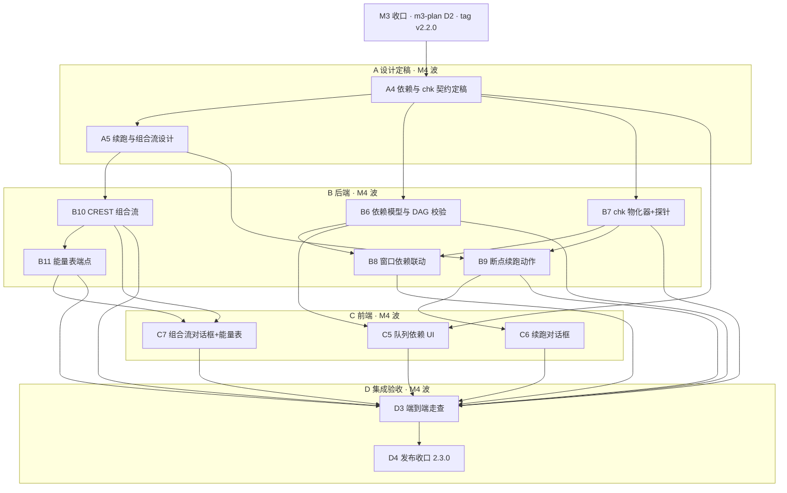
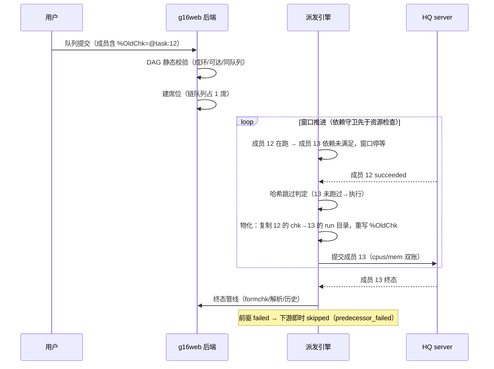
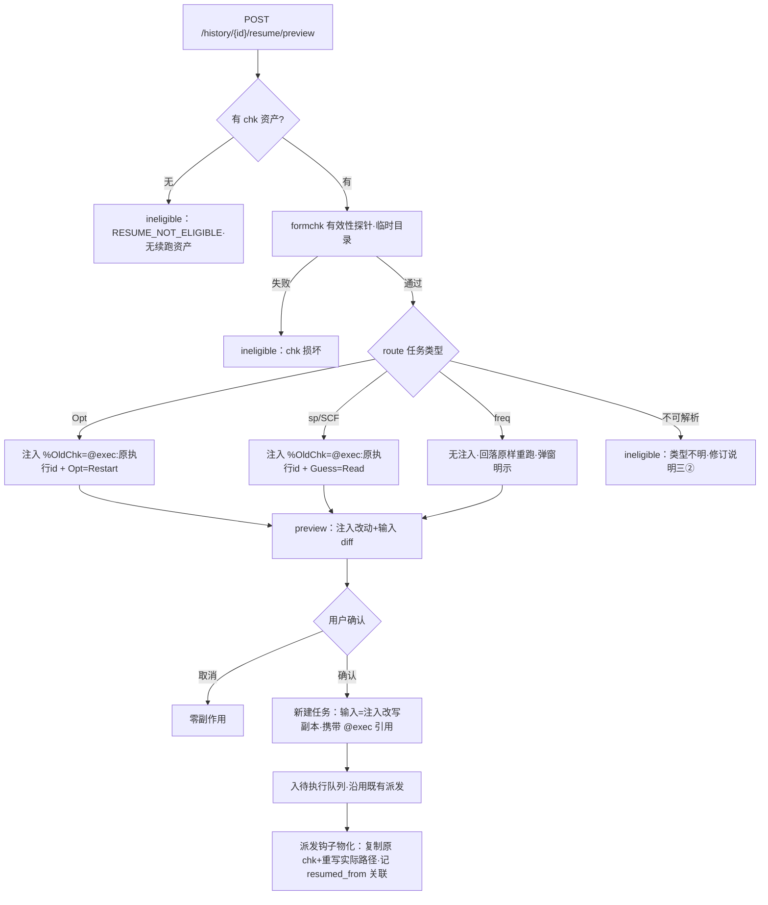
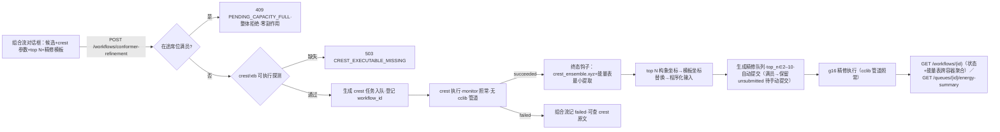

# M4 · 工作流 — 执行计划

> 状态：执行计划（依据 [roadmap.md](../specs/roadmap.md) §3 M4 制定；
> 2026-09-30 由 M3+M4 联合计划拆分而来，拆分缘由与「修订说明一/二/三」
> 回指的解见 [m3-plan.md](m3-plan.md) 头部沿革注记）。目标版本 2.3.0；
> **开工闸门 = M3 收口**（m3-plan D2：tag v2.2.0 落位）——原联合计划
> 「M3 全部收口后才启动 M4」的波次闸门不变。
> §1–§9 结构同 m3-plan。本文与 roadmap 冲突时以 roadmap 为准；契约
> 基线 = M3 收口后的 docs/api/（M3 波新增端点/设置项已落库），M4 新增
> 一律走契约文档 diff（roadmap §4），不漂移既有语义。

## 0. 目标、范围与依据

### 0.1 目标（= roadmap §3 M4 原文定义）

**M4 · 工作流**：任务链（opt→freq→sp 精修）、接入本机已有的 CREST/xtb
（`~/opt/xtb-6.7.1`、`~/opt/crest-3.0.2`）做构象搜索 → Gaussian 精修的组合
流。队列内任务间依赖与 chk 传递在此定稿（roadmap §7.1 建议方案：`%CHK` 符号
引用 + 提交时 DAG 校验 + 运行时物化路径，`%OldChk` 只读接续）。**自我续跑
同源**：failed/外部中断历史条目的「从断点续跑」动作复用同一物化机制——M1
已保全的 chk 先过 formchk 有效性探针，按任务类型注入 `Opt=Restart`（优化）
或 `%OldChk`+`Guess=Read`（SCF 初猜），弹窗展示注入改动与输入 diff，用户确
认后新建续跑任务入队、派发时经同一物化机制在新执行目录物化（freq 无中断
续跑语义，回落原样重跑；时序措辞为修订说明一②裁决，A4 批次回填 roadmap）。

### 0.2 工作项编号（引 roadmap 原文段落顺序，WBS 表「对应项」列引用）

| 编号 | 工作项（roadmap 原文摘要） |
|---|---|
| M4.1 | 任务链（opt→freq→sp 精修），队列内任务间依赖与 chk 传递定稿（关闭 roadmap §7 开放事项 1） |
| M4.2 | 接入本机 CREST/xtb：构象搜索 → Gaussian 精修组合流 |
| M4.3 | `%CHK` 符号引用 + 提交时 DAG 校验 + 运行时物化路径；`%OldChk` 只读接续；依赖与并行窗口联动（依赖未满足者不得进入窗口） |
| M4.4 | 「从断点续跑」动作（复用同一物化机制；formchk 有效性探针；`Opt=Restart` / `%OldChk`+`Guess=Read` 注入矩阵；弹窗 diff 确认；freq 回落原样重跑） |
| M4.5 | 验收能力：一个按钮完成「构象搜索 + top N 构象精修」提交并汇总能量表；一条带 chk 依赖的任务链跑通 |

### 0.3 不做（非目标）

- 通用 crest 日志解析器（仅提取组合流所需的最小数据：构象坐标与能量，见 §2.3）。
- 独立 xtb 单点计算任务类型（xtb 仅作 crest 的引擎；独立 xtb 需求落地时按
  roadmap §2.3 重新评估）。
- 从零新建输入文件的通用编辑器（roadmap §6 backlog；M4 的程序化输入生成
  仅限「模板坐标替换」这一组合流内场景，见 §2.3）。
- 跨队列任务依赖、队列间 chk 引用（roadmap 限定「队列内任务间依赖」）。
- 正则堆领域解析（roadmap §4 禁止事项；crest 最小提取为既定豁免——
  roadmap §1 原则 2）。
- 前端页面单测（roadmap §7 开放事项 5② 决策延续：手动冒烟 + D 阶段走查
  清单，不引入 vitest；M3 同此）。
- 结果分析与可视化（M3 范围，见 [m3-plan.md](m3-plan.md)）。

### 0.4 前置条件（开工闸门）

1. **M3 已收口**（m3-plan D2 完成）：tag v2.2.0 已落、progress.json
   `latest_released_version=2.2.0`、`unreleased` 仅含 scope=docs 的文档
   条目、无代码与契约类条目；M4 开工前把「M4 工作流」登记入
   `in_progress`。A4 契约 diff 以 M3 落库后的契约基线为前提（避免两次
   diff 叠加冲突）。
2. `target/release/hq` 在位（**M4 硬依赖**——触及派发链路，B8/e2e 依赖；
   缺失会静默跳过关键 e2e，违反 AGENTS.md §6.1 第 4 条）；**凡声称「全量
   pytest 通过」时 hq 一律须在位**——既有 e2e 同受其制约，静默跳过即
   通过数虚高（修订说明三⑰）。
3. 真机资产在位（已实测确认）：`~/g16/g16`、`~/g16/formchk`（续跑探针）、
   `~/opt/xtb-6.7.1`、`~/opt/crest-3.0.2`（组合流）；D3 走查需真机 g16
   跑 chk 依赖链与断点续跑场景。
4. A4/A5 两份契约 diff 与设计定稿经用户评审通过（文档先行，roadmap §4）。
5. roadmap §7 开放事项 1（任务间依赖与 chk 规范）随 A4 关闭（§6 进度
   同步含回填动作）。

### 0.5 依据

- roadmap：§2.1（领域模型/派发原则/成员数与只减不增）、§2.6（字段生命
  周期：跨里程碑扩展与历史冻结规则）、§2.7（输入空行规则——程序化输入
  生成沿用）、§3 M4、§5（风险表）、§7.1（任务间依赖与 chk 规范建议）、
  §8.6（journal 恢复语义——重入对账依据）、§8.8（HTTP/SSE 层——对账
  路径）。
- M0–M2 产出：`docs/api/` 契约四件套与 `web/src/`（store/engine/parse/
  services/routers）；M1 对账路径与重跑者识别（HQ job id 映射）。
- M1 遗产（M4 的直接依赖面）：非正常终止 chk/rwf 保全至
  `run/<执行id>/protected/` 并落库 `chk_snapshot`（`finalize.protect`，
  续跑探针的对象）；成功执行保留期内的 `run/<eid>/input.chk`（链式物化
  溯源目标）。
- M3 产出（M4 的直接依赖面）：B1 解析服务与 `run/<id>/analysis.json`
  （能量表 g16 行取末次 SCF 双单位能量）；`HistoryEntry.result_ref` 链路。
- Gaussian 16 官方手册（gaussian-kb MCP 权威核查，2026-09-30）：
  - `%OldChk=file`（gaussian.com/link0）：指定 chk 的内容在本 job step 开始
    时复制为本 step 的 chk——从先前计算取数据而不破坏其 chk，即只读接续的
    原生机制。
  - `Opt=Restart`（gaussian.com/opt）：从 checkpoint 重启几何优化；整个
    route 只需 Opt 关键字 + 原选项 + Restart，无其他输入。
  - `Guess=Read`（gaussian.com/guess）：从 chk 读初猜（常配
    `Geom=Checkpoint`）；`Guess=(Only,Read)` 可仅做种群分析。
  - `formchk`（gaussian.com/utils）：二进制 chk → ASCII fchk；cclib 不解析
    fchk，二进制 chk 也不能直接作 `%Chk` 复用目标之外的格式（M4 探针与
    物化据此设计，见 §2.1/§2.2）。
- CREST 3.0.2 / xtb 6.7.1：本机发行目录与输出格式锚点随 A5 实测核验
  留痕（含 `XTB_PATH` 环境变量拼写与能量表输出单位——修订说明三⑯）。

### 0.6 实施输入：现状核查结论（2026-09-30 实测，M4 视角）

| 事实 | 对计划的影响 |
|---|---|
| `engine/finalize.py`：非正常终止 chk/rwf 保全 `protected/` 并落 `chk_snapshot` | M4 续跑探针的对象即保全 chk（§2.2） |
| Task schema 无依赖字段、历史条目无 `resumed_from` | M4.3/M4.4 契约 diff 一次扩展（roadmap §2.6 规则 3）；存储迁移随 migrations 版本化（§2.2） |
| `~/opt/xtb-6.7.1`、`~/opt/crest-3.0.2` 在位；`~/g16/formchk` 在位 | B10 子进程调用 crest、B7/B9 探针调 formchk；可执行探测缺失时显式拒绝（不静默） |
| 契约基线 = M3 收口后的 docs/api/（M3 波新增 8/9 端点与设置项已落库）；错误码全集载体在 openapi.yaml 文件头（`test_error_codes.py` 静态闸门） | 新增错误码随 A4 diff 登记，闸门自动覆盖 |
| openapi `info.version` 运行时从 `APP_VERSION` 动态覆盖（v2.1.0 SSOT 豁免口径） | 契约 diff 不手工追版本号；2.3.0 发布时随 VERSION/tag 自然演进 |
| `target/release/hq` 在位且 e2e 不回归（M1/M2/M3 既有派发与解析链路） | B6–B8 触及派发链路的回归防线（§9 风险 5） |

## 1. 任务分解与追踪（WBS）

单波：**A4–A5、B6–B11、C5–C7、D3–D4，目标版本 2.3.0**。阶段语义
与 m1/m2 计划一致：**A** 设计定稿（契约 diff，文档先行）→ **B** 后端 →
**C** 前端 → **D** 集成验收与发布。规模：S ≈ 半天内，M ≈ 1 天，L ≈ 2 天。
任务编号 A4/B6–B11/C5–C7/D3–D4 沿联合计划（M3 波见
[m3-plan.md](m3-plan.md)）。

| 编号 | 任务 | 产出物 | 验收标准（可验证） | 依赖 | 规模 | 对应项 |
|---|---|---|---|---|---|---|
| A4 | 任务链依赖与 chk 传递契约定稿（关闭 roadmap §7 开放事项 1） | §2.1 定稿 + 契约 diff（依赖语义、resume 端点、新错误码、mapping 增行） | 符号引用文法与推导规则定稿；DAG 校验规则含成环/可达/跨队列拒绝；与并行窗口、重排、哈希跳过、成员下限的交互逐条写明；用户评审通过 | D2 | L | M4.1/M4.3、roadmap §7.1 |
| A5 | 断点续跑与 CREST 组合流设计定稿 | §2.2/§2.3 定稿（注入矩阵、探针规格、组合流模板、能量表形状、crest 提取边界） | 注入矩阵覆盖 opt/scf/freq 三分支；组合流「一键提交」全链路时序定稿；crest/xtb 定位与配置项定稿；程序化输入生成仅限模板坐标替换 | A4 | L | M4.2/M4.4/M4.5 |
| B6 | 依赖模型与 DAG 校验（后端） | 符号引用解析器 + 提交/编辑时静态校验 + 新错误码落位 | 成环/不可达/跨队列引用/越成员边界引用逐一 422 且错误码正确；`test_error_codes.py` 通过；合法链提交通过 | A4 | M | M4.3 |
| B7 | chk 物化器（含 formchk 探针） | `engine/materialize.py`：派发前物化 %Chk/%OldChk 符号行（复制上游 chk 进本执行目录并重写）+ formchk 探针 | 物化后输入文件内无符号引用残留；上游原件零改动（哈希前后一致）；探针对「正常 chk/损坏 chk/缺 fchk 段」三分支判定正确 | A4 | L | M4.3/M4.4 |
| B8 | 派发窗口依赖联动 | 窗口守卫：依赖未满足成员不取入窗口；依赖失败 → 下游 skipped | FakeGateway 单测：依赖满足前窗口停等不越位（保序语义与资源停等叠加）；上游 failed → 下游 skipped（归因 predecessor_failed）；哈希跳过视为依赖满足且 chk 溯源其最近成功执行 | B6, B7 | M | M4.3 |
| B9 | 「从断点续跑」动作 | POST /history/{id}/resume/preview + POST /history/{id}/resume | 预览返回探针结果 + 注入改动 + 输入 diff；确认后在新执行目录物化并走既有派发；opt 注入 Opt=Restart、单点注入 %OldChk+Guess=Read、freq 回落原样重跑；无保全 chk 或探针失败时 ineligible 且原因明确 | A5, B7 | L | M4.4 |
| B10 | CREST 任务类型与组合流生成 | task_kind 扩展（g16\|crest）+ crest 派发 + ensemble 提取 + top-N 精修队列程序化生成与自动入队 | crest 任务经 HQ 真机跑通（小分子）；ensemble 坐标/能量提取对 crest 3.0.2 输出正确；生成队列成员数=top N、route 来自模板；crest 可执行缺失时提交即拒（显式错误码） | A5 | L | M4.2 |
| B11 | 能量表汇总端点 | GET /queues/{id}/energy-summary | g16 成员能量取自 B1 解析（末次 SCF，附 hartree/eV 双单位）；crest 成员给相对能量；混合队列/部分完成态语义明确 | B10 | M | M4.5 |
| C5 | 队列编辑依赖 UI | 成员行「接续前置 chk」勾选辅助生成符号行 + DAG 错误提示 | 勾选生成的 Link0 行与契约文法一致；DAG 校验错误逐成员内联提示；重排不改 @task:id 引用 | A4, B6 | M | M4.3 |
| C6 | 断点续跑对话框 | 探针结果/注入改动/输入 diff/确认弹窗 | diff 展示与后端 preview 一致；ineligible 展示原因；确认后新执行出现于待执行队列 | B9 | M | M4.4 |
| C7 | 组合流对话框与能量表 | 一键提交对话框（crest 参数/top N/精修模板）+ 队列能量表展示 | 一个按钮完成「构象搜索 + top N 精修」全链路；能量表随成员完成增量刷新 | B10, B11 | M | M4.5 |
| D3 | M4 端到端验收走查（真机） | 走查记录 `docs/plans/m4-acceptance.md`（§7.2 路径逐条留痕，截图存本地不入库） | roadmap M4 验收段对照核验 + §7.2 走查路径逐条通过（含 chk 链、断点续跑、组合流） | B6–B11, C5–C7 | M | M4 验收 |
| D4 | M4 发布收口（2.3.0） | CHANGELOG.jsonl 冻结 + tag v2.3.0 + progress.json 同步 | AGENTS.md §5.2 五步顺序执行；双闸门通过 | D3 | S | AGENTS.md §5.2 |

**依赖关系总览**：`D2→A4→(A5, B6, B7)`（D2 = m3-plan 的 M3 发布收口，
开工闸门见 §0.4）；`A4→C5`；`A5→(B9, B10)`；`B6→B8`；
`B7→(B8, B9)`；`B10→(B11, C7)`；`B11→C7`；`B9→C6`；
`B6–B11/C5–C7→D3→D4`。A4 是本波契约总闸（B6/B7/C5 的文法与校验规则
唯一来源）；B8/B9 同源于 B7 物化器（「自我续跑同源」的工程投影）。

**总工量与关键路径**（2026-09-30 按审查补录，沿 m1/m2 口径；拆分后仅计
本文任务）：总工量 ≈ **17.5 人天**（A4/A5 4 + B6–B11 9 + C5–C7 3 +
D3/D4 1.5）。逻辑关键路径 `A4→A5→B10→B11→C7→D3→D4`（9.5 人天，
组合流链最长——修订说明三③实算更正）；次链 `A5→B9→C6`（8.5），
A4 契约评审为两链共同前置，B9 另受 B7（物化器，与 A5 并行）约束。
单人串行执行时总工期即总工量；B7/B9/B10（L 估算）建议各预留
~20% 缓冲；估算不含 D 阶段走查缺陷 fix 的返工，亦不含决策点 7 分支 b
（改 `crates/` 的 HQ per-job 重试上限）+1~2 人天的 contingency（修订
说明三⑤）。

## 2. 关键设计定稿（A 阶段规格输入）

> 以下为 A4/A5 的定稿基线。标注「建议」的条目为开放决策点
> （§8）的建议值，评审时定案；未标注者为本计划的直接约束。

### 2.1 任务链依赖与 chk 传递（A4 定稿基线，关闭 roadmap §7 开放事项 1）

- **符号引用文法**：Link0 的 `%Chk=` / `%OldChk=` 取值支持 `@task:<id>`
  （id=同队列成员的任务 id）。`@prev` 建议不纳入（提交顺序不构成承诺、
  重排会破坏其语义；如评审坚持保留，则定义为「提交时展开为队首前驱的
  @task:id 糖衣」，重排后不重展开）。
- **依赖推导（单一真相）**：成员的依赖关系**由其 Link0 符号引用自动推导**
  （引用即依赖），不引入独立 depends_on 字段——避免「显式依赖」与「引用
  依赖」两套真相漂移；契约 diff 仅在 Task/输入预览层标注「Link0 含符号引用
  ⇒ 依赖其余成员」的派生语义与校验规则。`%Chk=@task:X`（续用语义）与
  `%OldChk=@task:X`（只读接续）均产生对 X 的依赖边。
- **提交时静态校验（DAG）**：① 引用可达——@task:id 必须是同队列现存成员
  （跨队列、引用已移除成员、自引用一律 422，码 `DEPENDENCY_UNREACHABLE`）；
  ② 依赖图无环（含续用自环），码 `DEPENDENCY_CYCLE`；③ 队列编辑（PATCH）
  同步校验——移除被依赖成员时拒绝（提示先解除下游引用，码沿用
  `DEPENDENCY_UNREACHABLE`，details 注明被谁依赖）；重排不影响 id 引用。
- **运行时物化**：派发某成员前，物化器将其 Link0 符号引用重写为实际路径——
  `%Chk=@task:X`：复制 X 最近一次成功执行的 chk 至本执行目录
  `dep-<taskid>.chk` 并改写 `%Chk=dep-<taskid>.chk`（G16 会重写该文件，复制
  语义保护上游原件——遵循 roadmap §8.6「g16 启动会重写 %CHK」教训）；
  `%OldChk=@task:X`：复制至 `dep-<taskid>.chk`、改写 `%OldChk=`，本任务自身
  `%Chk` 保持默认 `input.chk`。物化完成后输入文件内**零符号残留**；输入哈希
  按物化前的符号形式计算（哈希语义不受物化影响，重跑判定稳定）。
- **chk 溯源**：@task:X 的 chk 来源 = X 最近一次成功（succeeded）执行的
  `run/<eid>/input.chk`（M1 清理边界内的保留期 chk）；X 被哈希跳过时溯源至
  其被沿用的那次历史执行。溯源目标存在性在**提交时静态校验**：X 尚无成功
  执行（待执行/在跑）属正常（依赖满足时必然有产出），放行；X 已有成功记录
  但其 chk 已被清理 → 提交拒绝（码 `CHK_SOURCE_MISSING`，details 注明缺失
  的执行 id，提示「重跑上游或经『从断点续跑』恢复」）——避免明知物化必败
  的提交。运行时物化失败（如期间被并发清理）→ 该成员 failed，归因沿用
  `program_error`（归因枚举为 M0 定稿不扩），details 注明
  `chk_materialization`（§8 决策点 3）。
- **重入语义（HQ 隐式重跑 × 物化副作用，§8 决策点 7）**：`%Chk=@task:X`
  （续用形态）的物化产物 `dep-<taskid>.chk` 是本任务的 %Chk 目标、会被
  G16 运行中重写；而 HQ 的隐式重跑（worker 失联按 crash_limit 自动重排、
  journal 恢复重提交，roadmap §8.6）**不经派发器物化钩子**——二次尝试
  将以被污染的 chk 为起点。定稿：① 凡输入含物化依赖（`@task:`/`@exec:`
  任一形态）的执行，提交 HQ 时**禁用内部重试**（worker 失联即终态
  failed、按既有归因落历史；重跑由用户显式发起、经派发器重新物化）；
  ② g16web 对账识别到 journal 恢复重跑者中含物化依赖的执行时，取消该
  HQ job、以新执行 id 重新物化派发（复用 M1 对账路径与重跑者识别）。
  crash_limit 旋钮粒度（per-job 可设否；无则按 ADR 0001 于提交路径加
  覆盖）与 `%OldChk` 只读形态是否一并适用，为 A4 实测核验与评审项。
- **与并行窗口联动**：依赖未满足（任一前驱未到 succeeded 终态）的成员**不
  取入窗口**——窗口守卫在资源检查之前（roadmap §7.1「依赖未满足者不得进入
  窗口」）；前驱 failed → 下游即时记 skipped（归因 `predecessor_failed`，
  既有语义复用）。窗口停等属显式接受语义，与资源停等叠加时先判依赖。
- **与其他边界交互**：成员数 2–10 仅创建时校验、只减不增、至少保留 1 个
  （roadmap §2.1 不变）；待执行席位语义不变（链队列仍占 1 席）；历史「重新排队」
  为单任务席位重跑、不建立下游依赖语义，但原输入若含 `@task:<id>` 引用则
  须按原任务 id 重新解析——单任务席位**禁止** `@task:<id>` 文法（限定
  队列内成员间；非队列载体提交时校验拒绝），原输入含引用者经「重新排队」
  将被此校验拒绝，引导改用「从断点续跑」或先重建队列。
  **`@exec:<执行id>` 为 resume 专用文法变体**（§2.2）：仅由断点续跑生成的
  新任务携带，指向单条终态执行的历史 chk 资产、不受「同队列」限制；静态
  校验要求该执行存在、已终态、chk 溯源存在（探针已保证）——随 A4 契约
  diff 一并定稿。
- **契约 diff**：openapi（Queue/Task 描述与校验规则、符号引用文法含
  `@task:<id>`/`@exec:<执行id>` 两形态及其载体约束、resume 端点与历史条目
  `resumed_from`（落库）+ `resumed_by`（派生只读、不入存储）关联字段见
  §2.2（修订说明三⑧）、能量表与 workflow 查询端点（含 `GET /workflows`
  列表，修订说明三⑦）见 §2.3、
  新错误码 `DEPENDENCY_CYCLE`/`DEPENDENCY_UNREACHABLE`/`RESUME_NOT_ELIGIBLE`/
  `CHK_SOURCE_MISSING`/`WORKFLOW_STATE_INVALID`/`CREST_EXECUTABLE_MISSING`
  ——每码均须在正文有触发场景承载）+ mapping.md + sse.md 无新增事件说明。
  M0 契约的「多步任务（--Link1--）导入拒绝」语义不变（任务链以队列表达，
  不引入单文件多步）。

### 2.2 「从断点续跑」动作（A5 定稿基线，M4.4）

- **入口**：历史页 failed 条目（归因=程序报错/外部中断，手动停止亦可）
  增「从断点续跑」动作，两段式：`POST /history/{id}/resume/preview`（无副作用）
  → 前端弹窗 → `POST /history/{id}/resume`（**新建任务**并入待执行队列，
  沿用既有派发/核验链路；任务身份见下）。
- **探针**：优先取 `chk_snapshot.location=protected` 的保全 chk；无保全但
  该任务存在成功执行记录者取最近成功执行的 `input.chk`；两者皆无 ⇒
  ineligible。探针 = 对该 chk 跑 `<g16_root>/formchk`（临时目录），formchk
  成功且 fchk 可读 ⇒ 有效；超时沿用 finalize 同款 120s，超时按探针失败
  处理（修订说明二）。探针失败/无 chk/route 不可解析 ⇒ `ineligible`
  （preview **恒 200**、以 `eligible=false` + reason 表达；`POST resume`
  对 ineligible 条目 422 `RESUME_NOT_ELIGIBLE`——修订说明三⑮。原因
  **四态**：无续跑资产/chk 损坏/探针超时/类型不明——修订说明三②）。
- **route 判定规则**（修订说明三②定稿；复用 M0 契约输入分块解析器取
  route 节文本，大小写不敏感，不另写解析——roadmap §4 禁正则领域解析）：
  ① route 含 `Opt`（含 QST2/QST3/TS/Restart 等一切变体）→ 优化行——
  **Opt 与 Freq 并存（`opt freq` 组合）同样归优化行**（此类任务中断几乎
  必然发生在优化段、chk 内即优化轨迹状态，Restart 恢复最上游未完成段、
  优化收敛后 freq 段自然执行）；② 不含 Opt 但含 `Freq` → freq 行；
  ③ 其余（sp/能量类）→ 单点行；④ route 缺失或不可解析 → ineligible
  （类型不明）。「组合任务中断点已过优化段」的边缘（Opt=Restart 遇已
  完成优化）列为 A5 真机核验项。
- **注入矩阵**（与 roadmap M4.4 逐字对齐；chk 来源以 `@exec:<原执行id>`
  符号引用表达，物化随派发钩子执行——文法与校验见 §2.1）：

| 任务类型（route 判定） | 注入 | 说明 |
|---|---|---|
| 优化（route 含 Opt） | Link0 追加 `%OldChk=@exec:<原执行id>` + route 改写为 `Opt=Restart` + 原选项 | 本任务 chk 自原 chk 复制（%OldChk 只读接续），Restart 读取并继续优化；整个 route 仅 Opt 关键字与其原选项 + Restart（G16 手册 Opt=Restart 语义） |
| 非优化 SCF（sp 等） | Link0 追加 `%OldChk=@exec:<原执行id>` + route 追加 `Guess=Read` | 只读接续做初猜；本任务 chk 为新 input.chk |
| freq | 无注入 | freq 无中断续跑语义，**回落原样重跑**（弹窗明示；不建立 @exec 引用；实现经 resume 链路新建任务以保留 resumed_from 关联——与历史页既有「重新排队」语义等价、并存） |

- **任务身份与关联**（2026-09-30 裁决，修订说明一②）：resume **新建任务**
  （新 task id + 新输入副本，副本内容 = 注入改写后的文本），并以两层关联
  指向原执行：① 输入层——`%OldChk=@exec:<原执行id>` 符号引用（物化链的
  技术关联）；② 记录层——新执行的历史条目记 `resumed_from: {task_id,
  execution_id}`，前端在新建任务详情与原历史详情双向展示「续跑自 #NNN」/
  「已续跑 → #MMM」（可读关联）。物化链路：confirm → 新建任务（改写输入
  副本）入队 → 派发时经 B7 物化钩子在 `run/<新eid>/` 复制原 chk、重写
  `%OldChk` 为实际路径 → 正常派发（与链式 `@task:` 引用共用同一物化器
  ——「自我续跑同源」的工程落点）。原历史条目**零 schema 变更**——
  「已续跑 → #MMM」由响应时按 `resumed_from` 反查的
  `resumed_by: [execution_id]` **派生只读字段**承载（不落库、不违反
  roadmap §2.6 规则 2 的冻结语义；与 `resumed_from` 随 A4 契约 diff
  一次定义——修订说明三⑧）。存储落位：新条目侧为历史表加列
  `resumed_from`（可空 TEXT JSON，与契约对象形状一一对应），随
  `web/src/store/migrations.py` 版本化迁移幂等落库（修订说明三⑥）。
- **弹窗与确认**：preview 载荷 = `{eligible, probe:{formchk_ok, reason},
  injections:[{type, link0_lines?, route_lines?}], input_diff}`（diff 为统一
  diff 文本，展示注入改动前后全文）；用户确认后按上述链路创建并派发；
  **零副作用前置**（取消即终止，不落任何记录）。续跑执行不受哈希跳过约束
  （新任务首次执行无哈希记录、天然不触发；显式动作即强制重跑，§8 决策点 4）。

### 2.3 CREST/xtb 组合流与能量表（A5 定稿基线，M4.2/M4.5）

- **任务类型**：Task 增 `kind: g16 | crest`（契约 diff，随 A4 一次性扩展）。
  crest 任务：HQ 提交 program=crest 可执行、cwd=`run/<执行id>/`、环境设
  `XTB_PATH` 指向 `~/opt/xtb-6.7.1/bin`（**环境变量拼写与生效方式为 A5
  实测核验项**——连同 crest 输出锚点一并核验留痕）；资源声明取组合流参数
  （核数默认 `link0_default_nproc`、HQ 请求仅 cpus）；**不进 cclib 管道、
  无增量进度解析**（execution.monitor 照常，execution.progress 不适用——
  在 sse.md 该事件行补注 crest 不适用，非事件结构变更）。
- **组合流（一键提交）**：`POST /workflows/conformer-refinement`，载荷
  `{candidate_id, crest: {nproc, top_n}, template: {route, link0?}}`：
  - 载荷语义：`candidate_id` 提供电荷/多重度与分子说明节框架（候选输入
    副本）；`template.route/link0` 为精修 route 与可选 Link0（坐标由
    top-N 构象替换注入）；crest 引导模板为本仓库内置模板（非通用编辑器）。
  - 提交前置检查（顺序：可执行探测 → 在途席位满员 → 候选形态与 top_n
    ——修订说明三④）：席位满员 → 409 `PENDING_CAPACITY_FULL`，组合流
    **整体拒绝、零副作用**（不建 workflow 记录、不生成 crest 任务），
    前端提示与行内提交满员同文案——与普通提交同待遇、不设特权绕过；
    来源候选须仍在候选形态，否则 422 `WORKFLOW_STATE_INVALID`
    （details 注明当前形态）；`top_n ∈ [2, 10]`（对齐队列成员数下限与
    上限，越界 422 `VALIDATION_FAILED`）。
  - 流程：① 生成 crest 任务（输入=候选输入副本的分子坐标引导文件，程序化
    生成）→ 入待执行队列；② 执行记录登记 `workflow_id`（SQLite 组合流
    记录：来源候选、crest 执行、状态、精修队列 id）；③ crest succeeded
    终态钩子提取 `crest_ensemble.xyz` 与输出中的构象能量表（**最小提取器**：
    文件级锚点解析，锁 crest 3.0.2 实测格式，不做通用 crest 日志解析）；
    ④ 取 top N 构象坐标，对模板输入做「分子说明节坐标替换」程序化生成
    N 个 g16 成员输入 → 生成精修队列（成员数 N=top_n）→ **自动提交**
    （验收「一个按钮」语义）。
  - 自动提交的失败路径：在途席位满员时**队列保留为已保存（unsubmitted）**
    并在 workflow 状态中记录 `refine_queue_pending`，前端提示「精修队列已
    生成、席位满员未自动提交，可在队列页手动提交」；crest 阶段失败不生成
    精修队列（§3.4），workflow 记 failed、crest 原文可查。成功后的失败
    回退仍走既有队列回退机制（§8 决策点 2）。
- **定位与配置**：运行级设置新增 `crest_root`（默认 `~/opt/crest-3.0.2`）、
  `xtb_root`（默认 `~/opt/xtb-6.7.1`）（生效边界=new_submissions 通则；
  A4 契约 diff 随 SettingItem 目录登记）。可执行探测失败 → 提交即拒
  （`CREST_EXECUTABLE_MISSING`，显式不静默）。
- **能量表与 workflow 查询**（2026-09-30 裁决，修订说明一①）：
  - `GET /queues/{id}/energy-summary`（队列维度）→
    `{rows: [{task_id, kind, state, method?, energy_hartree?, energy_eV?,
    relative_kJ_mol?, source}]}`——g16 成员取 B1 解析的末次 SCF 能量；
    crest 成员取 ensemble 相对能量；`relative_kJ_mol` 以**该查询范围内最低
    能量**为零点（crest 侧换算系数随 A5 实测定档——修订说明三⑯）；部分完成态照常返回已完成行（前端增量刷新）。
  - `GET /workflows/{id}`（**新增端点**，组合流单点数据源）→
    `{workflow_id, source_candidate_id, state, crest_execution_id,
    refine_queue_id, refine_queue_pending, created_at, updated_at,
    energy_summary: <上述 rows，跨容器聚合>}`——状态供 C7 进度展示
    （crest 执行与精修队列经既有 SSE 事件驱动前端刷新后再拉此端点）；
    `energy_summary` 由**后端聚合** crest 行 + 精修队列行（零点是聚合范围
    内最低能量）；无 combo 需求的队列能量表直接走 `/queues/{id}/energy-summary`。
    端点随 A4 契约 diff 登记（mapping 增行）。
  - `POST /workflows/conformer-refinement` 响应（与既有提交端点同形，
    200）：`{workflow_id, state, crest_execution_id?}`——前端由此取得
    id 打开进度面板（修订说明三⑦）。
  - `GET /workflows?limit=20`（**新增列表端点**，只读）→
    `{workflows: [<GET /workflows/{id} 同形响应>…]}`，按 `updated_at`
    倒序——页面刷新后找回组合流、`refine_queue_pending` 满员提示回看的
    恢复路径（单机同时进行的组合流几乎恒 0~1 个，一个只读列表端点为
    最短路径——修订说明三⑦）；随 A4 契约 diff 登记（mapping 增行）。

## 3. 任务流程图

### 3.1 阶段与任务依赖（WBS 全景）

要点：以 M3 收口（m3-plan D2，tag v2.2.0）为闸门整体启动；A4 是本波的
契约总闸（B6/B7/C5 的文法与校验规则唯一来源，含 @exec 文法与 resume
关联字段）；B8/B9 同源于 B7 物化器（「自我续跑同源」的工程投影）；B9
的注入矩阵规格来自 A5（图边 A5→B9）；B10→B11→C7 为组合流纵向链
（B11 含 `GET /workflows/{id}` 与列表查询端点）。

### 3.2 M4 任务链派发与 chk 物化时序（依赖联动）

### 3.3 断点续跑决策流（M4.4，与 §3.2 同源物化）

### 3.4 CREST 组合流时序（M4.2/M4.5）

## 4. 逐任务执行方案

> 每任务四要素：**步骤**（动手顺序）、**技术要求**（硬约束）、**质量标准**
> （可验证判据）、**交付物**（落库物）。公共纪律不重复写：文档先行、
> 全量 `uv run pytest` + 四校验脚本过闸、hq 产物在位（M4 派发相关）、
> 契约生成物随 diff 再生（gen:types 零 diff）、契约 diff 涉及新存储
> 字段者对应 SQLite 迁移随该批次落库（幂等、版本化，migrations 机制
> ——修订说明三⑥）。

### 4.1 A4 · 依赖与 chk 契约定稿

- 步骤：① 按 §2.1 起草契约 diff（符号引用文法含 `@task:<id>`/`@exec:<执行id>`
  两形态与载体约束、派生依赖、DAG 校验、窗口联动、错误码六枚——每码
  须有正文触发场景承载、SettingItem 增 crest_root/xtb_root、resume 端点
  与历史条目 `resumed_from` 关联字段、`GET /workflows/{id}` 与
  energy-summary 端点、Task.kind）；②
  与 roadmap §2.1 及本计划 §2.1/§2.3 交互项走查（重排/哈希跳过/重新排队/成员下限/清理边界/
  单任务席位引用禁止逐条）；③ 评审（此项即 roadmap §7 开放事项 1 的关闭
  动作，关闭后回填 roadmap）。
- 质量标准：交互矩阵（依赖 × 重排 × 跳过 × 回退 × 删除）逐格有结论——
  含「上游重跑后下游哈希跳过是否传导」专项裁决（建议：哈希跳过判定纳入
  直接前驱的溯源执行 id，前驱新执行即视依赖已变、下游重跑；随评审定案）；
  用户评审通过。
- 交付物：契约 diff + roadmap §7.1 状态更新。

### 4.2 A5 · 续跑与组合流设计定稿

- 步骤：① 注入矩阵定稿（§2.2，逐任务类型 diff 形状 + 任务身份与
  `@exec`/`resumed_from` 两层关联链路）；② 组合流时序与 workflow
  记录/查询模型定稿（§2.3，含 `GET /workflows/{id}` 响应形状与能量表
  聚合主体）；③ crest 提取器锚点清单 + `XTB_PATH` 环境变量拼写与生效
  方式 + crest 3.0.2 能量表**输出单位实测**（其输出惯不以 kJ/mol 计，
  换算系数随锚点一并核验留痕——修订说明三⑯）——均对 crest 3.0.2 实测
  输出核验；④ 能量表数据形状定稿；⑤ 程序化
  输入生成的模板与坐标替换规则定稿（沿用 roadmap §2.7 空行规约——模板重组经
  既有 verify_and_normalize）。
- 质量标准：crest 真机输出实测锚点与 XTB_PATH 核验留痕；评审通过。
- 交付物：本节定稿回填 + crest 样例输出留存 fixtures（小文件）。

### 4.3 B6 · 依赖模型与 DAG 校验

- 步骤：① Link0 符号引用解析器（%Chk/%OldChk 值文法）；② 提交核验链
  （verify_and_normalize 后）追加依赖校验段；③ 队列 PATCH 校验（移除被
  依赖成员拒绝）；④ 错误码落位与契约测试。
- 技术要求：校验在提交事务内、先于席位创建；details 携带环/不可达明细。
- 质量标准：场景矩阵单测（合法链、环、自环、跨队、悬引用、移除被依赖者）
  全绿；`test_error_codes.py` 通过。
- 交付物：校验模块 + 测试。

### 4.4 B7 · chk 物化器与探针

- 步骤：① 物化器（§2.1：复制上游 chk → 重写符号行 → 校验零残留）；②
  溯源（最近成功执行 → 哈希跳过沿用执行）；③ formchk 探针（临时目录、
  复用 finalize 的 formchk 调用模式）；④ 与派发器接线（派发前物化钩子）。
- 技术要求：上游原件哈希前后零改动；物化失败 = failed(program_error,
  details.chk_materialization)；哈希按符号形式预计算。
- 质量标准：FakeGateway 单测（物化后输入内容断言、上游零改动、缺源失败
  分支）；真机小链路（opt→sp）冒烟；重入①断言——含物化依赖执行的 HQ
  提交禁用内部重试（提交参数断言，§2.1 重入语义/修订说明二）。
- 交付物：engine/materialize.py + 测试。

### 4.5 B8 · 窗口依赖联动

- 步骤：① 窗口守卫（依赖检查先于资源检查，保序不越位不变）；② skipped
  联动（前驱 failed → 下游即时 skipped）；③ 事件时序对照 sse.md §3
  （task.status 语义复用，无新事件）。
- 技术要求：依赖满足判定含哈希跳过成员（视为已满足）；「依赖未满足停等」
  与「资源不足停等」并存时的优先序与可观测性（执行中页原因标注，C5/C7
  范围外、后端先落）。
- 质量标准：FakeGateway 场景单测（依赖停等不越位、失败联动 skipped、跳过
  溯源物化）全绿；重入②断言——对账识别 journal 重跑者中含物化依赖的执行
  时取消 HQ job 并以新执行 id 重新物化派发（§2.1 重入语义/修订说明二）；
  hq 产物在位跑 e2e。
- 交付物：派发器守卫 + 测试。

### 4.6 B9 · 断点续跑动作

- 步骤：① preview 端点（探针+注入矩阵+diff 生成，无副作用）；② confirm
  端点（**新建任务**：输入副本=注入改写文本、Link0 携带
  `%OldChk=@exec:<原执行id>`、历史条目记 `resumed_from` 关联【历史表
  加列 `resumed_from`（可空 TEXT JSON），随 migrations 版本化迁移幂等
  落库——修订说明三⑥】、入队——
  物化随派发钩子即 B7 物化器，不提前复制）；③ M1 保全 chk
  （protected/）与最近成功执行 input.chk 两条取数路径；④ freq 回落分支
  （无注入、原样重跑、保留 resumed_from 关联）。
- 技术要求：注入矩阵与 §2.2 逐字一致（route 判定按 §2.2 规则：含 Opt
  即优化行、Opt+Freq 并存归优化——修订说明三②）；resume 不改动原历史条目（新任务
  新执行 id，历史不可变；原条目「已续跑」走 `resumed_by` 派生只读，
  §2.2）；`@exec` 文法静态校验随 B6 校验链落位；
  ineligible 四态（无资产/chk 损坏/探针超时/类型不明）原因明确，preview
  恒 200、resume 422（修订说明三⑮）。
- 质量标准：真机强停 opt → 探针 → Opt=Restart 续跑成功走查（D3 留痕，
  含新任务与「续跑自」双向展示）；单测覆盖注入矩阵三分支、ineligible
  四态与 HTTP 语义（preview 200 / resume 422）、
  `resumed_from` 落库与物化链复用（与 B7 共用物化器的断言）。
- 交付物：resume 端点对 + 测试。

### 4.7 B10 · CREST 组合流

- 步骤：① Task.kind 扩展与派发适配（crest 程序、cwd、`XTB_PATH` 环境、
  资源声明）；② workflow 记录表（随 migrations 版本化新建——修订说明
  三⑥）；③ 组合流端点（提交前置检查按 §2.3 顺序：可执行探测 → 在途
  席位满员 409 `PENDING_CAPACITY_FULL` 整体拒绝零副作用（修订说明三④）
  → 来源候选形态校验 `WORKFLOW_STATE_INVALID`；`top_n ∈ [2,10]`
  校验）；④ ensemble 最小提取器（锚点解析 crest_ensemble.xyz + 能量表，
  crest 3.0.2 实测核验）；⑤ top-N 程序化输入生成与精修队列自动提交
  （满员时保留 unsubmitted + workflow 记 `refine_queue_pending`）。
- 技术要求：crest 可执行探测缺失提交即拒（503 `CREST_EXECUTABLE_MISSING`）；
  程序化生成输入必过既有提交核验（空行规约复用，不绕行）；crest 成员
  不进 cclib 管道。
- 质量标准：真机小分子（如甲醇）crest 任务跑通、top-2 精修队列自动生成
  并执行（D3 留痕）；满员失败路径单测（保留 unsubmitted + 前端提示）；
  提取器单测以留存样例喂入。
- 交付物：workflow 模块 + 提取器 + 端点 + 测试。

### 4.8 B11 · 能量表汇总与 workflow 查询端点

- 步骤：① 队列汇总查询（队列成员 × kind × 解析结果/ensemble 能量）；②
  `GET /workflows/{id}`（状态 + `energy_summary` 跨容器后端聚合——crest
  执行行 + 精修队列行，修订说明一①）与 `GET /workflows?limit=20` 列表
  端点（按 `updated_at` 倒序、复用单点同形响应——刷新恢复路径，修订
  说明三⑦）；③ `relative_kJ_mol` 零点计算
  （查询范围内最低能量）；④ 部分完成态语义；⑤ 契约测试。
- 技术要求：单位换算单点（hartree↔eV↔kJ/mol）与 B1 双单位一致；crest 行
  source 标注 ensemble；聚合在后端完成（前端不拼两段数据）。
- 质量标准：混合队列（crest+g16）汇总单测；workflow 单点与列表端点状态
  与聚合单测（修订说明三⑦）；缺失成员行为明确。
- 交付物：端点对 + 测试。

### 4.9 C5/C6/C7 · M4 前端

- C5（依赖 UI）：成员行「接续前置 chk」勾选 → 生成/移除 `%OldChk=@task:id`
  行；DAG 错误内联提示；重排不改 id 引用。质量：生成行与文法一致单测
  （前端无单测框架，走 D3 手动走查清单）。
- C6（续跑对话框）：preview 载荷渲染（探针结果/注入列表/diff 文本）、
  ineligible 原因展示、确认/取消两态；确认后提示「已创建续跑任务 #NNN
  （源自 #MMM）」，历史详情展示「续跑自 / 已续跑」双向关联
  （resumed_from）。质量：diff 展示与后端逐字一致、关联展示可辨
  （D3 走查）。
- C7（组合流对话框+能量表）：参数表单（crest nproc / top N∈[2,10] /
  精修模板路由）、提交后经 `GET /workflows/{id}` 展示进度（crest 执行与
  精修队列经既有 SSE 事件驱动刷新后再拉端点）、能量表增量刷新；页面
  刷新后经 `GET /workflows` 列表恢复进度面板（修订说明三⑦）；自动
  提交失败（满员）提示「精修队列已生成、未自动提交，可手动提交」。
  质量：一个按钮全链路 D3 留痕。

### 4.10 D3/D4 · M4 走查与发布

- D3：按 §7.2 走查路径清单真机走查（含 chk 链、断点续跑、组合流与能量表；
  GUI 经 Playwright 黑盒驱动），走查记录落 `docs/plans/m4-acceptance.md`
  （体例同 m3-plan D1；截图存本地不入库）；对照 roadmap M4 验收段核验。
- D4：AGENTS.md §5.2 五步执行（2.3.0；不推送远端，授权另请）。

## 5. 测试矩阵（先测试后实现）

| 测试文件（拟） | 覆盖 | 关键用例 | 类型 |
|---|---|---|---|
| test_dependencies.py | B6 | 合法链/环/自环/跨队/悬引用/PATCH 移除被依赖成员 | 单元+契约 |
| test_materialize.py | B7 | 物化重写内容断言；上游零改动；缺源失败归因；探针三分支；重入①提交参数（禁用 HQ 重试） | 单元 |
| test_dispatch_deps.py | B8 | 依赖停等不越位；前驱失败→skipped；哈希跳过溯源物化；依赖+资源双停等叠加；重入②journal 重跑者取消+重新物化派发 | 单元（FakeGateway） |
| test_resume.py | B9 | 注入矩阵三分支（`@exec` 引用与 Opt=Restart/%OldChk 形态）；ineligible 四态与 HTTP 语义（preview 200 / resume 422——修订说明三⑮）；新建任务身份与 `resumed_from` 落库；物化链复用（与 B7 同器断言）；原历史条目不可变（`resumed_by` 派生只读） | 单元+集成 |
| test_workflow_crest.py | B10/B11 | 可执行缺失 503；提交席位满员 409 零副作用（无 workflow 行——修订说明三④）；来源候选形态校验（WORKFLOW_STATE_INVALID）；`top_n∈[2,10]`；提取器样例回归；top-N 队列生成与自动提交（含满员保留 unsubmitted）；workflow 单点与列表端点状态与聚合；能量表混合聚合与换算 | 单元+契约 |
| test_e2e_m4.py | D3 | chk 链、断点续跑、组合流（真机段走查留痕） | e2e |
| 既有回归 | 全程 | `test_error_codes.py`、`test_openapi_ssot.py`、`gen:types` 零 diff、`test_e2e_fake_g16.py` 不回归 | 闸门 |

说明：真机依赖（crest/真 g16/真机 hq）缺失时 skip 必须显式带
reason（`-rs` 可见）；hq 产物缺失静默跳过的既有教训（AGENTS.md §6.1 第 4 条）不得
在新增测试重演——M4 派发类用例开工前先核 `target/release/hq`。

## 6. 提交序列与进度同步

遵守 conventional_commits（单类变更/提交，文档→测试→实现→进度同步；
测试与实现同提交——m1/m2 口径）。**定稿提交表**（13 项，含 2.3.0 发布；
每项随行一笔 chore(progress) 登记提交、不另占编号——m2 实践口径；
D3 的随查随修 fix 一缺陷一提交、另计。M3 波的 15 项提交见 m3-plan §6）：

| # | 提交（type: 摘要） | 内容 |
|---|---|---|
| 1 | docs(api): A4 依赖与 chk 契约 diff | 文法（@task/@exec）/resumed_from/resumed_by/workflow 端点/错误码/SettingItem |
| 2 | docs(plans): A5 续跑与组合流设计定稿回填 | §2.2/§2.3 评审修订（如有） |
| 3 | feat(web): B6 依赖模型与 DAG 校验 | + 测试 |
| 4 | feat(web): B7 chk 物化器与探针 | + 测试 |
| 5 | feat(web): B8 窗口依赖联动 | + FakeGateway 单测 |
| 6 | feat(web): B9 断点续跑动作 | 新任务 + @exec + resumed_from + 测试 |
| 7 | feat(web): B10 CREST 组合流 | workflow 模块 + 提取器 + 测试 |
| 8 | feat(web): B11 能量表汇总与 workflow 查询 | + 测试 |
| 9 | feat(frontend): C5 队列依赖 UI | |
| 10 | feat(frontend): C6 续跑对话框 | |
| 11 | feat(frontend): C7 组合流对话框与能量表 | |
| 12 | docs(plans): D3 走查记录 | `docs/plans/m4-acceptance.md`（+ 随查随修 fix 另计） |
| 13 | chore(release): 2.3.0 冻结五步 | CHANGELOG/progress/tag |

说明：A5 定稿若无评审修订，第 2 项可并入相邻文档提交；D4
发布五步按 AGENTS.md §5.2 独立提交（上表 13）。若决策点 7 裁决走
分支 b（HQ per-job 重试上限需改 `crates/`），于 #4（B7）前插入独立批次
`feat(hq): 提交参数支持 per-job 重试上限`（闸门含 `cargo test` 与重建
hq，修订说明三⑤）。

**进度同步**：每完成一项上表提交即向 CHANGELOG.jsonl unreleased 行与
progress.json unreleased 追加摘要（AGENTS.md §九 约定，不 deferred）；
每个 A 批次关闭时回填 roadmap（§7 开放事项 1 状态、§8.8 备忘如涉及）；
M4 开工时把 in_progress 置为 M4。回填登记
一项（修订说明三⑩）：A4 批次关闭时同步校正 roadmap M4 段「用户
确认后在新执行目录物化」措辞为「确认后新建续跑任务入队、**派发时**经
同一物化机制在新执行目录物化」（修订说明一②裁决的时序措辞）。

**闸门清单**（提交前逐项）：`uv run pytest`（全量）、
`scripts/validate_progress.py`、`scripts/check_tokens.py`、
`scripts/check_contrast.py`、`scripts/gen_changelog_md.py --check`、
`npm run build`（vue-tsc 零错误，前端改动批次）、
`scripts/audit_frontend_offline.sh`（前端批次与 D3 收口——修订说明
三⑭统一口径）、`npm run gen:types` 零
diff（契约批次）、`target/release/hq` 在位（**M4 硬依赖**——触及派发
链路；凡声称「全量 pytest 通过」时一律适用，静默跳过即通过数
虚高，修订说明三⑰）、`cargo test` 全绿 + 重建 hq（仅当批次触及
`crates/`，修订说明三⑤）。

## 7. 验收标准（DoD）

### 7.1 M4 DoD

1. 一个按钮完成「构象搜索 + top N 构象精修」：crest 任务执行 → top N
   精修队列自动生成并提交（满员时保留未提交并提示）→ 能量表（crest 相对
   能量 + 精修能量，相对 kJ/mol，经 `GET /workflows/{id}` **后端跨容器
   聚合**）可查、增量刷新。
2. 一条三段带 chk 依赖的任务链（opt→freq→sp，对齐 roadmap M4.1 原文；
   freq 与 sp 各以 %OldChk=@task: 引用直接前驱——修订说明二）跑通：
   依赖未满足期间窗口停等可见；逐级物化执行成功；上游 chk 原件零改动。
3. 依赖校验：成环/悬引用/跨队列引用/单任务席位引用提交被拒且错误码
   正确；移除被依赖成员被拒绝；溯源 chk 已清理时提交拒绝
   （`CHK_SOURCE_MISSING`）。
4. 断点续跑：真机强停一个 opt → 历史条目「从断点续跑」→ 弹窗展示探针
   结果/注入改动/输入 diff → 确认后**新建续跑任务**以 Opt=Restart 跑通，
   新任务可查「续跑自 #MMM」、原条目显示「已续跑」（resumed_from 双向
   关联）；sp 场景走 %OldChk+Guess=Read；freq 场景回落原样重跑且弹窗
   明示；ineligible 场景（无保全 chk）原因明确。
5. 派发联动：前驱失败 → 下游 skipped（predecessor_failed）；哈希跳过成员
   的 chk 可被下游溯源物化；上游重跑后下游按 A4 裁决语义（溯源执行 id
   变化即视依赖已变）重跑。
6. crest/xtb 可执行缺失时组合流提交显式 503。
7. 全量测试与全部闸门脚本通过（含 hq 产物在位、offline 审计与
   `npm run build`）。
8. 工作项销号：§0.2 的 M4.1–M4.5 逐项打勾（对应任务验收物留痕）。
9. 2.3.0 冻结五步完成、tag v2.3.0 本地落位；roadmap §7 开放事项 1 关闭
   回填。

### 7.2 M4 D3 走查路径清单（同体例；记录落 `docs/plans/m4-acceptance.md`）

1. **依赖链（三段，对齐 roadmap M4.1 原文——修订说明二）**：队列 [opt,   freq（%OldChk=@task:opt）, sp（%OldChk=@task:freq）] 提交 → 断言 opt
   在跑时后继窗口停等可见（执行中页原因标注）；逐级 succeeded → 逐级
   物化执行成功；上游 chk 原件哈希前后一致。
2. **依赖校验**：环/自环/悬引用/跨队列/单任务席位引用逐例 422 + 错误码；   PATCH 移除被依赖成员拒绝；溯源 chk 清理后重提交 `CHK_SOURCE_MISSING`。
3. **失败联动**：opt 失败（fake 注入）→ sp 即时 skipped   （predecessor_failed）+ 队列回退归因可见。
4. **哈希跳过溯源**：上游成功未变 + 下游依赖 → 重提交后下游物化使用上游   被沿用的历史 chk；上游重跑（新执行 id）→ 下游重跑（A4 裁决语义）。
5. **断点续跑 opt**：真机强停 opt → resume preview（探针/注入 diff）→   确认 → 新任务「续跑自」双向关联可见 → Opt=Restart 跑通。
6. **续跑 sp 与 freq**：sp 场景 %OldChk+Guess=Read 跑通；freq 场景弹窗   明示回落原样重跑；ineligible（无资产/探针失败）原因明确。
7. **组合流**：crest 真机小分子（甲醇）一键提交 → crest 执行 → top-2   精修队列自动生成并提交 → `GET /workflows/{id}` 进度与能量表（相对
   kJ/mol）可查、增量刷新、页面刷新后经 `GET /workflows` 列表恢复进度
   面板（修订说明三⑦）；精修自动提交满员受控场景断言保留未提交提示，
   crest 任务入队席位满员受控场景断言 409 整体拒绝零副作用（§2.3，
   修订说明三④）。
8. **可执行缺失**：crest/xtb 受控不可用 → 提交 503 显式。
9. **闸门与并排**：全量测试与全部闸门脚本通过（含 hq 产物在位、offline   审计与 `npm run build`、M3/M4 e2e 不回归；口径同 m3-plan §7.2 第 7 条）。

## 8. 开放决策点（实施中关闭，建议值先行）

1. **crest/xtb 配置项形态**（A4 关闭）：建议运行级 `crest_root`/
   `xtb_root` 两键（§2.3），生效边界=new_submissions 通则。
2. **精修队列自动提交**（A5 关闭）：建议自动提交（「一个按钮」验收语义）；
   满员时保留 unsubmitted 并在 workflow 状态记 `refine_queue_pending`、
   前端提示手动提交（§2.3）；提交成功后的失败回退走既有队列回退机制，
   用户可编辑后重提。
3. **物化失败归因**（A4 关闭）：建议归因沿用 `program_error`（M0 归因
   枚举冻结不扩），details 注明 chk_materialization 细节。
4. **resume 与哈希跳过**（A5 关闭）：resume **新建任务**、首次执行无哈希
   记录天然不触发跳过——显式动作即强制重跑（修订说明一②，无需额外豁免
   逻辑）。
5. **符号引用文法形态**（A4 关闭）：仅支持 `@task:<id>`（队列内）与
   `@exec:<执行id>`（resume 专用）两形态；`@prev` 不纳入（提交顺序不构成
   承诺、重排破坏语义）。如评审坚持保留 @prev，定义为「提交时展开为队首
   前驱的 @task:id 糖衣」，重排后不重展开。
6. **上游重跑对下游哈希跳过的传导**（A4 关闭；自 §4.1 交互矩阵专项
    裁决升格登记——修订说明二）：建议「依赖满足与跳过溯源纳入直接前驱的
    **溯源执行 id**——前驱产生新执行（重跑）即视依赖已变，下游不再沿用
    旧结果、随之重跑」；随 A4 评审定案。
7. **物化执行的重入语义**（A4 关闭）：建议「含 `@task:`/`@exec:` 物化
    依赖的执行禁用 HQ 内部重试（crash_limit 单执行关闭，失联即 failed、
    显式重跑经派发器重新物化）+ journal 重跑者对账取消后以新执行 id
    重新物化派发」（§2.1 重入语义，修订说明二）；A4 实测核验 crash_limit
    旋钮粒度与 `%OldChk` 形态适用性后定案。**裁决输出三分支及落位**
    （修订说明三⑤）：(a) HQ 提交参数已支持 per-job 重试上限 → 零 Rust
    改动，B7 提交参数携带即可；(b) 不支持但改动限于提交结构体加字段 +
    server 应用 + HTTP 层透传（不触调度核心）→ B7 内扩展（L 估算预留可
    容纳），提交序列 #4（B7）前插 `feat(hq)` 批次（闸门 cargo test + 重建
    hq，总工量 +1~2 人天未计入 17.5）；(c) 需触调度核心 → 放弃提交侧
    禁用，退守对账拦截（重入② journal 对账 + M1 对账路径识别重跑者
    取消），风险 8 应对预案相应改写。

## 9. 风险评估与应对预案

| # | 风险 | 影响 | 应对预案 |
|---|---|---|---|
| 1 | 上游 chk 被保留期清理后，下游链重跑物化失败 | 链队列重跑中断 | 物化=复制语义（下游自持副本，§2.1）；提交时静态校验溯源 chk 存在性（`CHK_SOURCE_MISSING` 拒绝，§2.1）；运行时物化失败显式归因（决策点 3），用户可改用「从断点续跑」或先重跑上游 |
| 2 | crest 输出格式随版本变化破坏提取器 | 组合流断链 | 锁定本机 3.0.2 实测锚点（A5 核验留痕）；提取器样例回归；失败时组合流记 failed 且 crest 原文可查，不产生半成品队列 |
| 3 | 依赖模型与重排/哈希跳过/回退/重新排队的交互回归 | 派发语义回归 | 依赖单一真相=符号引用（无第二字段可漂移，§2.1）；场景矩阵单测（§5 test_dispatch_deps）；窗口守卫先于资源检查的优先序固化并留观测 |
| 4 | 组合流自动提交产生用户未预期的队列 | 误提交成本 | 满员时保留 unsubmitted 并提示手动提交（§2.3，不静默）；crest 阶段失败不生成精修队列（§3.4）；`top_n∈[2,10]` 前后端校验兜底 |
| 5 | M4 触及派发链路引入 M1/M2 回归 | 既有闭环受损 | B8 全部 FakeGateway 单测 + 既有 test_dispatch_engine/test_e2e_* 回归；hq 产物在位硬检查；A4 交互矩阵评审前置 |
| 6 | 契约 diff 与 2.3.0 发布交叠（版本号/SSOT） | ssot 闸门误报 | 沿用 v2.1.0 动态覆盖与豁免口径（§0.6）；契约批次跑 openapi ssot 测试；发布五步独立提交 |
| 7 | crest/xtb 与 g16 环境变量共存冲突（XTB_PATH 传递、worker env 构建） | 组合流 crest 任务启动失败或引错 xtb | A5 实测核验 XTB_PATH 拼写与生效路径（§2.3）；crest 任务 env 与 GAUSS_* 分域构建；可执行探测缺失提交即拒（503） |
| 8 | HQ 隐式重跑（worker 失联 crash_limit 自动重排 / journal 恢复重提交）绕过物化钩子，二次尝试以被 G16 重写的 dep chk 为起点（%Chk 续用形态） | 链式/resume 执行从污染状态静默重启，结果错误或连环失败 | 重入语义定稿（§2.1/§8 决策点 7，修订说明二）：含依赖执行禁用 HQ 内部重试（失联即 failed、显式重跑重新物化）；journal 重跑者对账取消+新执行 id 重派发；B7/B8 用例与 test_materialize/test_dispatch_deps 覆盖；crash_limit 不支持 per-job 时按决策点 7 三分支落位（b 改 `crates/` 或 c 退守对账拦截——修订说明三⑤） |
